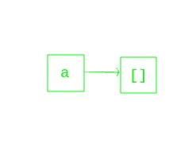

# rust——安全并发的一个例子

> 原文：<https://blog.devgenius.io/rust-a-case-of-safe-concurrency-b89d3ff89f76?source=collection_archive---------10----------------------->

在看 Rust 本身之前，我们先回到 1992 年。吉多·范·罗苏姆试图解决 CPython 解释器中的竞争问题，他添加了一个锁，著名的是全局解释器锁，简称 GIL。25 年后，这是我们都喜爱和使用的 Python 解释器的主要缺点之一。

## 那么什么是全局解释器锁呢？

在 Python 中，您创建的所有东西都作为 Python 对象在内存中分配，并返回对它的引用。让我们用视觉来更好地理解正在发生的事情。考虑代码行:

`a **=**` `[]`

在幕后，这就是 Python 解释器的工作

[]的空间被分配，它的一个引用被返回给 a，如果我们把 a 赋给另一个变量 b 会怎么样？

`a **=**`

`b **=**` `a`

如果我们从窗帘后面偷看，它看起来是这样的:

## 当所有引用都被删除时，如何释放内存？

这就是 Python 的简单性发挥作用的地方。与 Python 对象关联的是另一个值，称为引用计数。引用计数是一个数字，它告诉我们有多少变量保存了对给定分配值的引用。当进行新的参考时，该值增加。当一个引用被丢弃时，这个值被递减。为了使上面的图表更清楚，这是它们在引用计数下的样子。

当引用计数降到零时，为该对象分配的内存被释放，这就是 CPython 解释器管理内存的方式。没有任何定期运行的垃圾收集器，这使得集成 C API 和 Python 变得轻而易举。

**注意:**有关更多信息，请参考[什么是 Python 全局解释器锁(GIL)](https://www.geeksforgeeks.org/what-is-the-python-global-interpreter-lock-gil/)

## 随之而来的是一个很大的限制——如果两个线程想要创建一个新的引用或者删除对一个对象的引用，该怎么办？

以上面的变量 a 和 b 为例，如果 a 和 b 在不同的线程上，并且想同时删除引用，那么就会产生一个竞争条件。假设首先引用计数被读取、递减并存储——这就是汇编代码中发生的情况。如果读取发生在完全相同的时间，两个线程都将接受值 2，将其递减到 1，并将其写回对象。这里的问题是两个引用都被删除了，但是对象的引用计数保持为 1，这意味着这个对象永远不能被释放，从而导致内存泄漏。

另一个场景更可怕——如果在两个线程中添加两个新的引用只会使引用计数的值增加 1 会怎么样？在某些情况下，当一个引用被删除时，引用计数会降到零，内存被回收，但引用仍然存在。这将导致类似于核心转储或从内存中检索垃圾值的场景。

GIL 通过为 Python 添加一个全局锁来避免这一点，在任何时间点，获取 GIL 的线程是唯一可以执行内存 IO、字节码翻译和所有其他低级事情的线程。这实质上意味着，虽然可能有 16 个线程，但只有获得 GIL 的线程在工作，而所有其他线程都忙于获取它。这使得 Python 变成了奇怪的单线程，因为一次只有一个线程运行。

更糟糕的是，没有有效的方法来消除 GIL 并保持单线程工作负载的速度。试图通过原子递增和递减来移除 GIL，解释器的速度降低了 30%,这对于像 CPython 这样的语言来说是一个大禁忌

## 好故事，但这和铁锈有什么关系？

Rust 是 Mozilla Research 为安全并发而开发的一种语言。带有竞态条件的 Rust 代码几乎不可能编译。Rust 编译器不会接受任何非内存或线程安全的代码。它会检查代码中是否出现任何竞争情况，如果出现这种情况，则编译失败。

太好了，那为什么不能把这个添加到其他编译器中来完全避免这些情况呢？

很复杂。Rust 没有遵循传统的编程模式。相反，它遵循所有权和借款的过程。这意味着，在任何时间点，Rust 都会确保只有一个对所讨论对象的可变引用。你可以有多个只读引用，但是如果你想写一个位置，你必须获得对象的所有权，然后执行变异。

Rust 的模型不能直接有效地移植到其他编译器上，因为编写 Rust 代码的方式与编写 C 和 C++代码的方式根本不同。Rust 真正闪光的地方是它将安全性和性能结合在一个代码库中的方式。这就是为什么微软在 Rust 身上下了大赌注，用它来开发开源库和项目，以解决损害其一些核心产品的内存问题。

如果你是一名 web 开发人员，Rust 是编写 Web 汇编代码的绝佳语言。Web Assembly 是用于浏览器的中级低级语言，Rust 是可以编译成 WASM 的语言之一。它是如此的高效，以至于 NPM 现在在他们的工具链中使用了铁锈。

Rust 将会一直存在，并扰乱我们编写远离垃圾收集世界的并发程序的方式。不断增长的社区清楚地证明了它的力量，它被大型科技公司采用也清楚地表明它是一种值得一看的语言