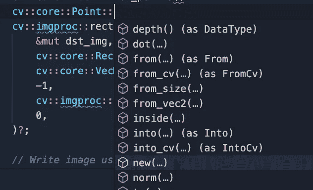

# Rust 和 OpenCV

> 原文：<https://blog.devgenius.io/rust-and-opencv-bb0467bf35ff?source=collection_archive---------0----------------------->

我们都知道为什么铁锈如此重要。然而，与 C/C++等老牌巨头相比，它有点太新太耀眼了，我们经常需要在没有适当文档的情况下使用 C++绑定(不过，我非常高兴它们的存在，谢谢社区！).

# 背景

现在，让我们首先回答这个问题，为什么我们会关心在 Rust 中运行 OpenCV？为什么不用 C++、Java 或 Python 呢？

C++是相当老的冠军，与 Rust 或 Go 相比，编译 C++代码并不有趣。对于伴随 Python 长大的年轻一代来说，用 C++安装包似乎相当过时。呀，没错。谁想花时间安装软件包？尤其是在好的厉害的那么多的今天。而且 Rust 的包经理货也很厉害。

在 Python 中使用 OpenCV 很容易。易于安装，易于在大型社区中使用。如果你真的想把事情做好，Python 是最好的选择。尽管 Python 语言非常慢，但是很少的 Python 代码是真正的 Python 代码(正如我们大多数人所知道的)。最后一句话可能会激起你的一点愤怒。可怜的美国人，他们不得不离开 Python 的快乐之路，去编写痛苦缓慢的代码，或者绑定到其他语言，让其他人免受痛苦。

> 如果你只是想做一些需要 for 循环的额外功能呢？或者，如果您想并行运行，该怎么办？Python 可以做到，只是不太好。—我

# Rust OpenCV

## 入门—安装(MacOS)

*Linux 用户通常足够聪明，知道如何在他们的机器上安装 OpenCV，* [*否则请遵循此处的指南*](https://github.com/twistedfall/opencv-rust) *和* [*Windows 用户可能会遵循此指南*](https://github.com/twistedfall/opencv-rust) *。对于 Mac 用户，你可以按照下面的超级短教程。*

让我们从安装 OpenCV 开始。不幸的是，OpenCV 不是另一个生锈的包。它要求在你的计算机上安装 OpenCV (C++)。然而，在 Rust 中，不需要痛苦的链接和编写 CMake 文件。Rust 中的 OpenCV 实际上比 C++更容易(IMHO ),并且当您想要引入许多依赖项时不会让您感到头痛(对于大量的 CMake 文件而言，这是个大问题)。

在 macOS 上安装它非常容易。假设您有 brew，只需运行

```
brew install opencv
```

然后在你的货物里加上

```
[dependencies]
opencv = "0.63.0" # or whatever version is the latest
```

你可以按照 [opencv-rust repo 获得完整的安装帮助。](https://github.com/twistedfall/opencv-rust)当我安装它的时候，我遇到了一个编译问题，但是按照**故障排除**部分可以很容易地修复。所以如果你遇到问题，一定要在拉头发之前检查一下那个部分。

这个 OpenCV Rust 绑定绑定到了 C++ API(这很好，因为 C++已经被抛弃了)。由于 Rust 可以直接与 C 接口，C++被包裹在一个额外的 C 层中，然后暴露于 Rust。

## 简码

我的第一个例子是基于 [Makeitnow](https://www.youtube.com/channel/UC-QQTgv-P_9_8tW1m7GSUTQ) 的[视频教程](https://www.youtube.com/watch?v=zcfixnuJFXg)。对于一个有经验的 OpenCV 用户来说，这非常简单。

总之我喜欢使用[来处理结果，所以我将使用它来代替 opencv::Result。让我们写代码吧！](https://docs.rs/anyhow/latest/anyhow/)

太好了！我们可以打开一个网络摄像头，将结果帧放入 frame 变量中。代码应该是不言自明的。不然看视频！

PS。这将是等效的 Python 代码

```
import cv2vid = cv2.VideoCapture(0)
while True:
    ret, frame = vid.read()
    cv2.imshow('window', frame)
    if cv2.waitKey(1) & 0xFF == ord('q'):
        breakvid.release()
cv2.destroyAllWindows()
```

# 使用 OpenCV-Rust 绑定变得越来越热

让我们做……

*   从文件中读取图像
*   使用 SIFT 和 ORB 检测关键点
*   用不同的颜色画关键点
*   画一个长方形
*   将图像转换为 n 数组(快速)
*   将 ndarray 转换为 image::rgbi image(为了测试我们的上述步骤是否按预期工作)
*   保存图像

在这里，我将首先把代码作为一个块，然后一步一步地分解它。

## 阅读图像

你不明白如何找到不同的类型？检查下面的矩形部分！它是一个更全面的指南！

阅读图像非常简单。您可能希望在所有这些选项上添加一个检查，以确保映像加载成功。如果找不到图像，OpenCV 不会抛出错误。不要被 Rust 的结果所迷惑，它不会检查图像是否被正确加载。

锈

```
// Read image
let img = opencv::imgcodecs::imread("./assets/demo_img.png", cv::imgcodecs::IMREAD_COLOR)?;
```

C++

```
cv::Mat I = cv::imread("./assets/demo_img.png", 0);
```

计算机编程语言

```
img: np.ndarray = cv2.imread("./assets/demo_img.png)
```

## 关键点检测和绘制

ORB 和 SIFT 代码非常相似，所以我只对 ORB 部分进行评论。

所以首先创建**检测器**

锈

```
let mut orb = <dyn cv::features2d::ORB>::create(
        500,
        1.2,
        8,
        31,
        0,
        2,
        cv::features2d::ORB_ScoreType::HARRIS_SCORE,
        31,
        20,
    )?;
```

C++

```
cv::Ptr<cv::ORB> orbPtr = cv::ORB::create();
```

这与 C++非常相似。需要提供稍微不同的名称空间和参数。*注意，所有的默认变量都可以在 Rust 的文档中找到。只需将鼠标悬停在“创建”功能上，您就会看到文档[VSCode]。*


在 VSCode 中可以看到 C++默认参数。如果使用另一个 IDE，您可能只需转到函数定义并读取 docstring。

**计算关键点**

再次 Rust vs C++。

锈

```
let mut orb_keypoints = cv::core::Vector::default();
let mut orb_desc = cv::core::Mat::default();
orb.detect_and_compute(&img, &mask, &mut orb_keypoints, &mut orb_desc, false)?;
```

C++

```
std::vector<cv::KeyPoint> keypoints;
orbPtr->detect(image, keypoints);
cv::Mat desc;
orbPtr->compute( image, keypoints, desc );
```

同样，没有什么太疯狂的差异。首先，可能很难知道如何初始化关键点和描述符。但是一旦看到，就很简单了。从上面的代码来看，不能说 Rust 代码比 C++更复杂。

**画出******关键点****

**锈**

```
let mut dst_img = cv::core::Mat::default();
cv::features2d::draw_keypoints(
        &img,
        &orb_keypoints,
        &mut dst_img,
        cv::core::VecN([0., 255., 0., 255.]),
        cv::features2d::DrawMatchesFlags::DEFAULT,
 )?;
```

**C++**

```
cv::Mat dst_img;
cv::drawKeypoints(image, keypoints, dst_img);
```

**弄清楚铁锈的种类有点棘手。使用类型推理和一点点直觉是有可能找到它的！**

## **侦查工作—绘制矩形(更具指导性的步骤)**

**由于 OpenCV Rust 绑定几乎没有文档，这是一种侦探游戏。我决定展示 C++代码是有原因的。我们可以看到的是，大部分 Rust 代码都可以从 C++中推断出来(某种程度上)。利用今天难以置信的 IDE，我们有机会(感谢 LSP)。此外，Rust 有一个很好对接系统。我的策略是依靠 [opencv-rust docs](https://docs.rs/opencv/latest/opencv/index.html) 和来自 C++的命名。所以让我们用这个策略来弄清楚如何画矩形。**

**首先，我们决定我们想做什么，即:**

*   **绘制矩形(在 C++中是`cv::rectangle`)**

**然后我们前往 [opencv-rust docs](https://docs.rs/opencv/latest/opencv/index.html) 。**

********

**现在，我们要做的就是找出类型(说起来容易做起来难)。这里我们将利用 IDE(在我的例子中是 VSCode)。使用 LSP，Nvim 或 Emacs 应该也可以。第一个论点应该很明显，图像。那就是 cv::core::Mat。很明显对吗？(不尽然)。但是，我们可以通过直觉来弄清楚。Mat 是存储图像数据的默认类型，所以应该是 Mat。Mat 实现了输出数组的特性，一切都很好。接下来，什么是 Rect 类型？**

****

**似乎我们可以在核心找到它。那很好。但是，我如何建立一个矩形呢？**

**使用 LSP，我们可以为合适的构造函数找到自动补全。这里，再一次，快速找到它需要一点直觉和运气(尽管 C++代码补全远没有 Rust 那么容易)。如果你被困在 C++中，在网上寻找解决方案通常也是不愉快的。**

****

**好，让我们看看 from_points 构造函数要说什么**

****

**我们需要两分！…但这有什么意义呢？🥁**

****

**在核心似乎是！让 LSP 为我们做更多的提升！**

****

**所以，“new”看起来很有前途，但“from_vec2”也是！嗯……我们也许可以用其中任何一个。但我们还是选“新”吧。(通常，查找 new 或 from)。**

****

**好吧，我们就给它输入两个整数，看看会发生什么(编译器应该不会抱怨)！所以现在我们已经搞清楚了第二个论点！**

```
cv::core::Rect::from_points(
  cv::core::Point::new(0, 0),
  cv::core::Point::new(50, 50
)
```

**(剩下的也是同样的方法…)。这有点乏味，但是一旦你开始了解类型，生活就变得容易了。在那个阶段，感觉很自然，你不会介意用 Rust 而不是 C++工作。**

# **敬恩达雷！**

**ndarray 似乎是 Rust 上适应性最强的矩阵库(对于想为 Python 的 NumPy 包编写绑定的年轻人来说，ndarray 是一个不错的选择)。后面还有一篇关于用 Python 和 NumPy 绑定 Rust 的文章！**

**这就有点棘手了。现在我们需要将一个 C++类型转换成 Rust 类型。我们知道我们正在处理一个矩阵类型。并且一般实现为[行主](https://en.wikipedia.org/wiki/Row-_and_column-major_order)。OpenCV Mat 和 ndarray 数组(视图)都是行主数组。并且数据按顺序(通常)存储在底层缓冲区中。为了确保我们的情况下，我们将检查垫是连续的。**

```
if !mat.is_continuous() {
    return Err(anyhow!("Mat is not continuous :("));
}
```

**我们可以使用这些知识快速(无复制，零成本)将 cv::Mat 转换为 ndarray::Array。但是，必须注意的是，数组将指向存储在 Mat 中的数据。因此，当 Mat 掉落时，阵列也必须掉落。否则我们(可能)会指向已分配的内存，这样不好！但似乎锈为我们处理这个！**

**首先，我们将提取 Mat 的数据字节。由于图像是以 8 位(u8)的无符号格式存储的，我们可以直接读取数据而不需要类型转换(是的！).**

```
let data_bytes: &[u8] = mat.data_bytes()?; // <-- This is the image data in sequence! Note it is pointing to the data in mat
```

**接下来，我们需要计算出这些数据的大小。当我们获取数据字节时，我们不是以我们想要的形状获取它们，而是以一个长序列获取它们。**

```
let size = mat.size()?;
let h:i32 = size.height;
let w:i32 = size.width;
```

**现在我们可以根据这些信息构建一个数组视图 3**

```
let a = ArrayView3::from_shape((h as usize, w as usize, 3), data_bytes)?; // The 3 is because we have bgr. For gray image this will be 1
```

**不错！我们得到了一个将 Mat 转换为 ArrayView3 <u8>的方法，具有性能。**注意，这只对连续数组有效。**</u8>**

**作为一个特征，它看起来就像**

```
trait AsArray {
    fn try_as_array(&self) -> Result<ArrayView3<u8>>;
}impl AsArray for cv::core::Mat {
    fn try_as_array(&self) -> Result<ArrayView3<u8>> {
        if !self.is_continuous() {
            return Err(anyhow!("Mat is not continuous"));
        }
        let bytes = self.data_bytes()?;
        let size = self.size()?;
        let a = ArrayView3::from_shape((size.height as usize, size.width as usize, 3), bytes)?;
        Ok(a)
    }
}
```

**为了快速将 Mat 转换为 Array，我们现在可以调用:**

```
let array: ArrayView<u8> = mat.try_as_array()?;
```

# **结论**

**Rust 中的 OpenCV 肯定是可能的。这需要更深入的知识才能在不同类型和意志力之间转换，以找出绑定。但是很管用！:))**

**由于 Rust package manager Cargo 非常好，它鼓励使用其他人的包(如 [cv-convert](https://crates.io/crates/cv-convert) 用于在许多流行的板条箱之间转换图像类型)使生活变得更容易。我希望在未来我们会看到更多更酷的软件包。一些 Rust GPU 包开始出现，谁知道呢，也许在未来有可能将 Rust 直接编译到 SPIR-V 上进行真正快速的计算！那将是多么美好的未来啊！**

**如果你一路来到这里，感谢你花时间阅读，并希望你在途中学到一些东西。**

**干杯！**