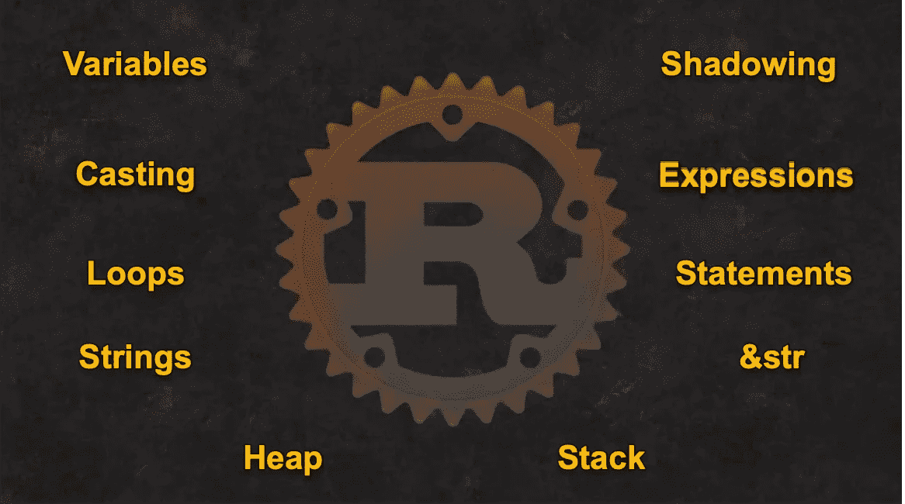
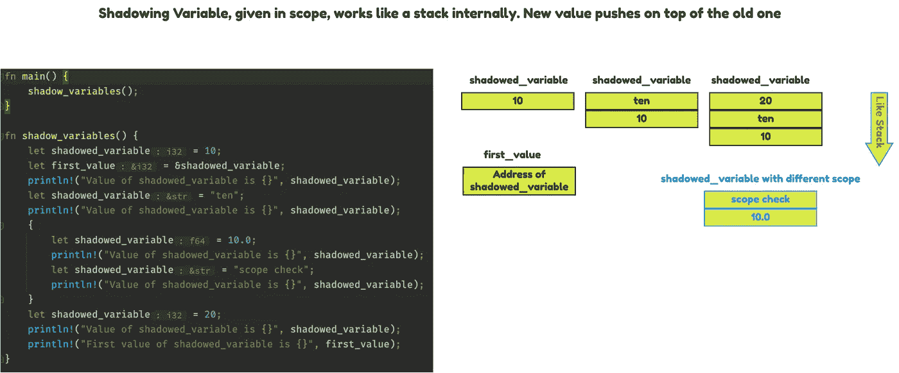
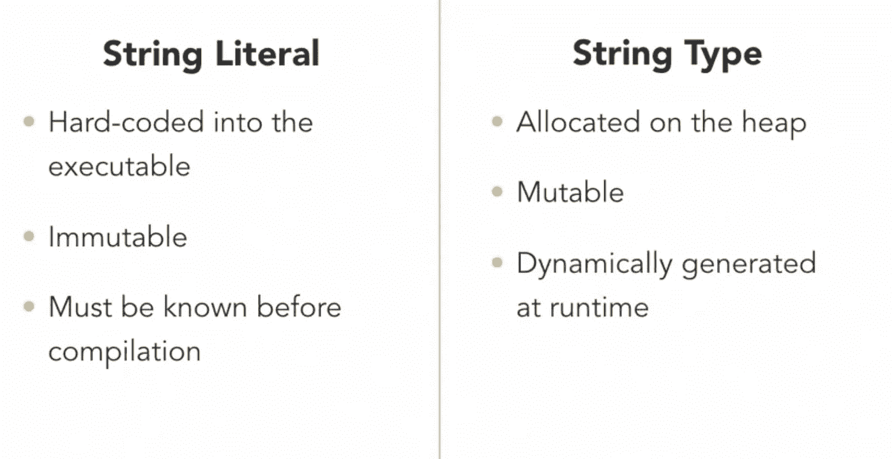
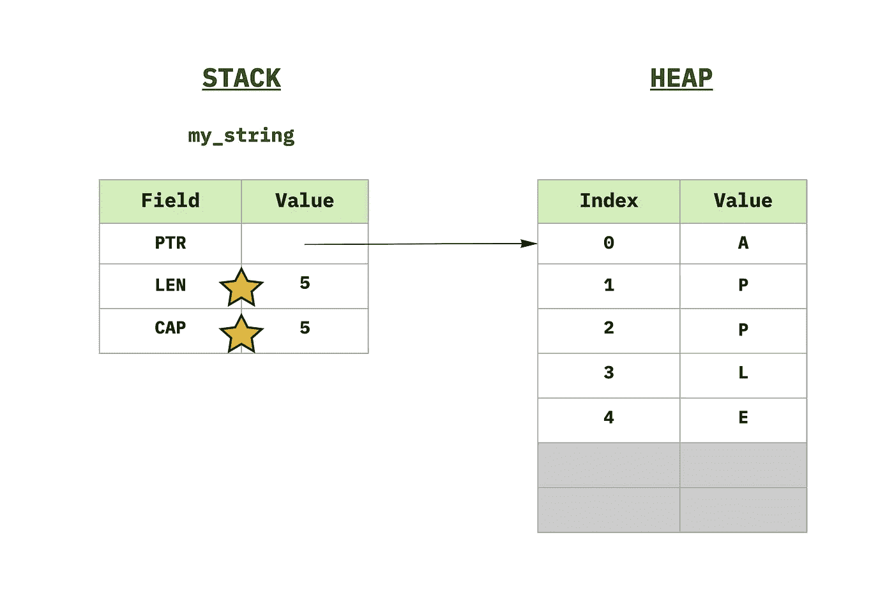
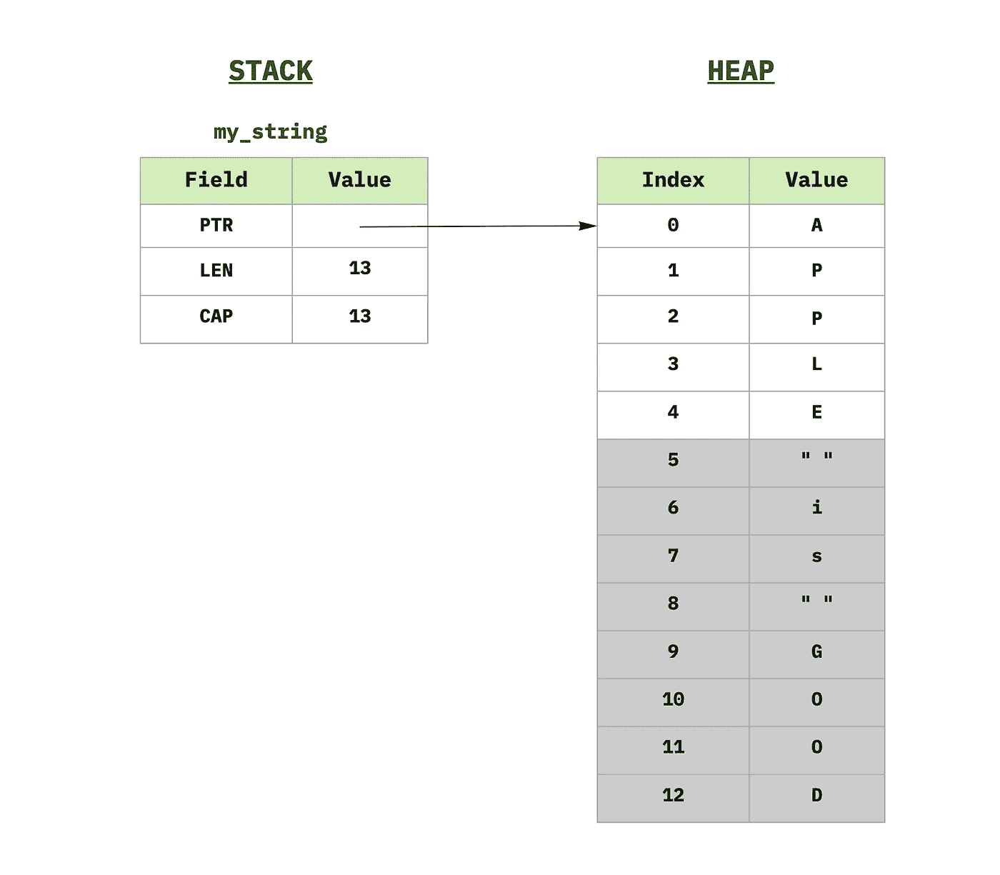
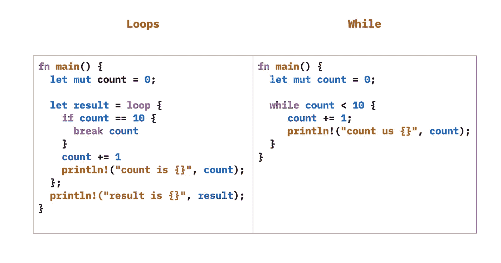

# [Rust]基础和概念，循序渐进—第一次迭代

> 原文：<https://blog.devgenius.io/rust-basics-and-concepts-step-by-step-1st-iteration-f71dc14d5ae6?source=collection_archive---------1----------------------->

一段时间以来，我一直在考虑开始在`Rust`中编码，但是由于永无止境的事情，我不能开始。通常我开始学习一门语言时，会先写一些实用程序代码，然后边学边学。然而这一次，时间似乎对我不利。



所以，我决定开始一步一步地学习小概念，一次一两件事，然后从那里开始。这个博客是关于我如何接受这个挑战并开始朝着学习的方向前进的

## 默认情况下，变量 a 是不可变的

我花了一段时间才意识到`Rust`默认将所有赋值变量视为**不可变。**表示绑定完成后，*(另一个* `*Rust*` *的概念，仅仅表示值已经赋给了变量)，*不能用不同的值重新赋给那个变量

```
fn main() {
 **// Variables by default are immutable use `mut` key word to make
    // mutable**
    concept1()
}

fn concept1() {
    let x: i8 = 15;
    println!("Value of X = {}", x);
    x = 20;
    println!("After Reassignment, value of X = {}", x);
}
```

这不管用

```
error[E0384]: cannot assign twice to immutable variable `x`
  --> src/main.rs:17:5
   |
15 |     let x: i8 = 15;
   |         -
   |         |
   |         first assignment to `x`
   |         help: consider making this binding mutable: `mut x`
16 |     println!("Value of X = {}", x);
17 |     x = 20;
   |     **^^^^^^ cannot assign twice to immutable variable**For more information about this error, try `rustc --explain E0384`.
error: could not compile `day1` due to previous error
```

那么，问题来了，我们如何运行计数器？简单的答案是让变量**可变**

```
fn main() {
    concept1() // Variables by default are immutable, use `mut`
}

fn concept1() {
    let **mut** x: i8 = 15;
    println!("Value of X = {}", x);
    x = 20;
    println!("After Reassignment, value of X = {}", x);
}
```

它运行良好

```
Value of X = 15
After Reassignment, value of X = 20
```

为什么`Rust`要这么做，尽管**跟踪**是可能的。事实上**隐藏**也允许我们改变变量的类型。简单地说，通过使用`let`关键字，我们创建了另一个同名的变量。

## 隐藏变量

```
fn main() {
    variables_are_immutable();
    variable_shadowing()
}

fn variables_are_immutable() { .... }

fn variable_shadowing() {
    let x: i8 = 15;
    println!("Value of X = {}", x);
    **let** x = x + 20; **// This is possible because of `let` keyword**
    println!("After Reassignment, value of X = {}", x);
}
```

我们得到了

```
Value of X = 15
After Reassignment, value of X = 35
```

查看下图中的阴影和代码



```
value of shadowed_variable is 10 **-> 1st Value**
value of shadowed_variable is ten **-> 2nd Value**
value of shadowed_variable is 10 **-> First Value in different scope**
value of shadowed_variable is scope check **-> 2nd Value different scope**
value of shadowed_variable is 20 **-> 3rd Value**
First value of shadowed_variable is 10 **-> 1st Value accessed using reference variable first_value**
```

正如你所看到的，隐藏在内部像一个**堆栈**一样工作，你可以通过使用`drop(shadowed_variable)`删除先前的值，它将像**堆栈**一样工作，并开始以 lifo 方式弹出值。还要记住，只有当**变量在**范围内时，**隐藏**变量才起作用。

同样`const`用于定义**常量**，该常量对程序的整个运行有效。常量的值不能是需要在运行时计算的东西

```
**const *DAY_IN_YEAR*: i32 = 31 * 7 + 30 * 4 + 28;**

fn main() {
    print_constant();
}

fn variables_are_immutable() {...}

fn variable_shadowing() -> i32 {
    let x: i32 = 15;
    println!("Value of X = {}", x);
    let x = x + 20;
    println!("After Reassignment, value of X = {}", x);
    return x
}

fn print_constant() {
    **println!("Value of constant {}", *DAY_IN_YEAR*);**
}
```

## 可变类型转换又名铸造

`Rust`允许对可变类型转换又名*进行动态铸造。喜欢*

```
*fn calculate_avg_using_casting() {
   ** let (a, b, c): (i32, f32, f32) = (13, 2.3, 120.0);**
    let avg = (**a as f32** + b + c) / 3.0; // **a is re-casted as f32**

    assert_eq!(avg, 45.100002);
    println!("Test Passed");
}*
```

*它将打印`Test Passed`。正如你所看到的，变量`a`已经使用`as`关键字从`i32`转换为`f32`。注意，**转换**应该小心使用，因为它可能会产生不可预知的结果，比如如果`f32`被重新转换为`i32`，那么小数点后的所有内容都将被截断。**铸造**使用`truncation`然后`round`将类型转换。*

## *函数的魔力*

*像大多数语言一样，`Rust`也需要至少一个可论证的函数`main()`，在`Rust`中，我们用`fn`关键字定义函数。除此之外 ***功能*** 中的`Rust`就相当直截了当了。*

```
*fn main() {
    println!("{}", variable_shadowing_and_return());
}fn variable_shadowing_and_return() -> i32 {
    let x: i32 = 15;
    println!("Value of X = {}", x);
    let x = x + 20;
    x * x **// missing `;` is intentional as it is an expression** 
}*
```

## *语句与表达式*

*以上是返回类型为`i32`的`Rust`中的函数示例。功能是 ***表达式*** 和 ***语句的组合。*** ***表达式*** 总是生成一个值，而 ***语句*** 只是一个动作。因此，在`Rust`中，像这样的东西是无效的`a = b = 1`，因为我们不能将一个**语句**赋给变量，因为`b = 1`是一个动作而不是一个值。给 ***表达式*** 添加一个`;`会将其转换为 ***语句****

> **在* `*Rust*` *中如果最后一行是一个* ***表达式*** *那么它将作为函数的* **返回值被传递出去。***

*功能`main()`可以从[锈 1.26](https://github.com/rust-lang/rust/blob/master/RELEASES.md#version-1260-2018-05-10) 开始返回一个`Result`类型([详情](https://github.com/rust-lang/rust/pull/49162))。例如*

```
*use std::num::ParseIntError;fn main() -> Result<(), ParseIntError> {
    let some_number = "10";
    let n = match some_number.parse::<i32>() {
        Ok(n)  => n,
        Err(e) => return Err(e),
    };
    println!("{}", n);
    Ok(())
}*
```

*最后，如果你的函数没有返回任何值，那么它会返回一个叫做 ***的单元数据类型*** `()`。`Rust`如果函数不返回，编译器自动推断单元数据类型。我们可以明确地提到太像了*

```
*fn some_func(x: i8) **-> ()** {
  println!("Square of X is {}", x * x)
}*
```

## *字符串文字或类型…嗯！！*

*看看下面的差异视图，我会试着解释我想要展示的东西*

**

*在`Rust`中，有两种方式使用**字符串文字**或**字符串类型来处理**字符串**。**当说`let some_string = "actually it is random string"`时，这被称为**字符串文字**，因为它是字面上写在可执行文件中的。如上所述，它们是不可变的，并且在编译之前需要知道尺寸。所以它不能保存任何本质上动态的值。*

> *一个`String`被存储为一个字节向量(`Vec<u8>`)，**，但是保证总是一个有效的 UTF-8 序列**。是堆分配的、可增长的并且不是空终止的。`&str`是一个切片(`&[u8]`)，它总是指向一个有效的 UTF-8 序列，并且可以用于查看到一个`String`，就像`&[T]`是一个到`Vec<T>`的视图一样。*

*为了处理**字符串**的动态性质，我们使用**字符串类型、**，它们存储在**堆**和**可变堆中。***

*下面的代码将创建一个名为`my_string`的变量，它是存储在**堆栈**中的`**&str**`类型，而将把值存储在**堆中。**在**栈**中，它将保持**指针**指向**堆**位置**，管柱长度****和**容量。**星号**表示容量始终大于等于**管柱的长度。*******

```
*fn main() {
    work_with_strings();
}

fn work_with_strings() {
    let mut my_string = String::*from*("APPLE");
    println!("Original my string: {}", my_string);
}*
```

**

*相同的代码，但在现有字符串中添加了更多内容*

```
*fn main() {
    work_with_strings();
}

fn work_with_strings() {
    let mut my_string = String::*from*("APPLE");
    println!("Original my string: {}", my_string);
    my_string.push_str(" is GOOD");
    println!("Final my string: {}", my_string);
}*
```

*变成了这样*

**

*要使用**索引引用字符串中的字符，b** 因为字符串是有效的 UTF-8，它们不支持索引。我们需要使用`.chars()` 的方法。在这里阅读更多关于弦乐[的内容](https://doc.rust-lang.org/std/string/struct.String.html)*

```
*fn main() {
    // shadow_variables();
    work_with_strings();
}

fn work_with_strings() {
    let mut my_string = String::*from*("APPLE");
    println!("Original my string: {}", my_string);
    my_string.push_str(" is GOOD");
    println!("Final my string: {}", my_string);
    println!("The characters are \n");
    for ch in my_string.chars() {
        print!("{},", ch)
    }
}*
```

## ***多圈圈***

*像其他语言一样,`Rust`也有一些机制，我们可以用它们来迭代一些东西。[循环](https://doc.rust-lang.org/reference/expressions/loop-expr.html)、[而](https://doc.rust-lang.org/rust-by-example/flow_control/while.html)和[为](https://doc.rust-lang.org/std/keyword.for.html)，顾名思义它们或多或少与其他语言相似，除了[循环](https://doc.rust-lang.org/reference/expressions/loop-expr.html)。*

*[循环](https://doc.rust-lang.org/reference/expressions/loop-expr.html)与[和](https://doc.rust-lang.org/rust-by-example/flow_control/while.html)非常相似，有两个主要区别。它没有像中的[那样的条件，它可以返回](https://doc.rust-lang.org/rust-by-example/flow_control/while.html)[中不能返回的值。](https://doc.rust-lang.org/rust-by-example/flow_control/while.html)*

**

*如你所见，一旦 **break** 语句执行，[循环](https://doc.rust-lang.org/reference/expressions/loop-expr.html)实际上将**计数**返回到**结果**变量，然而**同时**刚刚执行并在条件匹配时中断循环。*

> *还要注意，因为 ***循环*** 被赋值给变量**结果**，所以我们把`;`放在它的末尾，使它成为 ***语句*** 。*

*假设我们有嵌套循环，并且想要`break`到外部循环。然后，我们可以使用**循环标签**来指定`break`或`continue`应用于哪个循环。在下面的例子中，`'outer`是给外部循环的标签。*

```
*'outer: for x in 0..5 {
    for y in 0..5 {
        if y > 2{
            break 'outer
        }
        println!("x: {}, y: {}", x, y);
    }
}*
```

*我想我现在已经有足够的内容可以开始了。希望这有助于理解`Rust`的基础知识。我仍在学习，并将继续把我的想法写在未来的文章中！！*

# *编程快乐！！*