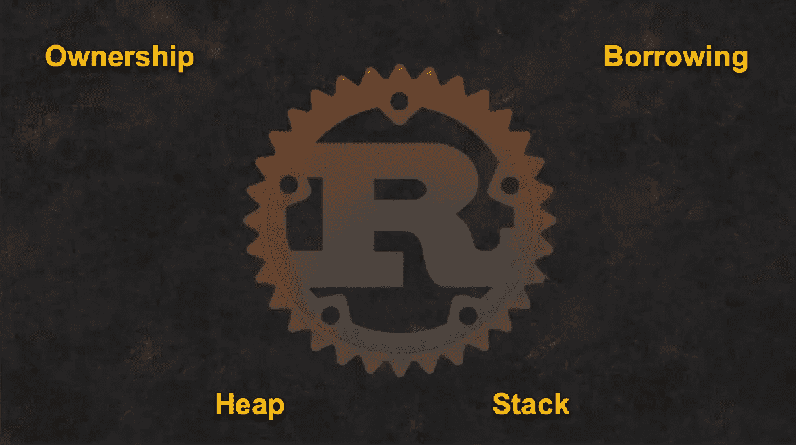
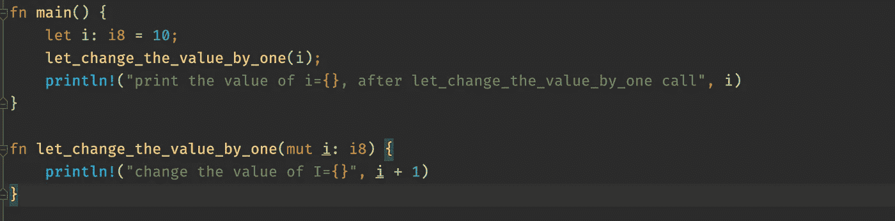
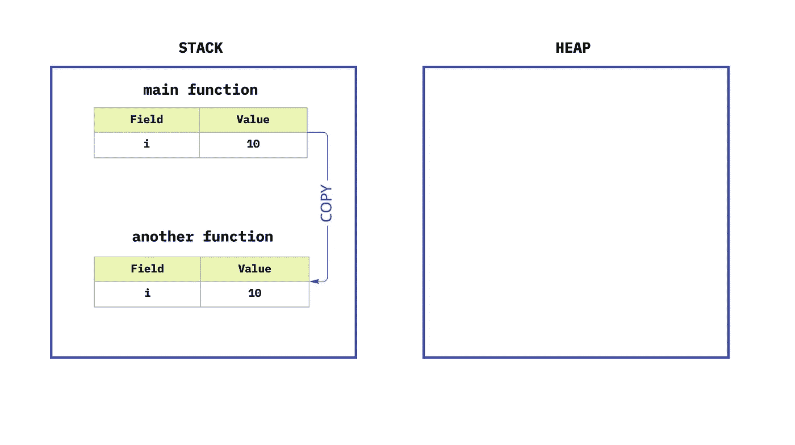
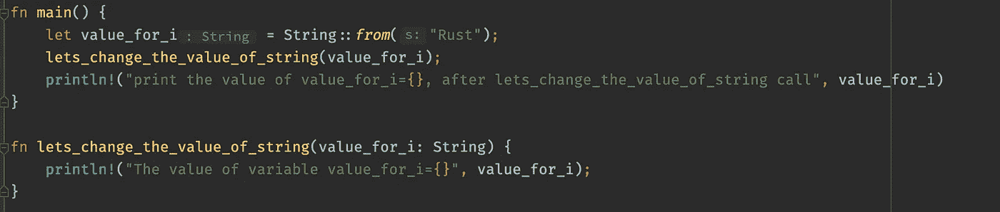
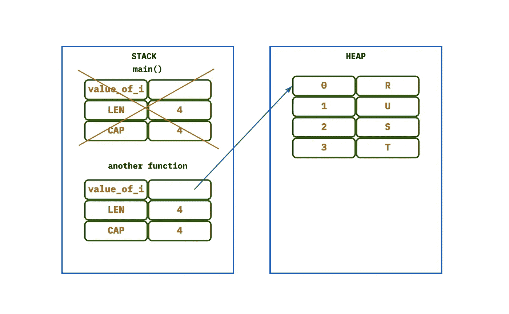
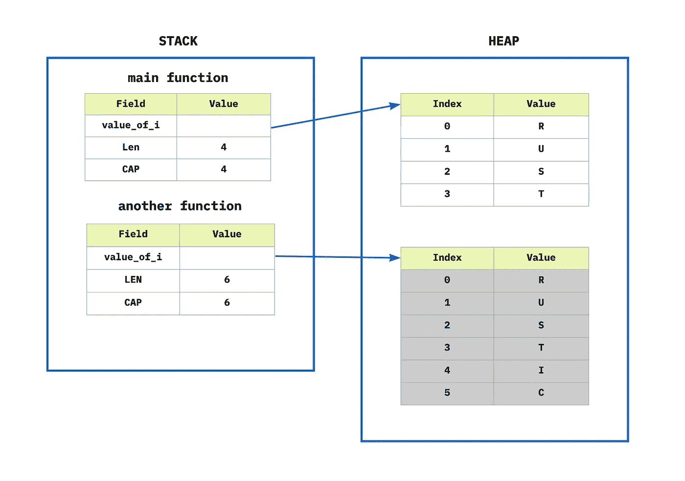
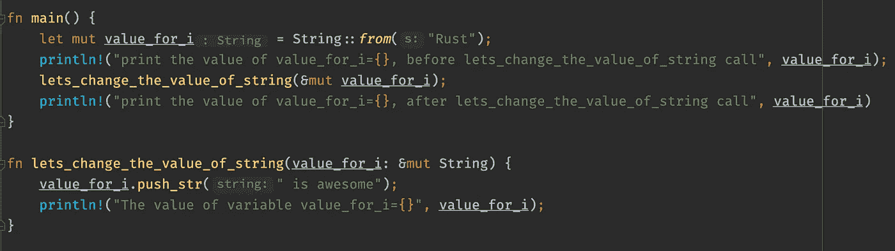
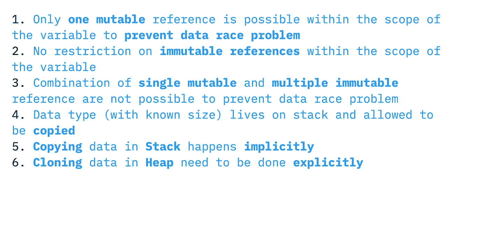
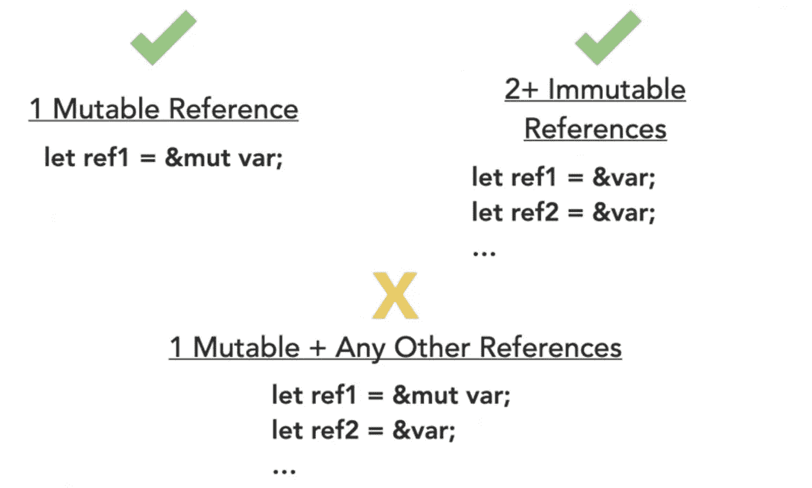

# [Rust]基础和概念，循序渐进—第二次迭代

> 原文：<https://blog.devgenius.io/rust-basics-and-concepts-step-by-step-2nd-iteration-5ba45c44f986?source=collection_archive---------9----------------------->

在这篇博客中，我将试着专注于`Rust`的一些基本但非常重要的概念。这将是我第二个关于 T1 的博客，你可以在这里找到第一个 T8。我将在这个博客中尝试讨论所有权、所有权转移、借用、堆、栈



## 那么，Rust 中的所有权是什么

`Rust`没有垃圾收集器，需要显式分配和释放内存空间。当涉及到大型代码库时，这很快就会变得乏味和具有挑战性。

传统上，有两种管理记忆的基本方法。第一个是垃圾收集器；它主要用于从程序员那里抽象出内存管理概念的高级语言中。

第二种是**手动**内存管理，程序员明确定义内存使用。虽然它提供了控制，但也留下了很多空间搬起石头砸自己的脚。

Rust 采用了另一种方法，叫做**所有权**和**借贷**。所有权是一个新的**构造**，它定义一个值有它的所有者。

让我们看看下面的代码和它的输出



```
change the value of i=11
print the value of i=10, after let_change_the_value_by_one call
```

当我们将 **i** 传递给函数`let_change_the_value_by_one`时，将值增加 **1** ，打印它，当控制返回到`**main()**` 函数并打印它时，我们得到与之前相同的值。



与**字符串不同，** **整数**存储在**堆栈**中，而不是**堆**中，并且在将 **i** 传递给函数`let_change_the_value_by_one`时，编译器会复制该值并将其传递给函数，实际值保持不变。根据**所有权**变量 **i** 是**堆栈**中值的所有者，直到它的作用域保持活动。

现在，我们把变量从`i8`改成`string`怎么样



```
18 |     let value_for_i = String::from("Rust");
 **|----------- move occurs because `value_for_i` has type `String`, which does not implement the `Copy` trait**
19 |     lets_change_the_value_of_string(value_for_i);
  ** |----------- value moved here**
20 |     println!("print the value of value_for_i={}, after lets_change_the_value_of_string call", value_for_i)
   |                                                                                               ^^^^^^^^^^^ value borrowed here after move
```

现在涉及到**堆**的时候，**所有权**的概念会更加透明。当变量`value_for_i`传递给函数`lets_change_the_value_of_string`时，编译器会在**堆栈**中创建该变量引用的副本，并将**所有权**移至其中。**堆中的值不会发生任何变化。**一旦控制返回到`**main()**` 变量`value_for_i`的引用不再存在，这就是编译器试图告诉我们**移动**已经发生的原因

```
**|----------- move occurs because `value_for_i` has type `String`, which does not implement the `Copy` trait**
|     lets_change_the_value_of_string(value_for_i);
**|----------- value moved here**
```

这是同样的例子



> 简单地说，在`Rust`范围内的任何变量都是值的所有者，在它的所有权之外它不能被改变。所有权需要由程序员自己手动管理。

为了让这段代码工作，我们可以将这个`value_for_i.clone()`传递给函数，这将创建一个引用和值的克隆



但是，如果我们不想转移所有权，而是想修改相同的值，该怎么办呢？如何通过使用**借用**的概念来实现这一点

## 什么是**借用**中的铁锈

在`Rust`中，我们可以**从**堆栈**中借用**变量的引用，然后使用**借用的**引用对**堆**中的值执行操作。这样我们就根本不用处理所有权转移的问题了。为了**借用`value_for_i`的引用**，我们使用**借用**操作符`&`，类似这样的东西`&value_for_i`并将其传递给函数。



```
print the value of value_for_i=**Rust**, before lets_change_the_value_of_string call
The value of variable value_for_i=**Rust is awesome**
print the value of value_for_i=**Rust is awesome**, after lets_change_the_value_of_string call
```

上面的例子我们正在做多件事情

1.  将局部变量`value_for_i`改为可变的
2.  将函数的参数更改为`&mut value_for_i`，因此引用可以被传递，并且使其可变
3.  使用`push_str()`和`value_for_i`扩展字符串值。
4.  现在，当控制返回到`main()`并执行`println!`时，我们得到修改后的字符串。

这解释了在我们不想转移所有权的情况下，我们如何使用借贷来处理价值。尽管借款有一些限制。



在变量的作用域内，我们只能为变量创建一次可变引用。不可变引用没有限制。此外，如果编译器发现**悬空引用**，它也会抱怨，这意味着编译器会在引用 之前确保 ***数据不会超出范围。***

希望这有助于理解`Rust`的一些非常有用的关键概念。随着我了解的越来越多，我会继续写关于`Rust`的文章。

# 编码快乐！！