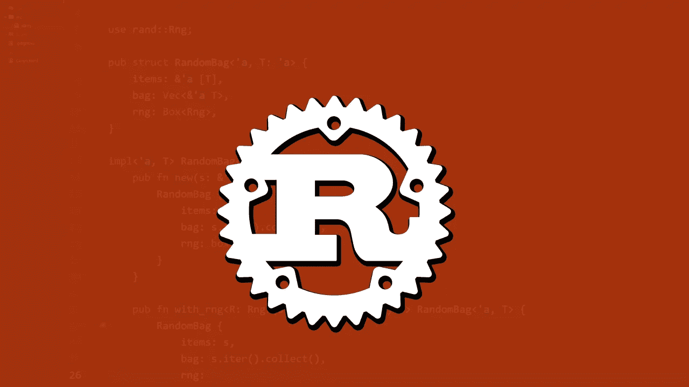

# 生锈的傻瓜，白痴，初学者和其他人！—第 0 部分:简介和设置

> 原文：<https://blog.devgenius.io/rust-for-dummies-idiots-beginners-and-everyone-else-part-0-introduction-setup-323653658c6?source=collection_archive---------4----------------------->

# 介绍

Rust 是一种很棒的、相对较新的系统编程语言，在过去几年里赢得了很多人的喜爱。

Rust 有很多好处，包括很棒的文档(学习使用文档是开发人员的第二大技能，仅次于知道如何谷歌搜索)，一个彻底的编译器来捕捉你的愚蠢错误，以及许多内置工具来使你的编程体验更加流畅。

在进入实际代码之前，我们将经历大量的 Rust 基础知识，包括背景信息和设置，从**基础知识**开始，在升级到更多的**【有趣】**例子之前。

在继续前进之前，请考虑一下全能的 [*锈识*](https://doc.rust-lang.org/book/title-page.html) 的来源。

铁锈！

# 背景

Rust 的设计目标是创建一种编程语言，让开发人员能够构建高效、可靠的软件。Rust 占据了与 c++(T11)相似的位置，是一种系统语言。

系统编程包括开发允许硬件与用户交互的程序。系统程序的一个常见应用是与操作系统一起工作。请注意，Rust 还不止于此，它可以扩展到 Unix 风格操作系统的命令行界面应用程序、web 服务器和 web 应用程序，以及嵌入式系统，如 Raspberry PI 或 32 位微控制器。

以下是开发铁锈的优秀人士关于铁锈为何如此重要的观点:

> “高层次的人机工程学和低层次的控制在编程语言设计中往往是不一致的；Rust 挑战这种冲突。通过平衡强大的技术能力和出色的开发人员体验，Rust 为您提供了控制低级细节(如内存使用)的选项，而没有传统上与此类控制相关的所有麻烦。”

Rust 是一个灵活但安全的程序，这使得它成为一个非常通用的工具！尽管 Rust 在语法上可能不像 Python 那样简单，但它是进入编程或改进您的工具包的一个极好的选择。

# **如何跟进**

通过这一系列的博客文章，我将发现并记录我的 Rust 之旅,(希望)为任何可能在 Rust 发布后遇到它的人创建一个易于遵循的课程。

就工作空间而言，我将在我的个人笔记本电脑上使用 [Visual Studio 代码](https://code.visualstudio.com)管理我自己的工作空间，然而对于任何想完全在浏览器中工作的人来说，这里有 [Rust Playground](https://play.rust-lang.org/) 。Rust-playground 是一个内置浏览器，基于云的 Rust IDE，任何人都可以免费去演示 Rust 代码。我将管理我自己的系统，因为我想完全控制我的设置，包括与 Rust 包管理器一起工作，编译代码，并更彻底地进行试验。

如果您将在操场上工作，请随意跳过下一部分。

# 设置铁锈

让我们开始吧——我将通过命令行工作，这对于 Linux 和 MacOS 用户来说很容易访问。继续下载 Rust，如下所示:

下载 Rust

要使用 Rust，你还需要一个链接器。链接器是 Rust 用来将其所有文件编译成单一输出的程序。您可能已经有了一个链接器，但是如果您遇到链接器错误，您可以安装一个 C 编译器，它通常包含一个链接器。C 编译器也很有用，因为一些常见的 Rust 包依赖于 C 代码，需要 C 编译器。

MacOS 用户可以选择以下选项:

下载 MacOS 的 C 编译器

现在，您的编译器应该可以运行了，我们可以继续检查 Rust 版本:

检查 Rust 版本

最后，检查和运行更新也不失为一个好主意:

检查更新是个不错的主意

# 结论

恭喜大家！这是第 0 部分。我们非常简要地介绍了 Rust 背后的意图，以及如何设置我们的编程环境。下一篇文章，我们将看看一个简单的 Hello World 程序以及 Cargo，Rust 的软件包管理器。

# **关于作者**

我是[卢克](https://www.linkedin.com/in/lukeabela5698/)，我在马耳他大学攻读电子电气工程学士学位，在那里我学习嵌入式系统。接下来，我在伦敦大学玛丽皇后学院攻读了人工智能科学硕士学位。从那以后，我一直从事人工智能和物联网工程师的工作。