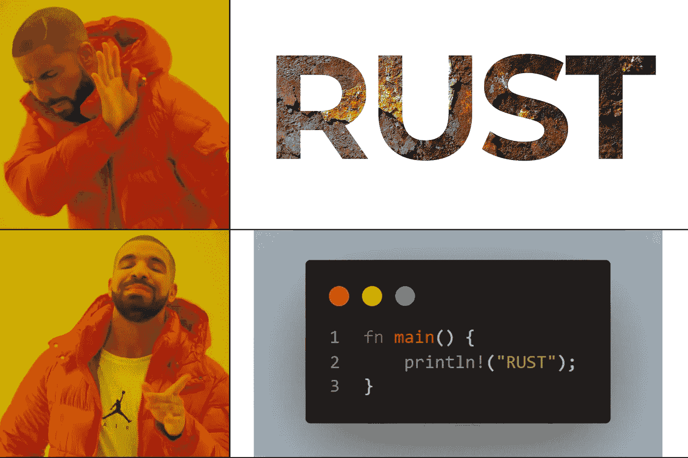
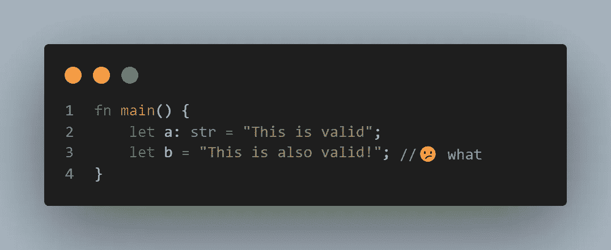

# 编程语言上的铁锈

> 原文：<https://blog.devgenius.io/rust-on-programming-language-5e3d0794d84a?source=collection_archive---------15----------------------->

随机迷因，在极客出来之前

标题有点混乱，理解不了内容的脉络。在这篇博客中，我将四处奔走，看看编程语言 [rust](http://rust-lang.org) 的不同方面。并讨论它引入的对编程的各个方面都有用的概念。

# 什么是铁锈？

简单地说，它是一种静态的和强类型的编程语言。

> 让我解释一下:
> **静态类型化**表示代码中表达的所有数据类型在编译时都是已知的，内存分配也做得很好。

那是什么👆那个？只能说 rust 知道你想说什么。
但这并不意味着你可以为一个复杂的数据类型声明变量，并期望 rust 能够理解。我上面提到的下一点来了。

> **强类型化**表示这些类型被设计成更难编写语法不正确的代码。

如果你在变量的语法或定义上犯了一点小错误，那么错误就会在编译时被发现。不仅仅是语法错误，编译器中还内置了各种测试来检查**未使用的变量**、**死代码**(永远不会运行的代码)、无限循环以及变量的生存期。

# 有什么不同？

这是在学习任何新的语言之前困扰人们的问题，如果它是口头语言或编程语言。

*   当我谈到语言时，我说过编译器中内置了各种测试，这使得编写代码时更难出错，这意味着在运行代码时没有任何内存未被触及，所有的内存访问都被检查。
*   这个特性是从上面的一个派生出来的，因为它检查编译后生成的机器代码非常干净，并且由于严格的编译策略而非常稳定。
*   引入了一个借用的新概念**，它类似于 c 语言的引用*调用，但是由于语言中实现的变量处理，一旦一个变量被传递给另一个函数，该变量的作用域在当前函数中结束，当该函数退出时，内存被释放。借用有助于函数使用变量，但不是释放变量，而是将变量返回给调用函数。***
*   编译后的二进制文件是静态链接的，打包了 rust 运行时，并不执行动态链接，除此之外，它显然具有所有为 C 实现的基本安全实现，如 [PIE](https://access.redhat.com/blogs/766093/posts/1975793) 、堆栈粉碎保护、 [NX](https://www.oreilly.com/library/view/advanced-infrastructure-penetration/9781788624480/a4458b97-fabc-4697-962d-ba509d712aa9.xhtml#:~:text=your%20free%20trial-,Non%2Dexecutable%20stack,and%20implementing%20the%20NX%20bit) 等。
*   启用了代码混淆，这使得汇编代码难以理解。
*   把安全性放在一边，因为这种语言生成干净的机器代码，所以运行速度非常快，与 C++相当。

**受够了书呆子气！这些特性到底能提供什么呢？**

由于生成干净的机器代码的特性，以及适当的内存管理和保护技术。它是开发**操作系统**、**设备驱动程序**、**独立**应用程序、**命令行**应用程序、**嵌入式设备**系统，甚至 **web 汇编**代码的完美语言。

*   **操作系统**:考虑到 Linux 操作系统，其大部分代码都是用 c 语言编写的，因此使用 rust 为 Linux 构建模块是很容易的，而且 rust 可以直接访问系统调用。由于生成代码的稳定性，这些模块将会更加高效。有可能将整个 Linux 内核转录成 rust。(谁知道呢，让我们抱最好的希望吧)。
*   类似于上面开放的 rust 中的写设备驱动程序使它们更加安全。
*   独立应用程序和命令行应用程序是可以在 windows 或 Linux 中使用的程序的简单例子。
*   由于 rust 编译成一个相当低级的代码，由于 rust 中的高级功能，对嵌入式设备进行编程会容易得多。
*   web 组装是一个相当新的概念，我们通过 web 浏览器使用预编译的应用程序来提高客户端运行的 web 应用程序的性能。
*   此外，建筑服务将更加容易，这些服务将更加可预测和可管理，安全性更高。

看看这些实际的用法，感觉这种语言的应用是无限的。但是由于这种语言的强类型化，很难执行在 C 甚至 C++中可以完成的操作。rust 中存在的一些其他功能是适当的多线程处理，即使这也是强类型的，这使得代码不会受到竞争条件、非法内存分配等的影响。

# 程序员语言

让我们从一个程序员的角度来谈谈这种语言。

*   作为一种强静态类型的语言，你可能会认为这种语言写起来很乏味，它的每个方面都应该手工指定。幸运的是，不用担心，有各种各样的特性使得编写这种语言相当简单，变量声明时猜测数据类型，然后生成的错误和警告是非常描述性的，所以调试代码非常容易。
*   虽然这是一种函数式语言*(类似于 C)。*它作为结构，枚举器类似于 c .但是这些结构可以有它们的实现。就像“方法之于类，实现之于结构”，我只是转述一下。
*   它有类似于结构的元组，但是它们的内容没有变量名，它们主要用于在单个变量下组织不同数据类型的值。
*   为了让开发更容易，rust 有**货。** Cargo 是一个为 rust 设计的建造系统，也是一个 rust 包管理器。Cargo 处理依赖关系。开发人员唯一要做的就是指定依赖项的名称，然后使用`use`关键字将它们包含在您的项目中。

现在，通读这篇博客，感觉好像没有涉及到编码，但这篇博客并不意味着是关于编程的。这是对这十年来新出现的语言的一种洞察，但就其应用而言，它的速度和影响力足以与 C 语言相提并论。学习这种语言有各种各样的来源，不是我，而是在官方网站上可以找到:[rust-lang.org](http://rust-lang.org)。

如果你正在读这封信，那么你没有中途离开，这让我认为内容是符合读者的标准的。谢谢你…