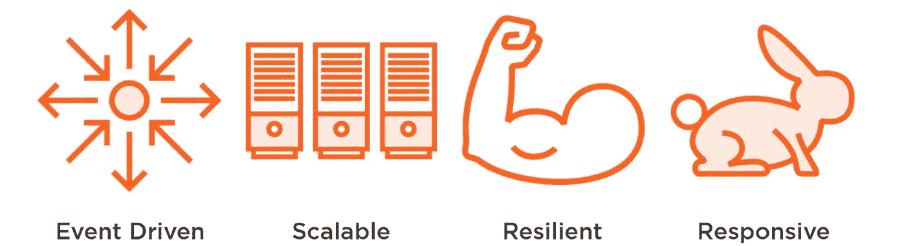
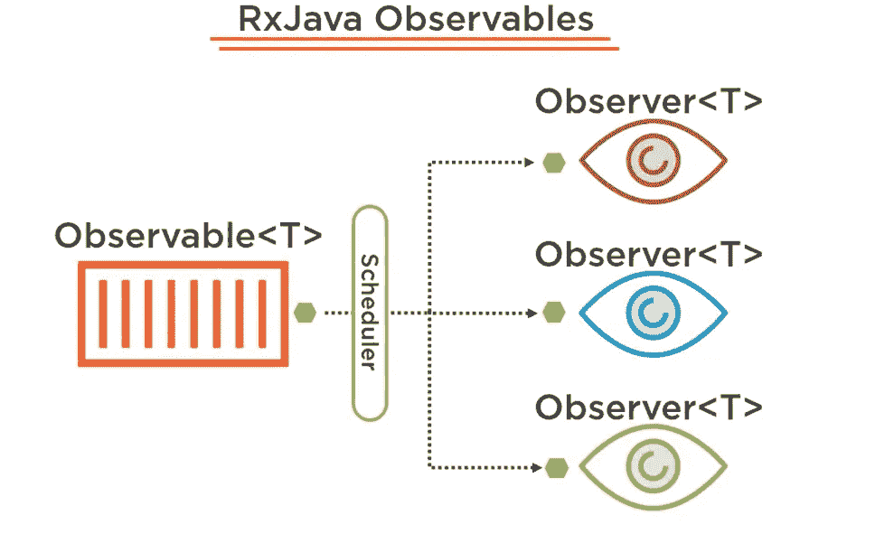

# RxJava 2 备忘单

> 原文：<https://blog.devgenius.io/rxjava-2-cheatsheet-73a112a9071f?source=collection_archive---------7----------------------->


rx Java(react vex Java)是一个 Java 库，用于通过使用可观察序列来组成异步和基于事件的程序。它实现了 react vex(Reactive Extensions)编程模型，这是一组使用可观察序列编写异步和基于事件的程序的原则。

RxJava 被设计成一个轻量级、高效和灵活的库，用于构建反应式应用程序，它被广泛用于 Android 和基于 Java 的应用程序中，用于处理网络请求、用户输入和数据流等任务。

RxJava 的核心概念是可观察序列，它表示可以随时间观察和处理的数据流或事件。可以从各种来源创建可观察序列，包括异步数据源，如网络请求和用户输入，并且可以使用各种操作符对它们进行转换和操作。

RxJava 还包括许多其他特性和工具，如调度、错误处理和实用函数，这使它成为用 Java 构建反应式应用程序的强大而有用的库。

# **反应式应用的属性**



*   **事件驱动**:事件驱动编程是一种编程范式，其中程序的流程由事件或动作决定。在事件驱动编程中，程序运行并等待特定事件或操作的发生，例如用户单击按钮或网络连接变得可用。当事件发生时，程序执行回调函数或处理程序来执行特定的任务以响应事件。
*   可伸缩性:根据反应宣言，我们希望我们的应用程序能够动态伸缩。如果系统上出现意外负载，我们应该能够简单地启动更多应用程序实例，以实现无缝扩展。当我们谈到利用云基础架构时，这一点尤为重要。
*   **弹性**:高容量且必须与外部系统通信的应用程序经常会经历短暂的中断和失败。在现代面向服务的系统中，如果我们依赖的服务停止运行，那么我们的应用程序通常也会停止运行。当我们所依赖的服务的响应时间增加，导致服务中的线程或其他资源备份时，经常会发生这种情况。在反应式世界中，我们希望我们的应用程序能够优雅地处理这种情况。
*   响应式**:响应式应用具有响应性。当面临高请求量时，我们仍然必须为我们的用户保持高水平的服务。对反应式应用程序进行编码，以确保它们即使在极端负载下也能做出响应，方法是在故障不可避免的情况下临时返回缓存数据，或者确保最少数量的客户因停机而感到不便。**

# **观察者模式**

**RxJava 使用这种模式的方式，仍然有可观察的，仍然有观察者。然而，我们要做一点小小的改变。我们将用一种类型来专门化可观察对象，这种类型表示用于事件的类类型。观察者也将期待一种特定类型的事件，这种事件与可观察对象所指定的类型相匹配。当事件被发送到可观察对象中时，它们必须是该特定类型的或从该特定类型中派生出来的。接下来，每个事件被同步或异步地发送给观察器，这取决于所请求的调度器。这就是 RxJava 库如此强大的原因。所有并发性都是声明性的，所有可观察性都必须遵守严格的契约，以确保线程复杂性得到控制。**

****

## **可观察，观察者，订阅**

**在 RxJava 中，Observable 是一个类，表示可以发送给观察者的数据流或事件。观察者可以订阅 Observables 来接收来自 Observables 的辐射。**

**要创建一个可观察对象并为其订阅一个观察者，可以使用 Observable 类的`subscribe`方法。以下是如何做到这一点的示例:**

```
Observable<Integer> observable = Observable.create(emitter -> {
  emitter.onNext(1);
  emitter.onNext(2);
  emitter.onNext(3);
  emitter.onComplete();
});

Observer<Integer> observer = new Observer<Integer>() {
  @Override
  public void onSubscribe(Disposable disposable) {
    // called when the subscription is made
  }

  @Override
  public void onNext(Integer integer) {
    // called when a new value is emitted
    System.out.println("Received: " + integer);
  }

  @Override
  public void onError(Throwable throwable) {
    // called when an error occurs
  }

  @Override
  public void onComplete() {
    // called when the Observable completes
  }
};

observable.subscribe(observer);
```

**结果:1，2，3**

## **可观察工厂**

**可观察工厂是一个创建并返回可观察对象的函数。可观察工厂对于创建以特定方式发出数据的可观察对象或者从其他可观察对象派生的可观察对象非常有用。**

```
Observable<Integer> rangeObservable(int start, int count) {
  return Observable.create(emitter -> {
    for (int i = start; i < start + count; i++) {
      emitter.onNext(i);
    }
    emitter.onComplete();
  });
}
```

**要使用这个可观察工厂，您可以简单地调用它并订阅返回的可观察对象:**

```
Observable<Integer> observable = rangeObservable(1, 10);
observable.subscribe(i -> System.out.println(i));
```

**这将把数字 1 到 10 打印到控制台。**

```
Observable<Integer> squareObservable(Observable<Integer> source) {
  return source.map(i -> i * i);
}
```

```
Observable<Integer> source = Observable.just(1, 2, 3);
Observable<Integer> squared = squareObservable(source);
squared.subscribe(i -> System.out.println(i));
```

**结果:1、4、9**

> **`range`、`interval`和`timer`**

**以下是一些如何使用这些方法创造可观测量的例子:**

1.  **`range`:**

```
Observable<Integer> rangeObservable = Observable.range(1, 5);
```

**这段代码创建了一个发出值 1、2、3、4 和 5 的可观察对象。**

1.  **`interval`:**

```
Observable<Long> intervalObservable = Observable.interval(1, TimeUnit.SECONDS);
```

**这段代码创建了一个发出一系列值的可观察对象，从 0 开始，每秒递增 1。**

1.  **`timer`:**

```
Observable<Long> timerObservable = Observable.timer(5, TimeUnit.SECONDS);
```

**这段代码创建了一个可观察对象，它在延迟 5 秒后发出一个值(0)。**

**您可以像使用任何其他可观察对象一样使用这些可观察对象，方法是为它们订阅一个观察者。例如:**

```
rangeObservable.subscribe(i -> System.out.println("Range: " + i));
intervalObservable.subscribe(i -> System.out.println("Interval: " + i));
timerObservable.subscribe(i -> System.out.println("Timer: " + i));
```

## **可观察基数**

1.  **`Single`:发出单个值或错误。**
2.  **`Maybe`:发出单个值，完成时不发出值，或发出错误。**
3.  **`Completable`:完成或发出错误。**
4.  **`Observable`:发出零个或多个值，然后完成或发出一个错误。**

**你使用的可观察类型应该取决于你正在处理的数据的性质。例如，如果你期望一个单一的值作为一个操作的结果，你可以使用 `*Single*` *。如果你期待一串值，你可以使用一个* `*Observable*` *。***

```
// Single that emits a value
Single<String> single = Single.just("Hello");
single.subscribe(s -> System.out.println("Single: " + s),
                 throwable -> System.out.println("Single error: " + throwable));

// Maybe that emits a value
Maybe<String> maybe = Maybe.just("World");
maybe.subscribe(s -> System.out.println("Maybe: " + s),
                throwable -> System.out.println("Maybe error: " + throwable),
                () -> System.out.println("Maybe complete"));

// Maybe that completes without emitting a value
Maybe<String> emptyMaybe = Maybe.empty();
emptyMaybe.subscribe(s -> System.out.println("Maybe: " + s),
                     throwable -> System.out.println("Maybe error: " + throwable),
                     () -> System.out.println("Maybe complete"));

// Completable that completes
Completable completable = Completable.complete();
completable.subscribe(() -> System.out.println("Completable complete"),
                      throwable -> System.out.println("Completable error: " + throwable));

// Observable that emits three values and completes
Observable<Integer> observable = Observable.just(1, 2, 3);
observable.subscribe(i -> System.out.println("Observable: " + i),
                     throwable -> System.out.println("Observable error: " + throwable),
                     () -> System.out.println("Observable complete"));
```

```
Single: Hello
Maybe: World
Maybe complete
Completable complete
Observable: 1
Observable: 2
Observable: 3
Observable complete
```

# **背压到底是什么？**

**他们无法满足需求！:D 这是反压**，这个**同样适用于我们的软件。**

**想象一下，一个可观察对象发出大量的值，但是观察者只能缓慢地处理它们。如果可观察对象继续以比观察者能消耗它们更快的速度发出值，这些值将开始在内存中积累。这可能导致 OutOfMemoryErrors 和其他问题。**

**为了解决背压问题，RxJava 提供了许多操作符，可以用来控制从可观察对象到观察者的数据流。这些运算符允许您控制值发出和消耗的速率，并处理发出速率超过消耗速率的情况。**

**`**Flowable**` **是营救:****

**在 RxJava 中，`Flowable`是一种被特别设计来处理背压的可观察对象。一个`Flowable`可以发出无限数量的项目，但是它将使用反压力来确保它不会一次用太多的项目淹没它的观察者。**

**`Flowable`与`Observable`相似，但有几个关键区别:**

1.  **一个`Flowable`可以发射无限数量的项目，而一个`Observable`只能发射有限数量的项目。**
2.  **`Flowable`支持背压，而`Observable`不支持背压。**
3.  **使用`Subscriber`或`Subscription`可以订阅`Flowable`，而使用`Observer`只能订阅`Observable`。**

**以下是如何创建和订阅`Flowable`的示例:**

```
Flowable<Integer> flowable = Flowable.range(1, 1000);

Subscription subscription = flowable.subscribe(new Subscriber<Integer>() {
  @Override
  public void onSubscribe(Subscription s) {
    // called when the subscription is made
    s.request(Long.MAX_VALUE); // request all items
  }

  @Override
  public void onNext(Integer integer) {
    // called when a new value is emitted
    System.out.println("Received: " + integer);
  }

  @Override
  public void onError(Throwable throwable) {
    // called when an error occurs
  }

  @Override
  public void onComplete() {
    // called when the Flowable completes
  }
});
```

## **热对比冷观察**

****一个热可观测值**可以在没有观测者订阅的情况下开始，并在最后一个观测者取消订阅后继续。RxJava 中热可观察的一个例子可能是来自 Swing 应用程序的鼠标移动事件的**流。只要应用程序启动，这个可观察对象就会开始发出事件，不管是否有观察者订阅它。稍后订阅的观察者将只能接收到在他们订阅后发出的事件****

```
SwingObservable.fromMouseMotionEvents(myComponent)
  .subscribe(event -> System.out.println("Mouse moved: " + event.getX() + ", " + event.getY()));
```

**另一方面，**冷可观察**进程通常只在订阅发生时启动，在订阅结束时关闭。它可以为每个订阅的观察者运行一个进程。**

```
Observable<Integer> coldObservable = Observable.create(subscriber -> {
  subscriber.onNext(1);
  subscriber.onNext(2);
  subscriber.onNext(3);
  subscriber.onComplete();
});

coldObservable.subscribe(x -> System.out.println(x));
```

> **请注意，热点观察值通常用于表示独立于任何观察者产生的连续数据流，例如鼠标移动或股票价格。另一方面，冷可观测量通常用于表示专门为特定观察者产生的一次性事件或数据集。**

## **可任意处理的**

**在反应式编程中，disposable 是一个对象，它表示当不再需要时可以被“处置”或释放的资源。一次性数据通常用于管理可观察数据和其他异步数据流的生命周期。**

**例如，在 RxJava 中，可以使用订阅对象订阅一个可观察对象，这是一种可任意处理的对象:**

```
Observable<Integer> observable = Observable.just(1, 2, 3);
Subscription subscription = observable.subscribe(x -> System.out.println(x));

// Later, when the subscription is no longer needed:
subscription.dispose();
```

**在这个例子中，当不再需要订阅时，订阅被处理掉，这将导致可观察对象停止向订阅者发送数据。**

**一次性设备还可用于以更高效的方式管理多个订阅和资源。例如，您可以使用 CompositeDisposable 来管理一组一次性用品，并一次性处理它们:**

```
CompositeDisposable disposables = new CompositeDisposable();

Observable<Integer> observable1 = Observable.just(1, 2, 3);
Subscription subscription1 = observable1.subscribe(x -> System.out.println(x));
disposables.add(subscription1);

Observable<Integer> observable2 = Observable.just(4, 5, 6);
Subscription subscription2 = observable2.subscribe(x -> System.out.println(x));
disposables.add(subscription2);

// Later, when all subscriptions are no longer needed:
disposables.dispose();
```

**在此示例中，当 CompositeDisposable 被释放时，subscription1 和 subscription2 都将被释放。**