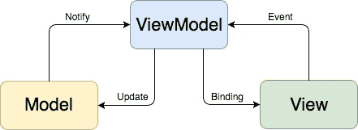
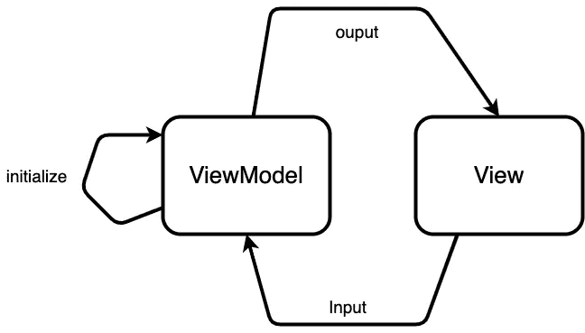

# Rxswift MVVM-了解您的视图模型

> 原文：<https://blog.devgenius.io/rxswift-mvvm-understand-your-viewmodel-50e8fe12436b?source=collection_archive---------10----------------------->

仅仅将逻辑代码移出 ViewController 是不够的

法比安·格罗斯在 [Unsplash](https://unsplash.com?utm_source=medium&utm_medium=referral) 上拍摄的照片

你可能已经知道 MVVM 建筑公司，它在视图模型中有所有的逻辑。因此，您可以从视图和其他服务中分离出来，更加专注。结构如下:

在本文中，我将重点关注 ViewModel。是的，我们有所有的逻辑，但这就是我们所需要的吗？显然，答案是否定的。我们必须做大量的工作来使代码简单、易读和可测试。

为了使代码可读和可测试，我们必须清楚地确认输入和输出。然后我们可以模拟输入并断言输出。基本上是这样的:

*   **输入**主要指用户的交互或者视图初始化时发生的一些自动输入(网络调用)等。
*   **输出**是视图中绑定的值或函数。每当 Viewmodel 中的值发生变化时，视图层也会发生一些变化
*   初始化是一种特殊的输入，叫做依赖注入。ViewModel 必须进行初始化，以便进一步使用。通过这样做，ViewModel 告诉视图:“嘿，如果你想使用我，给我我需要的东西！”

现在让我们看看 Rxswift 的“实时”代码是如何构建的:

我相信这段代码清楚地表达了这三个部分:

*   我们有 ViewModelType 协议来实现输入和输出
*   我们用 API 管理器的 init()方法来调用 API 数据
*   在输入中:重载可以是视图通过调用 API 管理器中的 requestData 来刷新的一个特性
*   在输出中:我们有 View 需要的所有可观察数据——文章、错误

以下是视图层中的代码:

*   1:我们有依赖注入来初始化视图模型
*   2:设置与商品数据的绑定
*   3:设置有错误的绑定
*   4:触发输入—重新加载以启动 API 调用

> 请注意:在 Rxswift 中，驱动程序和观察程序是懒惰的，它们在被订阅之前什么也不做。

在所有代码都工作之后，我们如何测试它呢？有了 Rxswift 的这种结构和测试时间表，测试变得更加容易。

我们可以让调度程序创建到输出的观察者绑定和到输入的可观察绑定。然后，我们模拟网络服务失败或成功，以测试断言的值。欲了解更多信息，请咨询:

 [## rx swift & MVVM——如何使用 RxTests 测试你的视图模型

### 不久前，我在一个 iOS 项目中写了如何将 RxSwift 与 MVVM 架构配对。即使我重构了我的代码…

benoitpasquier.com](https://benoitpasquier.com/how-to-use-rxtests-to-test-mvvm/) 

## 结论:

总的来说，当我们起草视图模型时，最好明确指出输入和输出函数/变量。我们可以把它放在命名或使用协议中。

用于输出/输入。它应该是我们的公共/内部函数或可观察变量，因为它必须与其他对象交互。然后，我们有所有的私有函数或其他处理器类/结构来处理大部分内部逻辑。

感谢阅读！你可以在这里找到完整的演示[,并随时留下任何评论！](https://github.com/lee197/NYT-Articles/tree/master)