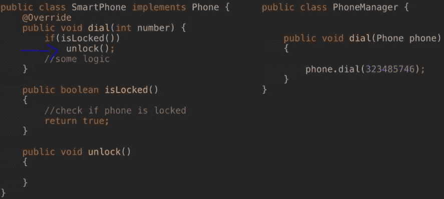

# 南 Android 开发中的 O.L.I.D 原则

> 原文：<https://blog.devgenius.io/s-o-l-i-d-principles-in-android-development-7353f4d5b23a?source=collection_archive---------1----------------------->

构建 android 应用程序可能是一项复杂的任务。如果没有对 android 架构组件的良好理解，它会把你引入死胡同。理解和利用 android 架构组件库对于掌握 Android 应用程序开发的艺术非常重要。

# **坚实的原则**

当谈到下面的架构时，首先想到的是坚实的原则。它最初是由 Robert C. Martin 提出的，遵循一种规范的开发方法，使 self 和其他开发人员遵循起来不那么混乱。它使得编写可扩展、可维护和可测试的代码变得更加容易。

南国际劳工组织原则

# 单一责任原则

第一个原则是，每个类应该只承担一个责任，也就是说，它应该只包含与那个功能/特性相关的代码。对于每个新的特性/功能，应该有一个单独的类。这个原则产生了简短的组件，这是扩展和测试组件的关键构件。

例如，如果您想要制作一把可以进行计算的多功能刀，它有一个放大镜、光源和一把锤子:

我们的单一责任原则组件/类应该是这样的。

每个类只包含与特定功能相关的代码。

# **O:开启/关闭原理**

第二个原则通常也被称为开/闭原则。顾名思义，这一原则强调:

每节课都应该

I)对扩展开放

ii)禁止修改

一旦你按照第一个单一责任原则编写了一个类/组件，你就不应该改变/修改现有的类。要添加或扩展功能，您应该只使用继承。

例如，在下面的示例中，我们编写了只处理 0 和 1 的情况的代码。

比方说，我们想添加案例来处理输入，比如 3、4 等等。为了迎合这种情况，我们必须扩展我们的类，而不是修改。

# **L:利斯科夫替代原理**

第三个原则说明，如果您用不同的子类参数替换类参数，现有功能不应中断，即

我)。将类“Y”作为参数的方法/函数必须能够与“Y”的任何子类一起工作

例如，看看下面的 Phone 类及其子类:

现在，假设您想拨打一个号码:

如果手机是智能手机类型，并且被锁定了怎么办？我们不能拨这个号码。因此，功能被破坏，原则被违反。我们可以通过如下更改我们的电话管理器类来解决这个问题:

我们检查电话的实例，然后根据需要拨打号码

将来，如果有多种类型的电话，我们将不得不再次修改我们的电话管理器类。然而，更改 Phone Manager 类会违反我们的第二个原则，即该类应该关闭以进行修改。

相反，正确的做法是在智能手机类中处理。更新后的代码如下所示:

# **I:界面分离原理**

我们经常最终在我们的接口中编写所有的函数，这些函数不一定需要在每个扩展类中实现。在这种情况下，复杂的接口使得扩展系统的小部分变得更加困难。接口分离原则指出，我们的复杂接口应该被分割成更小的接口，这样更容易将它们扩展到系统的相关部分。

举个例子，

在这个例子中，假设我们想要实现计算器功能，但是我们最终会得到 lightOn 和 lightOff 方法的空定义，这违反了这个原则。相反，我们应该使用这三个接口:

# **D:依存倒置原则**

最后一项原则指出:

I)不应该有隐藏的依赖性

ii)让调用类创建依赖性，而不是让被调用类自己创建依赖性

举个例子，

在这个例子中，调用 Bank()的类不知道 Bank 构造函数在其中创建的依赖项，这违反了这个原则。相反，应该这样重构它:

现在，在这种情况下，调用类将这些依赖项传递给 Bank 构造函数本身，因此它知道它，并且其中没有隐藏的依赖项。

这是编写测试用例的一个重要方面，因为我们知道每个组件，并且可以独立测试它。

# **结论**

对于新开发人员来说，每个软件都需要可维护、可扩展、可测试和可理解。只有在软件开发的整个生命周期中实施全球开发标准，才能实现所有这些特征。S.O.L.I.D 原则为如何定义正确的方法提供了非常基本的理解，去掉了维护、扩展和理解软件的额外成本。