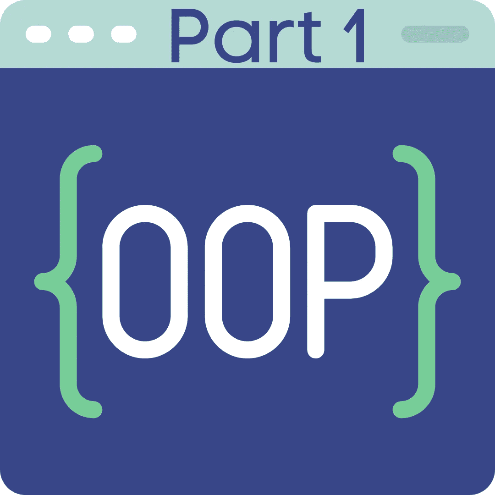
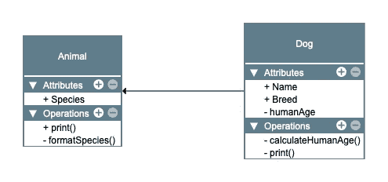

# S3，S4，RC，R6。R 中的面向对象—第一部分

> 原文：<https://blog.devgenius.io/s3-s4-rc-r6-object-oriented-in-r-part-1-4e6cb6a79003?source=collection_archive---------4----------------------->

介绍面向对象的 R，S3 和 S4 对象。

# 第 1 部分的主题

*   什么是面向对象(OO)？
*   R 是如何实现 OO 的？
*   案例研究。
*   S3 反对。
*   S4 物体

# 什么是面向对象编程？

面向对象(OO)是程序设计的三个主要范例之一。它革新了编程，还有结构化编程和函数式编程。面向对象非常流行，尤其是 Python、Java、C#等语言。但是什么是面向对象编程呢？OO 通常由封装、多态和继承等特性来定义。我更喜欢用马丁的定义:

> OO 语言对所有源代码的方向有绝对的控制权。

换句话说，OO 可以非常精确地控制依赖关系。

我们如何在休息中驾驭这种力量？

# R 中的 OOP

从设计上来说，r 是一种函数式语言。你分解一个问题，用函数解决它，而不是用对象。然而，R 支持 OO。事实上，在 R 中你一直在使用对象和方法，即使你没有意识到。像`data.frame`、`list`和`vectors`这样的实体就是类。他们都有自己的方法，如`print`或`summary`。这些方法根据您使用它们的类而有不同的行为。

r 支持两种类型的 OO 编程:

*   **功能性 OO 编程**。在函数式 OO 编程中，方法属于泛型函数。函数式 OO 编程类似于标准的函数式编程，至少从外部来看是这样。R 中的函数对象是 S3 和 S4 对象。

*   **封装的 OO 编程**。在封装的 OO 编程中，方法属于类:它们是封装的。如果你熟悉 Python 或者 Java OO 编程，这也是同样的原理。R 中封装的对象是 R6 和 RC 对象。

在这个小系列中，我们将首先看看 R 对 OO 的实现，以及不同解决方案的优缺点。

# 这个例子

在本系列中，我们将使用一个常见的例子来描述我们将要探索的所有对象。我们将用一些属性和方法定义一个类`Animals`。然后我们将定义`Animals`的子类:`Dog`。我们会用`Dog`来表示继承。

一些属性和操作应该是公共的(+)，而其他的应该是私有的(-)。

本系列中使用的类。

一如既往，我想给你你需要的知识来设计基于良好决策的解决方案。我不打算给你 OO 实现的每一个可能的细节。如果你想知道所有的细节，哈德利·威克姆有一本很棒的书:高级 R([https://adv-r.hadley.nz/index.html](https://adv-r.hadley.nz/index.html))。

# S3

S3 是 r 中最简单也是最常见的面向对象编程形式。它的实现非常简单，尤其是与传统的面向对象语言相比。然而，它是非常多才多艺的，其简化的方法也有优点。

为了理解我的意思，让我们开始研究我们的示例类:`Animals`。

这是非常不正式的。我们创建了一个列表，并将其属性从`list`更改为`Animals`。

一般来说，每当我们创建一个 S3 对象时，我们都希望创建三个函数:

*   ***内部构造函数*** 。这将创建列表并将类更改为`Animals`。这不会暴露给用户。这是一个开发者功能。构造函数名要以`new_`开头。
*   ***验证器*** 用于验证用户提供的创建类的输入。
*   ***一个用户友好的*** 类生成器导出给用户。用户将调用它来构建一个对象。构建器将调用验证器和内部构造函数。

这就是我们如何为我们的类编写这三个函数。

让我们打开行李。

`new_Animals`是内部构造函数。这不会向用户公开，但这是一种在内部构建对象的快速方法，即从包中构建。

`validate_Animals`是对象验证器。它检查我们有一个正确的类和正确的属性的对象。请注意，您可以在内部构造函数中包含这些简单的检查。根据经验，在验证器中包含昂贵的检查，在内部构造函数中包含廉价的检查。通过这种方式，您可以仅在需要时运行昂贵的检查。然而，我更喜欢更严格的责任划分。我将所有检查放在验证器中，而不是构造函数中。

`Animals`是建设者暴露给用户。这个函数构建对象，然后验证它。

# 泛型和方法

我们现在需要创建我们的两个方法:`print`和`formatSpecies`。`print`将打印我们对象的用户友好摘要，而不是我们默认得到的摘要。`formatSpecies`将格式化物种字符串。

在 S3，我们不能创建私有方法。我们所有的方法都会公开。

先从`print`法说起吧。r 中已经存在一个泛型`print`。您可以在任何变量上调用它，以查看它打印到控制台的值。事实上，`print`是 S3 的通用名。我们可以使用它并为类`Animals`创建一个新方法。

注意方法`print.Animal`的约定。调用方法为`generic.class`非常重要。这是让调度机制工作所需的内部 R 约定。

现在让我们创建`formatSpecies`。这个方法没有泛型，所以我们需要创建它。

泛型`formatSpecies`会将适当的方法匹配到对象。然后，它将调用这个方法:`formatSpecies.Animals`。

# 遗产

S3 的继承围绕着一个概念，即类可以是长度大于 1 的向量。也就是说，一个对象可以有两个或更多的类。您可以在`tibble`包中找到这种行为的示例。

一个`tibble`对象有三个类:`tbl_df`、`tbl`和`data.frame`。这体现了继承的顺序:`tbl_df`是`tbl`的子类，而`tbl`又是`data.frame`的子类。

当我们在一个像这样的对象上使用泛型时，R 会尝试按照指定的顺序分派给一个方法。如果没有找到`tbl_df`的方法，那么 R 将寻找类`tbl`的方法，最后是类`data.frame`的方法。

让我们看看如何在我们的例子中使用它。在我们创建子类之前，我们需要改变超类。这是因为在 S3，继承不是自动的:我们需要将它添加到超类中。

我们做了三点改变:

*   我们添加了参数`...`。这允许我们向超类传递构造函数所需的任何额外参数。
*   我们添加了`class=character()`这个参数。这允许我们指定子类并创建类向量，正如我们在 tibble 示例中看到的。
*   我们将这个类定义为`c(class, "Animals")`，而不仅仅是`"Animals"`。同样，这允许我们创建长度大于 1 的类向量。

既然超类可以接受子类，让我们创建`Dog`子类。

在第 3 行，我们调用了`Animals`超类构造函数，但是我们指定我们想要使用类`Dog`。在第 14 行中，我们看到`myDog`的类是一个包含两个元素的向量:`Dog`(子类)和`Animals`(超类)。如果我们尝试使用 print 方法，R 将使用为类`Animals`定义的 print 方法。这是因为我们没有为`Dog`定义打印方法。就这么办吧。

现在我们有了`Dog`的打印方法，R 将使用它，而不再使用`Animals`的方法。我们不需要定义泛型 print，因为它已经在 base R 中定义了。我们只为子类创建方法。

最后，我们可以使用相同的语法来创建新方法`humanAge`。这种方法将计算狗的年龄在“人类”年。

这里没有我们没有见过的东西:我们定义了泛型(`humanAge`)，然后定义了与泛型和类关联的方法(`Dog`)。

# S3 不是可变的

考虑一下这个场景。今天是你狗的生日。你想要一个新的方法，可以更新你的狗的年龄。它应该返回以前的年龄并更新内部年龄。S3 对象不能做到这一点。S3 对象不是可变的。他们不能修改输入参数，因为他们基于函数。

如果我们想要更新一个对象并从同一个调用返回一个结果，我们必须使用一个变通方法。我们需要创建一个功能:

*   修改输入对象以更新年龄。
*   在列表中返回修改后的对象。
*   将前一个年龄添加到列表中。
*   在主环境中，用赋值语句解包列表。

方法`updateAge.Dog`返回一个包含先前年龄和修改对象的列表。

这很尴尬，比传统的封装面向对象要差很多，因为在传统的封装面向对象中，对象是可变的。当我们探索 R6 天体时，我们将会看到不同之处。

# S3 总结

S3 是简单的物体。他们的定义是非正式和宽松的。您甚至可以在创建后更改它们的结构。没有正式的验证器。S3 没有“私人”的概念，一切都是“公共”的。此外，S3 不是可变的。他们以功能为导向的行为可能会让非 R 人群感到不快。本质上，S3 对象不仅仅是美化了的列表。

但是不要太快就放弃它们。S3 的简朴中蕴含着美和意义。例如，将新类的新方法插入到现有的泛型中是非常容易的。

如果您需要封装的可变方法或可靠的继承机制，S3 不是最佳选择。此外，在相同代码基础上开发的大型团队可能会因为界面缺乏结构而陷入困境。

然而，在大多数情况下，S3 应该是第一选择。毕竟，如果它们是最常见的类型或 R 对象，肯定是有原因的。通过简化您的代码，使其适用于 S3，会有很多好处。

# S4 物体

S4 是 S3 的更严格的执行。S4 仍然是功能性的 OO，但是类是正式定义的。创建对象后，您不能再更改其结构。S4 支持更复杂的继承和分派机制。

让我们看看如何在 S4 创建我们的`Animals`类。

我们可以看到一些与 S3 不同的地方。我们需要使用`representation`来定义类内容(`slots`)。如果我们试图在对象创建后给它添加另一个槽，或者给`species`分配一个字符以外的东西，我们会得到一个错误。我们还注意到，要访问一个槽，我们使用`@`而不是`$`，或者我们可以使用 S4 函数`slot()`。

我们现在有了基本的对象，让我们添加一个验证器。

我们的验证器`validate_Animals`基于我们用于 S3 的验证器，但是它更加轻量级。我们没有测试`species`是字符还是空。这是因为在我们将`species`定义为构造函数中的一个字符后，这些检查是免费的。我们只需要检查`species`是否是我们想要的形式。

在我们定义了验证函数`validate_Animals`之后，我们使用`setValidity`将它添加到构造函数中。通过这样做，每次创建对象时都会自动调用验证函数。

# 泛型和方法

如果我们不能对它做任何事情，我们的新 S4 对象就没有什么特别的帮助。让我们从创建一个显示其内容的方法开始。在 S4 你通常不用`print`，而是用`show`。如果你为`print`创建一个类属，这将覆盖基本 R `print`，然后它将停止工作。

`show`是一个 S4 内置泛型，所以我们不需要定义它。我们只需要为我们的类定义方法。

如果您还记得我们 S3 的例子，这看起来很熟悉。我们首先用`setGeneric`定义一个泛型，然后用`setMethod`定义一个方法。

使用相同的语法，让我们实现`formatSpecies`方法。

至于 S3，S4 没有私有方法的概念，所以两种方法都是公有的。

# 遗产

让我们创建一个继承自`Animals`的 S4 类`Dog`。

通过使用在`Dog`的定义中使用的参数`contains`，继承变得显式。你会注意到`Dog`继承了`Animals`的`show`方法。我们可以创建一个专用的`show`方法。同时，我们也可以创建`humanAge`方法。

# S4 不是可变的

至于 S3 对象，S4 不是可变的。我们不能同时修改一个对象并返回一个结果。我们需要实现与 S3 对象相同的解决方法。

在上面的代码片段中，我们创建了一个名为`updateAge`的方法。在该方法中，我们更新槽位`age`，且我们还返回旧年龄。为了能够一次完成这两个操作，我们必须从方法中返回一个列表。该列表将包含修改后的对象和期望的返回。最后，在主环境中，我们需要用更多的赋值来打开列表。

# S4 总结

S4 和 S3 基于同样的想法。它们都是功能性的 OO 系统，并且都是不可变的。S4 有更严格的定义。我们需要在我们的类中精确地指定我们想要的东西，并且一旦创建了一个对象的结构就不能被修改。这可以帮助更大的团队，因为界面更清晰。

S4 补充道，拘泥形式听起来可能很棒，但你应该仔细评估这是否值得。通常最好使用更简单、更 R 友好的 S3。这是因为传统 R 开发人员改进了文档和代码可读性。

请关注我并订阅，以便在本系列的第 2 部分发布时获得通知，并获得关于 R 编程的其他技巧。