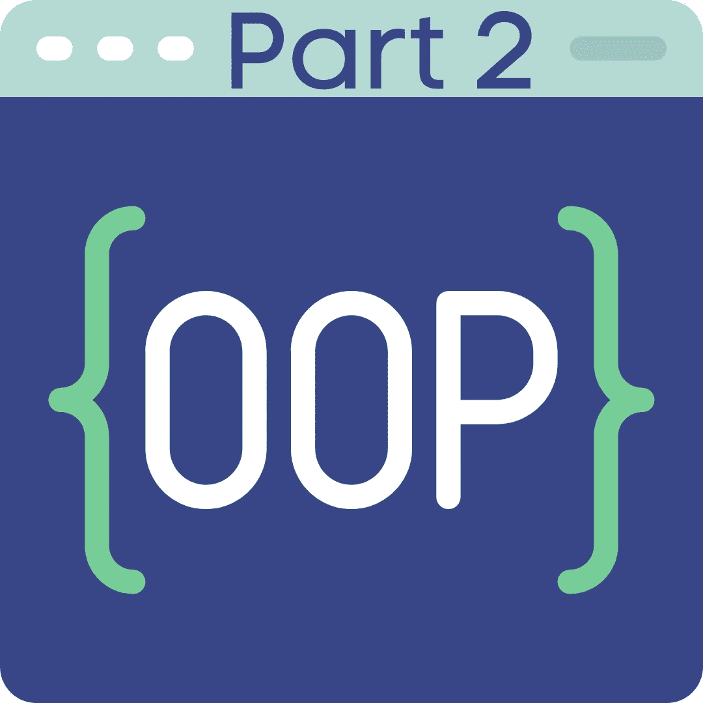
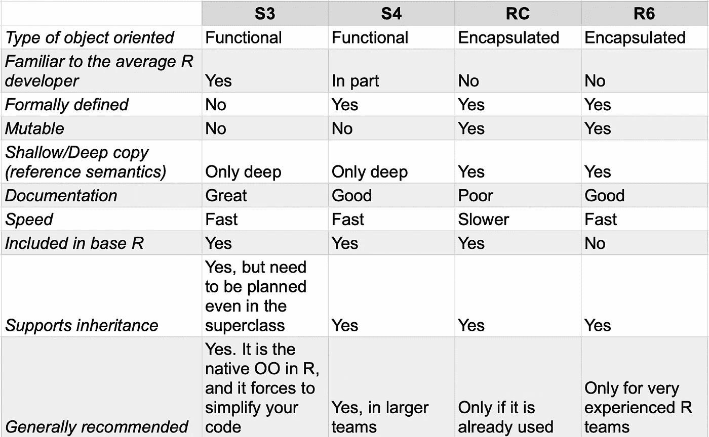

# S3，S4，RC，R6。R 语言中的面向对象—第二部分

> 原文：<https://blog.devgenius.io/s3-s4-rc-r6-object-oriented-in-r-part-2-109b3d82046e?source=collection_archive---------4----------------------->

RC 和 R6 对象。

本文基于我在第 1 部分中介绍的概念。

# 第 2 部分的主题

*   RC 对象。
*   R6 反对。
*   最终考虑

# RC 对象

引用类(RC)是 base R 的一部分，与 S3 或 S4 相比，它是 R 中一个非常不同的 OO 实现。S3 和 S4 代表功能性的面向对象，而 RC 是封装的面向对象。在 RC 中，方法属于类，而不属于函数。

传统的 OO 开发人员对 RC 会很熟悉。传统的面向对象被正式定义并被封装。然而，RC 语法和行为对纯 R 开发人员来说并不友好。稍后我们会看到一些这样的例子。

让我们看一下`Animals`例子的 RC 实现。

我们创建了具有以下属性的类`Animals`:

*   `fields`:这是对象内部的变量列表。
*   `methods`:属于类的方法。

`initialize`方法首先验证输入，然后格式化`species`字符串，最后初始化对象。

在实际应用中，我们可以考虑上面一个低级构造函数的例子。您可能希望为用户提供一个用户友好的构造函数来创建对象。昂贵的验证检查可以保留给用户公开的构造函数。

如果类定义变得太长，建议将其分成小块。我们可以通过使用`<class_name>$methods(<method_name> = function(){})`语法将方法附加到类定义上。

# 遗产

RC 通过构造函数的`contains`参数支持继承。让我们考虑一下我们的`Dog`子类。

我们定义类及其方法的方式与我们定义`Animals`的方式相同。但是，既然我们用了`contains`，那么`Dog`就是`Animals`的子类。我们可以从现场`species`看到这一点。我们没有在`fields`中定义`species`，但是我们从`Animals`中继承了它。

如果我们需要从超类中调用一个方法并解决名称冲突，我们可以使用`callSuper`方法。

注意`show`方法是如何从`Animals`继承的，我们使用`superClass`函数从`Dog`调用它。

# RC 是可变的

RC 对象是可变的。也就是说，我们可以在修改对象的同时返回值。在狗的例子中，我们在方法`updateAge`中演示了这一点。此方法修改对象以更新年龄字段。同时返回之前的年龄。这是一个强大的功能，但我们需要小心。可变性不是 R 中的自然行为:它会让开发人员措手不及。这也使得推理对象的效果和行为变得更加困难。尽可能地限制可变性，并始终将副作用(修改对象)与直接回报分开。

# 内置方法

RC 有几个内置的方法。我们已经看到了其中的一些，比如访问字段的`field`，或者为对象创建新方法的`methods`。

`copy`是一个重要的内置方法。它强调了“标准”R 行为和 RC 行为之间的根本区别。正如名字*引用*所暗示的，当我们创建一个 *ReferenceClass* 对象的副本时，我们不是创建一个独立的副本，而是一个被引用的副本。这意味着如果我们修改了对象的一个版本，我们也修改了它的副本。为了进行独立复制，我们需要使用`copy`方法，将`shallow`参数设置为`FALSE`。

对于一个 R 开发人员来说，这看起来非常奇怪和出乎意料。如果不小心使用的话，你可以预见它会产生一些问题。

其他内置方法有:

*   `new`:用于初始化对象。`newAnimal <- Animals$new()`等于`newAnimal <- Animals()`。
*   `help`:提供帮助文档。
*   `methods`:创建新方法。

完整的列表可以在 [RC 文档页面](https://www.rdocumentation.org/packages/methods/versions/3.6.2/topics/ReferenceClasses)上找到。

# 包裹

RC 对象对熟悉其他语言 OO 的开发人员很有吸引力。RC 支持熟悉的模式和概念，例如封装。然而，它使用了 R 语言不熟悉的机制，比如可变性。这些机制使得 R 开发人员更难阅读和维护代码。

此外，RC 的文档记录很差:它的所有文档都在[这一页](https://www.rdocumentation.org/packages/methods/versions/3.6.2/topics/ReferenceClasses)。RC 也比 R6 慢，后者基于相同的原理。

最后一点是关于私有方法的。在 RC 中，没有(简单的)方法来创建私有方法或字段。如果你足够努力地搜索 stackoverflow，你会发现一些变通办法，但它们仅仅是:变通办法。

由于所有这些原因，在任何情况下都很难推荐 RC。如果您需要增加 RC 可变性和封装的复杂性，请使用 R6。唯一需要考虑 RC 的情况是当你处理遗留代码并且 RC 已经被使用的时候。

# R6

R6 是封装面向对象的另一个实现。它不是 base R 的一部分，你需要安装`R6`包。R6 与 RC 共享许多功能，但它基于 S3，而不是 S4。

我们来看看如何编写`Animals`类。

R6 通过`private`支持私有方法和字段。您可以使用`private$`符号从公共方法中访问私有方法和字段，如上面的`initialize`方法所示。

R6 也支持管道。如果你熟悉 Python，你会知道你可以使用`.`符号来链接命令:`method1().method2().method3()`。在 R6，我们可以使用`$`操作符做同样的事情，如上面例子的最后一行所示。

# 遗产

R6 继承要求在类定义中使用`inherit`参数。

我们可以使用`super`访问超类的公共和私有属性，如下例所示。

# R6 是可变的

R6 对象是可变的，至于 RC，我们用`updateAge`方法演示了这一点。

同样，可变性不是一种正常的 R 行为:尽量少用它。

# 内置方法

R6 对象有内置的方法。最值得注意的是`clone`。`clone`允许您创建对象的深层副本。如果你经常在 RC 和 R6 之间切换，只要记住 RC 的`copy`与 R6 的`clone`工作原理相反:`copy(shallow=FALSE)`等同于`clone(deep=TRUE)`。

# 包裹

RC 和 R6 都是传统 OO 开发者所熟悉的。RC 和 R6 的语法和功能集是相似的。一个关键的区别是 R6 有对私有方法的本地支持。

RC 和 R6 有两个主要区别:性能和文档。R6 的表现比 RC 好，这也是 Shiny 从 RC 转投 R6 的原因之一。至于文档，R6 比 RC 有更好的文档。

# R 中的面向对象:最终总结

r 是一种函数式语言。然而，R 支持面向对象的编程。面向原生 R 对象属于函数类型。在这个实现中，方法属于一个函数(泛型)，而不是属于一个类。不同的类可以在现有的泛型中插入新的方法。这种类型的类没有正式定义，对于非 R 开发人员来说可能看起来很奇怪。

r 有两种类型的功能性面向对象:S3 和 S4。S3 被很好地记录并嵌入在 base R 中。像`print`或`summary`这样的函数实际上是 S3 泛型。我们可以创建新的 S3 类，并利用这些现有的泛型。我们要做的就是编写新的方法。这对 R 开发人员来说是非常自然的。此外，生成的语法将使用常见的 R 动词。

S4 比 S3 更复杂。它们是正式定义的，这种增加的刚性可以简化大型团队的工作。这是 S4 成为生物导体项目骨干的主要原因之一。

如果你需要“传统的”面向对象封装，那么你可以使用 RC 或 R6。R6 甚至支持私有属性。RC 和 R6 的缺点是它们有一些非 R 标准的属性，比如可变性和浅拷贝。这些特性可能会给不熟悉它们的其他团队成员造成混淆。请记住，你是在一个团队中工作，你必须致力于提供最好的解决方案。这是每个人都能理解和维护的解决方案，但不是技术上最先进的。

当我处理物体时，我倾向于处理 S3、S4 的组合，只有一小部分是 R6。对于向用户公开的类，我使用 S4 或 R6，对于内部方法，我使用 S3。这样，我可以在应用程序的外层利用接口的正式定义。同时，当我不必担心外部输入时，我可以使用 S3 的灵活性。只有当我不得不与熟悉 OO 的非 R 开发人员一起工作时，我才使用 R6。他们倾向于发现在 R6 工作很舒服，同时他们也开始理解 S3 和 S4 的概念。

下面是一个快速参考表，帮助你定义你的 R 的 OO 策略。

我希望这篇面向对象的快速指南对你有用。如果您想获得更多关于如何改进编码的技巧，请订阅并关注。