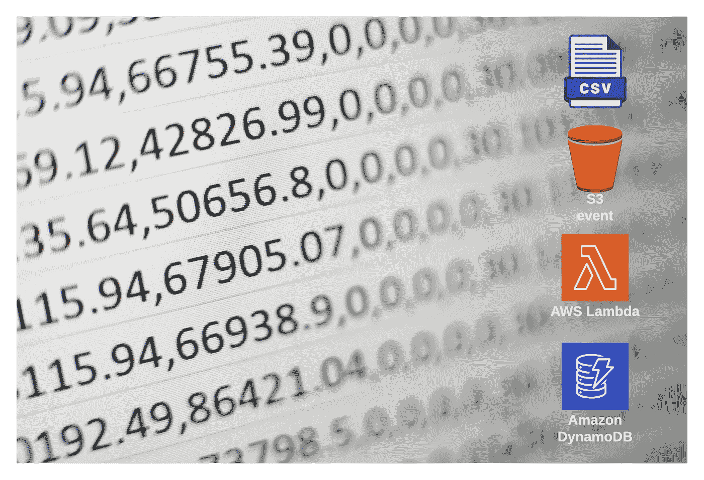
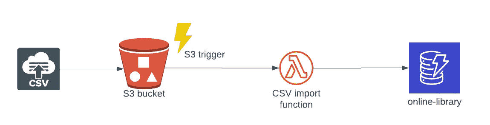
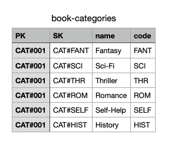
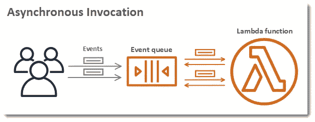
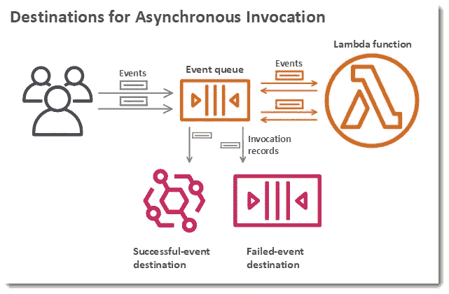
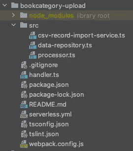
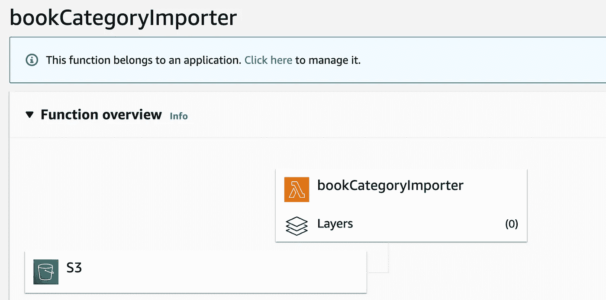
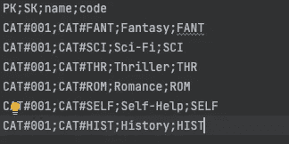
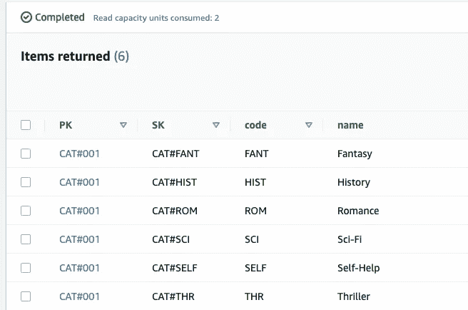

# S3 触发器:无服务器 CSV 上传到 DynamoDB

> 原文：<https://blog.devgenius.io/s3-trigger-serverless-csv-upload-into-dynamodb-8877c770fb32?source=collection_archive---------4----------------------->



米卡·鲍梅斯特在 [Unsplash](https://unsplash.com/s/photos/csv?utm_source=unsplash&utm_medium=referral&utm_content=creditCopyText) 上的照片

您可以在许多用例中使用 AWS Lambda 触发器。这一次的诀窍是通过将 CSV 文件的内容上传到 S3 存储桶并触发 Lambda 函数将它们存储在 DynamoDB 中，从而将静态数据添加到数据库中。尽管 CSV 看起来非常古老，但它仍然经常在 it 项目中用于交换数据或从一个数据存储导入到另一个数据存储。



方法:将 CSV 导入 DynamoDB

我们将在[之前的故事](/how-to-build-a-serverless-rest-api-with-nestjs-and-dynamodb-7b58b5b59bf6)中讨论创建一个在线图书馆服务。我们将创建一种方法，使用 CSV 文件将图书类别加载到 DynamoDB 数据库中。图书类别 CSV 可能如下所示。使用带 DynamoDB 的[单表设计策略](/how-to-do-single-table-design-with-dynamodb-db9101a43277)的分区键(PK)和排序键(SK)。



图书类别. csv

## 使用 AWS Lambda 的异步调用

在我们接触一些代码之前，我们先来看看 Lambda 是如何处理来自 S3 的触发器的。一些 AWS 服务，如亚马逊 S3 和亚马逊社交网络，异步调用函数来处理来自触发器的事件。下图显示了异步调用 Lambda 函数的客户端。



图表:使用 AWS Lambda 的异步调用

对于异步调用，Lambda 将事件放在一个队列中，并返回一个成功的响应，没有附加信息。一个单独的进程从队列中读取事件，并将它们发送到您的函数。

Lambda 管理函数的异步事件队列，并尝试在出错时重试。这里需要知道的重要一点是，即使你的函数没有返回错误，它也可以多次从 Lambda 接收相同的事件，因为队列本身最终是一致的。确保您的函数代码*优雅地处理重复事件*，并且您有足够的并发性来处理所有调用。

## 目的地

您可以为函数配置目的地，以便将异步调用的记录发送到另一个服务。您可以为处理失败的事件和成功处理的事件配置单独的目标。有关更多信息，请参见 AWS 上的[文档](https://docs.aws.amazon.com/lambda/latest/dg/invocation-async.html)。



异步调用的目标

## 无服务器设置

现在，让我们来看一些实际的代码。

我们将使用[无服务器框架](https://www.serverless.com)和一个模板来生成一个空白的 TypeScript 项目，用于接收 S3 上传事件的记录。

> *本文的完整项目可以在 Github*[*【https://github.com/cyberworkz/examples*](https://github.com/cyberworkz/examples)*的 bookcategory-upload 文件夹中找到。*

使用以下命令，通过无服务器 CLI 创建一个新项目:

```
sls create --template-url [https://github.com/cyberworkz/serverless-templates/tree/main/aws-nodejs-typescript-s3](https://github.com/cyberworkz/serverless-templates/tree/main/aws-nodejs-typescript-s3) --path bookcategory-upload
```

这将创建一个旨在从 S3 桶中拾取事件的项目。让我们进入文件夹 bookcategory-upload 并浏览无服务器配置文件(serverless.yml)。

当使用后缀. csv 创建对象时，lambda 函数接收器作用于 S3 事件。存储桶名称被设置为自定义变量。更多关于无服务器框架的变量可以在[这里](https://www.serverless.com/framework/docs/providers/aws/guide/variables)找到。

```
events:      
      - s3:          
          bucket: ${self:custom.bucket}          
          event: s3:ObjectCreated:*
```

添加了一个 *iamRoleStatement* 来获取函数读取文件和写入 DynamoDB 表的权限。

```
iamRoleStatements:    
- Effect: Allow      
  Action:        
  - s3:*      
  Resource: "*"
- Effect: Allow
  Action:
    - dynamodb:PutItem
  Resource:
    - <dynamodb-arn>
```

## 代码⌨️

首先，我们需要安装一些额外的依赖项来完成繁重的工作。安装以下软件包:

*   [类型二](https://www.npmjs.com/package/typedi)
*   [@ fast-CSV/解析](https://www.npmjs.com/package/@fast-csv/parse)

```
npm i @fast-csv/parse
npm i typedi
```

TypeDI 允许在没有紧密耦合的情况下将依赖项注入到类中。Fast-csv 是一个用于解析 csv 文件的库。

现在让我们转向代码。bookcategory-upload 目录结构应该如下所示:



图书类别-上传目录结构

重要文件如下:

> -**processor . ts**->-*处理 S3 事件*
> 
> -**csv-record-import-service . ts**->*读取流作为 CSV 记录并解析记录*
> 
> -**data-repository . ts**->-*将记录导入数据存储*

S3 事件的处理是在 processor.ts 文件中用下面一行完成的。

```
const processor: S3Handler = async (event: S3Event) => {
```

使用带有代码完成功能的编辑器，您可以研究 S3Event 的可能性。

处理器. ts

从事件中，我们循环到记录并检索 S3 存储桶密钥。我们从桶中检索一个流，并将其传递给 CsvImportService。

CSV-导入-服务. ts

CsvImportService 解析流中的每一行，并将其传递给 DataRepository 类。

数据仓库. ts

DataRepository 检查类别前缀，并在类别不存在的情况下将其放入 DynamoDB 表中。表名是从 Lambda 执行的环境中提取的。

```
put({                  
      TableName: this.tableName,                  
      Item: item,                  
      ConditionExpression: 'attribute_not_exists(#name)',                      
      ExpressionAttributeNames: {                    
          '#name': 'code',                  
    },
```

## 部署🚀

现在我们已经准备好部署 Lambda 函数了。使用以下命令将其部署到您的 AWS 帐户。

```
serverless deploy
```

成功后，你会在你的 AWS Lambda 页面上找到 *bookCategoryImporter* 功能。导航到它会显示部署了 Lambda 函数的 S3 触发事件。



bookCategoryImporter 函数

在 Serverless.yml 文件中指定的存储桶也将被创建。您可以通过上传以下文件来测试 AWS Lambda 函数:



如果您创建了一个 DynamoDB 并上传了一个包含上述内容的 csv 文件，那么您应该在 DynamoDB 中获得以下项目:



## 完成的🙏

所以，这就结束了。我希望这对你的无服务器之旅有所帮助。同样，这个项目的代码可以在 Github 上找到👇图书类别-上传文件夹中的【https://github.com/cyberworkz/examples】T2。

# 海科·范德沙夫

*   ***如果你喜欢这个，请*** [***跟随 Serverlesscorner.com 上中***](https://serverlesscorner.com/about) ***。***
*   ***爱情*** ❤️ ***阅读*** ***我的故事和其他关于媒？*** [***成为会员***](https://serverlesscorner.com/membership) ***如果你还没有成为会员。***
*   ***想阅读更多无服务器？报名参加我的*** [***月刊***](https://serverlessconsulting.org/newsletter) ***📬关于无服务器技术和使用案例的启发性和深刻的故事。***