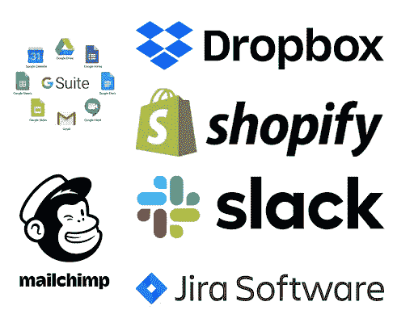
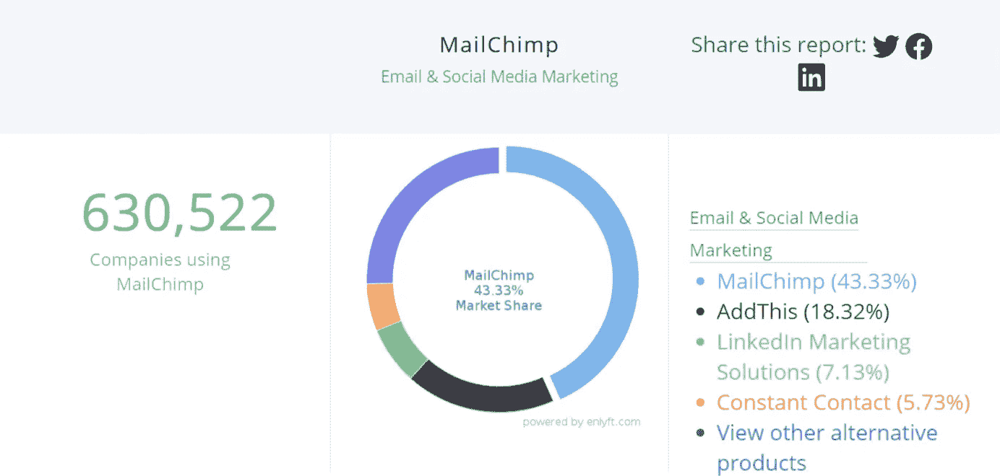
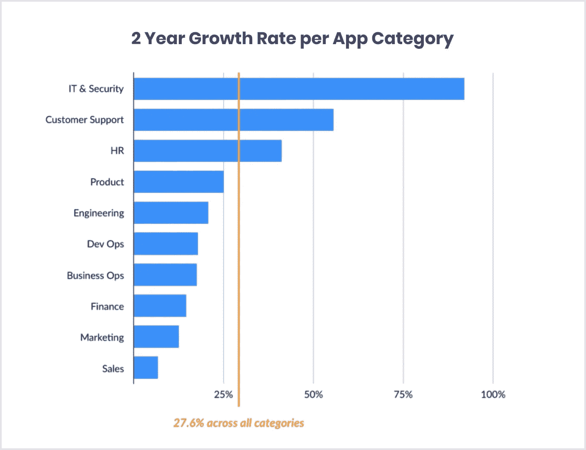

# SaaS 对 2021 年盈利业务的申请想法

> 原文：<https://blog.devgenius.io/saas-ideas-of-applications-for-a-profitable-business-in-2021-37cc5e3d7424?source=collection_archive---------7----------------------->

您是否希望在需求旺盛、竞争不太激烈的细分市场推出 SaaS 解决方案？让我们帮助您了解 2021 年 SaaS 顶级商业创意，以及一些将您的产品推向市场的专业建议。SaaS 是一种基于付费订阅在线提供软件解决方案的商业模式。该解决方案存储在云中，这使得用户可以访问它，并且对所有者来说具有成本效益。公司倾向于转向这种产品分销模式，寻求保持竞争力、通过自动化加速业务流程和防止网络攻击的有效方法。我们的开发人员分享了他们关于如何推出 SaaS 产品以及应该考虑哪些风险的知识。但是让我们从头开始。

# SaaS 商业对客户的优势

为什么你应该首先为你的项目考虑 SaaS 格式？

1.  **灵活的支付模式。**通过订阅 SaaS 服务，客户通过订阅模式每月支付服务费用。这为公司提供了可预测的预算。用户可以随时取消对 SaaS 服务的订阅。
2.  **不需要安装软件。**可以通过任何网络浏览器访问和使用 SaaS 应用程序，只有某些服务需要安装插件或特殊扩展。
3.  **高可用性。**云存储提供从任何连接到互联网的计算机或移动设备对应用程序的访问。并且当用户的设备出现故障时，加载的数据永远不会消失。
4.  **自动更新。**SaaS 提供商自动更新应用程序并修复问题。这减轻了客户员工中 IT 专业人员的负担。

各种各样的 SaaS 项目正在 100 多个国家运作。从 2015 年到 2017 年，全球公司使用的 SaaS 应用数量[从 8 个增加到 16 个](https://www.bettercloud.com/monitor/wp-content/uploads/sites/3/2017/05/2017stateofthesaaspoweredworkplace-report-1.pdf)。目前， [SaaS 市场的年增长率为 18%](https://www.reportlinker.com/p05749258/Cloud-Computing-Market-by-Service-Deployment-Model-Organization-Size-Workload-Vertical-And-Region-Global-Forecast-to.html)——并且还在继续增长。

# 突出的软件即服务示例

就收入而言，微软是全球最大的 SaaS 服务提供商，市场份额为 18%，Salesforce 排名第二(11.5%)，Adobe 排名第三(6.7%)。

**营收:**(截至 2019 年)16 亿美元 Dropbox 是一款广受欢迎的“基于云的硬盘”。这家初创公司为用户提供了 2 GB 的免费存储空间。高级计划“Dropbox plus”通过附加功能开放了对 2 TB 内存的访问，例如，通用访问的扩展参数。

**营收:**:26 亿美元 SaaS 在市场上最生动、最受欢迎的例子之一。G Suite 包括 Gmail、Google Docs、Google Sheets、Google Drive 等等。有了这些出色的工具，你可以创建和编辑文档，收发电子邮件，使用电子表格和云存储。

**收入:**4 亿美元 Slack 是一个久经考验的企业信使和 CMS 系统。该服务的功能包括公共或私人渠道的通信、小组对话、音频和视频通话。文件共享是可用的，以及文件结构和保护机密数据的存储。

收入:15.8 亿美元 Shopify 是一家非常受欢迎的电子商务网站创建者。与专有网站建设者(如 Magento、WooCommerce 和 Wix)不同，Shopify 不需要任何网页设计技能和编程语言知识。平台订阅者也不需要学习托管或购买域名的理论。订阅该平台，您可以访问创建和管理在线商店所需的众多功能。

**收入:**超过 29 亿美元 Adobe Creative Cloud 是一套面向平面设计师、网页设计师、修图师和视频编辑的 Adobe 系统应用程序。软件包中最受欢迎的 SaaS 应用示例包括:

*   Photoshop —用于照片编辑；
*   Illustrator —用于矢量图形和插图创作；
*   Indesign —用于书籍、杂志和其他文本功能的分页。
*   Flash Builder —用于创建 web 应用程序；
*   Adobe Muse 用于构建网站。

**收入:**:7 亿美元这个久经考验的电子邮件管理服务可以轻松地与领先的平台、CMS 和网站建设商集成。它还支持群发邮件、联系人基础收集、用户细分、信函模板准备、按事件自动发送信函、分析和带有库存信函模板的内容工作室。Mailchimp 目前被超过 63 万家公司使用，其中包括 Glovo、Barogo 和 Oxylabs。

[*来源*](https://enlyft.com/tech/products/mailchimp)

**收入:**12 亿美元的吉拉在众多 SaaS 软件公司中名列前茅。项目管理服务最常用于 IT 开发。该系统可以帮助跟踪开放任务及其当前状态，并提供 Scrum 或看板方法的选择。您可以在云中处理数据，也可以在服务器上管理数据。Atlassian 吉拉在金融服务、零售、软件、高科技、汽车和非盈利领域被超过 65，000 家公司雇佣。财富 500 强企业中有 83% 使用 Atlassian 的产品，其中包括 Dropbox、Visa、Nasa、HubSpot、可口可乐、雀巢和辉瑞的所有者和管理者。

# 独特的服务经营理念

从会计到社交媒体营销，你几乎可以在任何现有行业创办一家 SaaS 创业公司。 **Pro tip** —根据顶级 SaaS 服务提供商的例子，真正成功的产品有助于解决市场上缺乏必要的服务或软件解决方案的问题。像伟人一样思考:宜家之所以成立，是因为在公司成立之初，只有收入高于平均水平的瑞典人才能买得起家具。如今，每 10 秒钟就有另一个 BILLY BILLY[橱柜售出](https://flatpackmates.co.uk/blog/27-interesting-facts-about-ikea/)，自 20 世纪 50 年代初以来出版的瑞典家具目录版本早已在印刷过程中绕过了圣经。阿迪达斯运动品牌成名时，传统鞋厂并不认为“运动”类别是一个可能的增长领域。该公司发布了镶钉足球鞋，在运动员中非常受欢迎。你到底能创造什么？试着从下面的软件创意中挑选一些。

# CRM 系统

需求最大的 SaaS 例子之一是客户关系管理或 CRM 系统。这种解决方案允许管理客户档案并提供个性化的体验。CRM 通过各种渠道收集客户信息并跟踪互动，如网站、反馈日志、社交网络等。带有嵌入式人工智能的 CRM 会根据收集的数据和与公司沟通渠道的交互体验，自动修改沟通方式。

# 协作或沟通解决方案

SaaS 在这方面的服务从文件共享和信息传递到多功能项目管理工具。例如，Slack 适用于团体和私人通信以及视频或音频通话。Google Drive 用于文件共享。您也可以开发一个协作解决方案。为了使它可信，将它与你的网站或其他一些有用的第三方服务整合。

# 远程医疗解决方案

在全球疫情的条件下，远程医疗保健是一个特别相关的领域。到 2026 年，远程医疗保健解决方案市场的总收入将超过 1800 亿美元。因此，引入远程医疗 SaaS，你一定会击中有利可图的地方，并解决一些良好的需求。你可以创造一些东西来提供病人和医生之间方便的交流和远程互动。特别是，你可以考虑实现一个电子咨询平台，帮助用户找到附近的医生和医疗服务提供商，远程预约，并与医疗专家联系进行咨询和讨论(类似于著名的 [BetterHelp](https://www.betterhelp.com/) )。或者建立一个专门用于视频会议的平台，提供一个与有空的医生即时交流的机会。

# 远程工作流管理软件

从目前需求量很大的远程机会中获利不仅限于远程医疗保健。为了适应极端条件，企业寻求通过可访问的软件来组织员工的远程绩效和管理的方法。您可以在 SaaS 的帮助下满足他们的远程需求，例如，分配和跟踪任务、与员工聊天以及自动化责任管理例程。例如，有一个基于人工智能的[平台](https://memory.ai/timely)，用于形成和跟踪目标和关键绩效方面，这有助于跟踪专家在专业应用上花费的确切时间。这对您来说是一个很好的启发，您可以为企业提供有益的功能，同时采用一种时尚、引人注目的技术概念。

# 科技创业公司在人力资源和人力资源管理方面的想法

人力资源领域的 SaaS 解决方案提供有效的员工管理、日常任务自动化，从而帮助提高人力资源专家或招聘人员、单个员工以及整个部门的生产率。人力资源解决方案可以帮助:

*   雇佣员工；
*   生成新的职位；
*   对候选人进行面试；
*   管理员工出勤、病假和假期；
*   培训员工并提高内部资格；
*   发送自动通知并创建调查；
*   分析工作流程生产力；
*   预测裁员，减少员工流动。

根据德勤的数据，招聘人员 93%的时间花在日常工作上，而其中 65%的工作是可以自动化的。例如， [Ideal](https://ideal.com/product/screening/) 服务查看和选择简历，[专门团队](https://deventor.io/services/dedicated-teams/)，帮助组建梦之队， [GapJumpers](https://www.gapjumpers.me/) 基于“盲人就业”技术进行在线面试，即没有性别、种族、高等教育地点等歧视。

# SMM 规划师

世界人口的 45%或 3.5 万亿人使用社交网络。平均花在社交网络上的时间是 3 个小时。这种与社交渠道的积极互动刺激品牌通过这些渠道发布内容和推广账户。规划师帮助简化与脸书、Instagram、Twitter、YouTube 等社交网络用户的互动。它们用于内容策略创建、自动发布以及与消费者的交流。这一领域的杰出产品是 Zoho 和 HootSuite。

# 电子商务 CMS

此类解决方案涵盖了运营在线业务的必要功能:产品和购物车管理，以及在线支付。可以提供类似 Shopify 这样的平台服务，不需要用户具备创建店铺的技术技能。或者运行一个成熟的 SaaS 内容管理系统，比如 WordPress。这一类还包括虚拟主机服务。SaaS 最生动的电子商务例子是 Shopify、Volusion、Big Cartel、3dcart 和 BigCommerce。

# 教育技术产品

与医疗保健和商业部门一样，教育领域现在也迫切需要远程软件功能。用一个普遍可用的软件解决方案来弥合教师和学生之间的差距是一个非常需要的计划。首先想到的是一个视频流平台，各种类型的教师和教育工作者可以在这里发布视频课程并进行直播(查看非常受欢迎的 [Coursera](https://ru.coursera.org/) 和 [Khan Academy](https://uk.khanacademy.org/) 以获取灵感)。除此之外，您还可以处理教育设施管理，并创建一个管理平台，帮助教师和学校管理人员更轻松地处理组织时刻。以 SaaS 格式提供这样一种解决方案，将为教育工作者提供一种检查和调整课程、安排会议和保存记录的便捷方式。

# 直播平台

直播是一个独立的趋势，应该单独强调。大多数需要客户/客户/来宾亲自到场的组织现在都使用直播视频在恶劣的远程条件下覆盖他们的观众。一个生动的例子是，[甚至教堂](https://www.livecontrol.io/churches)也订购直播服务来进行远程布道。有了自己的强大的 SaaS 直播平台，你可以接触到最广泛的愿意为此付费的公司和专家。

# 科技创业公司的想法:根据 2021 年的趋势创业

[据 Gartner](https://www.gartner.com/en/newsroom/press-releases/2020-07-23-gartner-forecasts-worldwide-public-cloud-revenue-to-grow-6point3-percent-in-2020) 称，到 2022 年，SaaS 市场的总份额预计将达到 1.4 亿美元，是 IaaS 和 PaaS 份额的两倍。新冠肺炎疫情和世界市场的不稳定局势在 SaaS 形成了最接近的趋势。根据 Blissfully 的[报告，对云应用的需求在以下方面有所增长:](https://cdn2.hubspot.net/hubfs/2093754/eBooks/2020%20SaaS%20Trends%20Report.pdf)

[*来源*](https://cdn2.hubspot.net/hubfs/2093754/eBooks/2020%20SaaS%20Trends%20Report.pdf)

最流行的软件开发方法包括:

# 结论

考虑 SaaS 应用程序开发的最新趋势，以获得超越竞争对手的优势。在快速发展的技术世界里，引入一个新的想法永远不会太晚！

*原载于 2021 年 2 月 15 日*[*https://deventor . io*](https://deventor.io/blog/saas-ideas/)*。*