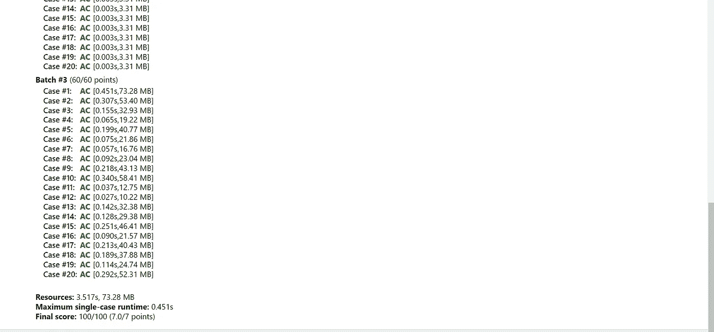

# SAC '22 代码挑战 5 少年 P4 —课程要求

> 原文：<https://blog.devgenius.io/sac-22-code-challenge-5-junior-p4-course-requirements-c314000ba8b1?source=collection_archive---------7----------------------->

我遇到了另一个图论问题。[这个问题](https://dmoj.ca/problem/sac22cc5jp4)要求我们找到一种订购课程的方法，以便满足先决条件。基本上，给你一个有向图，你必须找出一个顺序，在这个顺序中，所有的节点都被访问，同时考虑到先决条件。

假设你还没有注意到这一点，这是一个经典的拓扑排序问题，其中每个节点必须出现在它所指向的节点之前。让我们复习一下什么是拓扑排序。

基本上，每个节点都有一个度数。索引是指向该节点的节点数。例如，如果节点 1 和节点 3 指向节点 2，则节点 2 的度数为 2。这是因为有两个节点指向它。这可以用 hashmap 结构来表示。接下来，对于拓扑排序，我们需要使用优先级队列。在优先级队列中，顺序很重要，因此在本例中，我们按照升序对其进行排序。然后，从那里开始，我们添加所有索引为 0 的节点，因为这些是外部节点，这意味着它们没有先决条件。

然后，在插入所有索引度为 0 的节点后，我们可以开始类似于广度优先搜索的操作。当队列中有项目时，我们循环，从顶部弹出，并遍历连接到当前节点的每个节点。然而，在这种情况下，我们对遍历到下一个节点的限制是，它的索引必须为 1。这是因为当它的索引为 1 并且跟在我们的当前节点之后时，先决条件是我们可以“删除”的当前节点。这将给出图的拓扑排序。

现在，让我们用一些 C++代码来实现它。拓扑排序的代码如下所示:

```
vector<int> topsort(map<int, set<int>> graph, map<int, int> indegree, int N) {
 vector<int> ans;
 priority_queue<int, vector<int>, greater<int>>q;
 for (int i = 0; i <= N; i++) {
  if (indegree[i] == 0) {
   q.push(i);
  }
 }

 while (!q.empty()) {
  int current = q.top();
  q.pop();
  ans.push_back(current);
  for (auto next : graph[current]) {
   if (--indegree[next] == 0) {
    q.push(next);

   }
  }
 }
 return ans;
}
```

其中 ans 数组是存储拓扑排序的数组。然后，该函数将图作为输入(以 hashmap 格式表示)、图的索引和大小。然后在最后返回拓扑排序。然后我们有了主函数。

因为我们处理的是 DAG，所以我们必须这样表示它。接下来，您可以看到，仅在第二个节点上，索引增加。然后我们运行拓扑排序，然后打印出答案。

```
int main()
{
 int N;
 cin >> N;
 map<int, set<int>> graph;
 map<int, int> indegree;
 for (int i = 1; i <= N; i++) {
  int t1;
  cin >> t1;
  for (int k = 0; k < t1; k++) {
   int t2;
   cin >> t2;
   graph[t2].insert(i);
   indegree[i]++;
  }
 }
 vector<int> ans = topsort(graph, indegree, N);
 for (int i = 1; i < ans.size(); i++) {
  cout << ans[i] << " ";
 }

}
```

如果你认为这是有用的，请留下赞，并在下面评论任何你想回答的问题。

