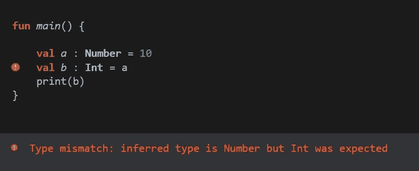
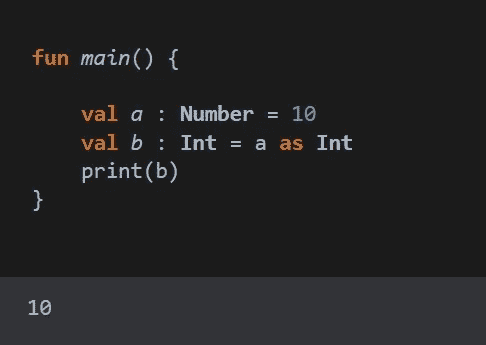
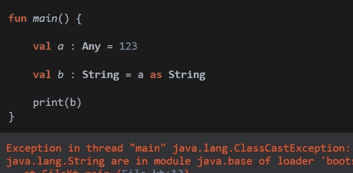
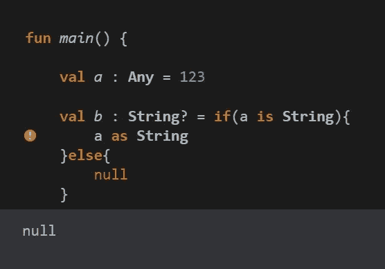
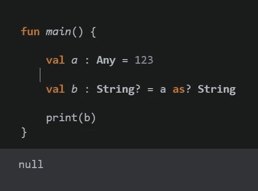

# 科特林安全浇铸[2022]

> 原文：<https://blog.devgenius.io/safe-casts-in-kotlin-2022-71f03bafb55d?source=collection_archive---------12----------------------->

> **铸造**指:-将一个变量的类型改变为另一个变量，称为铸造。

一般来说，铸造中使用的两个关键词**有*作为***；而*有* 作为【柯特林】。

"**为** " →将一种数据类型更改为另一种数据类型。
" **为** " →检查一项数据与另一项数据的类型是否相同。

> 让我们通过做一些编码来理解

在上面的代码中，我们试图将 Number 类型的数据存储到 Integer 类型的变量中，因此它会给出一个运行时错误。

> 为了解决这个问题，我们使用" as" :-

> 假设我们试图使用“as”将 Int 转换为 String，那么它会抛出错误:-

上述错误( **ClassCastException** )发生在运行时，而不是编译时。

> 要解决上述错误，我们可以执行以下操作:-

在这里，我们首先检查数据的类型，如果可以改变为字符串，那么就这样做，否则存储 null。

> 使用 ***SAFE CAST*** 在 **ONE LINE** 中可以简单地完成上述整个代码:-

这里，如果类型是字符串，则存储其值，否则存储 null。

请参阅 [**可空博客**](https://adi22maurya.medium.com/nullable-in-koltin-2022-ed6296786ed2) 了解更多信息。

感谢阅读……

保持编码:)