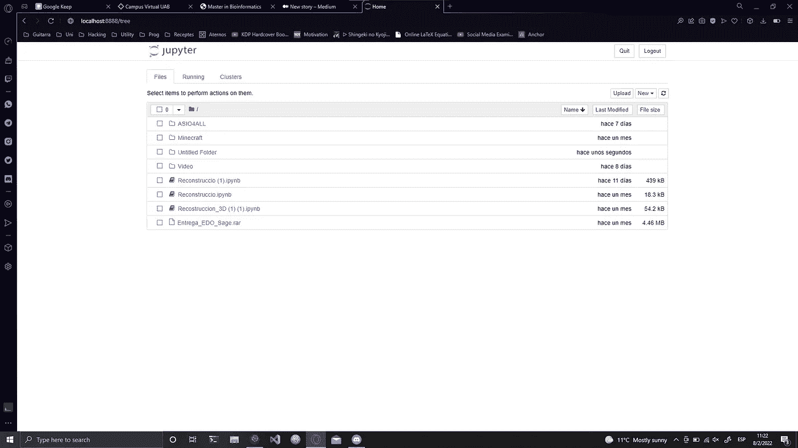

# SageMath:用 Python 做数学

> 原文：<https://blog.devgenius.io/sagemath-doing-math-in-python-8c34765254f7?source=collection_archive---------4----------------------->

## Python |数学

## Python 最好的即插即用数学库之一


你可能听说过 Wolfram Mathematica、GNU Octave 和 Mathworks Matlab。这三个是——除了 R 编程和 Maple——不同领域的科学家和工程师的三位一体的数学工具。但我打赌你还没听说过 SageMath。

## 什么是 SageMath？

SageMath 是一个免费的开源 Python 数学库。它基于您已经知道的其他 Python 包，如 NumPy、SciPy、Matplotlib、Maxima 和许多其他包。

它适用于 Windows、macOS 和 Linux 发行版。你可以在这里从它的官方页面下载[。](https://www.sagemath.org/download.html)

## 你如何发射它？

从 Windows 和 macOS 上，你都可以直接点击进入笔记本(将在 Jupyter 上运行)。也可以用命令行，但我不推荐。在 Linux 中，您可以使用终端和直接访问来启动 SageMath。

这将在您的浏览器中打开一个基于 Python 的本地托管笔记本，如下所示:



启动 SageMath 笔记本服务器后的初始屏幕

然后，我们可以创建一个新文件或打开一个现有的文件。请注意，Jupyter 笔记本文件的扩展名为“”。ipynb”。一旦我们做到这一点，我们就会发现我们自己与经典 Jupyter 接口。


我的一个笔记本的快照，一个物体的三维重建。

## SageMath 入门

你应该把 SageMath 想成是带有额外内容的 Python。所以不要害怕尝试你认为可能有用的东西。这里有一个关于如何创建矩阵的简单示例:

```
l=[[1,2,3],[4,5,6],[7,8,9]] #declaring a 2D array
M = matrix(l)               #converting that array to a matrix
M                           #printing M, equivalent to print(M) #output:
[1 2 3]
[4 5 6]
[7 8 9]
```

用图形表示 M 的一种更优雅的方式是 *show(M)* ，它使用类似 LaTeX 的降价文本。

如您所见，函数 *matrix()* 属于 SageMath 库，接受常规 Python 数组作为参数。另一个例子如下:

```
v1=vector([1,-2,4])
v2=vector([-1,0,1])
v3=v2.cross_product(v1)
v3#output:
(2, 5, 2)
```

同样，为了获得更“漂亮”的输出，我们可以使用 *show()* 函数。

## 你能用鼠尾草做什么？

SageMath 在解决代数问题时非常有效，例如，寻找矩阵的核或特征空间。而且还是数据分析、2D 和 3D 绘图以及符号表达式操作的一个非常好的工具。

请随意查看[文档](https://doc.sagemath.org/html/en/)，在那里您将找到几乎所有您需要的东西。

## SageMath 唯一的问题

正如我在文章开头所说的，SageMath 不像其他应用程序那样受欢迎。这方面的问题是，没有很多视频教程或论坛回答与这个库相关，这可能会减慢学习过程。但是对于一个有经验的程序员或工程师来说，这应该不是问题。

## 但是还有更多

关于 SageMath 的内容太多，我无法在一篇文章中涵盖。如果这篇文章成功的话，我可能会写一些关于 SageMath 中某些函数组的深入文章。欢迎在下面评论你对这个 Python 库的看法！