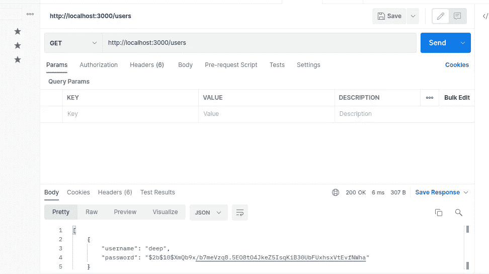
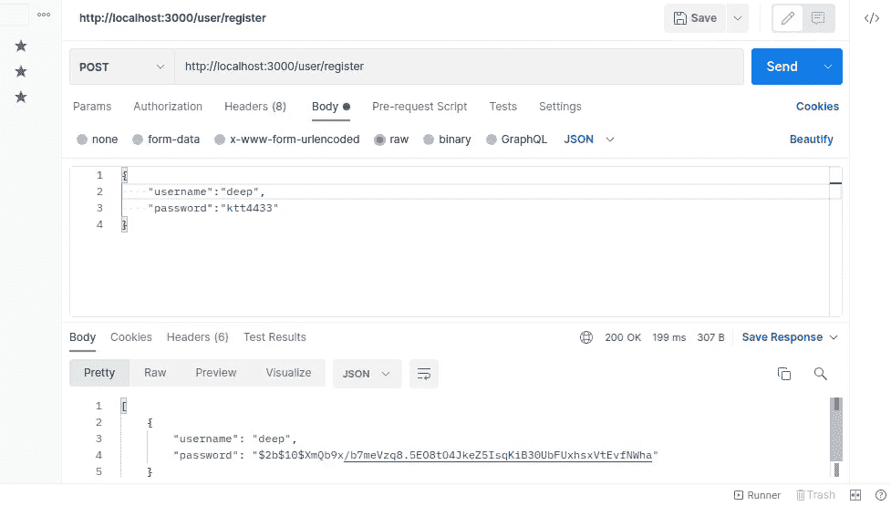
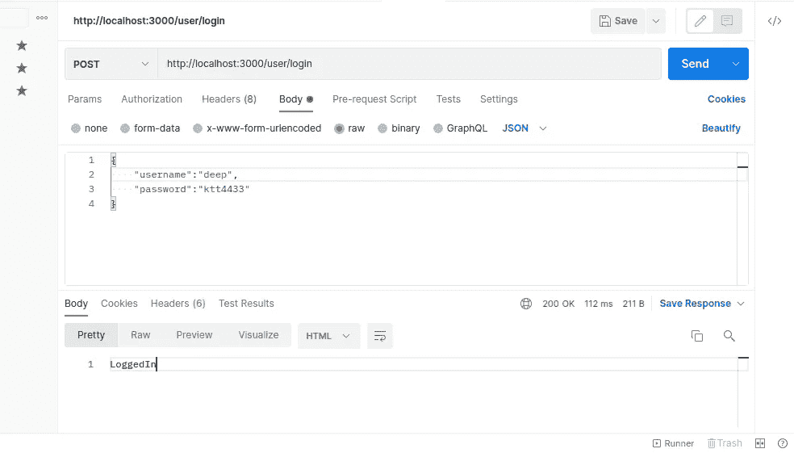
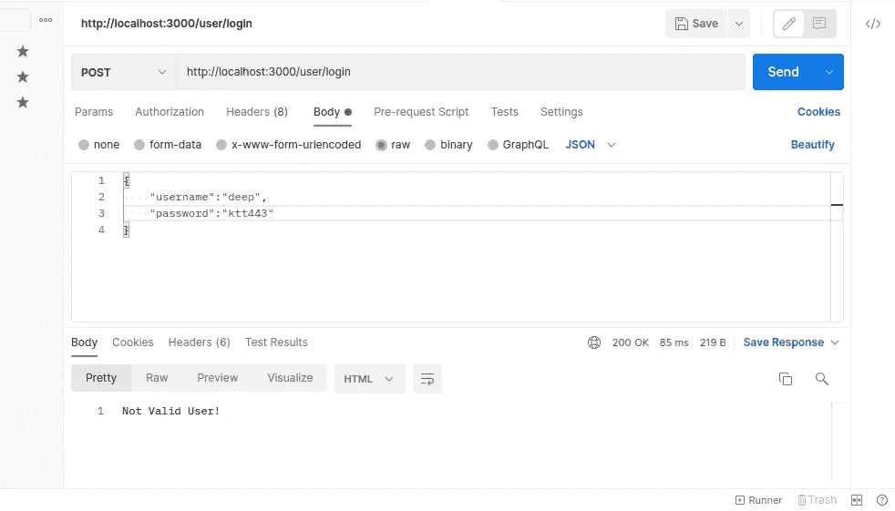

# 在 NodeJS 中使用 bcrypt 的 Salt 和 hash 密码

> 原文：<https://blog.devgenius.io/salt-and-hash-password-using-bcrypt-in-nodejs-3df1b7d23705?source=collection_archive---------3----------------------->

保护用户密码的安全以防范网络攻击至关重要。第一步是在安全的数据库服务器上存储密码。然而，无论您采取多少预防措施，您都不能假设数据库是不可渗透的。这就是为什么你必须采取第二个步骤来使破解任何被盗密码更加困难:加盐和散列。

在本帖中，我们将:

1.  了解 NodeJS 中的哈希
2.  了解盐腌
3.  使用 bcrypt 的 Salt 和 hash 密码
4.  将密码与哈希进行比较

你也可以在 YouTube 上浏览我的 NodeJS 库管理系统播放列表的视频教程。在这里，我已经向**解释了真实项目**中的盐和散列

NodeJS 图书馆管理系统项目(YouTube)

**什么是哈希？**

哈希指的是获取纯文本并通过哈希算法对其进行处理。哈希算法接受任意大小的输入文本，并返回固定长度的字符串。不管字符串/文本的大小，它总是返回相同长度的字符串。

因为散列算法返回相同的散列字符串，所以这很可能是可预测的&黑客也有可能使用另一个字符串并生成相同的散列值。正如我们所见，散列是不够的。

**什么是腌制？**

加盐只不过是在你的密码散列中添加一个随机的字符串。现在，当您使用 salt 时，它会自动包含在您的哈希密码中。因此，对于相同的密码，整体哈希值是不同的，这是不可预测的。

**设置所需的环境和库**

这是一个 NodeJS 项目。它使用 NPM 来管理其依赖关系。您需要创建一个新的项目目录，并使用以下命令初始化节点应用程序:

```
npm init -y
```

它将生成默认的 package.json 来管理这个项目的依赖项。

现在安装这个项目需要的包

```
npm init express bcrypt --save
```

现在让我们安装 **nodemon** ，它实际上被用作代码监视器(这意味着如果你在你的项目中做了任何改变，那么你的应用程序将自动重启)

这是我完整的包

```
{
  "name": "auth",
  "version": "1.0.0",
  "description": "",
  "scripts": {
     "devStart":"nodemon server.js"
  },
  "keywords": [],
  "author": "",
  "license": "ISC",
  "dependencies": {
    "bcrypt": "^5.0.1",
    "express": "^4.17.3"
  },
  "devDependencies": {
    "nodemon": "^2.0.15"
  }
}
```

在这里，我修改了**脚本** &并在项目主文件中添加了 **devStart** 。

**创建 NodeJS 基本服务器**

现在创建一个我们在 package.json 中使用过的 **server.js** 文件，并添加以下代码

```
const ***express*** = require('express');
const app = ***express***();

app.listen(3000);
```

在这里，我刚刚创建了一个快速服务器应用程序&监听端口 3000。

现在将 **bcrypt** 添加到我们的应用程序中，它实际上用于 NodeJS 中的加密目的，主要用于散列密码。

我们将使用阵列进行存储。请注意，对于真正的应用程序，您必须将数据存储在一些持久存储中。但出于学习的目的，我将它存储在数组中。

**创建获取用户详细信息的路线**

首先，我将创建一个路由来获取所有用户。我们不会在生产中创建这样的路线，但出于学习目的，我们将在这里创建这样的路线

```
let users = []; // store user details in an arrayapp.get('/users', (req, res) => {
    res.json(users)
});
```



**创建用户注册路径**

创建注册用户的发布路径。但在此之前，我们必须添加一个中间件来接受 JSON 主体。在 NodeJS 中我们可以使用 **body-parser** ，但是新版本的 express 也支持带有 **app.use(express.json())** 中间件的 JSON body。我将这个中间件添加到我们的代码中

```
app.use(***express***.***json***());app.post('/user/register', async (req, res) => {
    try {
        const salt = await bcrypt.genSalt();
        const passwordHash = await bcrypt.hash(req.body.password, salt);
        users.push({username: req.body.username, password: passwordHash});
        res.json(users);
    } catch (e) {
        res.status(500).send(e.toString());
    }
});
```

这里 **bcrypt** 返回一个承诺，所以我们将添加异步。为了获得 Salt 字符串，我们将使用 genSalt 并将其存储在 salt 变量中。因为 genSalt 方法返回承诺，所以我们将等待该方法。

现在是生成散列密码的时候了——为了生成散列密码，我们将使用 **bcrypt.hash** 方法。该方法将第一个参数作为纯文本，第二个参数作为 salt 字符串，并返回一个包含 salt 字符串的哈希值。这里我使用了 await，因为它返回 Promise，但是如果你不想使用 await，那么你必须注册一个回调来获得返回值。

在下一行中，我将用户详细信息推送到我们的 **users** 数组中。对于真正的应用程序，您将在数据库中存储所有的细节。



**为登录用户创建发布路由**

```
app.post('/user/login', async (req, res) => {
    try {
        const user = users.find(user => user.username === req.body.username);
        ***console***.log(user);
        if (!user) {
            res.status(400).send('User Not Found!');
        }
        if (await bcrypt.compare(req.body.password, user.password)) {
            res.send('LoggedIn');
        } else {
            res.send('Not Valid User!');
        }
    } catch (e) {
        ***console***.log(e.toString());
    }
})
```

这里，我们首先根据用户名从用户数组中获取用户(这里我们假设用户名对于每个用户都是唯一的)。在下一行中，我们检查了用户是否存在，如果用户不存在，那么我们发送响应用户未找到！否则，我们将使用 bcrypt.compare 方法比较 password。该方法将第一个参数作为纯文本，第二个参数作为哈希密码。如果两者相等，则返回 true，否则返回 false。

**请注意**我在 bcrypt.compare 方法之前使用了 await 关键字。如果您错过了 await 关键字，那么这将始终给您发送一个响应作为登录。(我过去也犯过这个错误，调试了差不多半个小时:)。



这是完整的代码

```
const ***express*** = require('express');
const bcrypt = require('bcrypt');
const app = ***express***();

let users = [];
app.use(***express***.***json***());

app.post('/user/register', async (req, res) => {
    try {
        const salt = await bcrypt.genSalt();
        const passwordHash = await bcrypt.hash(req.body.password, salt);
        users.push({username: req.body.username, password: passwordHash});
        res.json(users);
    } catch (e) {
        res.status(500).send(e.toString());
    }
});

app.post('/user/login', async (req, res) => {
    try {
        const user = users.find(user => user.username = req.body.username);
        ***console***.log(user);
        if (!user) {
            res.status(400).send('User Not Found!');
        }
        if (await bcrypt.compare(req.body.password, user.password)) {
            res.send('LoggedIn');
        } else {
            res.send('Not Valid User!');
        }
    } catch (e) {
        ***console***.log(e.toString());
    }
})

app.listen(3000);
```

你喜欢这篇文章吗？如果有，通过 [**订阅获取更多类似内容解码，我们的 YouTube 频道**](https://www.youtube.com/channel/UCvEB7wXUEXGFE9lCx0USR3Q) **！**

感谢阅读！