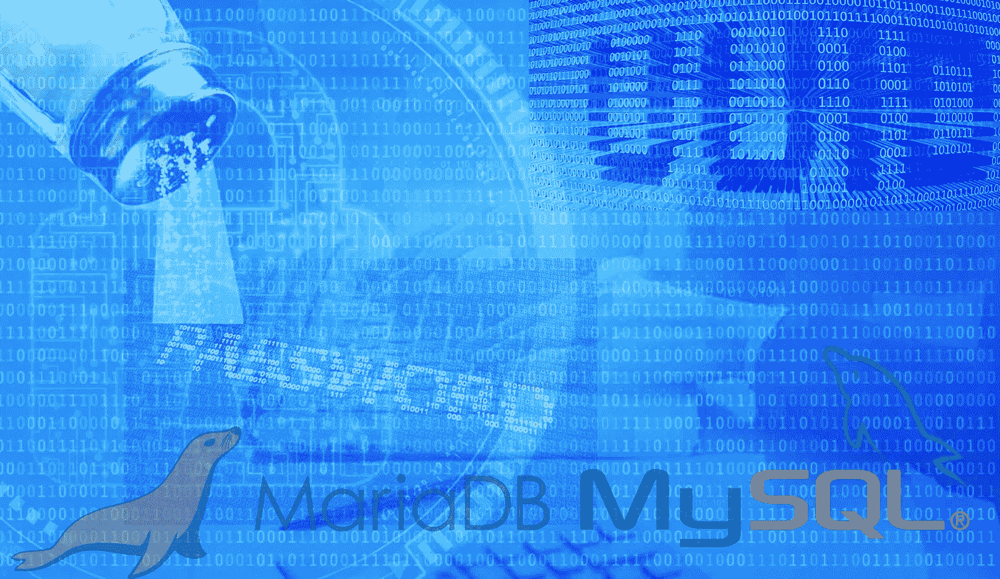
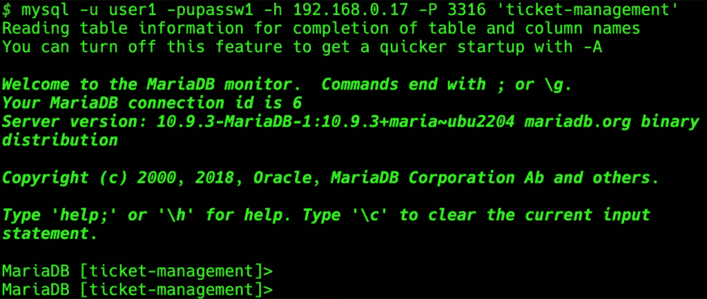

# MariaDB/MySQL 数据库的 Salts 和 UUIDs

> 原文：<https://blog.devgenius.io/salts-and-uuids-for-your-mariadb-mysql-databases-470dbcf23a5?source=collection_archive---------6----------------------->

一篇简洁的文章，展示了 UUIDs 和 Salts 在 MariaDB/MySQL 数据库中的实际实现。



# 介绍

这篇文章是在使用 MariaDB/MySQL 数据库时 UUIDs 和 Salts 的实际实现案例。将讨论的主题是:

*   使用数据库并创建 demousers 表
*   MariaDB UUIDs 使用 uuid()函数
*   使用**触发器**
*   使用哈希验证存储的**函数**

# 先决条件

假设你已经理解了基本的数据库概念， [UUID](https://en.wikipedia.org/wiki/Universally_unique_identifier) 和[密码加盐和散列](https://www.okta.com/uk/blog/2019/03/what-are-salted-passwords-and-password-hashing/)。我之前的帖子对这些主题有所了解:

[](https://medium.com/@zzpzaf.se/salts-and-uuids-for-your-databases-intro-41cc58fe100a) [## 所有数据库的 Salts 和 UUIDs

### 这是一篇关于 Salts 和 UUIDs 的介绍性文章，也是我的其他文章中关于如何在…

medium.com](https://medium.com/@zzpzaf.se/salts-and-uuids-for-your-databases-intro-41cc58fe100a) 

此外，为了遵循本文的示例，您必须能够访问正在运行的 MariaDB 实例和 [mysqlsh](https://dev.mysql.com/doc/mysql-shell/8.0/en/mysqlsh.html) 或 [mysql/mariadb](https://mariadb.com/kb/en/mysql-command-line-client/) CLI 工具。[ [在这里](/the-database-command-line-tools-you-can-add-to-your-dev-environment-without-database-installation-9091dd0c0277?sk=50026b887181c062144e6fbb9130663e)您可以找到如何将它们作为独立工具安装到您的系统中]。如果你愿意，你可以看看我下面关于如何创建和开始使用一个 [MariaDB Docker 容器](https://medium.com/@zzpzaf.se/mariadb-in-docker-65130d77959b?sk=b52cad21459a10dc0c873fcf15b612c8)的帖子。

[](https://medium.com/@zzpzaf.se/mariadb-in-docker-65130d77959b) [## 码头工人中的 MariaDB

### 三分钟指南。轻松全面！

medium.com](https://medium.com/@zzpzaf.se/mariadb-in-docker-65130d77959b) 

注意:在 SQL 命令中使用字符串文字时要注意，因为它们必须用反斜杠`…`和/或简单引号'…'括起来。

# 开始使用 MariaDB 并创建一个新用户和 demousers 表

如果你关注了我之前的帖子(Docker 中的 [MariaDB)，应该已经创建了一个用户名为“user1”的用户。否则，以具有适当权限的用户身份访问您的 MariaDB 首选实例，例如，以“root”用户身份登录:](https://medium.com/@zzpzaf.se/mariadb-in-docker-65130d77959b?sk=b52cad21459a10dc0c873fcf15b612c8)

```
~ mysql -u root -prpassw1 -h 192.168.0.17 -P 3316
```

然后创建一个名为“ticket-management”的新数据库

之后，使用密码“upassw1”创建用户“user1 ”,并授予他该数据库的所有权限:

```
CREATE DATABASE `ticket-management` DEFAULT CHARACTER SET utf8mb4 COLLATE utf8mb4_unicode_ci;
```

```
GRANT ALL PRIVILEGES ON `ticket-management.*` TO 'user1'@'%' IDENTIFIED BY 'upassw1';
FLUSH PRIVILEGES;
```

或者只是:

```
GRANT ALL ON `ticket-management.*` TO 'user1'@'%' IDENTIFIED BY 'upassw1';
FLUSH PRIVILEGES;
```

> 👉注意:如果您运行一个真实的 MySQL 实例(而不是 MariaDB 实例)，您可能会遇到类似于“您没有超级权限，并且启用了二进制日志记录”的警告或错误。因此，您还必须(以 root 用户身份)运行以下命令:

```
SET GLOBAL log_bin_trust_function_creators = 1;
```

之后，使用 user1 的凭据(用户名和密码)通过访问正在运行的 MySQL/MariaDB 实例上的 CLI 注销并重新登录:

```
mysql -u user1 -pupassw1 -h 192.168.0.17 -P 3316 'ticket-management'
```



接下来，在票证管理(或您更喜欢的)数据库/模式中创建一个新表:

之后，为用户名列创建一个唯一的约束:

```
ALTER TABLE `demousers` ADD UNIQUE **(**`username`**)**;
```

就是这样。现在是时候看看如何为 ID 列设置 UUID 值了。

# MariaDB UUIDs

正如我们在[介绍文章](https://www.devxperiences.com/pzwp1/2022/11/02/salts-and-uuids-for-your-databases-intro/)中所说，id 字段是 UUID。我们如何做到这一点？放心吧！有了 MariaDB，相当简单！MariaDB 为我们提供了一个**内置的二级函数，即**[**【UUID()**](https://mariadb.com/kb/en/uuid/)函数。自己试试:

所以，我们可以用一个带有'插入前' [**的触发器**](https://mariadb.com/kb/en/trigger-overview/) 来完成这项工作！(通常，触发器会在事件发生时自动执行数据库任务)。所以，在这里！创建以下触发器:

然后您可以使用 show triggers 命令来检查它:

现在我们可以通过添加新用户来测试它:

```
BEGIN;
INSERT INTO `demousers` **(**`username`, `password`**)** VALUES **(**‘panos’, ‘panospassw1’**)**;
COMMIT;
```

然后，看看我们得到了什么:

就是这样！正如您所看到的，自动创建的"**e 033 beef-448 b-11ed-a3 C3–0242 AC 110003**" UUID 已经作为 ID 字段中的值自动插入！

第二步是看看我们如何处理加盐和哈希。

# MariaDB 哈希和加盐

在继续创建必要的触发器之前，让我们快速看一下我们将使用的 MariaDB/MySQL 内置函数。

*   首先，我们将使用 [RAND()](https://mariadb.com/kb/en/rand/) 函数，这是数据库提供的数学函数之一，它返回一个随机的浮点值。我们将用它来随机生成盐。
*   接下来，我们将使用 [SHA2()](https://mariadb.com/kb/en/sha2/) 函数。
*   最后，我们将使用的其他 SQL 函数是 [CONCAT()](https://mariadb.com/kb/en/concat/) 和 [SUBSTR()](https://mariadb.com/kb/en/substring/) 函数。

现在，您已经准备好定义第二个触发器，该触发器将自动生成并在 password 字段中存储用户提供的纯文本密码的 salt 和 SHA2 哈希值。在将用户插入到“demousers”表中时触发该触发器。下面给出了这种触发器的示例代码:

再次使用 show triggers 命令检查它:

之后，我们可以通过插入一个新用户来测试刚刚创建的触发器“Hash_Password_insert ”:

```
BEGIN;
INSERT INTO `demousers` **(**`username`, `password`**)** VALUES **(**‘panos2’, ‘panospassw2’**)**;
COMMIT;
```

正如你在上面看到的，触发器似乎工作正常。但是我们如何检查所提供的密码(例如，用于登录目的的用户凭证)是否是正确的呢？我们如何验证这个密码？

# 使用存储功能进行密码验证

我们可以在 MariaDB 数据库中通过使用一个 [**存储函数**](https://mariadb.com/kb/en/stored-function-overview/) 来实现。下面是一个例子:

之后，您可以使用以下命令检查创建的函数:

```
SHOW **FUNCTION** STATUS;
```

该函数接受两个 VARCHAR 参数作为用户名和密码。首先，它使用提供的用户名获取现有的用户密码。然后，提取 salt，它实际上是密码的前 16 个字符的字符串。接下来，使用相同的算法重新计算新的哈希值。最后将新计算的散列值与现有散列值进行比较，现有散列值是现有密码串的最后一部分(从第 17 个字符直到末尾)。如果匹配，则返回 TRUE (1)，否则，返回 FALSE (0)。让我们检查一下:

```
SELECT IsUserPasswordValid**(**‘panos2’, ‘panospassw2’**)**;
```

正如你所看到的，它返回 1 =真，所以我们有一个匹配！注意，在您的后端/中间件中，您可以创建相同的查询字符串来调用存储的函数！

— — — — — — — — — — — — — — — — — — — — — — — — — — — — — — — —

这就是演示如何在 MySQL/MariaDB 中开始处理 UUID、盐和散列的全部内容！

继续阅读我的其他帖子，了解其他数据库的实现示例。

暂时就这样吧！我希望你喜欢它！
感谢阅读👏敬请关注！