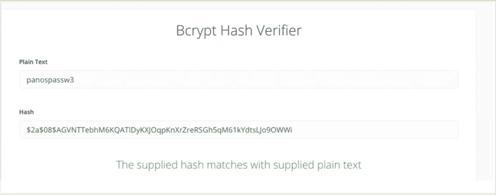

# PostgreSQL 数据库的 Salts 和 UUIDs

> 原文：<https://blog.devgenius.io/salts-and-uuids-for-your-postgresql-database-7c144e228097?source=collection_archive---------1----------------------->

使用 PostgreSQL 数据库时 UUIDs 和密码加盐散列的实际实现步骤。


# 到…里面

这篇文章展示了在使用 PostgreSQL 数据库时 UUIDs 和密码加盐散列的实际实现步骤。

将讨论的主题是:

*   使用数据库、创建新用户和创建 demousers 表
*   PostgreSQL UUIDs 使用 uuid()函数
*   2 种散列和加盐方法—使用**触发器**
*   2 个版本的验证存储的**功能**

# 先决条件

假设你已经理解了基本的数据库概念， [UUID](https://en.wikipedia.org/wiki/Universally_unique_identifier) 和[密码加盐和散列](https://www.okta.com/uk/blog/2019/03/what-are-salted-passwords-and-password-hashing/)。我之前的帖子对这些主题有所了解:

[](https://medium.com/@zzpzaf.se/salts-and-uuids-for-your-databases-intro-41cc58fe100a) [## 所有数据库的 Salts 和 UUIDs

### 这是一篇关于 Salts 和 UUIDs 的介绍性文章，也是我的其他文章中关于如何在…

medium.com](https://medium.com/@zzpzaf.se/salts-and-uuids-for-your-databases-intro-41cc58fe100a) 

此外，为了理解本文中的例子，您必须能够访问正在运行的 MariaDB 实例和 [psql](https://www.postgresql.org/docs/current/app-psql.html) CLI 工具。[ [在这里](/the-database-command-line-tools-you-can-add-to-your-dev-environment-without-database-installation-9091dd0c0277?sk=50026b887181c062144e6fbb9130663e)您可以找到如何将它作为独立工具安装到您的系统中]。如果你愿意的话，你可以看看我下面关于如何创建和开始使用一个 [PostgreSQL 容器](https://medium.com/@zzpzaf.se/postgresql-database-in-docker-876dc60467e9?sk=f33d8a09e8c1f3a19fe03a2f236fa7e8)的帖子。

[](https://medium.com/@zzpzaf.se/postgresql-database-in-docker-876dc60467e9) [## Docker 中的 PostgreSQL 数据库

### 三分钟指南。轻松全面！

medium.com](https://medium.com/@zzpzaf.se/postgresql-database-in-docker-876dc60467e9) 

# 开始使用 PostgreSQL 数据库，并创建一个新用户和 demousers 表

通过 [psql](https://www.devxperiences.com/pzwp1/2022/10/30/the-database-command-line-tools-you-can-add-to-your-dev-environment-without-database-installation/#psql) CLI 连接到正在运行的 PosgreSQL 实例，使用您喜欢的凭证(用户名和密码)。下面是一个连接到远程实例的示例:

```
~ psql -h 192.168.0.17 -p 5462 -U postgres -W
```

然后创建一个名为 ticket-management 的新数据库

```
postgres=# create database "ticket-management";
postgres=# \c ticket-management;
```

之后，创建一个新用户“user1 ”,密码为“upassw1 ”,然后为他分配票证管理数据库的所有权限。

```
CREATE USER user1 WITH PASSWORD 'upassw1';
```

```
GRANT CONNECT ON DATABASE "ticket-management" TO user1;
GRANT ALL ON DATABASE "ticket-management" TO user1;
```

之后，注销并重新登录，作为用户 1:

```
~ psql -h 192.168.0.17 -p 5462 -U user1 -W ticket-management
```

就是这样。现在是时候看看如何在 PostgreSQL 中使用 UUIDs 了。

# PostgreSQL UUIDs

**创建并使用**[**uuid _ ossp**](https://www.postgresql.org/docs/10/uuid-ossp.html)**扩展**

Postgres 使用扩展。可以使用常规命令在每个特定的数据库中安装扩展:

```
CREATE EXTENSION **IF** NOT EXISTS “<extension-name>”;
```

因此，为了使用自动生成的 uuid 值作为 id 主键列的默认值，我们必须首先安装 [**uuid-ossp**](https://www.postgresql.org/docs/10/uuid-ossp.html) 扩展:

```
CREATE EXTENSION **IF** NOT EXISTS “uuid-ossp”;
```

请注意，您总是可以使用 psql **\df** 命令来列出所有可用的函数。下面，您可以看到已安装的 uuid 扩展提供的功能:

**创建一个新表 demousers 表**

PostgreSQL 非常强大，它提供了一个特定的列类型，即 [**uuid**](https://www.postgresql.org/docs/current/datatype-uuid.html) 类型，这是将其用作 id 列类型的合适类型。此外，我们将使用之前安装的 uuid 扩展提供的 uuid_generate_v4()函数作为 id 列的默认值。

或者，您可以对用户名和密码字段使用更具体的类型，如 varchar 和 char，而不是一般的文本类型:

表创建后，您可以使用 **\dt** psql 命令检查它是否存在:

现在，是时候通过添加新用户来测试 uuid 是否工作正常了

```
BEGIN;
INSERT INTO demousers **(**username, password**)** VALUES **('**panos', 'panospassw1**)**;
COMMIT;
```

就是这样！如您所见，自动创建的“**cb5e 9022-f45b-45ea-b9c 6–952428 cc 45 e 8**”UUID 已经作为值正确地插入到 ID 字段中！

注意:正如您可能已经理解的那样，PostgreSQL 为我们提供了 uuid 的“交钥匙”解决方案:uuid 数据类型，以及使用函数作为字段默认值的能力(id 字段的 uuid_generate_v4())，因此不需要实现触发器。

然而，我们将需要一个哈希/盐的需求。

# PostgreSQL 散列和加盐

**添加并使用**[**pg crypto**](https://www.postgresql.org/docs/current/pgcrypto.html)**扩展名**

同样，在继续之前，我们需要安装另一个 Postgres 扩展，即[**pg crypto**](https://www.postgresql.org/docs/current/pgcrypto.html)**扩展。这是必要的，因为 **pgcrypto** 包提供了选择和使用散列算法、随机生成值、加盐等所有“标准”功能。**

**此外，pgcrypto 扩展还提供了一些非常具体的功能，特别是专用于密码散列和加盐。**

**因此，在这里我们将看到如何实现 2 个触发器和它们的触发器函数，两者都使用:“标准”方式，类似于我们使用 MariaDB 的方法，以及通过 crypt()函数的 PostgreSQL pgcrypto 包。然而，首先，我们必须创建/安装 pgcrypto 扩展:**

```
CREATE EXTENSION IF NOT EXISTS "pgcrypto";
```

**在我们有了 pgcrypto 扩展之后。我们可以继续创建触发器并使用必要的 pgcrypto 函数。实际上，我们将看到两种方法:**

## **使用“标准”方式的第一种方法。**

**我们将使用以下函数:**

*   **pg crypto**gen _ random _ bytes()**函数生成 8 字节的随机数**
*   ****encode()** 函数用于将一个字节数转换成十六进制字符串**
*   ****concat()** 函数用于连接两个或更多的字符串**
*   **pgcrypto **digest()** 函数为作为参数传递的算法创建一个散列值。在我们的例子中，我们使用 SHA256 算法。**

**你可以阅读更多关于 pgcrypto 模块及其功能，在官方文档中， [**这里**](https://www.postgresql.org/docs/current/pgcrypto.html) 。**

**现在，我们可以继续创建一个触发器，以支持每次插入新行时，在密码列中自动生成和自动插入加盐哈希值，而不是密码纯文本。在 PostgreSQL 中，[触发器创建](https://www.postgresql.org/docs/current/sql-createtrigger.html)假定执行了一个触发器函数。这意味着我们必须创建两者，触发器本身和触发器函数，它将被触发器主体触发(执行)。触发函数很容易识别，因为它应该返回一个触发器。**

**因此，在下面，您可以找到创建这样一个触发器函数的示例代码，以及触发器本身。**

**触发功能:**

**创建函数后，您可以使用 **\df** psql 命令检查它是否已被创建:**

**现在，我们可以创建触发器本身:**

**创建触发器后，您可以使用 sql 命令检查它是否已创建:**

```
SELECT ***** FROM pg_trigger;
```

**现在，我们准备通过插入一个新用户来测试刚刚创建的触发器“Hash_Password_insert_1 ”:**

```
BEGIN;
INSERT INTO demousers **(**username, password**)** VALUES **(**‘panos2’, ‘panospassw2’**)**;
COMMIT;
```

**然后，让我们看看表格中的行:**

**到目前为止，一切顺利。验证功能的时间。**

****密码验证的第一种情况****

**使用以下代码创建一个存储函数，该函数可以验证密码是否对应于存储的哈希值:**

**如果您愿意，您可以再次使用 **\df** 命令来确保‘isuserpasswordvality _ 1’已被创建。**

**正如您在上面看到的，该函数接受两个文本参数作为用户名和密码。首先，它使用提供的用户名获取现有的用户密码。然后，提取 salt，它实际上是存储的哈希密码的前 16 个字符的字符串。接下来，使用相同的算法重新计算新的哈希值。最后将新计算的散列值与现有散列值进行比较，现有散列值是现有密码串的最后一部分(从第 17 个字符直到末尾)。如果匹配，则返回 TRUE (t ),否则，返回 FALSE (f)。**

**让我们检查一下:**

```
SELECT IsUserPasswordValid**(**‘panos2’, ‘panospassw2’**)**;
```

**就是这样。它工作正常。**

## **使用 pgcrypt()函数的第二种方法**

**我之所以决定使用 pgcrypt 扩展的 crypt()和 gen_salt()函数来包含触发器函数的替代函数，是因为官方文档声明:“crypt()和 gen_salt()函数是专门为散列密码而设计的。crypt()进行哈希运算，gen_salt()为其准备算法参数。而且，实际实现只是 1 行代码。验证功能也是如此。让我们看看它是如何实现的。**

**下面是我们如何在触发函数中使用它们。实际上，代码创建了先前触发器函数的第二个版本，这次的名称是‘trigger _ function _ password _ hash _ 2’:**

**触发器本身保持相同的名称，但是现在它调用/执行第二版本的触发器函数:**

**同样，让我们再插入一个用户来检查加盐散列密码是什么样子的:**

```
BEGIN;
INSERT INTO demousers **(**username, password**)** VALUES **(**‘panos3’, ‘panospassw3’**)**;
COMMIT;
```

**注意，现在存储的散列密码的输出字符串的长度为 60 个非十六进制字符。这就是为什么 crypt()函数实际上是一个 [bcrypt](https://en.wikipedia.org/wiki/Bcrypt) 实现。您也可以使用[在线加密](https://bcrypt.online/)验证器亲自检查:**

**[](https://bcrypt.online/)**

**此外，这也是 crypt()接受最长 72 个字符的密码的原因，正如官方文档所述，这也适用于 bcrypt。因此，输出是一个$2a$- null 结尾的 UTF-8 编码的散列字符串，60 个字符长。**

**到目前为止，一切顺利！现在让我们创建自己的验证函数。**

****使用 pgcrypt crypt()函数进行密码验证的第二种情况****

**使用以下代码创建一个存储函数，该函数可以验证密码是否对应于使用 **pgcrypt** crypt()函数创建的存储哈希值:**

**第二版也接受相同的用户名和密码两个参数，并且通常与之前的验证功能非常相似。然而，这里我们再次使用 crypt()函数，但是这次我们使用获得的存储散列密码，就像 salt 一样！然后，我们测试结果(newHash)是否与存储的哈希值匹配。**

**让我们检查一下:**

```
select isuserpasswordvalid_2**(**'panos3', 'panospassw3'**)**;
```

**如您所见，它返回 TRUE (t)，所以提供的密码与存储散列值匹配。**

**— — — — — — — — — — — — — — — — — — — — — — — — — — — — — — — — —**

**这就是演示如何在 PostgreSQL 中开始处理 UUID、盐和散列的全部内容**

**继续阅读我的其他帖子，了解其他数据库的实现示例。**

**就这样…暂时的！我希望你喜欢它！
感谢阅读👏敬请关注！**