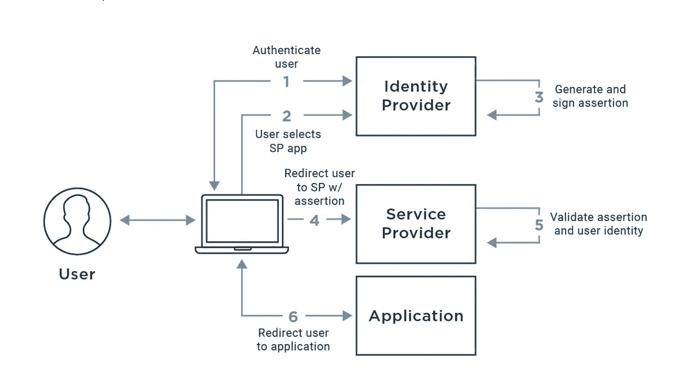

# SAML 与 OAuth:联合身份管理的构建模块

> 原文：<https://blog.devgenius.io/saml-vs-oauth-building-blocks-to-federated-identity-management-f36ca58f7aa0?source=collection_archive---------4----------------------->

本博客是我们从零开始讨论**云/云相关**概念系列的一部分，面向入门知识有限的受众。这篇文章属于*中级*系列，因为它涉及了解企业网络使用的[联合身份管理](https://en.wikipedia.org/wiki/Federated_identity)来管理个人在网络中各种 it 资产上的身份。

云系列中的一些早期博客如下。

[**AWS 云上的灾难恢复**](/disaster-recovery-on-aws-cloud-building-blocks-e013bffd6244)[**Azure 云上的灾难恢复**](/disaster-recovery-on-azure-cloud-building-blocks-6ff826adbc8b)[**Google 云上的灾难恢复**](/disaster-recovery-on-google-cloud-building-blocks-b2a232a9ec)

# 介绍

随着企业网络中各种移动组件(**本地/云**)的出现，对企业来说，拥有[**单点登录(SSO)**](https://en.wikipedia.org/wiki/Single_sign-on) 的需求变得至关重要。作为将 SSO 发展成为一个完整的联合身份验证解决方案的一部分，两项关键技术脱颖而出— **安全断言标记语言(SAML)** 和**开放授权(OAuth)。**

SAML 主要用于服务提供商针对源身份提供商的 ***认证*** 需求，OAuth 则可满足 ***授权*** 需求，即在整个企业网络设置中进一步细化基于角色的对给定资产的访问。

# SAML 与 OAuth 的主要区别

# **SAML 是如何工作的？**

## 顺序流程

1.  最终用户在一个示例网站上单击登录按钮。网站是客户的服务提供商
2.  服务提供商构建 SAML 身份验证请求，在将请求发送给身份提供商之前对其进行签名和加密。
3.  出于身份验证目的，服务提供商将客户端重定向到身份提供商。
4.  身份提供者验证 SAML 身份验证请求，并显示一个登录表单，供用户输入用户名和密码。
5.  在客户端成功登录后，身份提供者生成一个 SAML 令牌作为用户的身份，并将其发送给服务提供者。
6.  身份提供商将客户端重定向回服务提供商。
7.  服务提供商验证 SAML 断言，提取用户身份，为客户端分配正确的权限，并记录用于服务的日志。

# OAuth 是如何工作的？

## 序列流

1.  应用程序/客户端向资源所有者发送授权请求。
2.  资源所有者批准请求并颁发授权令牌。
3.  客户端(使用授权令牌及其自身身份)从授权服务器(API)请求访问令牌。
4.  授权服务器验证客户端身份并颁发访问令牌。
5.  客户端使用访问令牌向资源服务器请求资源。
6.  资源服务器为客户端提供受保护的资源，以获取有效的访问令牌。

# 结论

给定的文档仅覆盖了作为联邦身份管理的一部分的 **SAML** 和 **OAuth** 用例的高级概述。这两种解决方案都可以单独使用，也可以作为集成解决方案来满足单点登录需求。

*如需反馈，请留言至****Amit【dot】894【at】Gmail【dot】com****或联系 https://about.me/amit_raj**中的任意链接。*