# Knative 上的 SpringBoot 示例应用程序——一个无服务器平台

> 原文：<https://blog.devgenius.io/sample-springboot-application-on-knative-a-serverless-platform-33a4ed0f6551?source=collection_archive---------6----------------------->

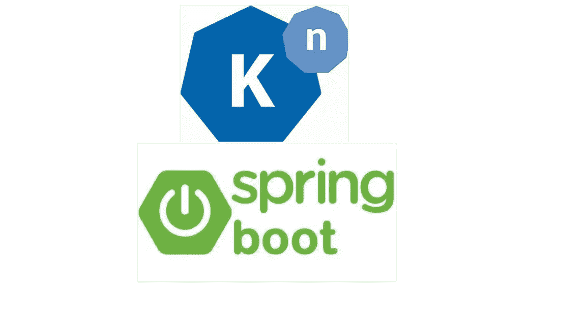

今天我将解释一些有趣的话题“kna tive”——无服务器架构，以及我们如何在一个简单的 SpringBoot 应用程序中利用它。我不会讨论 Knative 的所有细节，但会集中讨论它的一些特性，以及我们如何在应用程序中简单地利用这些特性。

Knative 无服务器环境帮助您将代码部署到 Kubernetes。它为您提供了灵活性，在您的服务未被使用之前，不会消耗任何资源。基本上，你的代码只有在被消费的时候才会运行。有关 Knative 的更多详情，请参见下面的官方链接。

[首页— Knative](https://knative.dev/docs/)

让我们开始演示吧，这样我们会有一些真实的想法。虽然你可以找到几个样本，代码 Knative 与跳羚和 Kubernetes。但是在这里，我试图用 SpringBoot 和 Kubernetes 集群来解释 Knative 的一些基本的和工作的例子。此外，尝试触及一些有趣的功能，如“缩放至零”、“自动缩放”、“修订”、“流量分配”等。

出于真正的演示目的，我将使用一个公开 REST API 并连接到 mongo 数据库的 Spring Boot 应用程序。这是一个非常简单的应用程序，部署在 Kubernetes 集群上

**先决条件:**

由于我用的笔记本电脑都是 Windows 10，所以一些必备链接都是和 Windows 10 有关的。但是有些链接是通用的，你可以在你的 Linux / Mac 系统中使用它们。对于某些先决条件，您不必使用这些工具集。您也可以使用自己的工具集。如果你想使用我在这里提到的工具集，那也没问题。

**Docker 桌面:**

[在 Windows 上安装 Docker 桌面| Docker 文档](https://docs.docker.com/desktop/windows/install/)

**迷你库贝:**

[minikube start | minikube(k8s . io)](https://minikube.sigs.k8s.io/docs/start/)

**kubectl cli:**

[安装工具| Kubernetes](https://kubernetes.io/docs/tasks/tools/)

用于自动化的 ska fold CLI:

[安装斯卡福德|斯卡福德](https://skaffold.dev/docs/install/)

**负载测试用 JMeter:**

[阿帕奇 JMeter —阿帕奇 JMeter](https://jmeter.apache.org/)

**Windows 上的常用命令行界面:**

[安装 Knative CLI — CLI 工具|无服务器| OpenShift 容器平台 4.9](https://docs.openshift.com/container-platform/4.9/serverless/cli_tools/installing-kn.html)

**在 Kubernetes 上安装 Knative Serving:**

在我们开始将 SpringBoot 应用程序部署到 K8s 集群并利用 Knative 特性之前，让我们在 minikube 集群中启用 Knative 服务组件。我们可以通过多种方式在集群中安装和配置 Knative 服务组件。请查看以下链接了解更多详情。

[Knative 快速入门— Knative](https://knative.dev/docs/getting-started/)

我按照下面的步骤在我的终端安装了 Knative Serving。在本文中，我只关注 Knative 服务组件。

**启动 Minikube:**

```
minikube start
```

(如果 minikube 的旧实例出现问题，您可以使用“minikube delete”删除 minikube，并使用 minikube start 启动新集群)。

minikube 成功启动后，打开另一个终端。请在该终端上执行命令“minikube tunnel ”,以便我们能够将外部 IP 用于 kourier 负载平衡器服务。

```
minikube tunnel
```

**Knative Serving 的安装和配置:**

1.选择要安装的 Knative 服务版本。我用的是 1.0.0 版本。

```
export KNATIVE_VERSION=”1.0.0"
```

2.在命名空间 knative-serving 中安装 Knative Serving。安装 Knative Service CRDs 需要以下命令。

```
kubectl apply -f [https://github.com/knative/serving/releases/download/knative-v${KNATIVE_VERSION}/serving-crds.yaml](https://github.com/knative/serving/releases/download/knative-v$%7BKNATIVE_VERSION%7D/serving-crds.yaml)
```

请确保满足所有 CRD 的所有条件。

```
kubectl wait — for=condition=Established — all crd
```

3.安装活动服务核心对象需要以下命令。

```
kubectl apply -f [https://github.com/knative/serving/releases/download/knative-v${KNATIVE_VERSION}/serving-core.yaml](https://github.com/knative/serving/releases/download/knative-v$%7bKNATIVE_VERSION%7d/serving-core.yaml)
```

请确保满足所有条件。

```
kubectl wait pod — timeout=-1s — for=condition=Ready -l ‘!job-name’ -n knative-serving > /dev/null
```

4.选择要安装的 Knative Net Kourier 版本。对于这个例子，我使用的是版本 1.0.0。

```
export KNATIVE_NET_KOURIER_VERSION=”1.0.0"
```

5.在命名空间 kourier-system 中安装活动层 kourier

```
kubectl apply -f [https://github.com/knative/net-kourier/releases/download/knative-v${KNATIVE_NET_KOURIER_VERSION}/kourier.yaml](https://github.com/knative/net-kourier/releases/download/knative-v$%7bKNATIVE_NET_KOURIER_VERSION%7d/kourier.yaml)
```

请确保满足所有条件。

```
kubectl wait pod — timeout=-1s — for=condition=Ready -l ‘!job-name’ -n kourier-systemkubectl wait pod — timeout=-1s — for=condition=Ready -l ‘!job-name’ -n knative-serving
```

6.让我们将环境变量 EXTERNAL_IP 设置为 minikube 集群的 Worker 节点的外部 IP 地址。

```
EXTERNAL_IP=$(kubectl -n kourier-system get service kourier -o jsonpath=’{.status.loadBalancer.ingress[0].ip}’)echo EXTERNAL_IP=$EXTERNAL_IP
```

7.让我们使用 nip.io 将环境变量 KNATIVE_DOMAIN 设置为 DNS 域

```
KNATIVE_DOMAIN=”$EXTERNAL_IP.nip.io”echo KNATIVE_DOMAIN=$KNATIVE_DOMAIN
```

请执行以下命令，以检查 DNS 是否正确解析。

```
dig $KNATIVE_DOMAIN
```

8.下一步是为被动服务配置 DNS。

```
kubectl patch configmap -n knative-serving config-domain -p “{\”data\”: {\”$KNATIVE_DOMAIN\”: \”\”}}”
```

9.现在我们需要配置 Knative 来使用 Kourier。

```
kubectl patch configmap/config-network \
 — namespace knative-serving \
 — type merge \
 — patch ‘{“data”:{“ingress.class”:”kourier.ingress.networking.knative.dev”}}’
```

10.验证 Knative 是否正确安装，所有 pod 是否都应处于运行状态，以及我们的 kourier 服务是否正确配置。在我的例子< 127.0.0.1 >中，它应该被分配一个外部 IP。

```
 kubectl get pods -n knative-serving
 kubectl get pods -n kourier-system
 kubectl get svc -n kourier-system
```

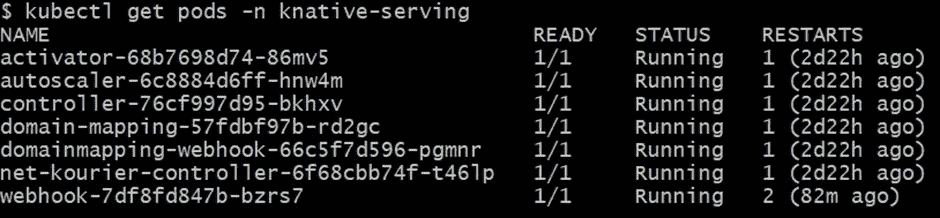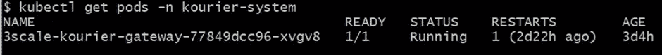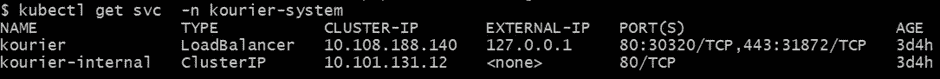

**将 SpringBoot 应用程序部署到 Kubernetes 集群。**

我们已经准备好了环境。现在是时候部署应用程序并查看操作了。我们可以使用 Knative CLI (kn)来管理和部署 Knative 上的应用程序。在本例中，我们将使用 YAML 清单进行部署。但是有时我们利用 Knative CLI (kn)来检查和管理我们的 Knative 服务。

让我们看看我们的应用程序代码，以及如何使用 scaffold 和利用 Knative 特性将该应用程序部署到 K8s 集群。

因为我已经提到我们的应用程序是一个简单的 Spring Boot REST 应用程序，它有一个数据库连接。为了简单起见，我们使用了 Mongo 数据库，它在示例 K8s 集群中运行。下面是我们模型类的代码片段。这个模型类正在使用 Mongo 数据库中的“employee”集合。

```
@Document(collection = “employee”)
 @Getter
 @Setter
 @AllArgsConstructor
 @NoArgsConstructorpublic class Employee {@Id
 private String id;
 private String firstName;
 private String lastName;
 private int age;
 private String address;}
```

对于数据库集成，我们在应用程序中使用简单的 Spring 数据 MongoDB。

```
public interface EmployeeRepository extends CrudRepository <Employee, String>{Set<Employee> findByFirstNameAndLastName(String firstName, String lastName);
 Set<Employee> findByAge(int age);}
```

在本例中，REST 端点仅用于保存和搜索雇员。任何人都可以为删除、更新等其他操作增强端点。下面是与端点关联的控制器类。

```
@RestController
 @RequestMapping(“/employee”)public class EmployeeController {@Autowired
 private EmployeeService employeeService;@GetMapping(“/getEmployeeById”)
 public Optional<Employee> getEmployeeById(@RequestParam(“id”) String id){return employeeService.getEmployeeById(id);}@PostMapping(“/saveEmployee”)
 public Employee saveEmployee(@RequestBody Employee employee){return employeeService.saveEmployee(employee);}@GetMapping(“/getEmployeeByAge”)
 public Set<Employee> findByAge(@RequestParam(“age”) int age) {return employeeService.getEmployeeByAge(age);}@GetMapping(“/getAllEmployee”)
 public Iterable<Employee> findAll() {return employeeService.getAllEmployee();}}
```

下面是“application.yaml”文件的详细信息，我们在该文件中使用环境变量声明了数据库连接设置和凭据。

```
server:
  port: 8096
spring:
  application:
    name: springboot-knative-demo
  data:
    mongodb:
      host: mongodb
      port: 27017
      username: ${MONGO_USERNAME}
      password: ${MONGO_PASSWORD}
      database: ${MONGO_DATABASE}
      authentication-database: admin
```

**知识服务定义:**

我们已经完成了应用程序代码片段。让我们从无效服务定义 YAML 文件开始。它是主配置文件，您可以在其中定义您的服务定义。您还可以在此配置文件中定义自动缩放策略、流量、版本等。

Knative Serving 为应用程序提供自动缩放，或*自动缩放*，以匹配传入的需求。这是默认情况下使用 Knative Pod 自动缩放器(KPA)提供的。您可以通过简单地使用注释来实现自动缩放。这里我们使用了注释‘auto scaling . knative . dev/target’。我们将该值设置为 15(在任何给定时间，应用程序的每个副本可以处理的并发请求数)。请在给定的链接上查看有关 Knative Serving autoscaling 的更多详细信息。

[关于自动缩放— Knative](https://knative.dev/docs/serving/autoscaling/)

我们还为数据库连接细节使用了 Secret 和 ConfigMap。因为我们在将 MongoDB 部署到集群的过程中使用了 ConfigMap 和 Secret。

以下是无效服务定义文件。

```
apiVersion: serving.knative.dev/v1
kind: Service
metadata:
  name: springboot-knative-demo
spec:
  template:
    metadata:
      annotations:
        autoscaling.knative.dev/target: "15"
      # This is the name of our new "Revision," it must follow the convention {service-name}-{revision-name}
      name: springboot-knative-demo-final
    spec:
      containers:
        - image: dockertestbaby/springboot-knative-demo
          ports:
            - containerPort: 8096
          env:
            - name: MONGO_DATABASE
              valueFrom:
                configMapKeyRef:
                  name: mongodb
                  key: database-name
            - name: MONGO_USERNAME
              valueFrom:
                secretKeyRef:
                  name: mongodb
                  key: database-user
            - name: MONGO_PASSWORD
              valueFrom:
                secretKeyRef:
                  name: mongodb
                  key: database-password
  traffic:
  - latestRevision: true
    percent: 60
  - revisionName: springboot-knative-demo-rev2
    percent: 20
  - revisionName: springboot-knative-demo-rev1
    percent: 20
```

**用于部署的 Skaffold 配置**

这里我们将使用 Skaffold 来实现部署的自动化。Skaffold 是一个命令行工具，支持 Kubernetes 本地应用程序的持续开发。对于构建阶段，Skaffold 支持不同的工具，如 Dockerfile、Jib 插件、云原生构建包等。在我们的演示中，我们将在构建阶段使用一个简单的 docker 文件。

请查看位于项目根目录下的 skaffold.yaml 文件。想了解更多关于斯卡福德的信息，你可以点击下面的链接。

[安装斯卡福德|斯卡福德](https://skaffold.dev/docs/install/)

```
apiVersion: skaffold/v2beta22
kind: Config
metadata:
  name: springboot-knative-demo
build:
  artifacts:
  - image: dockertestbaby/springboot-knative-demo
  local:
    push: true
deploy:
  kubectl:
    manifests:
    - kubernetes/mongodb-deployment.yaml
    - kubernetes/app-knative-service.yaml
```

下面是我们的应用程序的 docker 文件，Skaffold 将使用这个 docker 文件来构建容器映像。

```
 FROM openjdk:11.0.7-jre-slim-buster
 ARG JAR_FILE=target/*.jar
 COPY ${JAR_FILE} app.jar
 ENTRYPOINT [“java”,”-jar”,”/app.jar”]
```

现在我们可以开始部署我们的应用程序了。让我们执行命令“skaffold run”。它将构建我们的应用程序，创建并推送 Docker 映像，最后在 Knative 服务定义文件的帮助下将应用程序部署到 Knative。

```
skaffold run
```

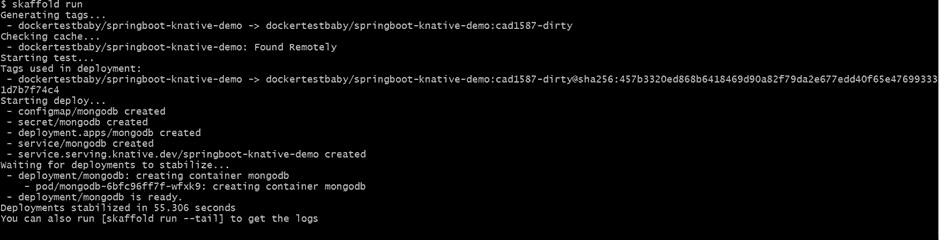

**部署验证:**

是时候验证我们的部署了。让我们使用 Knative CLI 进行验证。请执行“kn 服务列表”命令。您可以看到名为“springboot-knative-demo”的单一 Knative 服务。

```
kn service list
```

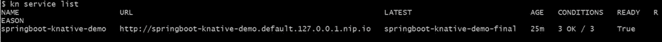

让我们对我们的应用程序进行更多的修改。为此，我们需要改变我们的代码(关于不同的修订)。这里我创建了 3 个版本，它们指向同一个服务。在对你的源代码做了必要的修改后，你只需要执行‘ska fold run’。最终的源代码已经有了所有的修改。对于我们的例子，您需要从“rev1”、“rev2”开始，最后是“最终”版本。

```
kn revision list
```

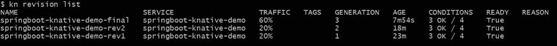

另一个重要的特性是在多个版本之间划分流量。这是非常重要的，当你将处理蓝绿色，金丝雀部署。

让我们看看在不同版本之间分配流量有多容易。为此，我们需要添加“交通”标签。我们可以定义分配给特定版本的负载百分比。在这里，我们将 60%分配给最终版本，20%分配给版本 2，20%分配给版本 1。下面是代码片段。

```
apiVersion: serving.knative.dev/v1
kind: Service
metadata:
  name: springboot-knative-demo
spec:
  template:
    .
    .
    .
    .
  traffic:
  - latestRevision: true
    percent: 60
  - revisionName: springboot-knative-demo-rev2
    percent: 20
  - revisionName: springboot-knative-demo-rev1
    percent: 20
```

**让我们实现自动缩放和缩放到零:**

正如我们所知，Knative 支持自动伸缩的默认“并发”目标，我们需要对我们的服务执行一些特定的加载，以便实现 Knative 服务的自动伸缩机制。

我们已经将并发目标级别设置为 15。为了给我们的服务生成高负载/流量，我们可以使用不同的负载测试工具。在这个例子中，我们将使用 JMeter 向我们的服务发送一个并发请求。例如，我们将在 JMeter 中使用以下参数发送请求(用户数量= 50，上升周期= 2s，循环计数= 50)。

有关 JMeter 的更多信息，请参见以下链接:

[阿帕奇 JMeter —阿帕奇 JMeter](https://jmeter.apache.org/)

**创建一个 JMeter 测试计划和线程组:**

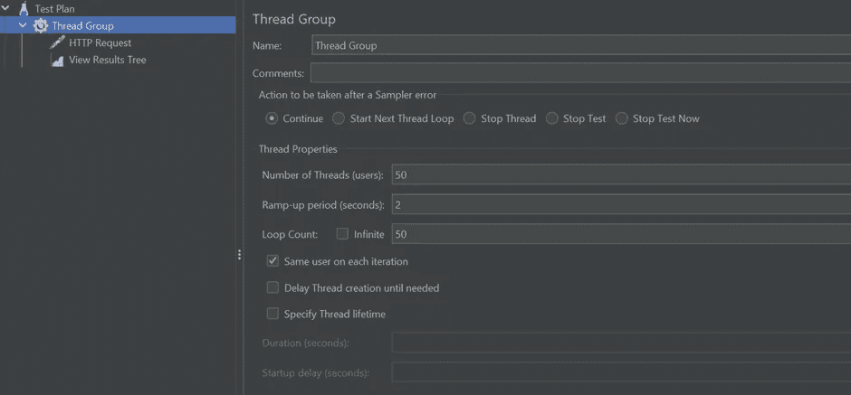

**创建一个简单的 HTTP 请求:**

具有“/employee/getAllEmployee”终结点的 HTTP GET 请求。

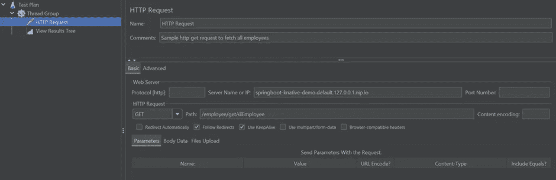

**执行请求:**

一旦我们执行了来自 JMeter 的 HTTP GET 请求，那么在后端我们可以看到，由于 Knative 服务的自动伸缩特性，已经创建了更多的 pod。对于我们的例子——

3 pods 正在进行最终修订，处理 60%的流量。

2 个 pod 运行 rev1 修订版，处理 20%的流量。

1 个 pod 正在运行 rev2 修订版，该版本处理 20%的流量。

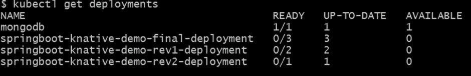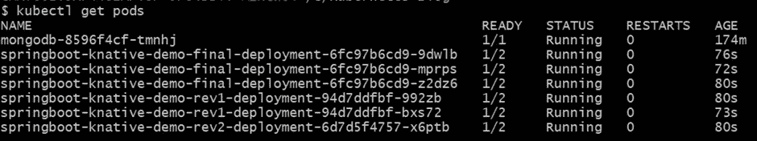

有时，如果您执行命令“kubectl get deployments”，那么您可以找到负责服务流量的就绪部署。

```
kubectl get deployments
```

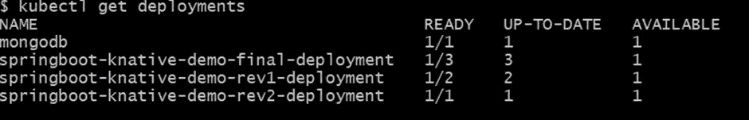

**结果:**

成功执行上述请求后，结果应该如下所示。

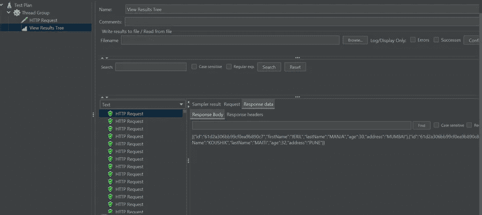

太好了！！！我们已经很好地检查了自动缩放功能，现在让我们探索另一个漂亮的功能。**“扩展到零”**—Knative 无服务器平台/架构最漂亮的特性之一。让我们看看当没有流量进入服务时 Knative 的行为。你不需要担心那个。Knative 将检测是否没有流量进入服务，它会自动将运行的 pod 数量减少到零。

让我们在空闲状态下等待几分钟，不要向我们的服务发送任何请求。现在你可以看到吊舱处于终止状态。

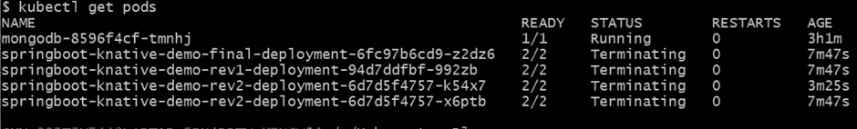

几秒钟后，您可以看到集群中没有与我们的服务相关的 pod 在运行。

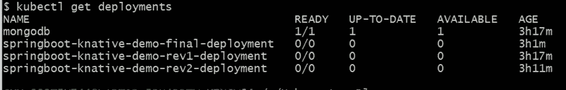

**清理部署:**

我们已经完成了演示。现在，是时候从集群中清理部署了。同样很简单，只需运行“skaffold delete”即可。它将从集群中删除/清理所有资源。

```
skaffold delete
```

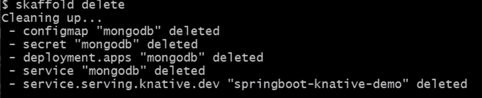

**源代码:**

如果你正在考虑工作代码，那么我们开始吧。

[](https://github.com/koushikmgithub/springboot-knative-demo.git) [## GitHub-koushikmgithub/spring boot-knative-demo:带有 knative 和…

### 此时您不能执行该操作。您已使用另一个标签页或窗口登录。您已在另一个选项卡中注销，或者…

github.com](https://github.com/koushikmgithub/springboot-knative-demo.git) 

**上链:**

太好了！！！我们已经完成了这篇文章。希望你喜欢它！！！。在本文中，我试图展示我们如何使用 Skaffold 和 Dockerfile 将 Spring Boot 应用程序作为一个 Knative 服务部署到 minikube Kubernetes 集群。我还试图触及 Knative Serving 的一些有趣的特性——比如自动缩放、缩放到零、带有简单注释的流量分布。

随时欢迎您的评论/建议！！！。