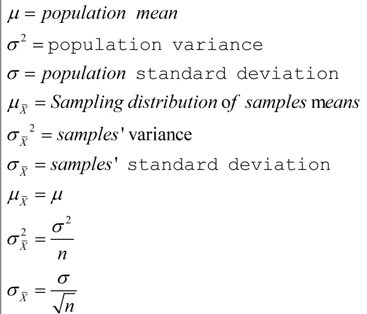

# 样本的抽样分布意味着使用 Python

> 原文：<https://blog.devgenius.io/sampling-distribution-of-samples-means-using-python-14da802d3168?source=collection_archive---------3----------------------->

## Python 中带替换和不带替换的简单随机示例

由于计算机内存的限制，如果数据量非常大，不同的机器学习模型都不能很好地执行。为了解决这个问题，我们必须选择代表整个数据集的数据集部分。这个挑选部分数据集的过程被称为抽样。样本是总体中的一部分，它被选择用来代表总体的特征。抽样是从给定的总体中选择有代表性的样本的过程。当随机选择的单元在下一个单元被选择之前被返回到群体中时，从群体中进行替换的随机抽样。当随机选择的单位在下一个单位被选择之前没有返回到总体中时，从总体中进行无替换的随机抽样

卢卡斯·桑托斯在 [Unsplash](https://unsplash.com?utm_source=medium&utm_medium=referral) 上拍摄的照片

如果从有限的 N 个样本中选择一个简单的 N 个随机样本，那么所有可能样本的数目如下

如果采样是在替换的情况下完成的

如果采样是在没有替换的情况下进行的

其中`N`是总体规模，`n`是样本规模

在本文中，我们将在有替换和无替换的情况下，从大小为`N`的总体中生成大小为`n`的所有可能的简单随机样本，然后我们将计算样本均值并做出频率分布，计算样本分布的均值和方差，并根据中心极限定理将它们与总体均值和方差进行比较

# 补替抽样法

## 获取所有尺寸为 2 的样本

`p = [1, 2, 3, 4, 5, 6]`

`Population size: N = 6`

`Sample size: n = 2`

`Number of all possible samples = N x N = 6 x 6 = 36`

## 步骤 1:导入库

*   `numpy`用于计算`mean`、`variance`和`standard deviation`
*   `pandas`用于以表格形式显示样本
*   `itertools`中的`product`和`combination`分别用于更换样品和不更换样品
*   `matplotlib.pyplot`中的`plt`用于可视化数据

## 第二步:申报人口

*   创建一个人口的 python 列表，并将其赋给一个变量`pop`

## 第三步:抽取所有尺寸`N x N`的样品

*   `product(pop, pop)`抽取人口的所有样本`pop`
*   `list(product(pop, pop))`将这些样本转换成 python `list`的`tuples`

## 步骤 4:返回列表的大小

*   `len(list(product(pop, pop)))`返回样本列表的大小

## 步骤 5:计算所有样本的平均值

*   `np.mean(list(product(pop, pop)), axis=1)`计算所有样本的平均值

## 步骤 6:创建数据框

*   创建一个数据框`df`
*   创建两列`samples`和`samples means`
*   显示`df`

## 步骤 7:创建频率分布

*   `np.unique(np.mean(list(product(pop, pop)), axis=1), return_counts=True)`返回样本均值和频率的两个向量
*   从`f/sum(f)`创建概率向量，并将其分配给`p`

## 步骤 8:创建样本的频率分布均值

*   创建样本频率分布的数据帧意味着
*   `Σ(xp)`是指**和**的频率分布
*   `Σx²p-(Σxp)²`是频率分布的方差
*   `sqrt((Σx²p)-(Σxp)²)`是分布的标准偏差

## 步骤 9:计算人口参数

*   计算并打印样品的`mean`、`variance`和`standard deviation`的平均值
*   计算并打印人口的`mean`、`variance`和`standard deviation`

# 不重复抽样

代码与我在上面解释的替换样本均值的抽样分布的情况非常相似

## 获取所有尺寸为 2 的样本

`p = [1, 2, 3, 4, 5, 6]`

`Population size: N = 6`

`Sample size: n = 2`

`Number of all possible samples = C(6, 2) = 15`

# 创建`samples_distribution()`功能

这里我创建了一个函数`samples_distribution(pop, samples_mean, n, replacement = True)`,它将接受 4 个参数，并计算有无替换的样本均值的抽样分布

1.  `pop`是人口
2.  `samples_mean`这个样本列表是什么意思
3.  `n`是样本的大小
4.  `replacement = True`表示有替换，表示`replacement = False`没有替换

## 获取所有尺寸为 5 的样品

## 有替换

`Sample size: n = 5`

`All possible samples = N x N x N x N x N = 6 x 6 x 6 x 6 x 6 = 7776`

## 获取所有尺寸为 5 的样品

## 无放回

`Sample size: n = 5`

`All possible samples = C(6, 4) = 15`

# 结论

在本文中，我们学习了如何生成大小为`n`的所有可能的简单随机样本，包括替换和不替换，然后我们计算样本均值并制作频率分布，从样本分布中计算均值和方差，并根据中心极限定理将它们与总体均值和方差进行比较。