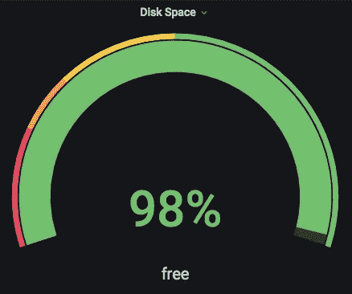
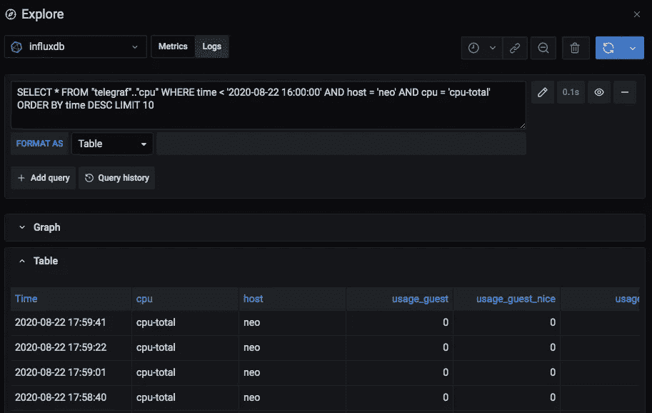
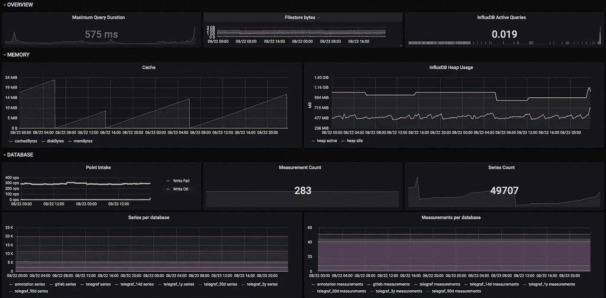
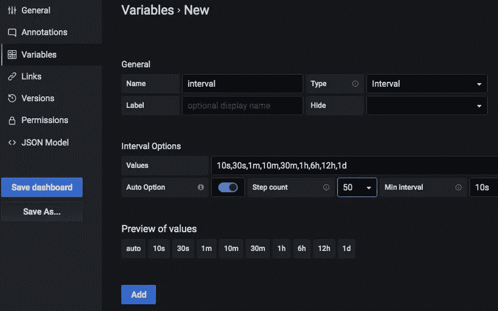
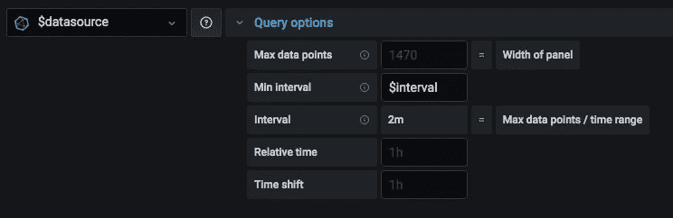

# 通过压缩您的 InfluxDB 节省 90%的磁盘空间

> 原文：<https://blog.devgenius.io/save-90-disk-space-by-compacting-your-influxdb-838366cfa133?source=collection_archive---------0----------------------->

## InfluxDB | Grafana |成本|监控|软件工程

## 加快查询速度并降低存储需求。如何用 Grafana 监控 InfluxDB 本身？



Grafana 仪表插件。

# 是什么让查询变慢了

在我们优化查询之前，我们必须了解是什么使它们变得缓慢，哪些操作或查询是昂贵的，以及什么是您真正想要的。

## 数据越多=越慢

这是显而易见的，对吗？查询需要浏览的数据越多，花费的时间就越长。所以我们必须大致了解数据是如何存储的。还有另一个导致查询变慢的主要因素:基数。更多信息请见下文。

InfluxDB 是一个时间序列数据库，这意味着它记录一段时间内的数据。它可以处理纳秒精度，这意味着你可以输入每纳秒的度量。数据将以您“输入”的精度存储。

例如:如果您每 10 秒收集并报告一个指标，它将“按原样”存储，因此您每分钟将有 6 个指标。这一年有 310 万个指标。现在乘以你正在收集的指标…这是巨大的。InfluxDB 的默认`RETENTION POLICY`是“forever ”,因此您将收集数百万条记录。

> 如果您不汇总，您的指标将永远“原始”存储。

这很棒，对吧？您开始使用 InfluxDB 和输入数据，不会丢失任何东西。不错！然而，一段时间后，随着您添加更多指标，存储会不断增长。此外，你回顾半年后，对 10 秒粒度的指标感兴趣的次数是很少的，非常少。

## 检查你的数据库

现在让我们用您自己的数据库来检查我刚才所说的，假设您正在阅读这篇文章，因为您使用 InfluxDB。

有两种方法可以检查 InfluxDB 的存储和基数。第一种简单，运行查询。

## 1.运行查询

> **Tipp** :使用 Grafanas 的“探索”页面运行单个查询，探索你的数据库。



检查测量的原始数据。

```
# show raw data from your measurements (at any point in time)
SELECT * FROM "cpu" WHERE time < '2020-08-01 00:00:00' ORDER BY time DESC LIMIT 10
```

## 检查数据的一些查询

```
# show your measurements or how many you have
SHOW MEASUREMENTS
SHOW MEASUREMENT CARDINALITY# show how many tags keys you have, optionally per measurement
SHOW TAG KEY CARDINALITY
SHOW TAG KEY CARDINALITY FROM "cpu"
# show or count different values of the tag key "host"
SHOW TAG VALUES CARDINALITY [FROM "cpu"] WITH KEY = "host"
SHOW TAG VALUES FROM "cpu" WITH KEY = "host"# show how many fields you have in measurement "cpu"
SHOW FIELD KEY CARDINALITY FROM "cpu"# show how many series you have in a database
SHOW SERIES CARDINALITY ON telegraf
# show or count different series in measurement "cpu"
SHOW SERIES CARDINALITY ON telegraf FROM "cpu"
SHOW SERIES ON telegraf FROM "cpu"
```

## 探索您的数据回收策略

`RETENTION POLICY`定义了数据应该在数据库中保存多长时间。一个数据库中可以有多个保留策略。保留策略还定义了分片持续时间——基本上是一个数据分片应该包含的持续时间。

默认保留策略的持续时间为 0(永久)，碎片持续时间为 168 小时，即一周。简而言之，这意味着您的数据存储在碎片中 7 天，永远不会被驱逐。

```
# show how data is stored and evicted
SHOW RETENTION POLICIES# show storage shards and groups
SHOW SHARDS
SHOW SHARD GROUPS
```

在这里，您可以找到 InfluxDB 存储在磁盘上的实际文件:

```
ls -la /var/lib/influxdb/data/telegraf/[retention policy]/[shard]
```

更多关于`SHARDS`和`RETENTION POLICIES`的信息，请点击此处:

[](https://www.influxdata.com/blog/influxdb-shards-retention-policies/) [## 简化流入数据库:碎片和保留策略|流入数据

### InfluxData 的开发者倡导者 Margo Schaedel 的博客文章:我最近做了一个关于 InfluxDB 介绍的网络研讨会…

www.influxdata.com](https://www.influxdata.com/blog/influxdb-shards-retention-policies/) 

## 2.启用 InfluxDB 度量

检查 InfluxDB 的第二个选项是启用内部指标。

在您的`influxdb.conf`中启用`monitor:`

```
[monitor]
  store-enabled = true
  store-database = "_internal"
  store-interval = "30s"
```

[](https://docs.influxdata.com/platform/monitoring/influxdata-platform/tools/measurements-internal/) [## InfluxDB _ 内部测量和字段| InfluxData 文档

### 默认情况下，InfluxDB 生成内部指标并保存到 _internal 数据库。使用这些指标来监控…

docs.influxdata.com](https://docs.influxdata.com/platform/monitoring/influxdata-platform/tools/measurements-internal/) 

InfluxData 提到此**不应用于生产！**

当您打开内部指标时，您可以在 Grafana 仪表板中显示它们。



具有内部 InfluxDB 指标的仪表板。

# 发现并解决问题

既然您已经检查了数据库，您可能已经找到了它可能变慢的一些原因。以下是修复方法。

## 永久保存原始数据(磁盘空间和速度)

这可能是最常见的问题，也是最耗时的问题，但是有了它，你可以**重新获得高达 90%的磁盘空间**。检查您的保留策略，并对其进行调整，以便在您不再需要数据时将其丢弃。还要检查你的碎片的大小。正确的大小当然取决于运行 InfluxDB 实例的硬件，所以我不能给出任何建议，除了它们应该是可用 RAM 大小的一部分。

大多数人希望将数据保存更长时间(我也是)。但是，当您回顾几周或几个月以前时，您不希望或不需要 10 秒的粒度。你需要汇总的数据。

这似乎是一个简单的任务:只需运行一个查询，按照您想要的方式对数据进行分组，并将其插入另一个“长期”数据库。是的，本质上就是这样。但是，设置它，尤其是将它应用到现有的数据库是很繁琐的。

InfluxDB 甚至支持一种简单的方法来聚合数据，同时保留所有标签:

```
# downsample the measurement to 5 minutes, keeping all tags
SELECT max(field1) AS field1 FROM measurement GROUP BY time(5m), *
```

这里需要注意的一点是，您希望使用相同的仪表板和相同的查询来查询原始数据和聚合数据。这就是为什么您需要为每个聚合函数设置一个别名，并像原始字段一样命名它:`max(field1) AS field1`。

接下来要注意的是使用正确的聚合函数。你对平均值还是最大值感兴趣？如果是字符串值，也许你希望`last(field1)`作为聚合。下面举几个例子:[https://github . com/DrPsychick/ansi ble _ inflow _ down sampling/blob/master/defaults/main . yml](https://github.com/DrPsychick/ansible_influx_downsampling/blob/master/defaults/main.yml)

最后，您可能希望使用聚合设置，通过只包含某些值或排除其他值来清理您的标记。如果不是不可能的话，从测量中删除标记值是昂贵的。

不久前，我写了一个 ansible role，它可以帮助您设置聚合和压缩现有数据。如果你不想用 ansible，它可能还是会给你一些如何自己设置的思路。在我的例子中，我能够将一个 9.6GB 的数据库压缩 92%，同时在长期查询上获得巨大的速度。

[](https://github.com/DrPsychick/ansible_influx_downsampling) [## DrPsychick/ansi ble _ inflow _ down sampling

### InfluxDB 使用默认的保留策略，将数据永久保存在 7 天的碎片中——以原始格式(每 10 分钟数据点…

github.com](https://github.com/DrPsychick/ansible_influx_downsampling) 

示例中描述了我的设置:[https://github . com/DrPsychick/ansi ble _ inflow _ down sampling/tree/master/examples/full-5 level-回填-压缩](https://github.com/DrPsychick/ansible_influx_downsampling/tree/master/examples/full-5level-backfill-compact)

该解决方案大量使用了 InfluxDB 的“连续查询”功能，文档如下:

[](https://docs.influxdata.com/influxdb/v1.8/query_language/continuous_queries/) [## InfluxQL 连续查询| InfluxData 文档

### 连续查询(CQ)是对实时数据和存储查询定期自动运行的 InfluxQL 查询…

docs.influxdata.com](https://docs.influxdata.com/influxdb/v1.8/query_language/continuous_queries/) 

这里有一篇文章描述了如何使用连续查询将数据聚合到同一个数据库的不同保留策略中。那也很有效。我之所以使用不同的数据库，是因为在 Grafana 中用一个`$database`变量更容易处理，如果需要的话，它还允许你更容易地将长期数据库转移到不同的服务器上。

[](https://towardsdatascience.com/influxdb-data-retention-f026496d708f) [## InfluxDB 数据保留

### 如何对数据进行降采样并保存数年

towardsdatascience.com](https://towardsdatascience.com/influxdb-data-retention-f026496d708f) 

## 高系列基数(数据量和速度)

如果您的调查显示您的测量具有非常高的系列基数(> 2000)，那么您别无选择，只能减少/改变您正在收集的数据，或者坚持下去并为此付出代价。或者，您可以将指标分成多个测量值，以分散数据和负载。

```
SHOW SERIES CARDINALITY ON telegraf
SHOW SERIES CARDINALITY ON telegraf FROM "procstat"
```

问题要么是标签太多，要么是标签有很多不同的值。两者都导致更大量的标签值的可能组合。而且每个组合基本形成一个系列。

举一个真实的例子:假设您正在监控一个应用程序及其处理的请求。每个请求针对一个特定的路径(网站或 API ),大约有 20 个不同的路径。可以将它们作为标签添加到指标中，以查看每个端点的性能。假设某个业务部门的人要求您添加客户 ID，这样他们就可以了解某个客户是否比其他人更容易受到响应缓慢的影响。您的公司有 500 个客户端，他们都使用终端。您将得到 20*500 = 10000 种可能的标记值组合。您会注意到，一旦引入了 clientID 标记，该图的查询会变得更慢。有一天，您的 IT 老板走过来，让您添加国家作为标签，因为“我们想知道有多少请求来自某个国家”。因此，取 10000 个组合，乘以你的客户来自的国家，比如说 5 = 50000 个可能的组合。

这里要问的正确问题是:你需要知道与 clientID 一起**与 clientID 一起**与国家一起的路径吗？大概不会。因此，一种解决方案是拆分指标，一个用于路径和国家，一个用于客户端。

我想你明白了。这里没有放之四海而皆准的解决方案。这取决于您的数据以及您希望如何查询它。

## 总是查询原始数据(负载和速度)

很可能是最常见的“用户”问题。与 InfluxDB 相比，它与您如何设置 Grafana 仪表板更有关系。许多人要么在他们的查询中设置固定的粒度(按`time(10s)`分组)，要么保存仪表板，选择`10s`作为间隔。如果您随后查询更大的范围，如 7 天或 30 天，您会向 InfluxDB 请求大量数据，并且您的 Grafana(您的浏览器)必须处理所有这些数据，这使得它非常慢。

到目前为止，对我来说最好的选择是像这样设置仪表板:



仪表板设置:变量



查询编辑器:查询选项

*   创建一个名为`interval`的区间变量。如果需要，您可以更改预定义的值。激活`auto`选项。
*   编辑您的面板，并将查询选项中的“最小间隔”设置为`$interval`。
*   在您的查询中，确保您有 group by `time($__interval)`。
*   当“间隔”设置为`auto`时，保存您的仪表板**包括变量**。

现在，如果您使用 interval 变量，您将看到当您降低 interval 时，图形如何变化并变得更加“精确”,当您增加 interval 时，图形变得更加平坦。

为什么？因为:如果任何人使用你的仪表板想要“缩小”，他们可能会改变时间范围。如果你有一个固定的(或保存或选择！)间隔`10s`和查询 30 天，会很慢，甚至可能会中止。如果您将间隔设置为`auto`并查询 30 天，Grafana 将通过`$interval`变量自动调整分组。在变量设置中，您可以根据自己的喜好设置`Step count`,默认显示更精确或更平滑的图形。

为什么这么麻烦？它开箱即用！是的，它是。如果你没有做到以上几点，Grafana 会自动计算出最小间隔(如上图截图所示)。我发现，如果我可以手动选择粒度，这将非常有用。有时我想看原始数据，所以我选择`10s`区间。

## 始终显示所有图表(负载和速度)

第二个最常见的“用户”问题导致控制面板运行缓慢和数据涌入。Grafana 在您显示图表时运行查询。如果您将图表按行放置，并隐藏不总是需要的内容，那么您可以将大量查询保存到 InfluxDB，并且您的仪表板加载速度会更快。

## 创建单独的警报仪表板(负载和速度)

这似乎是一件小事，而且由于公告板中的变量，您还不得不为警报规则创建静态查询。在 Grafana 中很容易设置警报，并且需要一个能够快速查询短时间和/或预定义时间范围的板。我强烈建议仅在专用于警报的仪表板上创建警报。如果您的仪表板上有许多警报被设置为默认的 7 天时间范围，那么您的 InfluxDB 将持续加载，基本上没有任何附加值。毕竟，你通常不希望在几个小时甚至几天后才被提醒。您还可以添加警报图表或指标的链接，这些图表或指标直接链接到相应服务的仪表板。

# 度量的基本规则

综上所述，以下是度量的一些最佳实践:

*   **聚合您的数据以便长期存储**并设置您的 Grafana 仪表盘以支持切换数据库**。**即使查询一年的时间范围，也能保持快速查询。
*   以您需要的**最粗略粒度收集数据**。问问你自己，如果你更频繁地收集它，你会得到什么好处。从每分钟一次到每十秒钟一次已经让你的数据增加了 6 倍。
*   监控或定期检查您的数据库“负载”。**小心爆炸系列**，因为当有人向指标添加标签时，您通常不会得到通知**。根据您需要查询的内容，将指标**分割成单独的度量。
*   构建和使用仪表板，这些仪表板**只显示需要立即看到的内容**，并基于**动态间隔**查询数据。

# 感谢您的阅读！

我希望这有所帮助。我邀请您参与我的职责，或者提交有关改进或功能要求的问题。

## 我关于监控的其他文章

[](https://medium.com/dev-genius/3-years-of-influxdb-with-aggregation-a-review-6d160a4281cf) [## 三年来的 InfluxDB 与聚合—回顾

### 压缩数据是获得可维护的、响应迅速的系统的关键——但是这值得努力吗？

medium.com](https://medium.com/dev-genius/3-years-of-influxdb-with-aggregation-a-review-6d160a4281cf) [](https://medium.com/dev-genius/monitoring-your-machine-s-with-tig-a9ef39cd0eec) [## 使用 TIG 监控您的机器

### TIG = Telegraf，InfluxDB，Grafana。受众:开发人员、书呆子、devops 初学者…

medium.com](https://medium.com/dev-genius/monitoring-your-machine-s-with-tig-a9ef39cd0eec) [](https://medium.com/dev-genius/monitor-temperatures-with-telegraf-on-macos-4a0eae03549d) [## 在 macOS 上使用 Telegraf 监控温度

### 在 macOS 上使用 Telegraf 可以监控的内容:适用于书呆子、开发人员和 devops 初学者…

medium.com](https://medium.com/dev-genius/monitor-temperatures-with-telegraf-on-macos-4a0eae03549d) [](https://medium.com/the-innovation/monitor-nvidia-gpu-with-telegraf-on-windows-5acb73c91d20) [## 在 Windows 上使用 Telegraf 监控 Nvidia GPU

### Telegraf 通过 SMI 收集 Nvidia 指标并在 Grafana 中显示的 5 分钟设置:适用于书呆子、开发人员和…

medium.com](https://medium.com/the-innovation/monitor-nvidia-gpu-with-telegraf-on-windows-5acb73c91d20) 

## 资源

[](https://github.com/DrPsychick/ansible_influx_downsampling) [## DrPsychick/ansi ble _ inflow _ down sampling

### InfluxDB 使用默认的保留策略，以原始格式将数据永久保存在 7 天的碎片中(数据点每 10…

github.com](https://github.com/DrPsychick/ansible_influx_downsampling) [](https://docs.influxdata.com/influxdb/v1.8/query_language/continuous_queries/) [## InfluxQL 连续查询| InfluxData 文档

### 连续查询(CQ)是对实时数据和存储查询定期自动运行的 InfluxQL 查询…

docs.influxdata.com](https://docs.influxdata.com/influxdb/v1.8/query_language/continuous_queries/) [](https://docs.influxdata.com/platform/monitoring/influxdata-platform/tools/measurements-internal/) [## InfluxDB _ 内部测量和字段| InfluxData 文档

### 默认情况下，InfluxDB 生成内部指标并保存到 _internal 数据库。使用这些指标来监控…

docs.influxdata.com](https://docs.influxdata.com/platform/monitoring/influxdata-platform/tools/measurements-internal/)