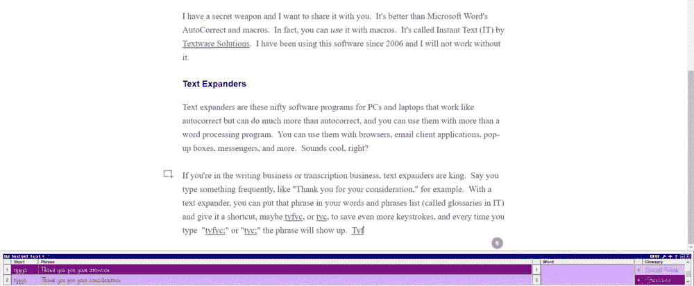
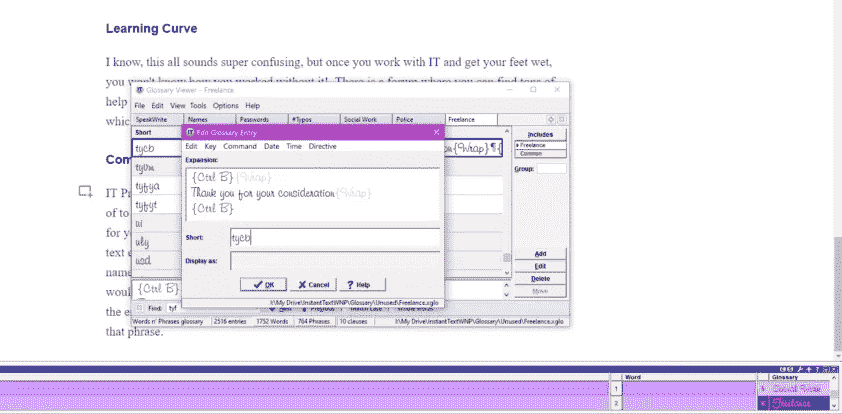

# 使用文本扩展器节省击键次数并提高工作效率

> 原文：<https://blog.devgenius.io/save-keystrokes-and-increase-productivity-with-text-expanders-b357f03c1e5f?source=collection_archive---------20----------------------->

卡尔·海尔达尔在 [Unsplash](https://unsplash.com?utm_source=medium&utm_medium=referral) 上拍摄的照片

我有一个秘密武器，我想和你分享。比 Microsoft Word 的自动更正和宏要好。事实上，你可以将*与*一起使用。被 [Textware Solutions](http://www.textware.com/) 称为即时文本(It)。我从 2006 年开始使用这个软件，没有它我无法工作。让我重新措辞；没有它，我不会打任何东西。

# 文本扩展器

文本扩展器是这些适用于个人电脑和笔记本电脑的漂亮的软件程序，其功能类似于自动更正，但比自动更正功能强得多，而且你可以将它们与更多的文字处理程序一起使用。您可以将它们用于浏览器、电子邮件客户端应用程序、弹出框、信使等。听起来很酷，对吧？

如果你在写作或转录行业，文本扩展器是国王。比如说，你经常输入一些东西，比如“谢谢你的考虑”。有了文本扩展器，你可以把那个短语放在你的单词和短语列表(称为词汇表)中，并给它一个快捷方式，可能是 tyfyc、tyfc 或 tyc，以节省更多的击键次数，并且每次你键入“tyfyc；”或“tyfc”或“tyc”这个短语就会出现。

它可以停靠到您的 word 客户端、浏览器等，以便您可以看到可用的短语。

# 即时文本专业版 8

如上所述，当我输入“tyf”时，短语下面会出现不止一个扩展。如果我继续输入“tyfya”，我会得到“感谢您的关注。”如果我输入“tyfyc”，我会得到“谢谢你的考虑。”对于即时文本，您可以选择按空格键使其像自动更正一样扩展，或者您可以使用标记键，这意味着您不必担心意外扩展单词或短语。

它默认的标记键是分号(；).例如，如果您添加短语“thank you ”,并使用 ty 作为快捷方式/缩写，使用标记键，您只需键入“ty；让它知道你想扩展这个短语。因为有了这个标记键，当你不希望的时候，你仍然可以输入“ty”而不会扩展成“thank you”。

# 学习曲线

我知道，这一切听起来超级混乱，但一旦你用它工作，并得到你的脚湿，你会不知道没有它你是如何工作的！有一个论坛，在那里你可以找到大量的帮助和有用的信息，并直接与开发人员交谈。我用的是[即时文字 Pro 8](https://textware.com/it8pro/IT8Pro_beta_installation.htm) ，目前处于测试阶段，是目前为止最好的版本。

# 命令

IT Pro 8 还有一个关键功能，您可以使用您能想到的任何组合键来获得您想要的东西。坚持前面的短语，如果你想让“谢谢你的考虑”加粗，你可以在短语的开头和结尾“记录”加粗的组合键(在大多数文本编辑器中是 Ctrl B ),并把这个快捷键/条目命名为“tycb”(B 代表加粗)，这样每次你输入“tycb；”你会得到**感谢你的考虑**。因为您还将组合键放在了短语的末尾，所以该短语后面的其余文本的粗体将被关闭。

加粗条目

# 日期和时间

我最喜欢的功能之一是日期。您可以创建一个条目来添加您需要的任何格式的日期，(06/05/2020，2020 年 6 月 5 日，6/5/20 等)。)，甚至可以倒退前进(昨天，今天，明天，更远)！我用 dx；对于 date (x 不是我经常用的字母，所以我把它放在很多东西的末尾。YMMV)而如果我需要昨天的日期，我用 yx；为了昨天。昨天的事情对我来说非常有用，因为我经常工作到半夜，我需要昨天的日期而不是今天的。

还有一个输入当前时间或自定义时间的时间功能。也可以对其进行自定义，以包括或排除小时、分钟、秒和毫秒。您可以选择美国标准 12 小时时间或 24 小时军事时间。

# 免费试用

我无法在一篇文章中列出它的所有特性，老实说，我并没有全部使用它们，因为开发人员不断提出一些我还没有学会使用的很酷的特性。你可以免费试用即时短信 30 天，看看它是否符合你的需求。我很乐意回答任何问题，但我只是一个快乐的顾客；不是开发商或附属机构。