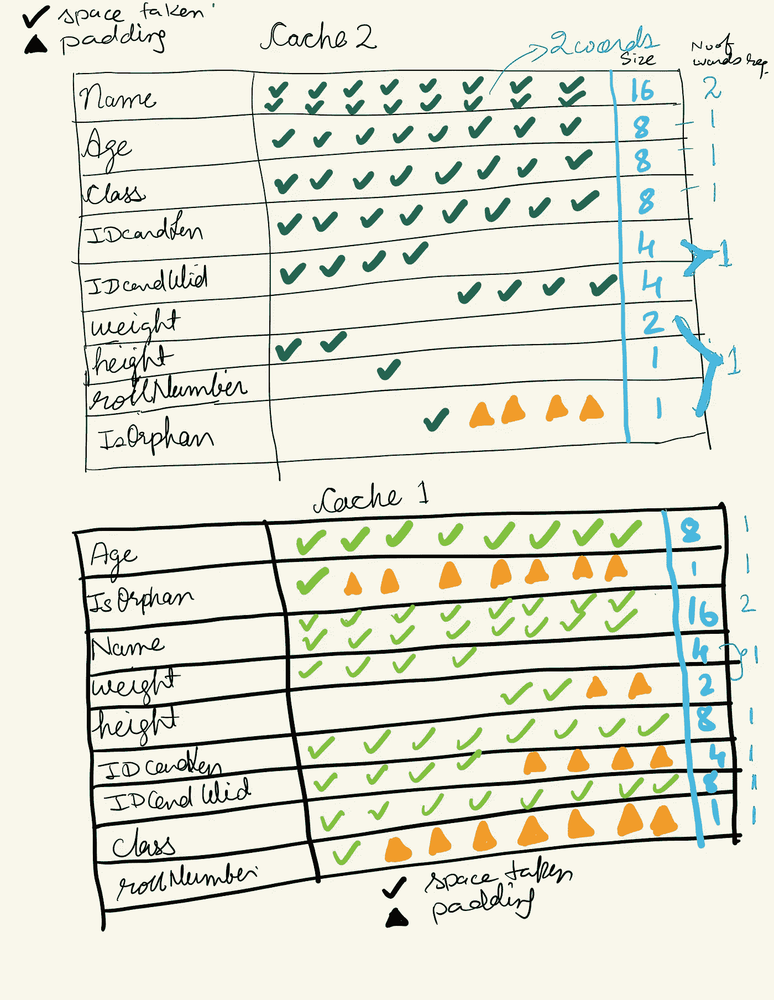

# 在内存密集型高速缓存中使用结构重新调整，节省 25%以上的内存。

> 原文：<https://blog.devgenius.io/save-over-25-memory-using-struct-realignment-in-a-memory-hungry-cache-a24fc20106bb?source=collection_archive---------7----------------------->

使用正确的结构重排和指针来节省内存。

# 介绍

在这篇文章中，我们将研究如何优化结构，以便在应用程序运行时使用更少的内存来存储数据(struct)。此外，我们将测量软件结构优化后内存使用量的变化。对齐是实现这一目标的一种方式。

对齐减少了读写内存区域所需的指令数量，从而加快了内存访问速度。如果没有对齐，处理器可能必须执行两条或多条指令来访问分布在多个机器字长的地址上的数据。

## Golang 内存中的对齐和填充

Golang 确实有填料。32 位系统架构的字长分别为 4 字节，64 位系统架构的字长分别为 8 字节。“字长”描述了计算机的 CPU 一次可以处理多少位。字长通常是数据总线大小、指令大小和地址大小的倍数。

截至目前，Go 使用的是“所需对齐”。所需的对齐等于结构中最大字段所需的内存大小。如果该结构包含 int32 字段,“所需对齐”将是 4 个字节。如果同时有 int32 和 int64，则需要 8 个字节。

## Golang 中的默认大小

```
Data Type        Size
bool            1 byte
int16           2 bytes
int32           4 bytes
int64           8 bytes
int             8 bytes
string          16 bytes
float32         4 bytes
float64         8 bytes
uint32          4 bytes
uint64          8 bytes 
```

**案例一——字长差异:**我们用一个例子来了解一下字长的差异。一个结构的最大内存大小为 int32，而另一个结构的最大内存大小为 int64。

```
package main

import (
 "fmt"
 "unsafe"
)

type Cache1 struct {
 a int32 
 b bool
 c int32
}

type Cache2 struct {
 a int32
 b bool
 c int64
}

var student1 [1]Cache1
var student2 [1]Cache2

func main() {
 fmt.Printf("struct: %d bytes\n", (unsafe.Sizeof(student1)))
 fmt.Printf("struct: %d bytes\n", (unsafe.Sizeof(student2)))
}
```

```
struct: 12 bytes
struct: 16 bytes
```

关于 Student1:它有一个缓存 1。Cache1 的字长为 4 字节，因为 int32 是结构 Cache1 中最大的内存大小。“a”完全占据了第一个字的 4 个字节。“b”从第二个字开始占用 1 个字节，剩下 3 个字节。“c”需要 4 个字节，但是因为第二个字还有 3 个字节。所以，“c”不能和第二个单词中的“b”放在一起。所以它需要 3 个大小为 4 的单词。大小是 4*3=12 字节。
学生 2 也可以得到类似的解释。

**案例 2—结构对齐差异:**让我们尝试使用更大的数据类型。在下面的例子中，两个结构的字长都是 8 字节，但由于对齐的原因，它们的大小还是不同。大小是 8 个字节，而不是 16 个字节，因为字符串本身是由 16 个字节组成的，有两个 8 字节的对齐。

## 例子

```
package main

import (
 "fmt"
 "unsafe"
)

type Cache1 struct {
                    // Data Size  ->  Total Size till now
 Age        int64   //    08      ->  8  (1st word)
 IsOrphan   bool    //    01      ->  16 (2nd word)
 Name       string  //    16      ->  32 (3rd & 4th word)
 weight     int32   //    04      ->  40 (5th word)
 height     int16   //    02      ->  40 (5th word)
 IDcardLen  float64 //    08      ->  48 (6th word)
 IDcardWid  float32 //    04      ->  56 (7th word)
 class      int     //    08      ->  64 (8th word)
 rollNumber int8    //    01      ->  72 (9th word)
}

type Cache2 struct {
 Name       string  //    16      ->  16 (1st & 2nd word)
 Age        int64   //    08      ->  24 (3rd word)
 class      int     //    08      ->  32 (4th word)
 IDcardLen  float64 //    08      ->  40 (5th word)
 IDcardWid  float32 //    04      ->  48 (6th word)
 weight     int32   //    04      ->  48 (6th word)
 height     int16   //    02      ->  56 (7th word)
 rollNumber int8    //    01      ->  56 (7th word)
 IsOrphan   bool    //    01      ->  56 (7th word)
}

var student1 [10000]Cache1
var student2 [10000]Cache2

func main() {
 fmt.Printf("Size of array %d ; struct: %d bytes\n", unsafe.Sizeof(student1), (unsafe.Sizeof(student1)))
 fmt.Printf("Size of array %d ; struct: %d bytes\n", unsafe.Sizeof(student2), (unsafe.Sizeof(student2)))
 fmt.Printf("Space Optimisation by %f %% \n", float64(unsafe.Sizeof(student1)-unsafe.Sizeof(student2))*100/float64(unsafe.Sizeof(student1)))
}
```

输出:

```
Size of array 720000 ; struct: 720000 bytes
Size of array 560000 ; struct: 560000 bytes
Space Optimisation by 22.222222 % 
```

原因:



图 1:解释空间占用和填充

**经验法则:**

为了最小化填充字节的数量，我们必须从最高分配到最低分配来布置字段。一个例外是空结构。空的大小为零。首先保留空结构，然后对于其余的，从最高分配到最低分配。

```
package main

import (
 "fmt"
 "unsafe"
)

type emptyOne struct {
 a struct{}
}

type A struct {
 b struct{}
 a int64
 c int64
}

type B struct {
 a int64
 b int64
 c struct{}
}

func main() {
 fmt.Printf("Size of emptyOne is %d byte(s) \n", unsafe.Sizeof(emptyOne{}))
 fmt.Printf("Size of A is %d in byte(s) \n", unsafe.Sizeof(A{}))
 fmt.Printf("Size of B is %d in byte(s) \n", unsafe.Sizeof(B{}))
}
```

输出:

```
Size of emptyOne is 0 byte(s) 
Size of A is 16 in byte(s) 
Size of B is 24 in byte(s)
```

A 的大小是 24 字节，而 B 的大小只有 16 字节。

**案例 3——大数组使用指针避免堆栈溢出:**我们可以使用指针对大切片进行操作**。**我们有一个大小为 100，000，000*8 字节的一维数组。

```
package main

import (
 "fmt"
 "unsafe"
)

func main() {
 var student1 [1e8]int
 fmt.Println("PRINT--DIRECTLY")
 fmt.Println(student1)
}
```

输出:

```
runtime: goroutine stack exceeds 1000000000-byte limit
runtime: sp=0x14000070f70 stack=[0x14000070000, 0x14000071000]
fatal error: stack overflow
```

程序崩溃。问题是为什么会发生这种情况，如何解决？
每个 go 例程都有预定义的堆栈大小限制。对于上述情况(64 位 arch)，它是 1，000，000，000 字节(1GB)。我们有大小为 0.1*8 GB 的可变学生 1。现在 main goroutine 调用 Println 函数，我们通过值传递，这意味着 Println 函数的形参在堆栈中复制了 student1。所以现在 go 例程需要 2*0.1*8=1.6GB > 1GB。

这可以通过使用指针将数据传递给 Println 函数来解决。指针基本上是指这个数组的起始点的内存地址。所以它只有 8 字节，而不是 800MB。使用指针可以节省复制大数据的时间，还可以防止堆栈溢出。

```
package main

import (
 "fmt"
 "unsafe"
)

func main() {
 var student1 [1e8]int
 fmt.Println("PRINT--WITH--POINTERS")
 fmt.Println(&student1)
 fmt.Printf("struct array: %d bytes\n", unsafe.Sizeof(student1))
 fmt.Printf("struct array's pointer: %d bytes\n", unsafe.Sizeof(&student1))
}
```

输出

```
PRINT--WITH--POINTERS
&[0.....0] //10^8 times 0 are there 
struct array: 800000000 bytes
struct array's pointer: 8 bytes
```

# 简而言之…

在结构中仔细选择数据结构。使用正确的结构对齐方式来节省内存。首先保留空结构，然后对于其余的，从最高分配到最低分配。如果您希望将数据传递到其他地方，但希望那里发生的更改对您在这里的代码可见，或者如果您的数据太大而无法复制，请使用指针。

如果你从中学到了什么，请鼓掌，如果你想提出一些建议或下一个话题，也请在评论中告诉我。