# 将本地服务器迁移到云

> 原文：<https://blog.devgenius.io/save-your-business-up-to-31-by-going-cloud-49a4237f9814?source=collection_archive---------8----------------------->

*如何在 20 分钟或更短时间内在 AWS 上创建 EC2 实例*


老实说，做生意是一件既费钱又残酷的事。每个人都在寻找优势。如果我告诉你，通过迁移到云，你可以削减[15](https://technologyadvice.com/blog/information-technology/4-ways-cloud-computing-can-save-money/)–[30%](https://aws.amazon.com/smart-business/savings/?smb-all.sort-by=item.additionalFields.sortDate&smb-all.sort-order=desc&awsf.location=location%23all&events-cards-main.sort-by=item.additionalFields.startDateTime&events-cards-main.sort-order=asc&awsf.event-location=location%23namer)的日常开支，会怎么样？


花更多时间处理业务，花更少时间维护服务器设备

然而，即使在证明您的业务从内部迁移到云之后，您如何开始呢？不要烦恼！这就是我来这里的原因。

其实比你想象的简单。

非常简单，事实上，我将向您展示如何在 AWS 上创建您的第一个云服务器，即使您没有在云中构建系统的经验。

我打赌你能在 20 分钟或更短的时间内完成。

让我们开始吧:

# 先决条件

*   AWS 账户——注册是免费的，他们甚至会在第一年提供“免费”服务。
*   互联网接入、网络浏览器、电子邮件帐户和计算机

# 步骤 1:通过您的网络浏览器登录您的 AWS 帐户

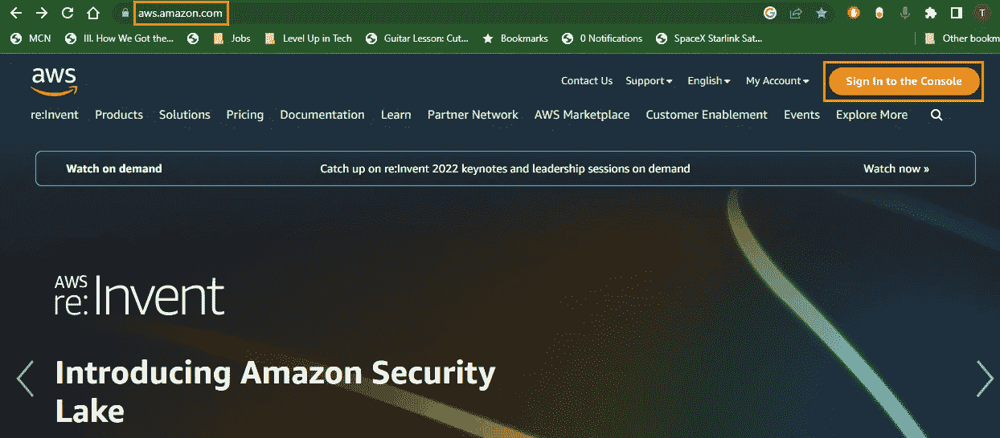

# 第二步:选择你的地区

由于我们将推出 EC2 实例，任何地区都可以。我建议选择离你最近的地区

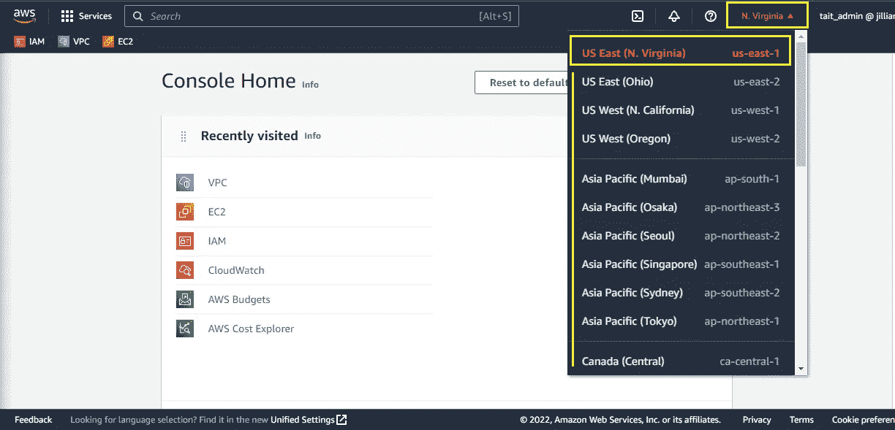

EC2 实例只存在于您构建它们的区域。如果切换区域，EC2 实例将只存在于创建它们的区域中

# 步骤 3:在搜索栏中搜索并选择 EC2

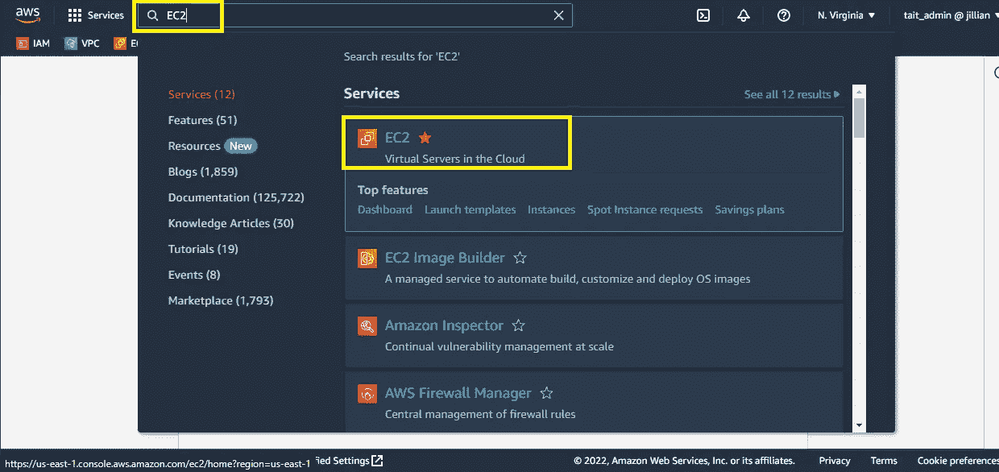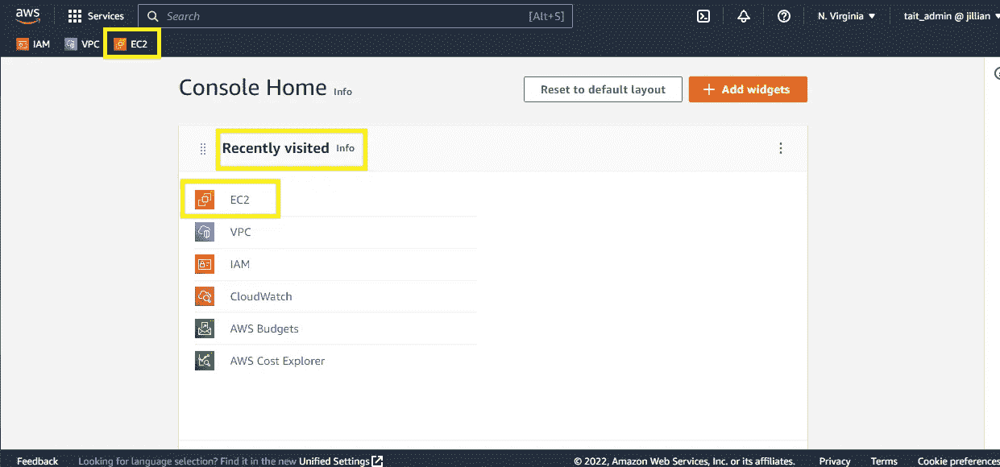

此外，EC2 可能位于您仪表板上的这些位置，如果您过去导航到该应用程序的话

单击橙色的“启动实例”按钮

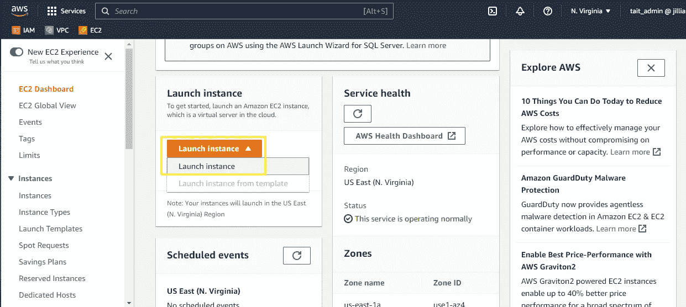

# 步骤 4:创建 EC2 实例并设置默认设置(第 1 部分)

当你听到 EC2 实例时，你会想到——我的企业的计算机资源在云中。它是您的本地服务器，但通过 AWS 进行了虚拟化。

通过将您的本地服务器迁移到云中，您可以利用 AWS 庞大的云网络和服务中更好的可访问性、灵活性、安全性、可扩展性、支持和共享计算资源。

命名您的实例。

由于我们公司的原生操作系统是 Ubuntu Linux，我们将选择 Ubuntu 作为我们服务器的操作系统。

在此阶段，您需要确定[您的业务需要](https://aws.amazon.com/ec2/instance-types/?trk=36c6da98-7b20-48fa-8225-4784bced9843&sc_channel=ps&s_kwcid=AL!4422!3!467723097967!p!!g!!amazon%20ec2&ef_id=Cj0KCQiA4uCcBhDdARIsAH5jyUkwqUCjfCp00rUSM1bze9zo3CeaLbOfOorfGr_VYXDh7OhpvdJKVMsaAt46EALw_wcB:G:s&s_kwcid=AL!4422!3!467723097967!p!!g!!amazon%20ec2)多少计算资源。

今天，我们将提供一个 t2.micro EC2 实例:

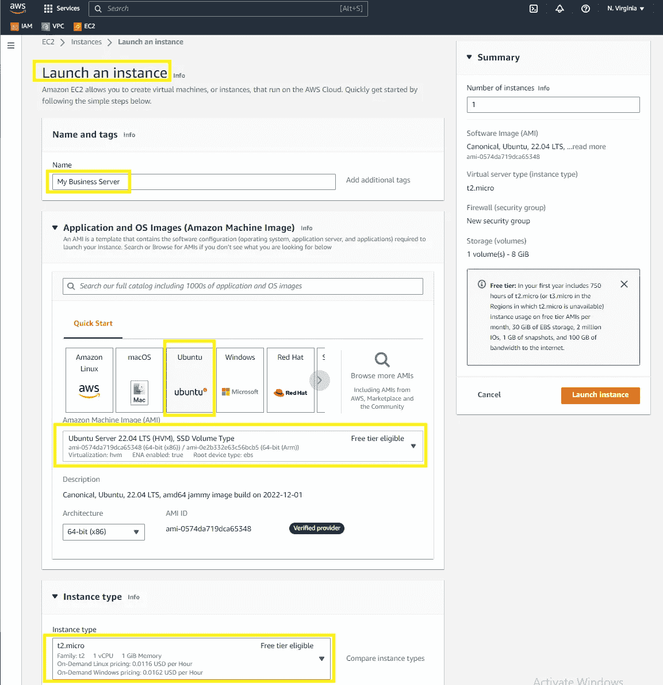

# 步骤 5:创建新的密钥对

AWS 中的密钥对用于保护您的服务器，并允许您远程登录到您的服务器。从技术上讲，您不需要创建密钥对，但是没有它，任何拥有您的 IP 信息的人都可以远程登录到您的服务器来访问您的数据(不好)。

现在让我们创建一个新的密钥对。单击“创建新的密钥对”链接:

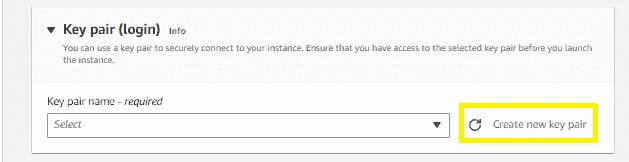

命名您的密钥对，并使用以下默认设置。单击“创建密钥对”

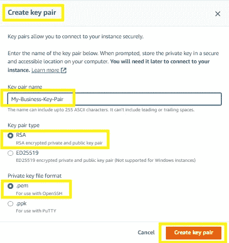

注意:您不能在密钥对名称中使用空格

当您单击“创建密钥对”时，a .pem vile 将下载到您的本地计算机:

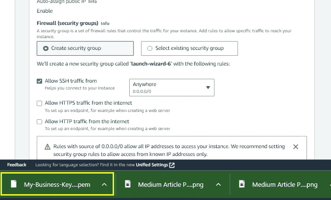

移动这个。pem 文件保存到您打算从中访问 AWS EC2 实例的工作目录中

如果您将通过 CLI 登录到您的服务器，AWS 将检查以确保这个键在您当前的工作目录中。如果该文件不是，当您尝试登录时，将会出现“身份验证错误”。

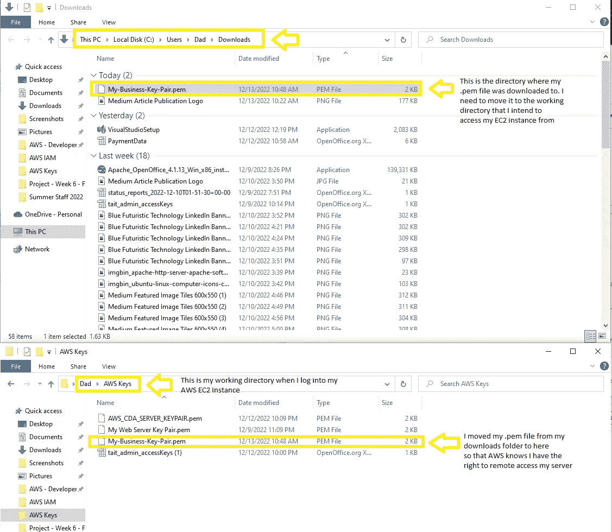

# 步骤 6:创建 EC2 实例并设置默认设置(第 2 部分)

出于我们的目的，我们将网络设置主要保留为默认设置:

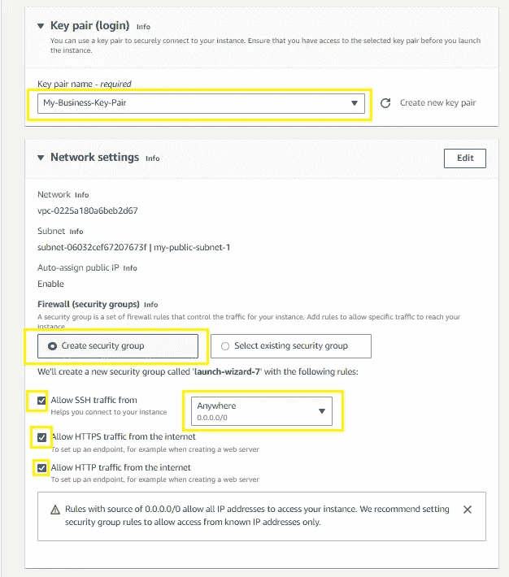

对于配置存储，我建议使用您的企业当前使用的存储量+20%来适应增长。如果以后需要，您可以随时添加更多存储空间。

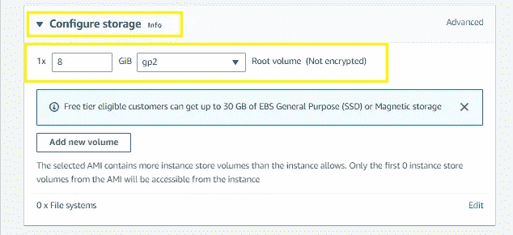

# 步骤 7:在高级详细菜单中创建脚本

出于我们的目的，我们将把这些高级设置中的大部分保留为默认值。但是，在该子菜单底部附近，我们将使用一个脚本来填充“用户数据”字段，该脚本将在实例启动时为我们自动执行几个过程:

*   更新我们的 Ubuntu 包
*   安装 Apache web 服务器
*   启动我们的 Apache web 服务器

如果你对这个脚本是如何工作的感到好奇，我邀请你阅读我以前写的一篇文章，我在这里详细解释了这个脚本[。](https://medium.com/@tait.hoglund/installing-a-web-server-in-4-simple-steps-ubuntu-18-04-apache-2-4-63a386fa6626)

我们将把脚本复制并粘贴到“用户数据”字段中:

```
#!/bin/bash
sudo apt update -y
sudo apt-get install apache2 -y
sudo service apache2 start
```

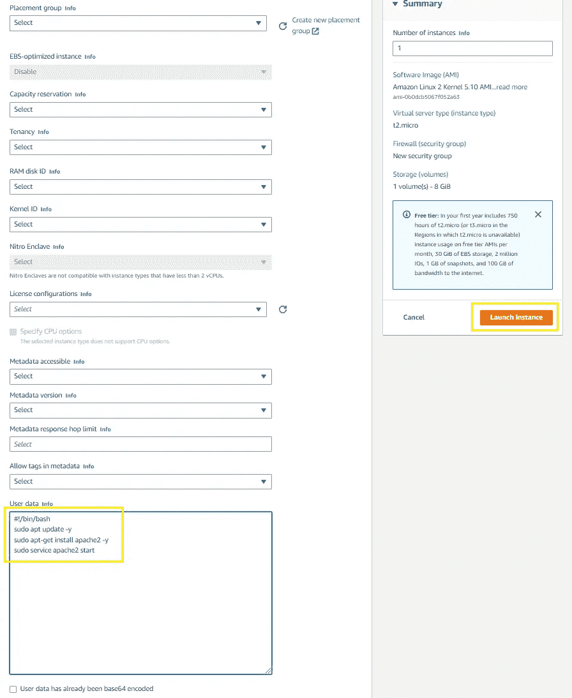

AWS 将向您发送一个类似如下的确认屏幕:

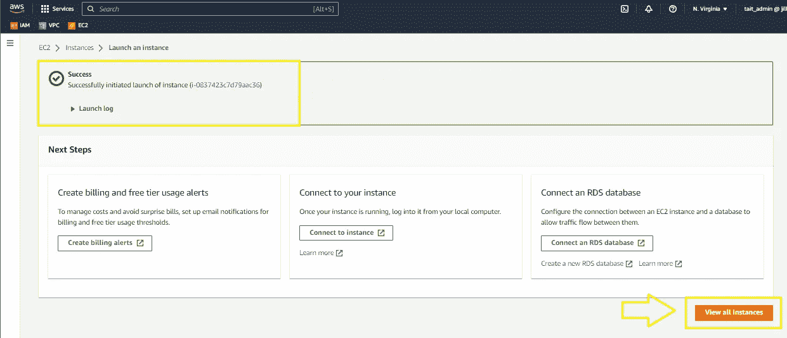

单击“查看所有实例”继续

# 步骤 8:更新安全组入站规则，使我们的服务器可用于 Internet

默认情况下，EC2 将限制对您的服务器的访问。如果您希望您的站点被公开访问，请确保更新安全组的入站规则

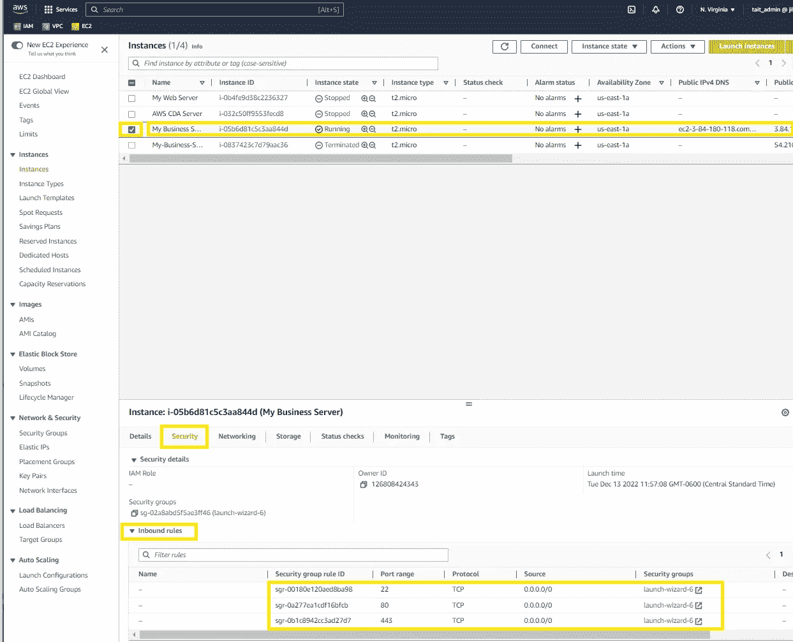

# 步骤 9:通过公共 IP 地址验证我们的实例

最后，我们可以将公共 IP 地址从我们的 EC2 实例仪表板复制到一个新的浏览器窗口中，以验证我们的 EC2 实例是否正确启动:

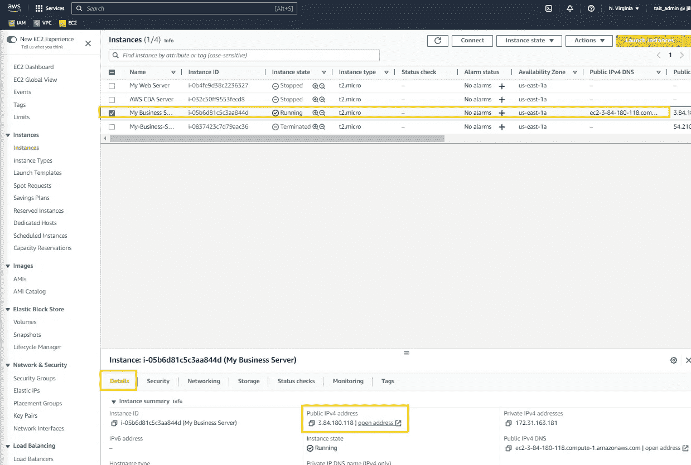

确保你的浏览器加载的是 http:// <ip_address>而不是 https://<ip_address. you="" might="" have="" to="" manually="" type="" it="" into="" your="" address="" bar="" since="" many="" browsers="" default="" https.=""></ip_address.></ip_address>

If we see the default Apache2 page, we know that our script ran correctly once the EC2 instance was provisioned.

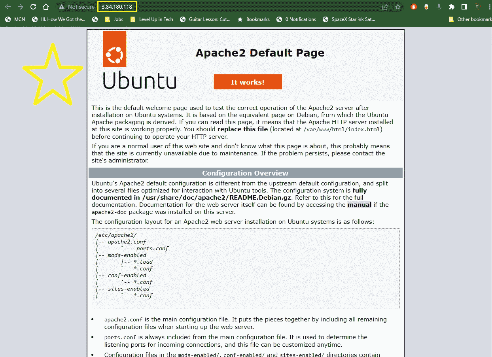

Gold star for you indeed cloud profession. :)

If you found this content helpful, I would appreciate a ‘follow’, a ‘clap’, or a comment.

If you enjoyed my writing in this article, you might enjoy these as well:

*   [为绝对初学者准备的 Bash 脚本基本自动化](https://medium.com/devops-dev/basic-automation-with-bash-scripts-for-absolute-beginners-d09d04d930f?source=your_stories_page-------------------------------------)
*   [使用 Git w/GitHub——分叉、克隆、推送、&拉取，实现有效协作](https://medium.com/dev-genius/all-things-github-forking-cloning-pushing-pulling-d253bc71f5cf?source=your_stories_page-------------------------------------)

直到下一次:前进！