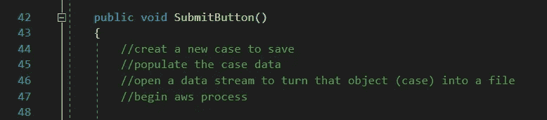
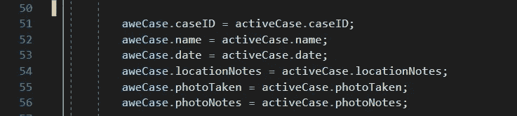
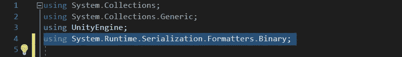
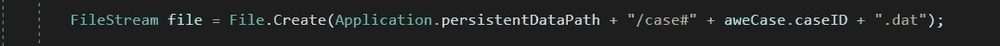

# 用 Unity 保存数据第 1 部分！

> 原文：<https://blog.devgenius.io/saving-data-with-unity-part-1-4bf0c35dbb1e?source=collection_archive---------13----------------------->

目的:将病例信息保存为 Dat 文件！

我们将把案例的对象转换成数据文件。首先，我们需要创建在 UIManager 中保存这些信息的能力。当我们点击提交按钮时，UIManager 将负责上传这些信息。

创建新案例

将所有 awsCase 属性设置为 activeCase

我们用活动案例数据填充新案例，然后将 awecase 转换成文件并存储在云中。

下一步是打开数据流，这是通过使用二进制格式化程序完成的。二进制格式化程序将允许我们把这个案例转换成文本文件。我们之所以能做到这一点，是因为[系统。可序列化】。这允许你把它转换成一堆字节，并存储到一个数据文件中。

二进制格式化程序需要使用 System 命名空间。' runtime . serialization . formatters . binary；'

这就开放了序列化数据的能力。

我们在这里创建一个新的数据流。一旦我们有了它，我们需要创建一个文件来保存它。为此，我们需要打开我们的文件流。这需要使用系统命名空间。木卫一；'

这相当于创建一个文件的能力以及我们将它保存在哪里。在 Unity 中，我们得到了一个叫做持久数据路径的东西，在那里我们可以访问保存的关于我们应用程序的信息。

我们将选择“应用程序”。“持久数据路径”这是 Unity 提供给我们的东西，它建议我们保存游戏文件等信息。

然后我们将向它追加一个字符串。

这将创建一个名为 caseID 的文件

一旦我们有了那个文件位置和附加的文件，我们需要写入那个文件。

为此，我们访问二进制格式化程序，并键入 Serialize()

当我们序列化时，我们传入一个要序列化的流，然后传入一个对象。我们将传递要保存的文件。那么我们需要一个对象。什么对象？awsCase

一旦我们序列化，我们要确保我们关闭文件。

为提交按钮设置一个点击事件，以调用我们创建的提交按钮方法。

我们需要指定这样追加的文件类型”。dat "文件。

暂时就这样了。在下一部分中，我们将讨论纹理的序列化。下期教程再见！