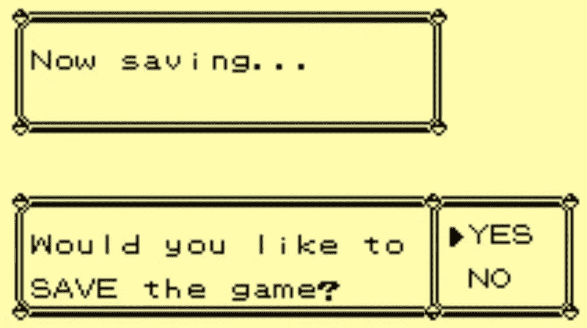
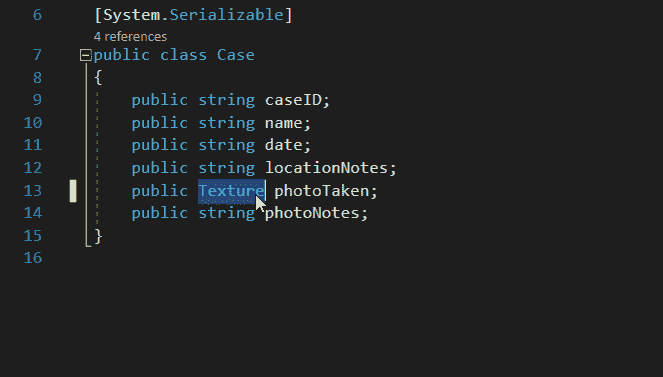
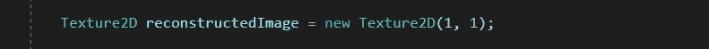
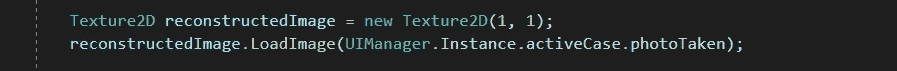
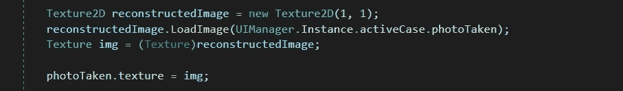
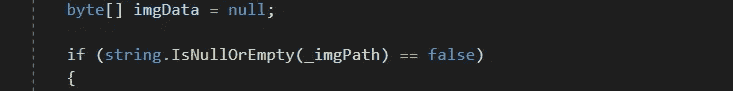
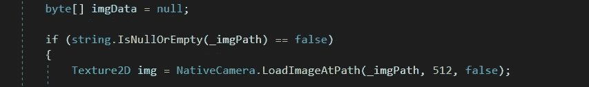
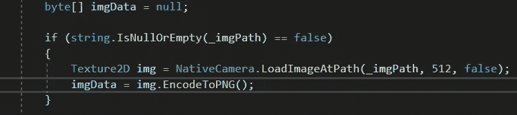
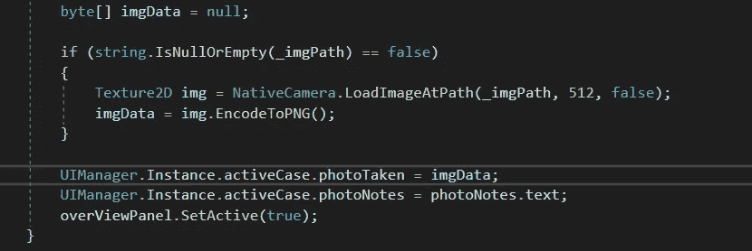

# 用 Unity 保存数据第 2 部分！

> 原文：<https://blog.devgenius.io/saving-data-with-unity-part-2-c0c22ba13064?source=collection_archive---------11----------------------->

目标:序列化一个纹理！

本教程将集中在序列化一个纹理。由于程序的原因，纹理没有被标记为可序列化。基本上，我们需要将图像转换为数据字节，然后我们可以存储这些数据字节，并从这些字节中重建图像。

我们需要折射我们的程序。该案例将不再存储纹理。它将存储 photoTaker 的一个字节数组。

这给了我们两个需要更新的东西。首先，在总览面板中，我们需要重建照片并显示它。第二个是在拍照面板。我们将稍微倒退一下。我们将从概览面板开始，在这里我们将把照片从字节数组转换成纹理。

为此，有一种称为图像转换的辅助方法。这将允许我们通过字节数组加载图像，然后我们可以将它应用到纹理。

大小(1，1)并不重要，它将被我们应用到纹理的任何东西所取代。

现在我们需要将字节转换成 PNG。

随着图像加载到 out Texture2D，我们可以将其转换回纹理，并将其应用到照片纹理。

现在，我们可以在拍照面板上将照片转换为字节数组。我们需要找到那张照片的位置。看看在拍照方法中会发生什么。

我们需要将这个图像路径放入内部，并在 process info 方法中重新加载它。我们想检查图像路径是否为空。

现在，在 null 检查之后复制图像路径。

随着纹理设置为 2D 纹理，我们现在可以编码为 PNG，这将返回一个字节数组。

从那里，我们可以将图像数据分配给活动案例的字节数组。

这应该对过程的编码方面有所帮助。在下一个教程中，我们将设置提交按钮并定位物理保存文件。下期教程再见！