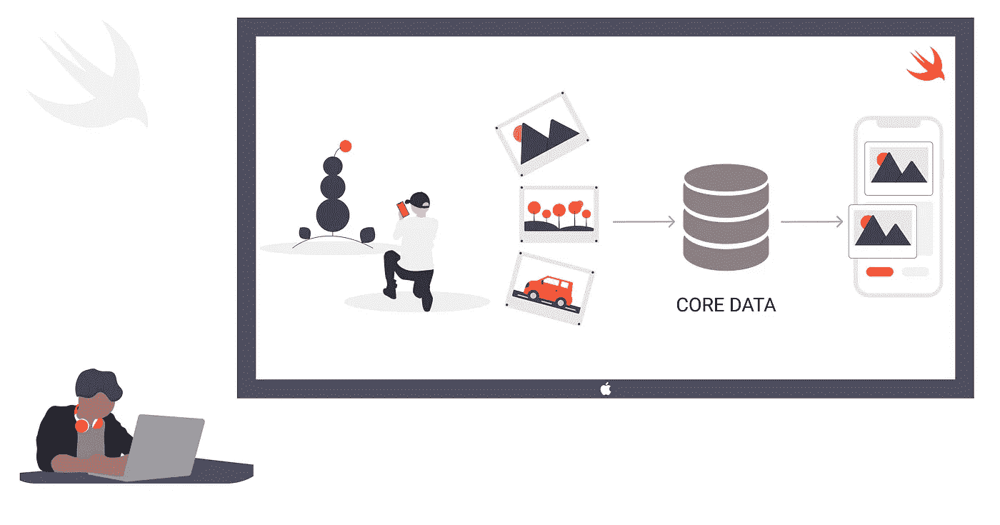
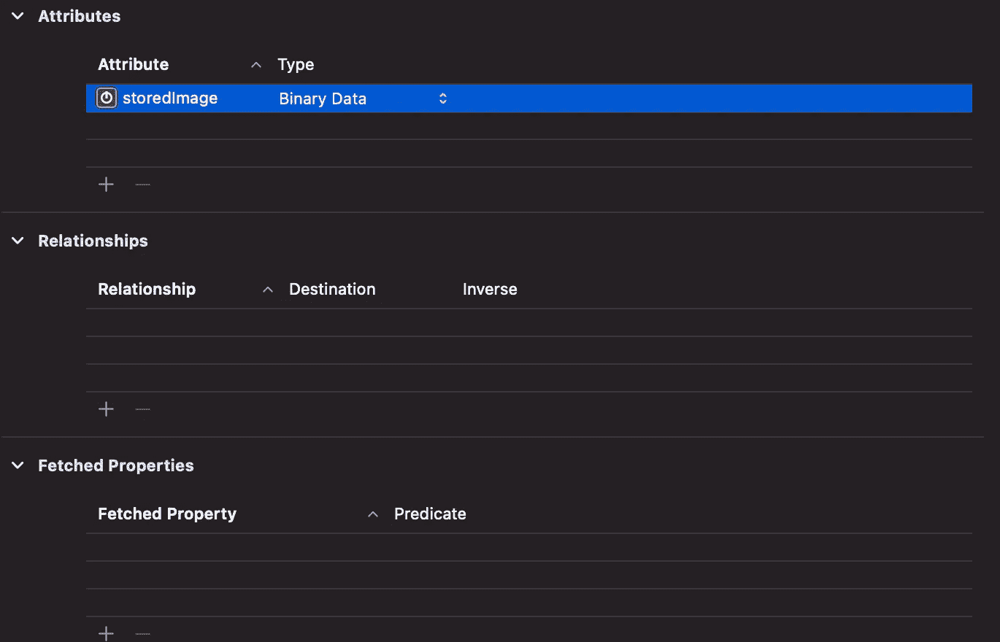

# 在 CoreData 中保存图像

> 原文：<https://blog.devgenius.io/saving-images-in-coredata-8739690d0520?source=collection_archive---------0----------------------->

## 你自己的照片库



## **可以在核心数据中存储 UIImage 吗？**

是的，我们可以用核心数据存储图像，但不能直接存储为 UIImage。这可以通过将 UIImage 转换为数据来实现。因为 UIImage 在核心数据中不是有效的属性类型。

如果你是核心数据的新手，想从基础开始学习，那么参考这篇 [**帖子**](https://tonywillson.medium.com/core-date-in-swift-basics-ededf37574b0) 。在此仅讨论将图像保存到核心数据中。

> 核心数据中用来存储图像的属性类型是**二进制数据**。所以在你的模型中声明属性类型为二进制数据。



1.  **要将图像转换成可移植的数据格式，如 png 或 jpeg，使用下面的代码:**

2.**将图像保存在核心数据中**

3.**要从核心数据中获取保存的图像，使用以下代码**

4.**将图像数据转换为 UIImage 显示给用户**

我确信你们每个人都可能成功地完成了这一过程。但是很少有人会失败，原因是他们将在核心数据中存储一组图像。

> 所以你可能会问我，有没有可能把我的图像数组存储在核心数据里？。我会说是的，肯定可以，而且要遵循的步骤也会和上面那个一样。哎呀！！不完全相同的一个，几个更多的秘密被添加到它的工作。

例如，考虑这个图像阵列

*   let myImages = ["车"，"笔"，"相机"，"包"]

1.  **要将这个图像数组存储到核心数据中，首先将每个图像转换成数据，存储在一个数组中。**

2.**将图像数组保存到核心数据**

3.**从岩心数据中提取图像数组**

4.**将 imageData 的数组转换为 UIImage，如**

> nskeydarchiver 是一个序列化(转换)数据的类，非常类似于 JSONEncoder。
> 
> *nskeydunarchiver*是一个反序列化(重新转换)数据的类，非常类似于 JSONDecoder。

这两个函数在核心数据中存储任何类型的数据数组时起着重要的作用。

T **ips:** 有一种方法可以查看你存储的图片，只需在你的控制台中使用下面的代码。

```
po NSSearchPathForDirectoriesInDomains(.documentDirectory, .userDomainMask, true)
```

> 这将引导您到达核心数据模型的 SQLite 文件的目的地。使用工具***DBBrowser for Sqlite***您可以查看您存储的图像和其他数据。我提到的工具就是一个例子，互联网上有大量的工具。你可以用你觉得舒服的。

这很有趣，伙计们，试试这个，如果有任何疑问和建议，请通过 [**Twitter**](https://twitter.com/Sridharan_tsd) 联系我。

[](https://www.linkedin.com/in/sridharan-t-6b51b2143/) [## Sridharan T - iOS 开发者- Ivy Mobility | LinkedIn

www.linkedin.com](https://www.linkedin.com/in/sridharan-t-6b51b2143/)