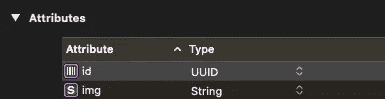
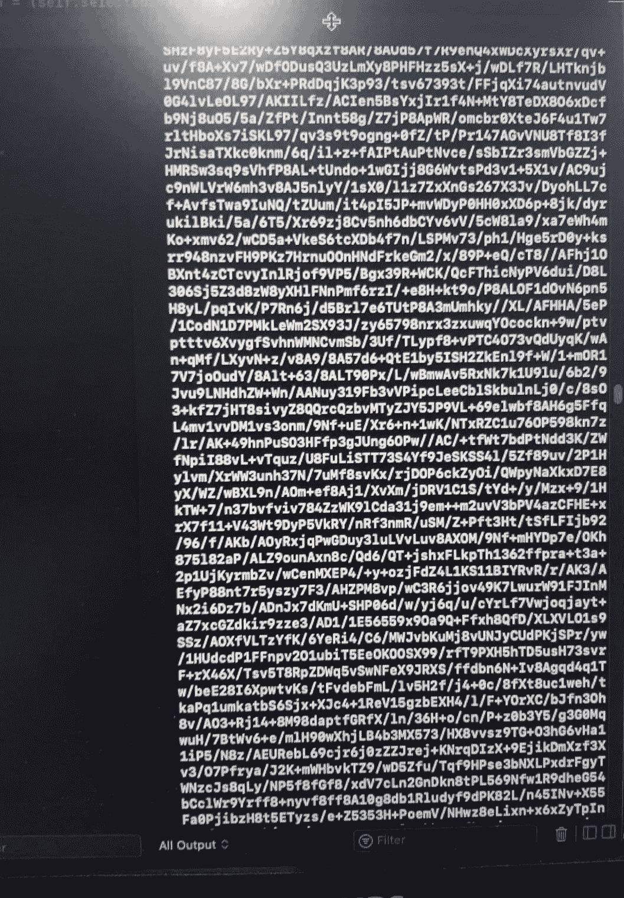

# 使用 Swift 将图像保存到核心数据

> 原文：<https://blog.devgenius.io/saving-images-to-core-data-with-swift-d0802b1413ee?source=collection_archive---------3----------------------->

嗨，我想告诉你我是如何解决这个问题的。

但是，如果你的应用程序包含太多的图像，这种解决方案可能会导致问题！

我做了一个应用程序，从用户那里获取图片。我必须存储这些图像，但是在哪里以及如何存储呢？为了保存信息，我使用了核心数据。我想我可以使用核心数据来保存图像。但是当我试图将图像保存到核心数据时，我发现它不受支持。在这之后，我搜索了互联网，我没有找到 swiftui 和 swift 5 的正确解决方案。所以我想出了我的解决方案。我的解决方案是将图像转换成字符串。

通过这行代码，我将图像转换为字符串。我把它们存在核心数据里了。这些是我的实体属性:

核心日期实体属性

这是图像转换为字符串时的样子:

图像作为字符串

用这一行代码，我将字符串转换成图像，并加载到屏幕上。

谢谢你的时间。

如果你有兴趣，你可以在查看我的应用。