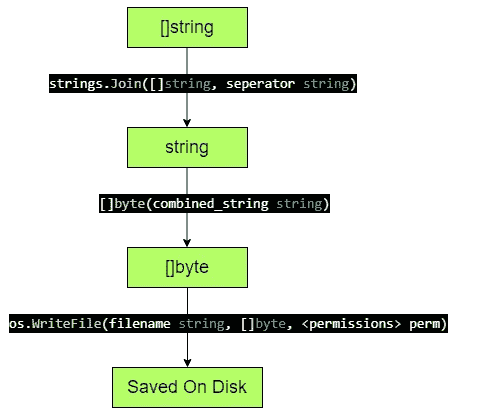

# 使用 Go 将切片数据保存为本地磁盘上的文件

> 原文：<https://blog.devgenius.io/saving-slice-data-as-file-on-local-disk-using-go-19360574d2d5?source=collection_archive---------14----------------------->

## 我们将使用操作系统包的 WriteFile()将数据保存为本地磁盘上的文件

**文章范围:**

*   操作系统包的 WriteFile()将切片数据保存在本地磁盘上
*   可以扩展到所有数据类型的切片的通用算法


图来自 unsplash

**简介:**

Slice 是一种类似可变长度数组的轻量级数据结构，用于存储一系列相似类型的数据元素。我们将使用操作系统包将数据保存在本地磁盘的切片中。

**概念:**

软件包 os 支持操作系统功能的独立于平台的接口。WriteFile 函数将数据写入一个命名文件。必要时，WriteFile 会创建命名文件，并向其中写入数据。但是，WriteFile 需要字节片格式的数据。

因此，如果数据是字符串切片形式，我们将连接存储到字符串切片的字符串，然后将连接的字符串转换为字节切片。最后，我们将把这个字节片数据发送给 WriteFile 函数。

如果您有一个其他数据类型的切片，比如 int64 silce 或 float32 切片，我们可以使用 for 循环将该数据转换为 string 切片，并从那里插入上面讨论的算法。

*算法:*



图:使用操作系统包应遵循的步骤(使用 apps.diagram.net 制作的图片)

**代码:**

该算法已编码如下

```
package mainimport (
 "fmt"
 "os"
 "strings"
)func main() { quotes_data := []string{"Spread love everywhere you go. Let no  one ever come to you without leaving happier. -Mother Teresa ", "Tell me and I forget. Teach me and I remember. Involve me and I learn. -Benjamin Franklin", "You must be the change you wish to see in the world. -Mahatma Gandhi", "The opposite of love is not hate; it’s indifference. -Elie Wiesel"} combined_string := strings.Join([]string(quotes_data), "; \n")
     bs1 := []byte(combined_string)
     err := os.WriteFile("quotes_repo.txt", bs1, 0666)
     if err != nil {
         fmt.Println("Error : ", err)
     } bs2, err := os.ReadFile("quotes_repo.txt")
     if err != nil {
         fmt.Println("Error : ", err)
     }
     file_datas := strings.Split(string(bs2), ";")
     fmt.Println(file_datas)
}
```

*输出:*

```
[Spread love everywhere you go. Let no one ever come to you without leaving happier. -Mother TeresaTell me and I forget. Teach me and I remember. Involve me and I learn. -Benjamin FranklinYou must be the change you wish to see in the world. -Mahatma GandhiThe opposite of love is not hate  it’s indifference. -Elie Wiesel]
```

*理解代码和输出:*

输出与输入匹配，输出格式良好，因为当我们连接字符串时，我们添加了“\n”新行命令，以提高存储在本地磁盘上的文件的可读性。

**读者部分**

请在评论区给出你的想法，告诉我们如何将这个概念变成一个项目。