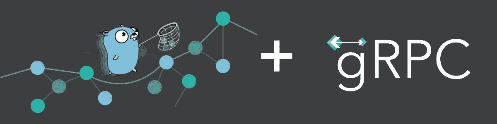

# 使用 Go (Golang)为生产搭建 gRPC 服务

> 原文：<https://blog.devgenius.io/scaffolding-a-grpc-service-with-go-golang-for-production-9de91f6198b0?source=collection_archive---------2----------------------->



gRPC 是 google 的高性能 RPC 框架。在 gRPC 出现之前，使用远程过程调用(RPC)一直是一个令人头疼的问题。Google 为开发者和工程师提供了多语言代码生成支持。今天，我们将了解微服务和服务对服务通信协议的现代事实标准——gRPC。

本文不打算介绍 protobuf 和 go 包的安装。它们非常简单，您可以在— [快速入门](https://grpc.io/docs/languages/go/quickstart/)中轻松找到。

# 入门指南

在这篇文章中，我们将创建一个基本的几何服务，它将返回给我们一个形状的几何属性，例如，圆形，矩形等。我非常喜欢项目结构。这有助于我了解我要做什么，以及在解决任何 bug/问题时，我应该去哪里寻找。所以，我将从我们项目的文件夹结构开始-

```
**.**
├── **cmd**
│   ├── **client**
│   └── **server**
├── **internal**
├── **proto**
└── go.mod
```

获取源代码并跟随…

[](https://github.com/by-sabbir/grpc-service-example) [## GitHub-by-sab Bir/grpc-service-示例

### 此时您不能执行该操作。您已使用另一个标签页或窗口登录。您已在另一个选项卡中注销，或者…

github.com](https://github.com/by-sabbir/grpc-service-example) 

# 原型文件

几乎每个 go 项目都会有一个`cmd`文件夹。根据项目要求，可包含`cli`、`server`、`client`。内部将包含工厂、存储库和服务。现在我们准备定义服务器和客户机之间的契约，也就是原型。在名为 geometry.proto 的 proto 目录下创建一个新文件，并粘贴以下内容

这三行代码是设置。第一行表示我们用来定义原型的版本。第二行是包名，我们可以在这里发挥创意。第三行是特定于 go 的选项，这是 go.mod 中的模块名和 proto 目录的相对路径的组合。

# 在 Proto 中定义服务

现在，我们准备声明服务和请求/响应契约——gRPC 通过建立一个预定义的消息结构来确保通信，这样服务器和客户机就不会混淆消息结构。对于初学者来说，这可能听起来没有必要，但是在我的软件开发经验中，这是最令人沮丧的一点。gRPC 从一开始就解决了这个问题。RPC 服务有三个部分，

1.  服务
2.  请求消息
3.  响应信息

在 Proto point 中，2 和 3 是消息结构的一部分，服务是服务结构，非常简单。让我们编写代码—扩展 geometry.proto 文件并添加以下代码行

原型本身是自我描述的，我们有一个具有两个功能的 GeometryService 面积和周长。这两个 RPC 函数都接受一个请求对象并发出一个响应。通常，请求和响应消息使用相同的前缀命名，例如，如果我们有一个名为 Greet 的服务，我们将有一个 GreetRequest 和一个 GreetResponse (Greet as prefix)。但是我们的服务是一个破例的完美例子。

# 使用协议生成代码

一开始，我们吹嘘 gRPC 是多语言的，在这一节中，我们将看到它的实际应用。我们将使用 protocol 生成一些 go 代码。请注意，我们必须为它需要 go 插件，检查您是否已经在 [Go 快速入门](https://grpc.io/docs/languages/go/quickstart/)安装了它们。

基本命令如下-

```
❯ protoc --go_out=. --go-grpc_out=. proto/*.proto
```

这将生成如下的 go 接口代码。

```
├── **github.com**
    └── **by-sabbir**
        └── **grpc-service-example**
            └── **proto**
                ├── geometry_grpc.pb.go
                └── geometry.pb.go
```

哦！现在我们看到了模式，对吗？这是我们在 geometry.proto 文件的第三行中分配给 go_package 的文件夹结构…相似之处是不可思议的(双关语)。但是我们在这里不需要它们，我们在 proto 目录中需要它们。如果你在考虑换 go_package，你没有错。但是有一个更好的方法。protoc CLI 工具允许我们为生成的代码分配模块和导入路径。让我们更新命令

```
❯ protoc -Iproto/ --go_out=. --go_opt=module=github.com/by-sabbir/grpc-service-example --go-grpc_out=. --go-grpc_opt=module=github.com/by-sabbir/grpc-service-example proto/*.proto
```

如果我没有错的话，你一定在想谁还记得那个巨大的命令！让我来给你解释一下。但在实践中，您总是会使用 Makefile 或等效文件来为您生成代码。所以简洁的命令应该是这样的

```
❯ protoc -I<proto path> --go_out=. --go_opt=module=<go module> --go-grpc_out=. --go-grpc_opt=module=<go module> proto/*.proto
```

对于每个 _out，我们将拥有 _opt=module=和来自 go.mod 文件的模块名。我们可以删除 github.com 文件夹，因为我们在 proto 目录中有生成的代码。

# 实施 gRPC 服务器

我们已经走了很长一段路，让我们在 cmd/server 目录下创建一个新文件，并将其命名为 main。并运行以下命令来获取依赖项-

`❯ go mod tidy`

先从 [GitHub](https://github.com/by-sabbir/grpc-service-example/blob/101e32aa9dafe5b8ab1f87f981180a2ce9b554ce/cmd/server/main.go) 的 cmd/server/main.go 和 [GitHub](https://github.com/by-sabbir/grpc-service-example/blob/2db6ce263ca164dac31162d869585b774aeeb4e9/cmd/client/main.go) 的 cmd/client/main.go 中复制以下代码。

此时，我们已经准备好测试我们的应用程序，

`❯ go run cmd/server/main.go`

输出应该如下所示-

```
2022/09/26 16:18:17 tcp listener started at port:  5000
2022/09/26 16:18:21 invoked Area:  height:10.1  width:20.5
2022/09/26 16:18:21 invoked Perimeter:  height:10.1  width:20.5
```

如果存在状态代码为 1 的代码，您应该在 server/main.go 的第 16 行更改端口，否则运行客户端:

`❯ go run cmd/client/main.go`

如果输出如下所示，我们就可以进入下一步了

```
Area:  207.05
Perimeter:  61.2
```

使用客户端代码中的一些值进行测试。

# 为生产重构服务器

在 Go 中，通常的做法是从单个文件开始，然后重构为最佳实践。目前，我们有一个没有分离问题的整体服务器。我们开始这个项目时考虑到了增长因素，我们有一个名为 internal 的未动过的文件夹。让我们创建一个文件夹 geometry 和一个文件 geometry.go，因此路径看起来像 internal/geometry/geometry.go。这将是我们的几何服务工厂。让我们看看 geometry.go 文件

商店接口将充当存储库。如果我们需要扩展项目并将其与数据库集成，我们可以在内部目录中创建一个新的文件夹 db，只需实现 Store 接口。现在我们的 cmd/server/main.go 文件应该如下所示，

正如我们现在看到的，服务器不再承担区域和外围功能。这只是一个简单的 gRPC 服务器实现，关注点是分离的。

# 丰富

*   为原型目录维护一个单独的存储库
*   版本的原型文件，即，原型/v1