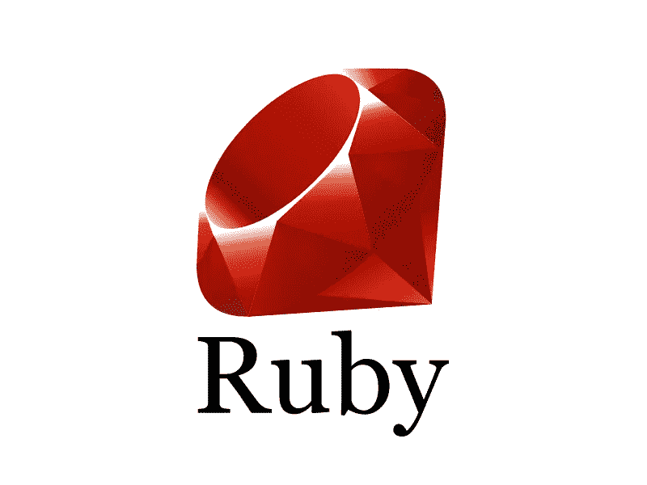
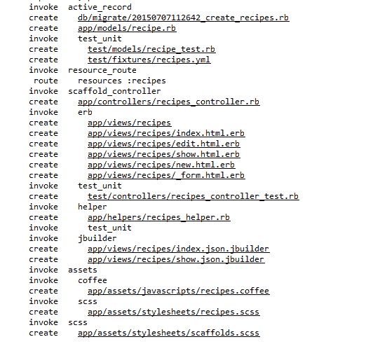
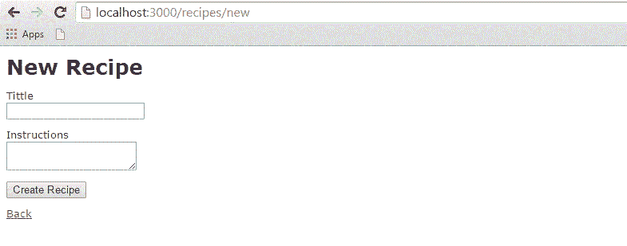
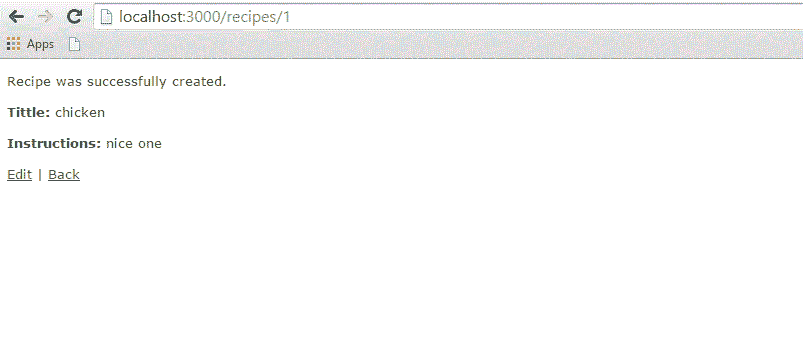

# Ruby on Rails 脚手架

> 原文：<https://blog.devgenius.io/scaffolding-in-ruby-on-rails-64d2acbf4a95?source=collection_archive---------19----------------------->



当您开发 Rails 应用程序时，尤其是那些主要为您提供数据库中数据的简单接口的应用程序，使用 scaffold 方法通常很有用。

脚手架提供的不仅仅是廉价的演示体验。以下是一些好处:

您可以快速将代码呈现在用户面前以获得反馈；

通过查看生成的代码，您可以了解 Rails 是如何工作的；

您可以使用脚手架作为开始开发的基础。

**脚手架示例**

为了理解搭建，让我们创建一个名为 cookbook 的数据库和一个名为 recipes 的表。

**创建一个空白的 Rails web 应用**

打开命令窗口，转到您想要创建这个 cookbook web 应用程序的位置。因此，运行以下命令来创建一个完整的目录结构。

```
tp> rails new cookbook
```

配置数据库

这里有一种创建数据库的方法:

```
mysql> create database cookbook;
Query OK, 1 row affected (0.01 sec)

mysql> grant all privileges on cookbook.*
to 'root'@'localhost' identified by 'password';
Query OK, 0 rows affected (0.00 sec)

mysql> FLUSH PRIVILEGES;
Query OK, 0 rows affected (0.00 sec)
```

要告诉 Rails 如何找到数据库，请编辑 cookbook \ config \ database.yml 配置文件，并将数据库名称更改为 cookbook。将密码留空。完成后，应该是这样的:

```
development:
   adapter: mysql
   database: cookbook
   username: root
   password: [password]
   host: localhost

test:
   adapter: mysql
   database: cookbook
   username: root
   password: [password]
   host: localhost

production:
   adapter: mysql
   database: cookbook
   username: root
   password: [password]
   host: localhost
```

Rails 允许您使用不同的数据库在开发、测试或生产模式下工作。这个应用程序对每一个都使用相同的数据库。

**生成脚手架代码**

使用 scaffold Rails action 可以动态生成我们需要的所有代码。通过将 scaffold 作为脚本运行，我们可以将所有代码写到磁盘上，在磁盘上我们可以检查它，然后开始使它适应我们的需求。

因此，现在让我们使用 scaffold helper 脚本再次开始手动生成 scaffold 代码:

```
cookbook> rails generate scaffold recipe
```

它生成如下所示的自动文件。



控制器

让我们看看控制器背后的代码。这段代码是由脚手架生成器生成的。如果您打开 app/controllers/recipes _ controller . Rb，您会发现以下内容:

```
class RecipesController < ApplicationController
   before_action :set_recipe, only: [:show, :edit, :update, :destroy]

   # GET /recipes
   # GET /recipes.json
   def index
      @recipes = Recipe.all
   end

   # GET /recipes/1
   # GET /recipes/1.json
   def show
   end

   # GET /recipes/new
   def new
      @recipe = Recipe.new
   end

   # GET /recipes/1/edit
   def edit
   end

   # POST /recipes
   # POST /recipes.json
   def create
      @recipe = Recipe.new(recipe_params)

      respond_to do |format|
         if @recipe.save
            format.html { redirect_to @recipe, notice: 'Recipe was successfully created.' }
            format.json { render :show, status: :created, location: @recipe }
         else
            format.html { render :new }
            format.json { render json: @recipe.errors, status: :unprocessable_entity }
         end
      end

   end

   # PATCH/PUT /recipes/1
   # PATCH/PUT /recipes/1.json
   def update
      respond_to do |format|
         if @recipe.update(recipe_params)
            format.html { redirect_to @recipe, notice: 'Recipe was successfully updated.' }
            format.json { render :show, status: :ok, location: @recipe }
         else
            format.html { render :edit }
            format.json { render json: @recipe.errors, status: :unprocessable_entity }
         end
      end

   end

   # DELETE /recipes/1
   # DELETE /recipes/1.json
   def destroy
      @recipe.destroy
         respond_to do |format|
         format.html { redirect_to recipes_url, notice: 'Recipe was successfully destroyed.' }
         format.json { head :no_content }
      end
   end

   private

   # Use callbacks to share common setup or constraints between actions.
   def set_recipe
      @recipe = Recipe.find(params[:id])
   end

   # Never trust parameters from the scary internet, only allow the white list through.
   def recipe_params
      params.require(:recipe).permit(:tittle, :instructions)
   end
end
```

当 Rails 应用程序的用户选择一个动作时，比如“show”，控制器将执行适当部分中的任何代码——“def show”——然后显示一个默认同名的模板——“show . html”。欧洲电台。"此默认行为可以被覆盖。

控制器使用 ActiveRecord 方法，如 find、find_all、new、save、update_attributes 和 destroy，将数据移入和移出数据库表。请注意，您不需要编写任何 SQL 语句，rails 会自动完成这项工作。

这一行代码将赋予数据库表生命。它将为您的数据和方法提供一个简单的接口:

创造新的记录；

编辑当前记录；

查看当前记录；

销毁现有记录。

创建或编辑记录时，scaffold 将为您完成所有繁重的工作，例如生成和处理表单，甚至通过支持以下类型的输入数据来提供智能表单生成:

简单的文本字符串；

文本区域(或大块文本)；

日期选择器；

日期和时间选择器。

您可以使用 Rails 迁移来创建和维护表。

```
rake db:migrate RAILS_ENV=development
```

现在转到 cookbook 目录，使用以下命令启动 web 服务器:

```
cookbook> rails server
```

现在打开浏览器，进入[http://127 . 0 . 0 . 1:3000/recipe/new](http://127.0.0.1:3000/recipe/new)。这将为您提供一个在处方表中创建新条目的屏幕。截图如下。



点击“创建”按钮创建新配方后，您的输入将被添加到配方表中，并显示以下结果:



您可以看到编辑、显示和销毁记录的能力。所以，试试这些选项。

您也可以使用 URL[http://127 . 0 . 0 . 1:3000/recipe/list](http://127.0.0.1:3000/recipe/list)列出配方表中所有可用的配方。

**改进模型**

Rails 免费为您提供了许多错误处理。为了理解这一点，向空配方模型添加一些验证规则。

如下修改 app / models / recipe.rb，然后测试您的应用程序:

```
class Recipe < ActiveRecord::Base
   validates_length_of :title, :within => 1..20
   validates_uniqueness_of :title, :message => "already exists"
end
```

这些条目将给出自动验证:

validates _ length _ of 字段不为空或过长。

validates _ uniqueness _ of 截取重复值。我们在这里给出了自己的消息，而不是默认的 Rails 错误消息。

validates _ length _ of 该字段既不为空也不太长。

validates _ uniqueness _ of 截取重复值。我们在这里给出了自己的消息，而不是默认的 Rails 错误消息。

**搭建脚手架的另一种方式**

创建如上所示的应用程序和如下所示的生成的支架代码。

```
rails g scaffold Recipe tittle:string instructions:text
```

上面的代码使用 sqlite3 生成自动数据库文件，带有一个标题和一个说明列，如下图所示。


我们需要使用下面的语法来迁移数据库。

```
$ rake db:migrate RAILS_ENV=development
```

最后，使用以下命令行运行应用程序:

```
rails server
```

所有视图及其相应的控制器方法都是由 scaffold 命令创建的，可以在 app / views / recipes 目录中找到。

**脚手架是做什么的？**

如果你已经阅读了前面的章节，那么你已经看到我们已经创建了显示、显示、删除和创建数据等方法。等等。，但是 scaffolding 会自动完成这项工作。