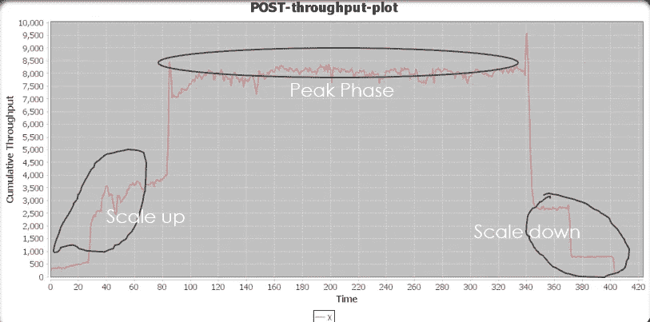
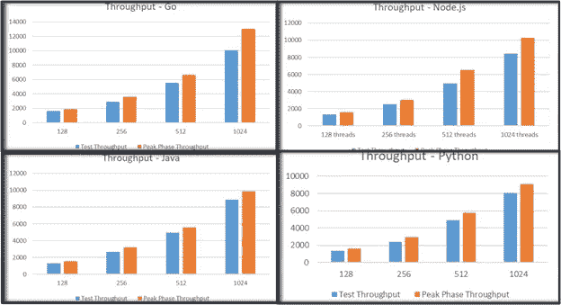
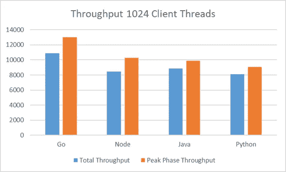
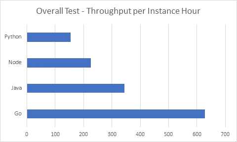

# 基于云的软件系统的可扩展性和成本分析(上)

> 原文：<https://blog.devgenius.io/scalability-and-cost-analysis-for-cloud-based-software-systems-part-1-472012435b26?source=collection_archive---------1----------------------->

马文·迈耶在 [Unsplash](https://unsplash.com?utm_source=medium&utm_medium=referral) 上的照片

大型组织 IT 系统从内部部署到公共云平台部署的转变似乎势不可挡。下面是来自[最近调查](https://hostingtribunal.com/blog/cloud-adoption-statistics/)的一些关于云采用的数字:

*   94%的企业已经在使用云服务
*   所有 IT 预算的 30%分配给云计算
*   66%的企业已经拥有中央云团队或云卓越中心
*   到 2020 年，83%的企业工作负载将位于云中

单个市场的调查和分析在很大程度上应被视为幻想，但当所有指标都指向同一个方向时，他们的发现就必须有一定的可信度。

从全球范围来看，这些数字令人震惊。难怪云提供商能赚这么多钱——事实上，预计 2020 年将达到 2660 亿美元。从初创公司到政府机构再到跨国公司，各种组织都将云视为数字化转型平台和改善业务连续性的基础技术。

云平台的两大吸引力在于其*现收现付*计费和快速扩展(和缩减)以满足不断变化的工作负载和数据量的能力。这种扩展能力当然不是免费的。您的应用需要经过[架构设计，以利用云平台提供的可扩展](https://medium.com/@i.gorton/six-rules-of-thumb-for-scaling-software-architectures-a831960414f9)服务。当然，[成本和规模有着不可分割的联系](https://medium.com/@i.gorton/building-scalable-distributed-systems-part-1-introduction-to-scalable-systems-9ca471fd77d7) —长期使用的资源越多，月底的云账单就越大。

这些每月的云账单可能会很大。非常大。更糟糕的是，出乎意料的大！大量云超支的“价格休克”案例屡见不鲜— [在一项调查中](https://www.prnewswire.com/news-releases/survey-enterprises-overspending-by-millions-on-cloud-bills-300968100.html) 69%的受访者经常在云预算上超支 25%以上。[一个众所周知的案例在 Azure](https://www.infotech.com/software-reviews/research/unexpected-cloud-costs-are-rocking-the-enterprise) 任务上花费了 50 万美元才被注意到。导致超支的原因有很多，包括没有部署自动扩展解决方案、长期容量规划不佳，以及未充分利用云架构导致系统占用空间达不到最优。

# 成本和规模不可分割地联系在一起

正如我在[之前的文章](https://medium.com/@i.gorton/six-rules-of-thumb-for-scaling-software-architectures-a831960414f9)中所讨论的，在云平台上扩展系统会增加成本。这是必然的。然而，确切的“多少”是你作为一个建筑师可以通过一系列的架构决策来控制的。

术语“软件架构”有太多的定义，因此其使用范围比最初预期的要广得多。一般来说，一个很好的经验法则是，被整合到系统中的设计决策是架构性的，因此很难(也很昂贵)改变。这些设计决策对系统的构建方式和部署后的非功能特性都有影响。因此，用迈克尔·尼加德的术语来说，影响性能和可伸缩性的设计决策是[架构上重要的](http://thinkrelevance.com/blog/2011/11/15/documenting-architecture-decisions)。

在云平台上，架构师面临着无数的架构决策。就系统采用的整体架构模式或风格而言，它们既广泛，例如微服务、n 层、事件驱动，也狭窄，具体到系统所基于的单个组件和云服务。从这个意义上说，架构决策贯穿于云上系统设计和部署的所有方面。当您收到每月的云账单时，这些决定的后果非常明显。

# 云中扩展的架构权衡

正如我在本文中描述的[，经济高效的扩展需要:](https://medium.com/@i.gorton/building-scalable-distributed-systems-part-1-introduction-to-scalable-systems-9ca471fd77d7)

1.  优化单个服务和组件的吞吐量
2.  当请求负载增长(纵向扩展)时，按需利用额外的资源来提供增强的处理能力
3.  当请求负载减少时释放资源(缩减)

在云平台上，具体如何实现上述目标取决于您所使用的云服务的细节。例如，如果您在基础设施即服务(IaaS)平台上部署您的 web 服务，您将启动新的虚拟机(VM)来使用云提供的负载平衡服务增加容量。您的成本基本上与您选择的虚拟机类型及其部署持续时间成正比。

或者，如果您选择平台即服务(PaaS)部署，您友好的基于云的无服务器引擎，如 AWS Lambda 或谷歌应用引擎(GAE)将基本上为您管理自动伸缩(向上和向下)。这些平台提供了各种策略，您可以通过配置设置来影响这些策略，以尝试优化扩展。

通常，您的成本与您选择部署的服务器实例的类型、请求的数量和每个请求的处理持续时间，以及/或者每个服务器实例在无服务器基础结构上驻留和使用的时间成比例。

每个平台都不一样。

你也有其他的决定要做。如果在虚拟机上部署，基本上可以选择任何您想要的服务器框架技术和相关编程语言。带烧瓶的蟒蛇。Node.js 和 Express。Java 的春天。技术世界是你真正的牡蛎。

如果您选择无服务器，该平台将限制您的语言和框架选项，或者提供您需要使用的自己的 API。举个例子，如果你想部署一个 Java/Spring 服务器，AWS Lambda 框架为从 Lambda 函数中调用 Spring 提供了一些胶水。GCP 可以轻松部署 Java servlets 和 Spring Boot，但是 Spring 还是 Jersey——还不太清楚？如果 PHP 是你的工作，那么 GCP 可能是你的首选，因为它在 Lambda 上没有本地支持。

在云部署的所有阶段都需要做出类似的架构决策。例如，在数据层，您是在虚拟机上部署和管理自己的数据库服务器，还是使用云管理的数据库服务。如果是前者，您选择什么配置虚拟机，以及随着请求负载的增长，您将如何扩展(纵向或横向扩展)您的数据库？如果是后者，您如何设计一个数据模型来平衡读写性能和成本，以及最小化存储成本？通常还有其他的设计限制。例如， [Google Firestore 限制每秒对 10K 的并发写入](https://cloud.google.com/datastore/docs/firestore-or-datastore)。

欢迎来到云部署的世界。每个云服务都有许多架构上的重要决策需要解决。优秀的云服务进入门槛低，有足够的设施和能力让你轻松实现支出最大化。我知道这有点愤世嫉俗，但也有一点道理。

# 成本和可扩展性分析实验

虽然架构上重要的云平台决策显然会影响成本，尤其是在服务扩展时，但这种影响的程度很难抽象地衡量。对平台和部署选项进行试验是否会节省 20%的基础成本，或者仅仅是微不足道的一部分，与昂贵的工程师和架构师的努力不相称？没有一些对照实验来调查这些影响的程度，我们都只是猜测。

幸运的是，由于来自[谷歌云平台研究](https://edu.google.com/programs/credits/research/?modal_active=none)的一些资助，我们能够设计这样一组实验。由于有大量可能的服务和选项可供探索，并且资金和时间有限，我们针对使用无服务器平台的建筑师面临的两个设计决策——在我们的案例中是谷歌应用引擎(GAE)——并围绕它们设计了实验。我们想要回答的问题如下:

1.  编程语言的选择如何影响 GAE 的可伸缩性和成本？
2.  自动伸缩配置设置的平台值如何影响 GAE 的可伸缩性和成本？

在本文的剩余部分，我们将描述我们对编程语言多样性的研究结果。后续将描述平台配置实验的结果。

简言之，实验方法如下:

1.  用 HTTP API 设计一个综合应用程序
2.  实现一个支持这个 API 的 GAE 服务，并使用 [GCP 数据存储 NoSQL 数据库](https://cloud.google.com/datastore)来保存数据。在 Java、Go、Python 和 Node.js 中实现了相同的服务逻辑和数据库 API 调用
3.  构建一个多线程的 Java 客户端，可以用来在服务器上施加指定的请求负载。可以对客户端进行定制，以指定要发送的客户端线程数量和请求类型。它使用预热和冷却阶段的标准性能测试方法，预示着持续的峰值负载阶段。在一两个段落中会有更多关于这方面的内容。

这种方法遵循广为人知的 [*微基准*](https://link.springer.com/referenceworkentry/10.1007%2F978-3-319-77525-8_111#:~:text=A%20microbenchmark%20is%20either%20a,operations%2C%20bandwidth%2C%20or%20latency.) *s* 方法。微基准测试在区分平台和组件级行为的性能和可伸缩性方面非常有效。为什么？

在云平台上，处理 HTTP 服务请求的大部分执行时间都被平台和框架代码消耗了。实际上，我们的服务(业务)逻辑通常只执行总请求时间的一小部分。在微基准测试方法中，这个比例可能在 1%左右——在实际应用程序中，通常不会更多。其余时间由平台和语言运行时代码消耗，这在不同的应用程序行为中是相对恒定的。

在本文描述的第一个实验中，我们对服务器执行相同的客户端请求负载，这些服务器执行用 Java、Go、Python 和 Node.js 实现的相同业务逻辑。在每个版本中实现了相同的数据模型和相同的数据库 API 调用，唯一的变量是编程语言运行时，以及随着请求负载的扩展，GAE 如何管理它。这意味着结果应该广泛地代表任何应用程序在类似的使用/平台场景中看到的性能差异。

我们对 US-West2 数据中心上运行的每台服务器进行了一系列测试。在峰值测试阶段，我们将峰值客户端请求负载从 128 个最大并发请求变为 1024 个最大并发请求。图 1 显示了一个包含 1024 个客户端线程的示例测试运行，其中有预热和冷却阶段，以使测试能够测试 GAE 的放大和缩小功能。

图 1 一个示例测试运行显示了 POST 请求的吞吐量。

在客户端上测量并记录所有请求的延迟。测试后处理计算各种延迟统计数据，以及从测试开始到结束每秒处理的请求的吞吐量。

我们还使用 GCP 控制台来获得额外的测试指标，包括成本，我们在一个 GAE 应用程序中用“实例小时”来衡量成本。在 US-West2 上，[对于我们使用的默认 B1 实例，一个实例小时的成本是 6 美分](https://cloud.google.com/appengine/pricing)。

在云平台上可靠地复制测试行为是一项众所周知的棘手工作，因为涉及到如此多的潜在变量，而且环境是动态的。这可能导致结果的可变性。幸运的是，研究表明这种可变性在实践中很低。然而，为了最小化可变性的影响，我们进行了实验控制。

具体来说:

*   每天在同一时间运行测试(美国太平洋时间上午 7-9 点)。
*   对于每个测试配置(客户端负载/语言)，我们执行了一个持续的每日基线测试，以检查测试环境的表现是否与前几天一样。如果基线测试显示结果可变性超过 5%，我们当天就不测试了。
*   所有语言的测试都在两周内完成。这比预期的时间稍长，因为我们因为在 US-West2 GCP 数据中心使用了过多的容量而被限制了几天(是的，真的，我认为 GCP 支持部门从这个问题中学到的和我一样多)。节流期间的结果明显被丢弃！
*   每个测试配置至少运行 3 次，以确保结果一致。偶尔，测试运行会产生异常的结果(网络拥塞？有东西坠毁了？)并且我们丢弃这些，直到 3 次运行在受控的结果范围内。

TL；DR——我们在时间和预算上尽了最大努力。

# 结果:编程语言的影响

我们对每个服务器实现运行了相同的测试负载，包括 128、256、512 和 1024 个并发客户端。图 2 总结了吞吐量方面的结果。对于每个测试，我们在左栏中显示完整测试的吞吐量，包括预热和冷却阶段，在右栏中仅显示峰值阶段的吞吐量。从这些图表中最大的收获可能是，随着负载的增长，每种语言的实现都可以很好地伸缩。GAE 的自动缩放政策做得相当不错。

图 2 不同编程语言实现的测试吞吐量

每种语言的绝对吞吐量略有不同，请注意 y 轴上的不同范围。为了更直接地比较结果，图 3 比较了每种语言相同的 1024 个客户端负载的吞吐量。Go 实现显然提供了最高的吞吐量，峰值约为 13K 请求/秒，而 Java 和 Node.js 的峰值约为 10K 请求/秒，Python 约为 9K。换句话说，Python 服务器在峰值负载时提供了 Go 服务器大约 70%的吞吐量，而 Java/Node.js 服务器提供了大约 77%。

图 3 与每种语言的 1024 个客户端的比较

这些结果表明我们有明显的峰值吞吐量差异。事实上，Python 提供了强大的性能，并且没有明显的障碍来阻止它进一步扩展。如果你是一家 Python 商店，这是一件好事😉

接下来，让我们检查一下成本，如图 4 所示。这显示了 GAE 控制台报告的使用 1024 个客户机执行每个测试的实例小时数。实例是 GAE 用来执行和自动缩放应用程序的语言运行时。在任何给定的时间，根据负载情况，应用程序可以在一个或多个实例上运行，并在实例间对请求进行 GAE 负载平衡。在 GAE，您是按每个实例小时计费的，因此它基本上代表了服务一个工作负载的成本。

图 4 揭示了明显的差异。Go 实现只需要 Python 所需实例的 1/3，并且提供了高得多的吞吐量。Java 和 Node.js 介于两者之间，但由于这两者提供了相似的性能，Java 在某种程度上更具成本效益。

图 4 显示了一个有 1024 个客户端测试的平均 GAE 实例小时数。

最后，让我们检查一个直接的比较，它结合了整个测试的平均吞吐量和每个测试运行的成本。图 5 显示了每个实例小时的吞吐量，计算方法是将整个测试的平均吞吐量除以运行测试所消耗的实例小时数。这就是有效的性价比。

基本上，Go 的性价比比 Python 高 4 倍，比 Node.js 高 3 倍，比 Java 高 2 倍。或者换句话说，Go 服务器将提供与 Python 服务器相同的性能，而成本大约为。

图 5 每个 GAE 实例小时的吞吐量

这些结果似乎有些重要。对于任何应用程序，*您的里程数可能会因您的工作负载、业务逻辑、数据模型等而异*。但是有充分的理由相信这些结果有广泛的相关性。为什么？

GAE 自动伸缩基于许多因素创建运行时实例，包括请求到达率和响应延迟。随着到达的请求数量的增加，会产生新的实例来处理这些请求并保持较低的延迟。有许多自动缩放参数会影响这种行为。在上述测试中，所有语言的所有测试都使用了默认设置。

GCP 控制台使您能够在测试过程中监控各种度量。我们密切关注其中的两个:

1.  测试期间部署的实例的峰值数量
2.  新实例的加载时间

我们注意到语言之间在这两个指标上有相当大的差异。例如，在一个 1024 客户机测试中，为 Python 部署的实例的峰值数量是 550 个。对于相同的测试，Go 服务器的峰值实例数量级为 100。Node.js 的峰值实例与 Python 类似，Java 低 30%左右。

新实例的加载时间也是高度可变的。Go 实例总是在一秒或更短的时间内加载，而 Java 的平均加载时间约为 4 秒，p95 约为 11 秒。实例加载时间是影响性能提升的一个因素，受多种因素影响。这里有一个关于这种复杂性的很好的描述。见使用默认自动缩放设置，我们没有试图通过使用[常驻实例](https://medium.com/google-cloud/app-engine-resident-instances-and-the-startup-time-problem-8c6587040a80)来避免“冷启动”问题。这可能至少对 Java 性能有所帮助。当然，常驻实例要花钱。

这些指标让我们对我们在测试中观察到的测量成本、性能和可伸缩性可变性有了一些了解。更深入地探索这些问题会很有趣，看看是否有系统的方法来减少 Python、Java 和 Node.js 的实例数量和加载时间值。和美元的研究学分。

# 摘要和下一期…

云的主要吸引力之一是易于扩展系统。如果您从增长的角度来设计您的系统，那么您确实可以轻松获得可伸缩性。这一切当然不是免费的。随着你工作量的增加，月底你的账单也会增加。有时超出你的客户或经理的期望。

本文探讨了 Google App Engine 上不同编程语言的可伸缩性和成本有何不同。结果强烈地表明了编程语言选择对性能和成本的影响。GAE 在扩展你的服务方面做得很好，不管你用什么语言。但是，在最好的情况下，对于给定的工作负载，您选择的语言可以使成本降低四倍。在繁重的工作负荷下，这是一大笔钱。

当然，这些结果是上下文相关的，并且特定于 GAE 无服务器平台如何处理处理实例。基准测试是在 2019 年夏天进行的，因此语言运行时间和 GAE 毫无疑问会从那时起发生变化。我们不知道这些工作负载的类似实现在 AWS Lambda 或 Azure Serverless 上的表现如何。但我们很乐意调查。我敢打赌，在任何平台上，语言选择都是规模成本的主要决定因素。

# 感谢

我要感谢[邵宜兴](https://www.linkedin.com/in/yixingshao/)、[李一进](https://www.linkedin.com/in/yijinleemacy/)、[、](https://www.linkedin.com/in/yiwen-zhang-525554178/)、[、](https://www.linkedin.com/in/cong-li-905/)和[斯蒂芬·马丁](https://www.linkedin.com/in/stephenlockwoodmartin/)来自[东北大学的 Align MSCS 项目](https://align.khoury.northeastern.edu/)的努力。他们是我们 MSCS 项目在整个东北部地区拥有的高质量学生的优秀范例。