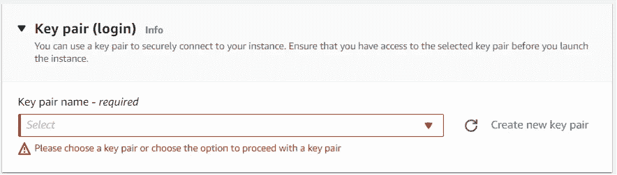

# 借助 EC2 实现可扩展的计算能力

> 原文：<https://blog.devgenius.io/scalable-compute-capacity-with-ec2-a94f42351770?source=collection_archive---------12----------------------->


# 概观

亚马逊弹性计算云(EC2)是亚马逊的虚拟、可扩展、安全和可靠的计算服务。只需片刻，您就可以根据工作负载的需要启动任意数量的虚拟计算实例。这些实例也可以利用定制的 AMI 或 Amazon 机器映像，用您想要的设置和工具进行预配置。所有新的 AWS 帐户都符合自由层资格。对于 EC2 服务，这意味着我们在一年内每月获得 750 小时的 Linux 和 Windows micro 实例。让我们看看在 EC2 Amazon Linux t2.micro 实例上运行 web 服务器的情况。启动和配置 AWS 资源有多种方式。对于本文，我们将通过 AWS 控制台启动我们的实例，并通过 SSH 连接来配置我们的 web 服务器。

# 方案

您的公司希望开始从使用本地服务器转向使用云中的服务器。他们要求您在 AWS 中创建一个 EC2 实例来托管他们的新网站，而不是购买数据中心的所有基础设施。

*   在公共子网中启动 EC2 Amazon Linux t2.micro(免费层)。
*   创建一个安全组，允许 0.0.0.0/0 的 HTTP 上的入站流量，并允许来自您的 IP 地址的 SSH 上的入站流量。
*   SSH 到您的 EC2 实例中，并使用 BASH 脚本安装带有自定义网页的 Apache。

**补充**:

因为随着时间的推移，您可能会创建多个实例，所以为您经常用于安装和用户创建的脚本创建一个存储库是一个好主意。然后你可以利用 GitHub 与你的团队分享这些。

*   在实例中创建一个 BASH 脚本目录。
*   将您的 Apache 脚本移动到新目录中
*   还要创建一个添加新用户的脚本，并将其放入 BASH 脚本目录
*   通过使用脚本创建一个新用户来确保脚本正常工作。
*   使用 Git 命令将 BASH 脚本添加到新创建的 GitHub repo 中。

# 先决条件

*   AWS 帐户

> 点击[此链接](https://www.youtube.com/watch?v=FRQ9fE4fd5g)利用安全最佳实践设置一个免费等级账户。

*   AWS CLI 工具

> 安装 AWS CLI 工具的步骤可以在[这里](https://docs.aws.amazon.com/cli/latest/userguide/getting-started-install.html)找到。

*   熟悉 Linux
*   熟悉 Bash、Git 和 GitHub。

> 创建一个 [GitHub 账户](https://docs.github.com/en/get-started/onboarding/getting-started-with-your-github-account)和创建一个 [GitHub 库](https://docs.github.com/en/get-started/quickstart/create-a-repo)的链接

*   基本 HTML

# 启动并连接到 EC2 实例

首先，我们需要登录我们的 AWS 帐户来访问我们的控制台。然后，我们将导航到 EC2 控制台，选择 instances，然后选择**启动 instance** 。


接下来，我们将确保选择 Amazon Linux 2 AMI t2.micro，并确保它符合自由层条件。


然后，我们将配置我们的安全组，允许我们从我们的 IP 地址进行 SSH，并允许所有 HTTP 流量。


我们需要确保生成一个密钥对来安全地连接到我们的实例。按照说明创建一个**。pem** 文件，记下它在系统上的位置，因为以后连接到实例时需要引用它。



我们现在可以滚动到页面底部，选择**启动实例**来创建我们的实例。然后选择**查看实例**。

从实例视图中，一旦我们的实例处于运行状态，我们可以选择我们的实例，然后选择 **connect** 。


我们将导航到 **SSH 客户端**选项卡，获取连接说明。如有必要，您可以更改。pem fiel。如果你在一个类似 UNIX 的系统上(MAC 或 Linux ),你可以使用`chmod`命令来改变文件权限。

> 对于 windows 系统，您需要导航到文件位置，右键单击该文件，选择属性，然后选择安全设置。


更改 Windows 系统上的权限

我们现在可以在本地终端中使用以下命令来连接到我们的实例。出现提示时，回答“是”。

`ssh -i <".pem file locatoion"> <public DNS name of your EC2 instance>`


成功连接到您的实例

现在，我们可以使用下面的命令创建并执行一个脚本，安装一个带有自定义网页的 Apache web 服务器。

使用 vim `vim apachescript.sh`在当前目录下创建一个脚本文件

将以下文本插入文件。

```
#!/bin/bashsudo yum updatesudo yum install httpd -ysudo systemctl start httpdsudo systemctl enable httpd# Creating index.html to edit web pagesudo touch /var/www/html/index.html # Open index file to add your custom htmlsudo vim /var/www/html/index.html
```

输入`:wq`保存/退出，输入`chmod +x <file name>`使文件可执行。

执行当前目录下的文件`./<your script name>.sh`

> 该脚本将打开一个空白的 index.html，您可以在其中输入 html 来定制您的网页。更多细节请参考我的文章。

使用`*curl -4 ifconfig.co*`获取实例的公共 IP 地址，或者在 EC2 控制台中导航到实例的 networking 选项卡。


在浏览器中导航到公共 IP 地址。


> 恭喜你！现在，您已经在 EC2 实例上配置了一个静态网页。继续阅读第 2 部分，建立一个在线存储库，您可以利用它在未来的实例中配置 Apache 和用户。

# 补充的

既然我们已经熟悉了创建 EC2 实例的过程。让我们利用 Bash 脚本、Git 和 GitHub 的知识来加速配置过程。

我们可以利用 Git 来:

*   在我们的实例上创建一个存储库
*   将我们的脚本存储在存储库中
*   把回购推到我们的 GitHub 账户

> [参考我关于 Git 和 GitHub 的文章，了解如何实现以下步骤的更多详细信息。](https://medium.com/@hunterjshaun/push-pull-and-merge-with-git-and-github-926067878f03)

首先，我们需要在实例上安装 Git，为我们的脚本创建一个目录，并初始化存储库。

```
sudo yum install gitsudo mkdir BashScriptscd BashScriptsgit init
```

我们可以将用于安装 Apache 的脚本移动到新的存储库中。我们还将创建一个脚本，用于向 Linux 服务器添加用户。

```
mv <your file location> <your repository location>mv /home/ec2-user/apachescript.sh ./ (./ is the current working directory)
```

下面是我创建的添加用户、创建其主目录和密码的脚本。

该脚本将提示您输入用户名。如果已经创建了该用户，脚本将通知您，如果没有，它将创建用户并提示您为该用户创建密码。

在我们的新存储库中输入以下命令。

```
vim UserAdd.sh**ENTER THE BELOW TEXT INTO YOUR FILE**#!/bin/bashecho “Enter username: “read usernameif id -u $username > /dev/null 2>&1; thenecho ‘A user with that name already exist. Please try again. ‘elsesudo useradd -m “$username” | echo “User created: $username”sudo passwd $usernamefi:wq **TO SAVE THE FILE**chmod +x AddUser.sh **TO MAKE FILE EXECUTABLE**
```


运行脚本并创建一个测试用户，以确保它正常工作


检测到测试用户，脚本按预期运行

我们现在可以存放我们的存储库，提交文件，并将它们推送到我们的 GitHub 帐户。

> [在您的 GitHub 帐户中创建 BashScripts repo。](https://docs.github.com/en/get-started/quickstart/create-a-repo)

```
**STAGE OUR NEW FILES IN OUR REPOSITORY**git add apachescript.sh UserAdd.sh**COMMIT THE FILES TO THE REPOSITORY AND SET A COMMIT MESSAGE**git commit -m “Added Apache and User Scripts”
```

现在，我们可以将本地回购推送到 GitHub 上的 BashScript 回购。我们将需要我们的 GitHub 回购的网址，我们打算推到。


您可以使用“git status”命令来验证您在哪个分支上

```
**TO SPECIFY THE URL(ORIGIN) OF THE REMOTE REPOSITORY WE WANT TO PUSH TO**git remote add origin [https://github.com/hunterjshaun/BashScripts.git](https://github.com/hunterjshaun/BashScripts.git)**NAME THE BRANCH(MASTER) YOU WANT TO PUSH TO GITHUB**git push -u origin master
```

系统会提示您输入您的 Github 用户名。当系统提示您输入密码时，您需要提供您的[个人访问令牌](https://docs.github.com/en/authentication/keeping-your-account-and-data-secure/creating-a-personal-access-token)。

我们应该看到我们的命令已经成功运行，我们的脚本现在显示在我们的 GitHub repo 中。


成功推送

我们现在可以将新创建的 GitHub 存储库克隆到我们当前的或我们决定启动的任何新实例中。

`git clone <URL for your repository>`


将存储库克隆到我们的实例中，我们的脚本就存在并准备好执行了。

> 恭喜你！现在，如果我们愿意，我们可以通过将存储库克隆到一个新实例中，将该存储库拉入我们决定启动的任何实例中，从而节省宝贵的配置时间。