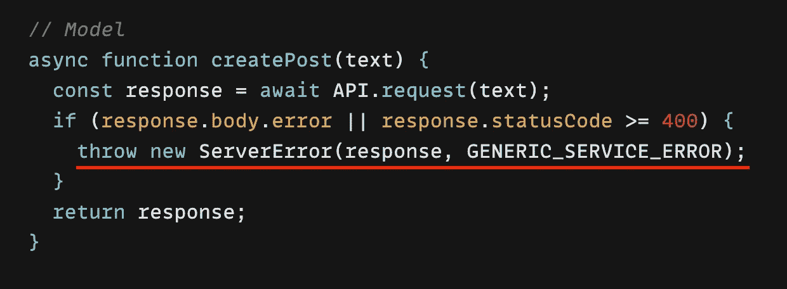

# 使用装饰模式在节点中进行可伸缩的错误处理。

> 原文：<https://blog.devgenius.io/scalable-error-handling-in-node-using-the-decorator-pattern-c475d7c99ce5?source=collection_archive---------6----------------------->



使用不同类型的 API、服务、数据库、其他服务器等。使得在服务器上以可伸缩的方式处理响应和错误变得复杂，因为每个消耗品都有自己的签名、响应和错误结构。

# TL；速度三角形定位法(dead reckoning)

你可以跳过一切，直接进入我在这篇文章末尾添加的代码沙箱。

# 背景

在[现代 JavaScript 装饰模式](https://pgarciacamou.medium.com/modern-javascript-decorator-pattern-1b440500b38e)中，我提到过:

> 在迁移我们的一个 GraphQL 端点时，我注意到错误结构略有变化。这通常不是问题，但是每个使用数据的控制器都有不同的客户端错误映射(statusCode、name、Code 等等),这使得迁移非常困难。此外，一些控制器暴露了可能成为潜在安全风险的数据。

在这篇文章中，我将向你展示我是如何重用我实现的[装饰模式](https://pgarciacamou.medium.com/modern-javascript-decorator-pattern-1b440500b38e)并使其适应`ExpressJS`的错误处理的，如果你对理解实现细节和结论感兴趣，请随意阅读这篇文章。

这里我们有[装饰模式](https://pgarciacamou.medium.com/modern-javascript-decorator-pattern-1b440500b38e)的实现:

```
export class DecoratedError extends Error {
  constructor(error, ...decorators) {
    if (typeof error === "string" || error instanceof String) {
      error = new Error(error);
    }
    let previouslyParsedData = {};
    if (error instanceof DecoratedError) {
      previouslyParsedData = error;
      error = error.cause;
    }
    super(error?.message, { cause: error });
    this.decorate(previouslyParsedData, decorators);
  }
  decorate(...decorators) {
    const rawError = this.cause || {};
    while (decorators.length > 0) {
      const decorator = decorators.shift();
      if (decorator instanceof Function) {
        decorators.unshift(decorator(rawError, { ...this }));
        continue;
      } else if (Array.isArray(decorator)) {
        decorators = decorator.concat(decorators); // flatten
        continue;
      } else if (decorator === Object(decorator)) {
        for (const key in decorator) {
          if (decorator[key] !== undefined && key !== "cause") {
            Object.defineProperty(this, key, {
              value: decorator[key],
              writable: true,
              enumerable: true,
              configurable: true
            });
          }
        }
      }
    }
    return this;
  }
}
```

上面的[装饰类](https://gist.github.com/pgarciacamou/88d03714b3c4deccec3396bf43956263#file-decoratederror-js)继承自`Error`用于堆栈跟踪，它使用`decorate`解析错误并增强实例。我们的想法是利用动态类型，允许传递`Array`、`Function`和`Object`以可伸缩和可重用的方式修饰实例。

这是一个非常简约的预览:

```
// signature
new DecoratedError(Error|String, ...(Object|() => Object|Array))// manual errors with an object decorator
new DecoratedError('Oops!', { status: 500 })// catching errors
try { ... } catch (error) {
  new DecoratedError(error, (error, parsed) => ({
    status: error.status || 500 // defaults to 500
  })
}// using N decorators
new DecoratedError('error', () => ({}), {}, [{}, {}], ...)// API responses
const response = API.doSomething() // raw
const decorator1 = (response, parsedData) => ({ ... })
const decorator2 = (response, parsedData) => ({ ... })
new DecoratedError(response, decorator1, decorator2, ...)
```

# 解决办法

为了让`DecoratedError`准备好处理服务器错误，我们必须做一些事情:通过继承进行一些增强，创建错误类型，使用组合来处理错误映射，并能够为客户端将*特定错误*转换为*非敏感错误*。

## 继承性增强

我在`ServerError` : `getClientError`中引入了两个新方法来清理响应，这样我们就不会将**敏感的**数据暴露给客户端；然后`send`形成一个适当的客户端响应，并以某种预期的方式发送出去。

```
class ServerError extends DecoratedError {
  /**
   * This method cleans the error for the client.
   */
  getClientError() {
    // Clean non-enumerable Error props like 'name'
    const enumerableProps = { ...this };

    const {
      status,
      code,
      name,
      redirectUrl,
      clientData = {}
    } = enumerableProps;

    const {
      status,
      code,
      name,
      redirectUrl,
      clientData = {}
    } = enumerableProps;

    return {
      // required
      status: status || 500,
      name: name || "INTERNAL_SERVER_ERROR",
      // optional
      ...(code && { code }),
      ...(redirectUrl && { redirectUrl }),
      // Explicitly mention what props to pass to the client.
      // This is required to avoid security issues.
      ...clientData
    };
  }
  /**
   * This method takes care of sending the response
   */
  send(req, res, next) {
    const response = this.getClientError()
    let { status, redirectUrl } = response
    status = status || 500 // default to 500

    // Anything <300 should not be treated as an error
    if(status < 300) {
      status = 400
    }

    const redirect = status >= 300 && status < 400 && !!redirectUrl
    // Redirect unless AJAX.
    if (redirect && !isAjaxRequest(req)) {
      return res.status(status).redirect(redirectUrl)
    }

    // Gracefully default to JSON:
    return res.status(status).json(response)
  }
}
```

上面的代码需要这个小工具:

```
// Checks if an HTTP request is to be considered an AJAX request.
export function isAjaxRequest(req) {
  const isXhr = req.xhr
  const isJsonRequest = req.headers?.accept?.includes?.('json')
  const isApiCall = /^\/api\//.test(req.url || '')
  return isXhr || isApiCall || isJsonRequest
}
```

## 装饰者——实现错误类型

能够通过装饰创建错误类型是重用这种装饰器模式最重要的好处。

我们可以通过指定错误的类型来消费错误:

```
// server/errors/types/generic.js
// This is just a plain decorator that parses the service response.
export function GENERIC_SERVICE_ERROR(response, parsed) {
  const { statusCode, body = {} } = response || {};
  return {
    status: statusCode >= 300 ? statusCode : 500,
    issue: body?.error?.issue
  };
}// Usage:
// new ServerError(cause, GENERIC_SERVICE_ERROR)
```

如果这还不够，我们还可以使用[封装](https://en.wikipedia.org/wiki/Encapsulation_(computer_programming))和[组合](https://en.wikipedia.org/wiki/Composition_over_inheritance)来创建错误的“类”(即不是实际的类):

```
export function GenericServiceError(raw, ...decorators) {
  return new ServerError(raw, GENERIC_SERVICE_ERROR, ...decorators)
}

export function GenericServiceErrorV2(raw, ...) {
  return new GenericServiceError(raw, GENERIC_SERVICE_ERROR_V2, ...)
}
```

## 合成—实现错误映射

当我说“映射”时，我指的不是`new Map()`，我指的是 1:1 的`Object`，它将特定的服务响应转换或翻译成更通用的、客户端就绪的响应。

例如，*假设*用例将接收`error.issue="USER_BANNED"`，当然我们不能将此发送给客户端，因为攻击者可能会利用它来收集信息，所以我们将其转换为客户端错误:

```
USER_BANNED: {
  status: 422,
  issue: 'UNPROCESSABLE_ENTITY',
  code: 'SEND_INVITE' 
}
```

我们可以通过创建一种叫做 ***高阶装饰器*** 的新型装饰器来解决这个问题。高阶装饰器是一种可以返回其他装饰器的特殊类型的装饰器，它使用部分解析的数据将映射到实际的装饰器。

```
// server/errors/utils/createServerErrorMap.js
export function createServerErrorMap(errorMap) {
  return function higherOrderDecorator(raw, parsed) {
    const { issue, name, code } = parsed;
    const decorator =
      errorMap[issue] ||
      errorMap[name] ||
      errorMap[code] ||
      errorMap._default; // allow defaults
    return decorator
  };
}
```

注意，**错误类型是负责解析原始数据的类型，而错误映射在解析(易于阅读)的数据之上充当过滤器**。

> 旁注:你可以把它作为一个`*static*`方法移动到`ServerError`里面。

下面是一个示例地图:

```
// server/errors/maps/posts.js
export const POSTS_ERROR_MAP = createServerErrorMap({
  POST_CREATION_RESTRICTED: (raw, parsed) => ({
    code: "UNPROCESSABLE_ENTITY",
    status: 422 // Unprocessable Entity
  }),
  _default: {
    status: 400,
    code: "UNEXPECTED_RESPONSE",
    clientData: { ... }
  }
});
```

# 使用

在我们的数据访问层中，我们将有一个调用服务并获得响应的方法，包括捕捉/抛出错误的逻辑，但不包括如何处理响应:

```
// server/models/posts.js
export async function createPost(...) {
  try {
    const response = await api.request(...) if (response.body.error || response.statusCode >= 400) {
      throw response;
    }
  } catch (error) {
    throw new ServerError(error, GENERIC_SERVICE_ERROR);
  }
}
```

如您所见，数据层知道可以抛出的错误的类型。这很重要，因为我们现在有了一种方法来解析这些错误，并把它们扔给控制器。然后，控制器可以将这些误差映射成客户端定相误差:

```
// -> server/controllers/posts.js
// :: [POST] /posts/create
export async function createPost(req, res, next) {
  try {
    await postsModel.createPost();
  } catch (cause) {
    const error = new ServerError(cause, POSTS_ERROR_MAP);
    return error.send(req, res, next);
  }
}
```

或者，如果您使用 [ExpressJS 默认错误处理程序](https://expressjs.com/en/guide/error-handling.html#writing-error-handlers)，您可以:

```
// -> server/controllers/posts.js
// :: [POST] /posts/create
export async function createPost(req, res, next) {
  try {
    await postsModel.createPost();
  } catch (cause) {
    next(new ServerError(cause, POSTS_ERROR_MAP));
  }
}
```

在这方面，我们可以看出我们的解决方案已经可以扩展到一个新的水平。拥有**类型的**错误和**错误映射**允许组合错误，并拥有一个可以不断增加的结构系统，其中模型和控制器不需要有特定的错误实现，只需要重用它。

更具体地说，这种实现减少了组件的[耦合](https://en.wikipedia.org/wiki/Loose_coupling)，因为我们可以很容易地增强和替换装饰器，同时增加了其 [*即插即用*](https://techterms.com/definition/plugandplay) 的能力，因为您可以将问题映射到客户端理解的代码或动作，并且可以将其挂钩到流中。

例如:`USER_NOT_FOUND`和`USER_NOT_SEARCHABLE`都可以映射/翻译成相同的代码`SEND_INVITE`，客户端理解该代码并为两者显示相同的用户体验，无论是否收到新的错误，我们都可以在服务器级别进行连接。

这就是装饰模式的力量。

# 操场