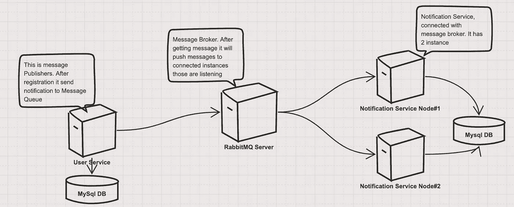
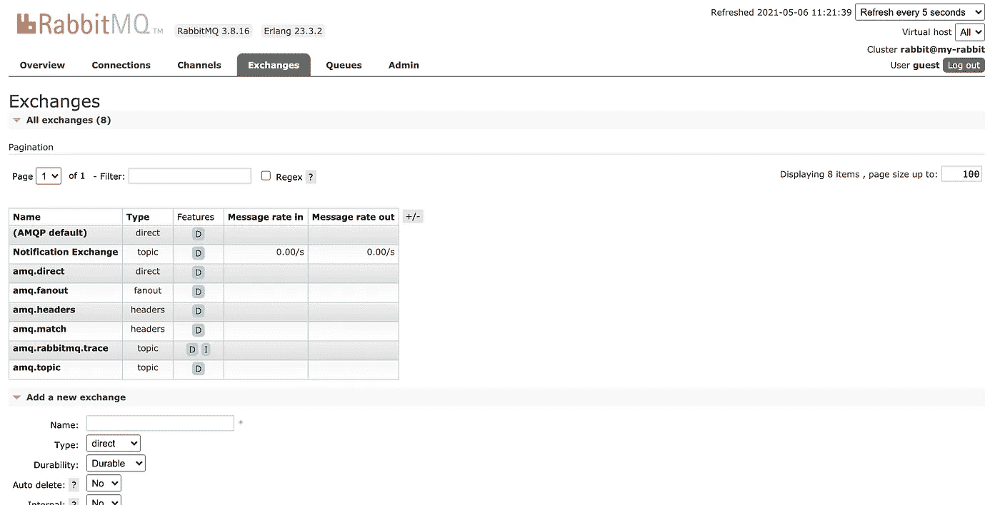
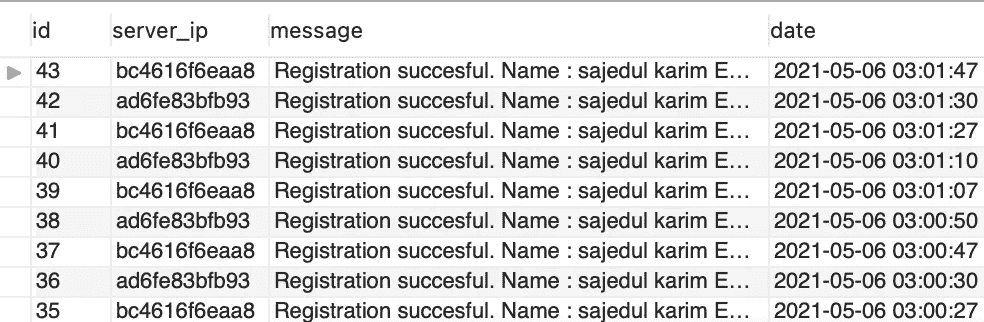

# 使用 RabbitMQ、Java 和 MySQL 的可伸缩系统实现

> 原文：<https://blog.devgenius.io/scalable-system-implementation-using-rabbitmq-java-and-mysql-2d5fe0fa182e?source=collection_archive---------1----------------------->

## RabbitMQ 是一个广泛使用的开源消息代理

[澳门图片社](https://unsplash.com/@macauphotoagency?utm_source=medium&utm_medium=referral)在 [Unsplash](https://unsplash.com?utm_source=medium&utm_medium=referral) 上拍摄的照片

RabbitMQ 是开源的消息代理软件，最初实现了高级消息队列协议(AMQP)。它还通过一个插件架构进行了扩展，以支持面向流文本的消息传递协议(STOMP)、MQ 遥测传输(MQTT)和其他协议。

消息传递使软件应用程序能够连接和扩展。消息传递使应用程序异步，通过分离发送和接收数据来解耦。

在本文中，我们将了解以下主题

1.  什么是 RabbitMQ 及其用法
2.  它如何帮助我们开发高度可伸缩的系统
3.  用 Spring boot 应用程序、MySQL 数据库和 JPA 为传统注册系统实现 RabbitMQ
4.  共享源代码和数据库脚本

在本文中，我们将实现以下基础设施

图片来源—作者

这里，

*   我们有一个 RabbitMQ 服务器，所有与这个服务器连接的应用程序都有一个特定的主题、队列配置和路由键。
*   用户服务负责保存用户注册数据。它作为消息生产者与 RabbitMQ 服务器连接。注册成功后，它通过 RabbitMq 服务器发送通知。
*   通知服务负责处理用户服务发出的通知。它有两个实例，运行在 docker 中，并与 MySQL 数据库连接。它还与具有特定主题、队列配置和路由键的 RabbitMq 消息代理相关联。
*   为了简单起见，我们对用户服务和通知服务都使用了一个 MySQL 数据库。
*   用户服务向外部世界公开了注册端点

## 什么是 RabbitMQ？

图片来源—[www.cloudamqp.com](http://www.cloudamqp.com)

*   RabbitMQ 是轻量级的，易于在内部和云基础设施中部署。
*   RabbitMQ 支持多种消息传递协议。它可以部署在分布式和联合架构中，以满足高可扩展性和高可用性的需求。
*   它是定义队列的软件，应用程序连接到该软件以传输消息或消息。
*   消息可以包括任何信息。例如，它可能包含关于应该在另一个应用程序(甚至可能在另一个服务器上)上启动的进程或任务的正确信息，或者它可能只是一条简单的文本消息。
*   队列管理器软件存储消息，直到接收应用程序连接并从队列中取出一条消息。然后，接收应用程序处理该消息。

在我们深入研究 RabbitMQ 之前，需要描述一些基本概念。示例中使用了默认虚拟主机、默认用户和默认权限，所以让我们来看一下这些元素和概念:

*   **生产者:**发送消息的应用程序。在我们的案例中，用户服务是我们的生产者。
*   **消费者:**接收消息的应用程序。在我们的例子中，通知服务是我们的消费者。
*   **队列:**暂时存储消息的缓冲区。成功传递此消息后，队列可能会清空。
*   **消息:**生产者通过 RabbitMQ 发送给消费者的适当信息或数据包。它可能是 JSON 格式的，带有基于业务需求的特定消息。
*   **连接:**TCP 连接是您的应用程序和 RabbitMQ 代理之间的连接。在我们的例子中，用户服务连接到 RabbitMQ 服务器。
*   **通道:**是连接内部的虚拟连接。当从队列中发布或使用消息时，这都是通过一个通道来管理和完成的。
*   **交换:**根据在交换类型上设置的规则，它接收来自生产者的消息，并将它们推送到队列中。要接收消息，队列需要绑定到至少一个交换。如果没有定义交换，那么一个没有命名的交换会自动创建。
*   RabbitMQ 有四种不同类型的交换；**直接、主题、扇出、标题**。每种交换类型使用其他参数和绑定设置以不同的方式路由消息。客户端可以创建自己的交换，也可以使用预定义的默认交换。交换可以有绑定队列或交换。
*   **绑定:**绑定是队列和交换之间的链接。
*   **路由关键字:**交换机查看以决定如何将消息路由到队列的关键字。把路由关键字想象成消息的一个*地址。*
*   **AMQP:** 高级消息队列协议是 RabbitMQ 用于消息传递的协议。
*   **用户:**可以使用给定的用户凭证连接到 RabbitMQ。它还可以在实例中设置读写权限和配置特权。还可以为用户分配特定虚拟主机的权限。

## RabbitMQ 在构建可伸缩系统中的应用

*   RabbitMQ 支持异步处理。这意味着它允许您将消息放入队列中，而无需立即处理它。
*   RabbitMQ 非常适合长时间运行的任务或阻塞任务。它允许 web 服务器非常快速地响应请求，而不是被迫在现场执行计算密集型研究。RabbitMQ 存储消息，并在准备就绪时将其传递给消费者。
*   当将一条消息分发给多个消费者或者平衡工作器之间的负载时，消息队列也很有用。
*   **RabbitMQ 是一个可靠的开源消息代理。**它自 2007 年上市，2013 年成为 Pivotal software 的一部分。它在不断更新，不断改进。RabbitMQ 有一个强大而活跃的社区，以及一个非常活跃的核心团队，他们开发了额外的特性、改进和方便的插件。RabbitMQ 的许可证从未更改(2019 年 11 月)。
*   **RabbitMQ 支持几个标准化协议**，如 AMQP、MQTT、STOMP 等。，在这里它本机实现了 AMQP 0.9.1。
*   **RabbitMQ 被各行各业的许多公司使用**，并被大公司(Zalando、WeWork、Wunderlist、彭博等)使用和信任。所有这些都依赖于基于微服务的架构。
*   **RabbitMQ 是用户友好的，**通过遵循这些 RabbitMQ 最佳实践，很容易调整配置以适应预期目的。RabbitMQ 是用 Erlang 编写的，是世界上部署最多的开源消息代理，这意味着它是一个经过良好测试的健壮的消息代理。
*   **rabbit MQ 代理具有可伸缩性和灵活性。**您的开发团队只需要维护生产者和消费者向队列发送消息和从队列接收消息。在高负载下，如果队列变得更长，标准的反应是增加更多的消费者和并行工作。这是一种简单有效的缩放方法。

## RbbitMq 设置

您可以使用 docker 设置 RabbitMQ 服务器。以下是 docker 拉取和运行命令:

这里，

*   我们正在从他们的官方 docker hub 库中提取 RabbitMq 管理映像。
*   打开双口 **5672** 和 **15672** 运行图像。端口 5672 用于 rabbitMQ 服务器，端口 15672 用于管理窗口，您可以在其中查看所有交换、队列和数据的状态
*   管理窗口的默认凭据是来宾、来宾

管理窗口类似于

图片来源—作者

## 用户服务后端应用

下面给出了`build.gradle`文件:

这里，我们只是用 c3p0 连接池添加了 RabbitMQ 依赖和 MySQL 数据库依赖。

下面给出了`application.yml`文件。

这里，

*   在第一部分中，我们正在配置 MySQL 数据库和 JPA
*   在第二部分中，我们配置了 RabbitMQ 依赖项。这里 RabbitMQ 服务器运行在 5672 端口
*   最后，我们将应用程序端口设置为 7070，上下文路径是 user-service

## RabbitMQ 配置

这里，

*   我们用特定的名称定义了一个队列和一个交换。
*   之后，我们用路由键将该队列绑定到交换机。发布消息后，订阅者必须确保该队列具有此路由关键字。
*   我们还配置了消息转换器。这里我们使用了 Jackson 到 JSON 的消息转换器。
*   最后，我们建立一个兔子模板。此模板将用于发布消息。

现在我们的用户保存并发送通知代码如下。

这里，

*   我们通过构造函数注入来初始化存储库和 rabbit 模板。
*   我们使用 JPA 用户存储库将用户保存到数据库中。
*   保存用户后，我们将发送通知。这里，我们构建 NotificationRequest 并使用 redisTemplate 及其`convertAndSend`方法发送它。
*   这里，在发送期间，我们使用交换和路由密钥。

这是控制器类

这里，我们有一个端点，它只是将请求对象传递给服务类。

请求和响应如下所示:

## 通知服务

其`build.gradle`文件和 application.yml 文件与用户服务相同。

下面给出了它的消息监听器类。

这里，

*   我们有一个方法监听器，它是@RabbitListener 注释的。它正在监听我们配置的标签。这里，它的队列必须是发送者队列。
*   消息将到达这个方法。
*   它的参数是 CustomMessage，与来自用户服务的发送方请求相同。
*   在解析之后，我们只是将这个请求传递给服务类以进行进一步的操作。在服务类中，我们用服务器 IP 将其保存到数据库中。

将通知保存到通知表后，数据如下所示。

图片来源—作者

在这里，仔细看。

*   在保存成表的过程中，我只是添加了一个参数， **server_ip。**这里保存的是哪个实例正在保存。在我的例子中，我有两个 docker 实例，这里的服务器 IP 是 docker 容器 id。
*   队列按顺序将流量分配给两个节点。

## 结论

就是这样。我希望你喜欢这篇文章。快乐阅读:)

您可以尝试使用 spring cloud 实现微服务。然后你可以查看[这篇文章](/microservice-implementation-using-spring-cloud-with-docker-netflix-stack-76a367a5cf05)。

源代码在[这个 GitHub 仓库里](https://github.com/mesuk/SpringRabbitMqImplementation)

**参考文献**

1.  [https://en.wikipedia.org/wiki/RabbitMQ](https://en.wikipedia.org/wiki/RabbitMQ)
2.  [https://medium . com/trendyol-tech/rabbit MQ-exchange-types-d 7 E1 f 51 EC 825](https://medium.com/trendyol-tech/rabbitmq-exchange-types-d7e1f51ec825)
3.  [https://www . rabbit MQ . com/features . html #:~:text = rabbit MQ % 20 is % 20a % 20 messaging % 20 broker，place % 20 to % 20 live % 20 until % 20 received](https://www.rabbitmq.com/features.html#:~:text=RabbitMQ%20is%20a%20messaging%20broker,place%20to%20live%20until%20received)。
4.  [https://www . cloudamqp . com/blog/part 1-rabbit MQ-for-初学者-what-is-rabbitmq.html](https://www.cloudamqp.com/blog/part1-rabbitmq-for-beginners-what-is-rabbitmq.html)
5.  【https://www.rabbitmq.com/tutorials/amqp-concepts.html 