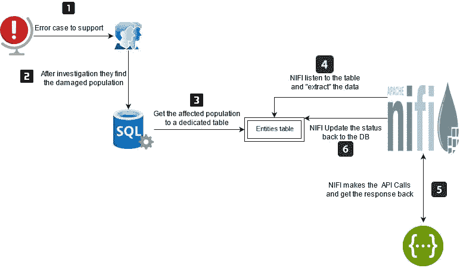
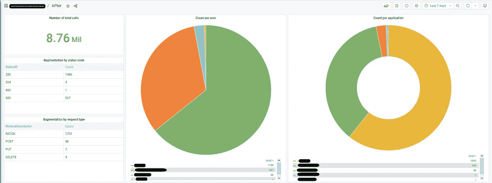
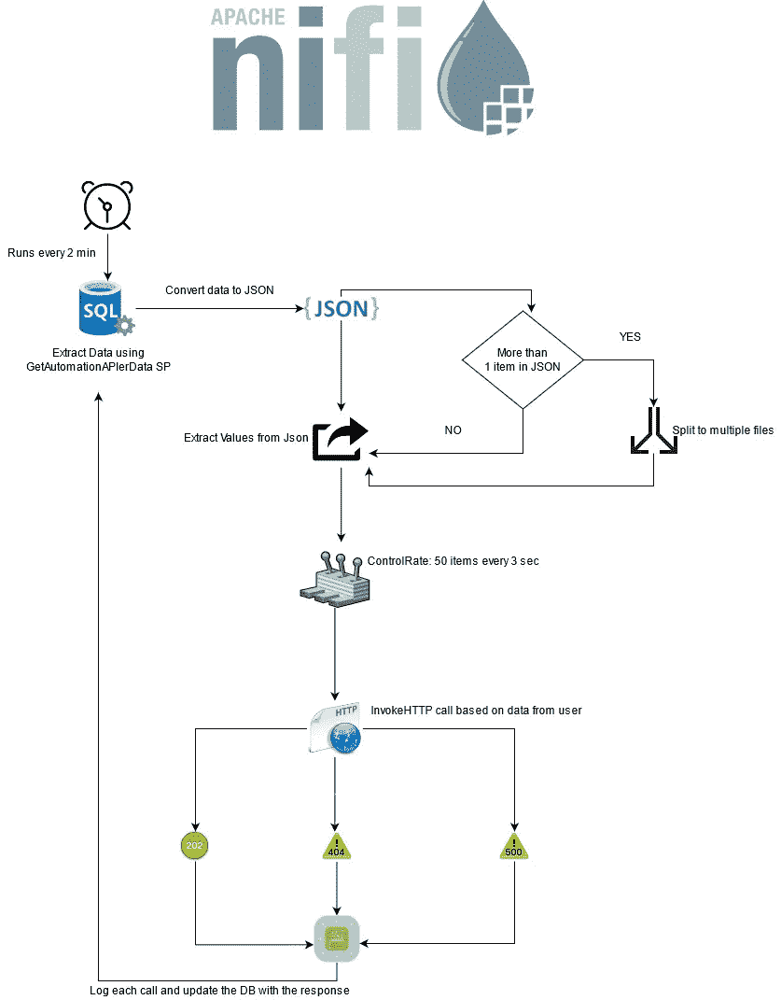

# 使用 Apache Nifi 从数据库扩展 API 调用

> 原文：<https://blog.devgenius.io/scale-api-calls-from-db-using-apache-nifi-81a006aad90c?source=collection_archive---------5----------------------->

如今，为了将应用程序扩展到小型建筑组件，分解一个整体并开发微服务要容易得多。这些服务通常使用 API 相互通信。

> 一个**应用编程接口** ( **API** )是[计算机](https://en.wikipedia.org/wiki/Computer)之间或者[计算机程序](https://en.wikipedia.org/wiki/Computer_program)之间的连接。它是一种软件[接口](https://en.wikipedia.org/wiki/Interface_(computing))，为其他[软件](https://en.wikipedia.org/wiki/Software)提供服务。[【1】](https://en.wikipedia.org/wiki/API#cite_note-1)描述如何构建这种连接或接口的文档或标准称为 *API 规范*。符合这个标准的计算机系统被称为*实现*或*公开*一个 API。术语 API 既可以指规范，也可以指实现。

API 已经改变了我们在代码开发中的操作方式，非常易于使用，并且在需要获取数据时被广泛传播。

如今，组织使用 API 连接公开共享信息给:

1.  不同的监管机构
2.  与其他公司的整合

API 内部的另一个重要用例是内部操作和支持。如今，每家公司都有不同层次的支持:

1.第 1 层 2。第二层
3。三级+四级

每个支持级别都需要使用内部后台系统的内部工具在数据库中运行查询，以调查和缓解问题。

尤其是第 3 层和第 4 层，更像是一个技术团队，对公司的架构结构有更全面的方法。他们知道哪些组件相互关联，以及如何解决问题。他们使用的工具之一是使用 API 调用内部应用程序。

这是一种模拟应用程序流程并以适当和有文档记录的方式解决问题的强大方法。

# 贸易工具

调用 API 的方法有很多，从简单的使用浏览器到编写脚本和使用现成的工具，比如 Postman。

以上都很棒，可以由团队的每个成员单独运行，没有任何干扰。

但是，如果前面的一行让您有点畏缩，那么您心里有一些安全感&审计。

调用内部 API 时，我们需要遵循以下准则:

**A .安全性。**我们不能允许任何人调用内部 API。我们需要阻止该选项被组织中受信任的人使用。这是通过分配对特定 IP/Mac 地址的访问来实现的。
另一种选择是完全阻止访问，只有应用程序可以相互调用，即只有来自该 vlan 环境中的应用程序的调用可以进行 API 调用。第三种选择是使用 VPN 来控制它，但是这需要大量的处理。

**B .审计。**如果一个团队成员在自己的工作站上运行脚本，会有人知道吗？我们如何监督这种行为？

**C .一致性。假设我们同意用一个脚本来运行我们的代码。
如果我需要做一点点改变，那么现在我打的每个电话都有不同的足迹，该怎么办？**

今天最常用的工具是邮递员。它非常轻便，易于使用，只有一点不足:适当的审计。

因此，我们需要找到一种方法来使这些大摇大摆的调用更加包容、安全，并且能够在以后进行询问。介绍**阿皮尔。**

# 阿帕奇 NIFI

> Apache NiFi 支持强大且可伸缩的数据路由、转换和系统中介逻辑的有向图

Nifi 是一个强大数据传输和丰富工具，可以用于多种目的，可以在几秒钟内处理数千个流文件。这就是我们选择它作为这个流程的原因，因为它可以:

1.HTTP/S 调用。
2。从数据库获取数据。
3。更新数据库。
4。处理负载。
5。流量控制可用于许多属性。

# 解决方案架构

下图说明了总体架构:



阿皮尔建筑

1.支持团队收到一张关于需要修复的不良群体的罚单。
2。他们调查并找到所需的人口。他们将数据放入 DB 中的一个专用表中(下面 git 中的完整 sql 模式):
4。Nifi 总是监听那个表，一旦监听到，它就会找到状态为“0”的群体[新的和就绪的]，并将群体提取到流文件中，并将数据库更新回状态为“1”的群体[传输中]。
5。基于该表中的数据，它执行 API 调用(下面有更详细的流程)并返回调用的响应代码。
6。然后，Nifi 用每个调用的响应更新 DB。

# NIFI 流

使用上面的流程，我们可以通过一种清晰的方式来跟踪所有的呼叫，并统计有多少呼叫成功以及到达哪个端点，从而极大地扩展我们的呼叫。为了更好的理解，我们用 Grafana 来形象化它。
一些统计:
1。开始于 2019-01-23，自(908 天)
2 开始运行。迄今已创建 8760046 个呼叫，其中 6894019 个成功
3。由不同的 20 个用户使用(有些是自动化流程)
4。打电话给 30 个不同的内部服务机构



格拉夫纳的阿皮尔统计

为了了解原因，我们将所有的 nifi 日志收集到 ELK 堆栈中，以创建关于不成功调用的警报。



# SQL 模式

在专用的 sql 表“APIer”中:

```
[ID] [int] IDENTITY(1,1) NOT NULL,
[MethodID] [int] NOT NULL, // method connect as for FK to APIerMethods. can control the CRUD type
[Body] [nvarchar](max) NULL,
[Headers] [nvarchar](max) NULL,
[DelayInMiliseconds] [int] NULL, 
[URI] [nvarchar](1000) NOT NULL, // The End Point the nifi will call 
[StatusID] [int] NOT NULL, 
[CreateDate] [datetime2](7) NOT NULL,
[UpdateDate] [datetime2](7) NOT NULL,
[Ticket] [nvarchar](200) NULL, // Ticket id of the request
[RequestedUser] [varchar](250) NOT NULL,
[ResponseBody] [nvarchar](max) NULL // the status of call will be update here
```

完整的 APIer 模板可以在下面的 GitHub 资源库中找到，包括:
1。SQL 文件夹，包含所有必需的表和 SP
2。Nifi XML(和 JSON)模板。

https://github.com/mormor83/APIer

# 结论

这个流程已经成为我们支持团队(和一些开发团队:)直接从数据库运行多个 API 调用的主要来源。通过内置在“控制速率”处理器中的 Nifi，我们可以根据一些参数来调节流文件。然后，我们可以按我们想要的方式扩展它，最重要的是，我们可以记录和跟踪每个调用。