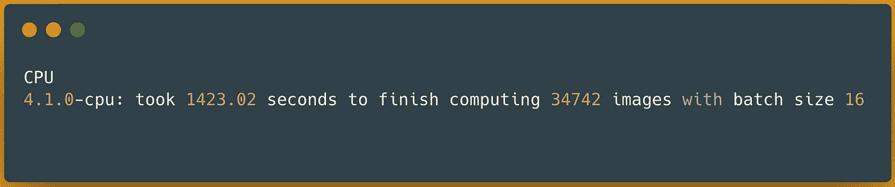

# 超越拥抱脸的视觉变形金刚(ViT)|第 1 部分

> 原文：<https://blog.devgenius.io/scale-vision-transformers-vit-beyond-hugging-face-part-1-e09318cab588?source=collection_archive---------13----------------------->

## 加快拥抱脸最先进的维生素 t 模型🤗借助 Databricks、Nvidia 和 Spark NLP，速度提升高达 2300%(25 倍)🚀


**通过使用**数据模块**、**英伟达**和 **Spark NLP** 扩展**基于**变压器**的型号

我是 [Spark NLP](https://github.com/JohnSnowLabs/spark-nlp) 开源项目的贡献者之一，最近这个库开始支持端到端**视觉变形器(ViT)** 模型。我在日常工作中使用 Spark NLP 和其他 ML/DL 开源库，我决定部署一个 ViT 管道来完成最先进的图像分类任务，并提供**拥抱脸**和 **Spark NLP** 之间的深入比较。

> 本文的目的是演示如何从 Hugging Face 向外扩展 Vision Transformer (ViT)模型，并将其部署到生产就绪环境中，以实现加速和高性能的推理。最后，我们将通过使用 Databricks、Nvidia 和 Spark NLP，将拥抱脸的 ViT 模型扩展 25 倍(2300%)。

## 在本文的第 1 部分，我将:

*   视觉转换器(ViT)简介
*   CPU 和 GPU 上戴尔服务器内部拥抱脸的基准测试
*   CPU 和 GPU 上戴尔服务器内部的基准 Spark NLP

> *本着完全透明的精神，GitHub* 上的[](https://github.com/JohnSnowLabs/spark-nlp-workshop/tree/master/tutorials/blogposts/medium/scale-vision-transformers-vit-beyond-hugging-face?ref=hackernoon.com)

**[](/scale-vision-transformers-vit-beyond-hugging-face-part-1-e09318cab588) [## 超越拥抱脸的视觉变形金刚(ViT)|第 1 部分

### 加快拥抱脸最先进的维生素 t 模型🤗使用 Databricks、Nvidia 和……最高可达 2300%(快 25 倍)

blog.devgenius.io](/scale-vision-transformers-vit-beyond-hugging-face-part-1-e09318cab588) [](/scale-vision-transformers-vit-beyond-hugging-face-part-2-b7b296d548b7) [## 超越拥抱脸的视觉变形金刚(ViT)|第 2 部分

### 加快拥抱脸最先进的维生素 t 模型🤗使用 Databricks、Nvidia 和……最高可达 2300%(快 25 倍)

blog.devgenius.io](/scale-vision-transformers-vit-beyond-hugging-face-part-2-b7b296d548b7) [](/scale-vision-transformers-vit-beyond-hugging-face-part-3-5b8c13ef6477) [## 超越拥抱脸的视觉变形金刚(ViT)|第 3 部分

### 加快拥抱脸最先进的维生素 t 模型🤗使用 Databricks、Nvidia 和……最高可达 2300%(快 25 倍)

blog.devgenius.io](/scale-vision-transformers-vit-beyond-hugging-face-part-3-5b8c13ef6477) 

# 视觉变压器(ViT)型号介绍

早在 2017 年，谷歌人工智能的一组研究人员发表了一篇论文，介绍了一种改变了所有自然语言处理(NLP)标准的 transformer 模型架构。本文描述了一种称为自我注意的新机制，作为一种新的和更有效的语言应用模型。例如，两个最受欢迎的基于变压器的模型系列是 GPT 和伯特。


一点变形金刚的历史[https://huggingface.co/course/chapter1/4](https://huggingface.co/course/chapter1/4)

有一个很棒的章节是关于“[](https://huggingface.co/course/chapter1/4)****”**变形金刚是如何工作的，如果你有兴趣，我强烈推荐你阅读。**

**虽然这些新的基于 Transformer 的模型似乎正在彻底改变 NLP 任务，但它们在计算机视觉(CV)中的使用仍然非常有限。计算机视觉领域一直由卷积神经网络(CNN)的使用所主导，并且存在基于 CNN 的流行架构(如 ResNet)。这种情况一直持续到 2021 年 6 月谷歌大脑的另一组研究人员在一篇题为**[**的论文中介绍了**“视觉变形金刚”** (ViT)一幅图像相当于 16x16 个单词:变形金刚用于大规模图像识别**](https://arxiv.org/abs/2010.11929)****

****这篇论文代表了图像识别方面的一个突破，它使用了我们刚刚讨论过的基于变换的模型(如伯特和 GPT)中使用的相同的自我注意机制。在像 BERT 这样的基于转换的语言模型中，输入是一个句子(例如一列单词)。然而，在 ViT 模型中，我们首先将图像分割成子图像片的网格，然后在每个嵌入的片成为标记之前，我们用线性项目嵌入每个片。结果是一系列嵌入补丁，我们将其传递给类似于 BERT 的模型。****

********

****Google Research 在 2021 年的原始论文中介绍的 ViT 模型结构概述****

****Vision Transformer 专注于更高的精度和更少的计算时间。查看论文中公布的基准测试，我们可以看到，针对 [**嘈杂的学生**](https://arxiv.org/abs/1911.04252v4) 数据集(由谷歌于 2020 年 6 月公布)的训练时间减少了 80%，尽管精度状态或多或少相同。如需了解更多关于 ViT 性能的信息，请访问其在 [**论文上的页面，代码为**](https://paperswithcode.com/paper/an-image-is-worth-16x16-words-transformers-1) **:******

********

****流行图像分类基准的比较。([https://arxiv.org/pdf/2010.11929.pdf](https://arxiv.org/pdf/2010.11929.pdf))****

****值得一提的是，一旦您通过 ViT 架构训练了一个模型，您就可以像在 NLP 中一样预训练和微调您的转换器。(实际上这很酷！)****

****如果我们将 ViT 模型与 CNN 进行比较，我们可以看到，它们具有更高的精度，而计算成本却低得多。您可以将 ViT 模型用于计算机视觉中的各种下游任务，如图像分类、检测对象和图像分割。这也可以是医疗保健领域特有的，你可以针对[股骨骨折](https://towardsdatascience.com/vision-transformers-for-femur-fracture-classification-480d62f87252)、[肺气肿](https://iopscience.iop.org/article/10.1088/1361-6560/ac3dc8/meta)、[乳腺癌](https://arxiv.org/abs/2110.14731)、[新冠肺炎](https://www.mdpi.com/1660-4601/18/21/11086/pdf)和[老年痴呆症](https://www.biorxiv.org/content/10.1101/2021.11.27.470184v2.full)对你的 ViT 模型进行预训练/微调。****

****我将在本文末尾留下参考资料，以防您想更深入地了解 ViT 模型是如何工作的。****

****[1]:深潜:拥抱脸上的视觉变形金刚最佳图芯[https://huggingface.co/blog/vision-transformers](https://huggingface.co/blog/vision-transformers)****

## ****一些正在使用的 ViT 型号****

****Vision Transformer (ViT)模型([ViT-base-patch 16–224](https://huggingface.co/google/vit-base-patch16-224))在分辨率为 224x224 的 ImageNet-21k(1400 万张图像，21，843 个类别)上进行了预训练，并在分辨率为 224x224 的 ImageNet 2012(100 万张图像，1，000 个类别)上进行了微调:****

****************

****[https://huggingface.co/google/vit-base-patch16-224](https://huggingface.co/google/vit-base-patch16-224)****

****用于食品分类的微调 ViT 模型:****

****************

****[https://huggingface.co/nateraw/food](https://huggingface.co/nateraw/food)——[https://huggingface.co/julien-c/hotdog-not-hotdog](https://huggingface.co/julien-c/hotdog-not-hotdog)****

****然而，当涉及到预测时，任何 DL/ML 模型都有局限性和限制。没有 100%准确的模型，因此当您将它们用于医疗保健等重要领域时，请记住:****

****************

******图片摘自:**[https://www . AKC . org/expert-advice/life style/do-you-live-in-dog-state-or-cat-state/](https://www.akc.org/expert-advice/lifestyle/do-you-live-in-dog-state-or-cat-state/)—**ViT model**:[https://huggingface.co/julien-c/hotdog-not-hotdog](https://huggingface.co/julien-c/hotdog-not-hotdog)****

****我们是否可以使用拥抱脸的这些模型或微调新的 ViT 模型，并将其用于实际生产中的推断？我们如何通过使用 AWS EMR、Azure Insight、GCP Dataproc 或 Databricks 等分布式计算托管服务来扩展它们？****

****希望在本文结束时，这些问题中的一些能够得到解答。****

# ****让基准测试开始吧！****

## ****关于我们基准的一些细节:****

******1-数据集:** ImageNet mini: **样本** ( > 3K) — **完整** ( > 34K)****

****我已经从 https://www.kaggle.com/datasets/ifigotin/imagenetmini-1000[的 ka ggle](https://www.kaggle.com/datasets/ifigotin/imagenetmini-1000)下载了 ImageNet 1000(迷你)数据集****

****我选择了包含超过 34K 图像的目录，并将其命名为 imagenet-mini，因为我所需要的是足够多的图像来进行耗时较长的基准测试。此外，我随机选择了不到 10%的完整数据集，并将其命名为 **imagenet-mini-sample** ，其中有 **3544 张图像**，用于我的较小基准测试，并微调合适的参数，如批量大小。****

******2-型号:**谷歌的[vit-base-patch 16–224](https://huggingface.co/google/vit-base-patch16-224)****

****我们将使用这个来自谷歌的拥抱脸模型:[https://huggingface.co/google/vit-base-patch16-224](https://huggingface.co/google/vit-base-patch16-224)****

******3-库:** [**变形金刚**](https://github.com/huggingface/transformers/) 🤗& [**火花 NLP**](https://github.com/JohnSnowLabs/spark-nlp) 🚀****

## ****裸机服务器上的基准测试拥抱脸****

******Dell PowerEdge c 4130 上的 ViT 型号******

****什么是裸机服务器？一台**裸机** - **金属服务器**只是一台只由一个用户使用的物理计算机。这台机器上没有安装虚拟机管理程序，没有虚拟化，一切都直接在主操作系统(Linux-Ubuntu)上执行——这台机器的 CPU、GPU 和内存的详细规格都在笔记本电脑中。****

> ****正如我的初始测试以及拥抱脸工程团队撰写的比较 DL 引擎推理速度的几乎每篇博客文章所揭示的那样，拥抱脸库(Transformer)中推理的最佳性能是通过使用 PyTorch 而不是 TensorFlow 实现的。我不确定这是否是因为 TensorFlow 在拥抱脸方面是二等公民，因为支持的功能更少，支持的模型更少，示例更少，过时的教程，以及过去 2 年用户回答的年度调查更多地询问 TensorFlow 或 PyTorch 在 CPU 和 GPU 上的推理延迟更低。****

> ****TensorFlow 仍然是最常用的深度学习框架****

****不管什么原因，我在拥抱人脸库中选择了 PyTorch，以获得我们图像分类基准的最佳结果。这是在拥抱脸中使用 ViT 模型(当然是 PyTorch)的简单代码片段:****

****[https://hugging face . co/Google/vit-base-patch 16-224 #使用方法](https://huggingface.co/google/vit-base-patch16-224#how-to-use)****

****这可能看起来直接预测图像作为输入，但它不适合大量的图像，尤其是在 GPU 上。为了避免连续预测图像，并利用 GPU 等加速硬件，最好通过 [**管道**](https://huggingface.co/docs/transformers/main_classes/pipelines#pipelines) 向模型提供批量图像，这在拥抱面部中是可能的。不用说，您可以通过扩展 Hugging Face 的管道或者自己实现批处理技术。****

****用于**图像分类**的一个简单管道将如下所示:****

****[https://hugging face . co/docs/transformers/main _ classes/pipelines # transformers。图像分类管道](https://huggingface.co/docs/transformers/main_classes/pipelines#transformers.ImageClassificationPipeline)****

****根据文档，我已经为特征提取器和模型(当然是 PyTorch 检查点)下载/加载了**Google/vit-base-patch 16–224**,以便在图像分类任务中使用它们。对于我们的基准测试，有三件事非常重要:****

*   ******设备**:如果是`-1`(默认)，它将只使用 CPU，而如果是正整数，它将在相关联的 CUDA 设备 id 上运行模型。(最好隐藏 GPU，强制 PyTorch 使用 CPU，不要只依赖这里的这个数字)。****
*   ******batch_size:** 当管道将使用 *DataLoader* (在 Pytorch 模型的 GPU 上传递数据集时)时，要使用的批处理的大小对于推断并不总是有利的。****
*   ****您必须使用 DataLoader 或 PyTorch 数据集来充分利用 GPU 上拥抱面管道中的批处理。****

****在我们继续进行基准测试之前，您需要知道一件关于拥抱面部管道批处理的事情，它并不总是有效的。正如 Hugging Face 的文档中所述，设置 **batch_size** 可能根本不会提高管道的性能。这可能会降低您的销售进度:****

********

****[https://hugging face . co/docs/transformers/main _ classes/pipelines # pipeline-batching](https://huggingface.co/docs/transformers/main_classes/pipelines#pipeline-batching)****

****公平地说，在我的基准测试中，我使用了一个从 1 开始的批量范围，以确保我能从中找到最佳结果。这是我如何在 CPU 上对拥抱脸管道进行基准测试的:****

****基准抱面管道****

****让我们来看看我们的第一个在 CPU 上的拥抱脸图像分类管道的基准测试在样本(3K) ImageNet 数据集上的结果:****

********

****CPU 上的拥抱人脸图像分类流水线——预测 3544 幅图像****

****可以看出，完成对样本数据集中大约 **3544 幅图像**的处理花费了大约 3 分钟( **188 秒)**。现在我知道了哪个批处理大小(8)最适合我的管道/数据集/硬件，我可以在更大的数据集( **34K 图像**)上使用相同的管道，批处理大小为:****

********

****CPU 上的拥抱人脸图像分类流水线—预测 34745 幅图像****

****这一次花了大约 31 分钟( **1，879 秒**)在 CPU 上完成了对 **34745 幅图像**的分类预测。****

****要改进大多数深度学习模型，尤其是这些基于 transformer 的新模型，应该使用 GPU 等加速硬件。让我们看看如何在完全相同的数据集上对完全相同的流水线进行基准测试，但这次是在一个 **GPU** 设备上。如前所述，我们需要将**设备**改为类似`0`(第一个 GPU)的 CUDA 设备 id:****

****除了设置`device=0`，我还按照推荐的方式通过`.to(device)`在 GPU 设备上运行 PyTorch 模型。由于我们使用加速硬件(GPU ),我还将测试的最大批量增加到 1024，以找到最佳结果。****

****让我们通过示例 ImageNet 数据集(3K)来看看我们在 GPU 设备上的拥抱面部图像分类管道:****

********

****GPU 上的拥抱人脸图像分类流水线—预测 3544 幅图像****

****可以看出，在一个 **GPU 设备**上，我们花了大约 **50 秒**来完成对来自 imagenet-mini-sample 数据集的大约 **3544 张图像**的处理。批处理提高了速度，特别是与来自 CPU 的结果相比，但是，在批处理大小为 32 左右时，这种提高停止了。尽管在批量大小为 32 之后结果是相同的，但我还是选择了批量大小为 **256** 作为我的更大的基准，以便利用足够的 GPU 内存。****

********

****在 GPU 上拥抱人脸图像分类流水线——预测 34745 张图像****

****这一次，我们的基准测试用了大约 8:17 分钟( **497 秒**)在一个 **GPU** 设备上完成了对 **34745 幅图像**的预测。如果我们比较我们在 CPU 和 GPU 设备上的基准测试结果，我们可以看到 GPU 是赢家:****

********

****拥抱脸(PyTorch)在 GPU 上比 CPU 快 3.9 倍****

> ****我使用 Hugging Face 管道来加载 ViT PyTorch 检查点，将我的数据加载到 Torch 数据集中，并在 CPU 和 GPU 上使用现成的批处理。与在 CPU 上运行相同的流水线相比， **GPU** 的速度高达**到 3.9 倍**。****

****我们已经改进了我们的 ViT 管道，通过使用一个 **GPU 设备**而不是 CPU 来执行图像分类，但是在将其扩展到多台机器之前，我们能否在单台机器中的两个 **CPU** & **GPU** 上进一步改进我们的管道？我们来看看 Spark NLP 库。****

# ****Spark NLP:最先进的自然语言处理****

********

****Spark NLP 是一个开源的最先进的自然语言处理库([https://github.com/JohnSnowLabs/spark-nlp](https://github.com/JohnSnowLabs/spark-nlp))****

****Spark NLP 是一个最先进的自然语言处理库，构建于 Apache Spark 之上。它为机器学习管道提供了简单、高性能和准确的 NLP 注释，可以在分布式环境中轻松扩展。Spark NLP 配有 **7000+** 经过预处理的**管道**和**型号**，支持超过 **200+种语言**。它还提供诸如标记化、分词、词性标注、单词和句子嵌入、命名实体识别、依存解析、拼写检查、文本分类、情感分析、标记分类、机器翻译(+180 种语言)、摘要&问答、文本生成、图像分类(ViT)等任务，以及更多 [NLP 任务](https://github.com/JohnSnowLabs/spark-nlp#features)。****

> ****Spark NLP 是唯一一个正在生产的开源 NLP 库，提供最先进的变压器，如**伯特**、**卡门伯特**、**艾伯特**、**伊莱克特拉**、 **XLNet** 、**蒸馏伯特**、**罗伯塔**、**德伯塔**、**XLM-罗伯塔**、 **而 Vision Transformer ( **ViT** )不仅可以扩展到 **Python** 和 **R** ，还可以通过原生扩展 Apache Spark 大规模扩展到 JVM 生态系统( **Java** 、 **Scala** 和 **Kotlin** )。******

## **裸机服务器上的 Spark NLP 基准测试**

****Dell PowerEdge c 4130 上的 ViT 型号****

**Spark NLP 在最近的 **4.1.0** 版本中添加了与拥抱脸相同的**图像分类**ViT 功能。这个特性叫做***ViTForImageClassification，*** *它拥有超过* ***240 个预先训练好的模型*** *准备就绪* ***，*** ，在 Spark NLP 中使用这个特性的简单代码如下:**

**如果我们并排比较 Spark NLP 和 Hugging Face 下载和加载预训练的 ViT 模型以进行图像分类预测，除了加载图像和在 Hugging Face 库外使用类似`argmax`的后期计算，它们都非常简单。此外，它们都可以被保存，并在以后用作管道，以将这些行减少到只有一行代码:**

********

**在 Spark NLP(左)和拥抱脸(右)中加载和使用 ViT 模型进行图像分类**

**因为 Apache Spark 有一个叫做**惰性评估**的概念，所以直到调用了**动作**它才开始执行流程。Apache Spark 中的操作可以是`.count()`或`.show()`或`.write()`以及许多其他基于 RDD 的操作，我现在不会深入讨论这些操作，对于本文，您不需要了解它们。我通常选择`count()`目标列或者`write()`磁盘上的结果来触发执行数据帧中的所有行。此外，像拥抱脸基准一样，我将循环选择批量大小，以确保我可以得到所有可能的结果，而不会错过最佳结果。**

**现在，我们知道了如何在 Spark NLP 中加载 ViT 模型，我们也知道了如何触发一个动作来强制对数据帧中的所有行进行计算以进行基准测试，剩下要学习的就是来自 [oneAPI 深度神经网络库(oneDNN)](https://github.com/oneapi-src/oneDNN) 的 oneDNN。由于 Spark NLP 中的 DL 引擎是 TensorFlow，您还可以启用 oneDNN 来提高 CPU 上的速度(像其他任何事情一样，您需要测试这一点，以确保它提高了速度，而不是相反)。除了没有启用 oneDNN 的普通 CPU 之外，我也将使用这个标志**

**现在，我们知道了 Hugging Face 的所有 ViT 模型也可用于 Spark NLP，以及如何在管道中使用它们，我们将在裸机戴尔服务器上重复之前的基准测试，以比较 CPU 和 GPU。让我们看看 Spark NLP 在 CPU 上的图像分类管道在我们的样本(3K) ImageNet 数据集上的结果:**

****

**没有 oneDNN 的 CPU 上的 spark nli image-分类流水线—预测 3544 个图像**

**大约花了 2.1 分钟( **130 秒)**来完成对来自我们样本数据集的大约 **3544 张图像**的处理。使用较小的数据集来尝试不同的批处理大小有助于为您的任务、数据集和计算机选择正确的批处理大小。很明显**批次大小 16** 是我们的管道交付最佳结果的最佳大小。**

**我还想启用 **oneDNN** ，看看在这种特定情况下，与没有 oneDNN 的 CPU 相比，它是否提高了我的性能指标评测。通过将 **TF_ENABLE_ONEDNN_OPTS** 的环境变量设置为 **1，可以在 Spark NLP 中启用 oneDNN。**让我们看看，如果我启用此标志并在 CPU 上重新运行之前的基准测试以找到最佳批量，会发生什么情况:**

****

**在具有 oneDNN 的 CPU 上的 spark nli image-分类流水线—预测 3544 幅图像**

**很明显，在这种特定情况下，为 TensorFlow 启用 oneDNN 将我们的结果提高了至少 14%。因为我们不需要做/改变任何事情，只需要说`export TF_ENABLE_ONEDNN_OPTS=1`我将把它用于具有更大数据集的基准测试，以查看差异。这大约快了几秒钟，但是在较大的数据集上快 14%会减少几分钟的结果。**

**现在，我知道了不使用 oneDNN 的 CPU 的批量大小为 16，启用 oneDNN 的 CPU 的批量大小为 2，可以获得最佳结果，我可以继续在更大的数据集上使用相同的管道( **34K 图像**):**

****

**无 oneDNN 的 CPU 上的 Spark NLP 图像分类流水线—预测 34745 幅图像**

**这一次，我们的基准测试用了大约 24 分钟( **1423 秒**)在没有启用 oneDNN 的 **CPU** 设备上完成了对 **34745 个图像**的分类预测。现在让我们看看，如果我为 TensorFlow 启用 oneDNN 并使用批量大小 2(最佳结果)，会发生什么情况:**

****

**具有 oneDNN 的 CPU 上的 Spark NLP 图像分类流水线—预测 34745 幅图像**

**这次用了大约 21 分钟( **1278 秒**)。正如我们的样本性能指标评测所预期的那样，我们可以在结果中看到大约 **11%的改进**，与没有启用 oneDNN 的情况相比，这确实节省了时间。**

**让我们看看如何在 GPU 设备上对完全相同的流水线进行基准测试。在 Spark NLP 中，使用 GPU 所需要的只是在启动 Spark NLP 会话时用`gpu=True`启动它:**

```
spark = sparknlp.start(gpu=True)
# you can set the memory here as well
spark = sparknlp.start(gpu=True, memory="16g")
```

**就是这样！如果您的管道中有可以在 GPU 上运行的东西，它会自动完成，而不需要显式地做任何事情。**

**让我们通过示例 ImageNet 数据集(3K)来看看我们在 GPU 设备上的 Spark NLP 图像分类管道:**

****

**GPU 上的 Spark 图像分类流水线—预测 3544 幅图像**

**出于好奇，我想知道我在较小的数据集上寻找一个好的批量大小的努力是否正确，我在较大的数据集上用 GPU 运行了相同的管道，以查看批量大小 32 是否会有最好的结果:**

****

**GPU 上的 Spark NLP 图像分类流水线—预测 34745 幅图像**

**幸运的是，批量 32 产生了最好的时间。所以用了 4 分半左右( **277 秒)。****

**我将从具有 oneDNN 的**CPU 中挑选结果，因为它们更快，我将把它们与 **GPU** 结果进行比较:****

****

**Spark NLP (TensorFlow)在 GPU 上比 CPU (oneDNN)快 4.6 倍**

> **这太棒了！我们可以看到，即使启用了 oneDNN，GPU 上的 Spark NLP 也比 CPU 快了 4.6 倍**。****

****让我们来看看这些结果是如何与拥抱脸基准进行比较的:****

****************

******Spark NLP** 在 **CPU** 和 **GPU** 上 **ViT** 型号推断**比**抱脸**快******

> ******Spark NLP** 在预测具有 3K 图像的样本数据集的图像类时，比**CPU**上的拥抱脸快 **65%,在具有 34K 图像的较大数据集上快 47%。 **Spark NLP** 在单个 **GPU** 推理 34K 图像的较大数据集上比拥抱脸**快 **79%，在较小数据集上快 35%。******

********

**与拥抱脸相比， **Spark NLP** 在 **CPU** 上快了 65% ，在 **GPU** 上快了 79%**

> **通过使用 CPU 或 GPU，Spark NLP 比单机中的拥抱脸更快——通过使用视觉转换器(ViT)进行图像分类**

**在 [**第 2 部分**](https://medium.com/@maziyar/scale-vision-transformers-vit-beyond-hugging-face-part-2-b7b296d548b7) 中，我将在 Databricks 单节点(CPU & GPU)上运行相同的基准测试，以比较 Spark NLP 与 Hugging Face。**

# **参考**

****ViT****

*   **[https://arxiv.org/pdf/2010.11929.pdf](https://arxiv.org/pdf/2010.11929.pdf)**
*   **【https://github.com/google-research/vision_transformer **
*   **[图像识别中的视觉变压器(ViT)——2022 指南](https://viso.ai/deep-learning/vision-transformer-vit/)**
*   **[https://github.com/lucidrains/vit-pytorch](https://github.com/lucidrains/vit-pytorch)**
*   **[https://medium . com/mlearning-ai/an-image-is-worth-16x 16-words-transformers-for-image-recognition-at-scale-51f 3561 a9f 96](https://medium.com/mlearning-ai/an-image-is-worth-16x16-words-transformers-for-image-recognition-at-scale-51f3561a9f96)**
*   **[https://medium . com/nerd-for-tech/an-image-worth-16x 16-words-transformers-for-image-recognition-at-scale-paper-summary-3a 387 e 71880 a](https://medium.com/nerd-for-tech/an-image-is-worth-16x16-words-transformers-for-image-recognition-at-scale-paper-summary-3a387e71880a)**
*   **[https://gareemadhingra 11 . medium . com/summary-of-paper-an-image-worth-16x 16-words-3f 7 F3 ACA 941](https://gareemadhingra11.medium.com/summary-of-paper-an-image-is-worth-16x16-words-3f7f3aca941)**
*   **[https://medium . com/analytics-vid hya/vision-transformers-bye-bye-convolutions-e 929d 022 E4 ab](https://medium.com/analytics-vidhya/vision-transformers-bye-bye-convolutions-e929d022e4ab)**
*   **[https://medium . com/synced review/Google-brain-uncovers-re presentation-structure-differences-between-CNN-and-vision-transformers-83b 6835 db BAC](https://medium.com/syncedreview/google-brain-uncovers-representation-structure-differences-between-cnns-and-vision-transformers-83b6835dbbac)**

****抱紧脸****

*   **[https://hugging face . co/docs/transformers/main _ classes/pipelines](https://huggingface.co/docs/transformers/main_classes/pipelines)**
*   **[https://huggingface.co/blog/fine-tune-vit](https://huggingface.co/blog/fine-tune-vit)**
*   **[https://huggingface.co/blog/vision-transformers](https://huggingface.co/blog/vision-transformers)**
*   **[https://huggingface.co/blog/tf-serving-vision](https://huggingface.co/blog/tf-serving-vision)**
*   **[https://huggingface.co/blog/deploy-tfserving-kubernetes](https://huggingface.co/blog/deploy-tfserving-kubernetes)**
*   **[https://huggingface.co/google/vit-base-patch16-224](https://huggingface.co/google/vit-base-patch16-224)**
*   **[https://huggingface.co/blog/deploy-vertex-ai](https://huggingface.co/blog/deploy-vertex-ai)**
*   **[https://huggingface.co/models?other=vit](https://huggingface.co/models?other=vit)**

****数据块****

*   **[https://www . data bricks . com/spark/getting-started-with-Apache-spark](https://www.databricks.com/spark/getting-started-with-apache-spark)**
*   **[https://docs.databricks.com/getting-started/index.html](https://docs.databricks.com/getting-started/index.html)**
*   **[https://docs . data bricks . com/getting-started/quick-start . html](https://docs.databricks.com/getting-started/quick-start.html)**
*   **看尽[数据+AI 峰会 2022](https://www.databricks.com/dataaisummit/)**
*   **[https://www . data bricks . com/blog/2020/05/15/shrink-training-time-and-cost-using-NVIDIA-GPU-accelerated-xgboost-and-Apache-spark-on-data bricks . html](https://www.databricks.com/blog/2020/05/15/shrink-training-time-and-cost-using-nvidia-gpu-accelerated-xgboost-and-apache-spark-on-databricks.html)**

****Spark NLP****

*   **[Spark NLP GitHub](https://github.com/JohnSnowLabs/spark-nlp)**
*   **[Spark NLP 研讨会](https://github.com/JohnSnowLabs/spark-nlp-workshop) (Spark NLP 示例)**
*   **[火花 NLP 变压器](https://nlp.johnsnowlabs.com/docs/en/transformers)**
*   **[Spark NLP 车型轮毂](https://nlp.johnsnowlabs.com/models?edition=Spark+NLP)**
*   **[Spark NLP 3 中的速度优化&基准测试:充分利用现代硬件](https://www.johnsnowlabs.com/watch-webinar-speed-optimization-benchmarks-in-spark-nlp-3-making-the-most-of-modern-hardware/)**
*   **[Spark NLP 中的硬件加速](https://nlp.johnsnowlabs.com/docs/en/hardware_acceleration)**
*   **[通过 API 服务 Spark NLP:Spring 和 LightPipelines](https://medium.com/spark-nlp/serving-spark-nlp-via-api-spring-and-lightpipelines-64d2e6413327)**
*   **[通过 API 服务 Spark NLP(1/3):微软的 Synapse ML](https://medium.com/spark-nlp/serving-spark-nlp-via-api-1-3-microsoft-synapse-ml-2c77a3f61f9d)**
*   **[通过 API 服务 Spark NLP(2/3):FastAPI 和 LightPipelines](https://medium.com/spark-nlp/serving-spark-nlp-via-api-2-3-fastapi-and-lightpipelines-218d1980c9fc)**
*   **[通过 API (3/3)服务 Spark NLP:数据块作业和 MLFlow 服务 API](https://medium.com/spark-nlp/serving-spark-nlp-via-api-3-3-databricks-and-mlflow-serve-apis-4ef113e7fac4)**
*   **[利用 Scala 中的深度学习和 Spark 3.0 上的 GPU](https://aws.amazon.com/blogs/opensource/leverage-deep-learning-in-scala-with-gpu-on-spark-3-0/)**
*   **[开始使用 GPU 加速的 Apache Spark 3](https://www.nvidia.com/en-us/ai-data-science/spark-ebook/getting-started-spark-3/)**
*   **[阿帕奇 Spark 性能调优](https://spark.apache.org/docs/latest/sql-performance-tuning.html)**
*   **GPU 上可能的额外优化:[Apache Spark 配置的 RAPIDS 加速器](https://nvidia.github.io/spark-rapids/docs/configs.html)****