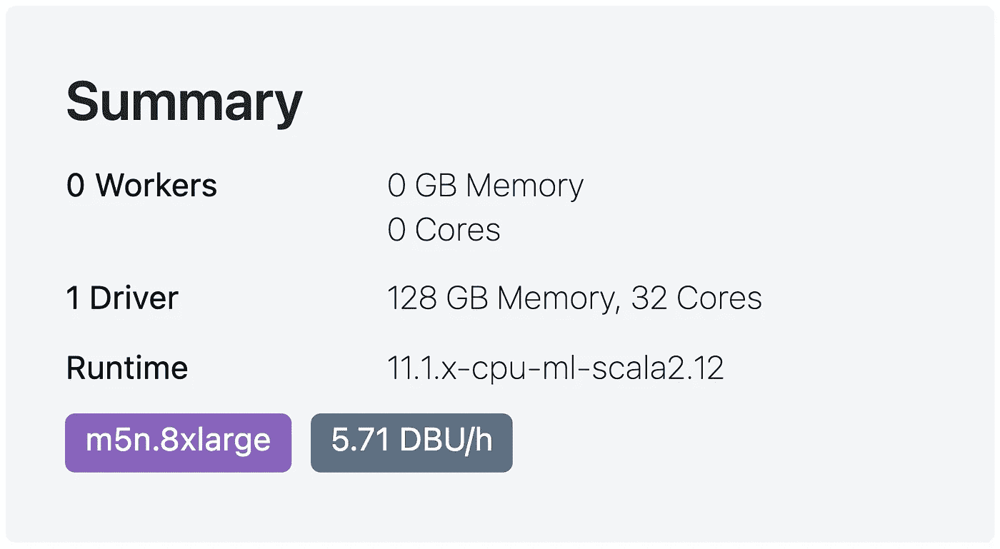

# 超越拥抱脸的视觉变形金刚(ViT)|第 2 部分

> 原文：<https://blog.devgenius.io/scale-vision-transformers-vit-beyond-hugging-face-part-2-b7b296d548b7?source=collection_archive---------23----------------------->

## 加快拥抱脸最先进的维生素 t 模型🤗借助 Databricks、Nvidia 和 Spark NLP，速度提升高达 2300%(25 倍)🚀

**通过使用**数据模块**、**英伟达**和 **Spark NLP** 扩展**基于**变压器**的型号

《超越拥抱脸|第一部 》前情提要:

> **裸机戴尔服务器:Spark NLP** 在预测具有 3K 图像的样本数据集的图像类时，比 CPU**上的拥抱脸**快 **65%,在具有 34K 图像的较大数据集上快 47%。 **Spark NLP** 在单个 **GPU** 推理 34K 图像的较大数据集上比拥抱脸**快 **79%，在较小数据集上快 35%。**

> 本文的目的是演示如何从 Hugging Face 向外扩展 Vision Transformer (ViT)模型，并将其部署到生产就绪环境中，以实现加速和高性能的推理。最后，我们将通过使用 Databricks、Nvidia 和 Spark NLP，将拥抱脸的 ViT 模型扩展 25 倍(2300%)。

## 在本文的第 2 部分，我将:

*   CPU 和 GPU 上 Databricks 单节点内部的基准拥抱面
*   CPU 和 GPU 上 Databricks 单节点内部的基准 Spark NLP

> *本着完全透明的精神，GitHub* 上的 [***提供了所有的笔记本及其日志、截图，甚至带有数字的 excel 表格***](https://github.com/JohnSnowLabs/spark-nlp-workshop/tree/master/tutorials/blogposts/medium/scale-vision-transformers-vit-beyond-hugging-face?ref=hackernoon.com)

 [## 超越拥抱脸的视觉变形金刚(ViT)|第 1 部分

### 加快拥抱脸最先进的维生素 t 模型🤗使用 Databricks、Nvidia 和……最高可达 2300%(快 25 倍)

blog.devgenius.io](/scale-vision-transformers-vit-beyond-hugging-face-part-1-e09318cab588)  [## 超越拥抱脸的视觉变形金刚(ViT)|第 2 部分

### 加速拥抱脸的最先进的维生素 t 模型🤗使用 Databricks、Nvidia 和……最高可达 2300%(快 25 倍)

blog.devgenius.io](/scale-vision-transformers-vit-beyond-hugging-face-part-2-b7b296d548b7)  [## 超越拥抱脸的视觉变形金刚(ViT)|第 3 部分

### 加速拥抱脸的最先进的维生素 t 模型🤗使用 Databricks、Nvidia 和……最高可达 2300%(快 25 倍)

blog.devgenius.io](/scale-vision-transformers-vit-beyond-hugging-face-part-3-5b8c13ef6477) 

# 数据块上的火花 NLP 和拥抱脸

**什么是数据块？**您所有的数据、分析和人工智能都在一个平台上

Databricks 是一个基于云的平台，拥有一套数据工程和数据科学工具，被许多公司广泛用于处理和转换大量数据。用户将数据块用于许多目的，从处理和转换大量数据到运行许多 ML/DL 管道来探索数据。

**免责声明:**这是我对 Databricks 的解释，它的确有很多其他特性，你应该去看看:[https://www.databricks.com/product/data-lakehouse](https://www.databricks.com/product/data-lakehouse)

Databricks 支持 AWS、Azure 和 GCP 云:[https://www.databricks.com/product/data-lakehouse](https://www.databricks.com/product/data-lakehouse)

**AWS 上带 CPU 的 Databricks 单节点中的拥抱面**

当您创建一个集群时，Databricks 提供了一个 **"Single Node"** 集群类型，它适合于那些希望仅在一台机器上使用 Apache Spark 或者使用非 Spark 应用程序的人，尤其是基于 ML 和 DL 的 Python 库。当您选择 Datanricks `11.1 ML`运行时，拥抱脸已经安装。在我们开始基准测试之前，下面是我的单节点数据块(仅 CPU)的集群配置:

数据块单节点集群— CPU 运行时

这个在 **AWS** 上使用 **m5n.8xlarge** 实例的集群的总结是:有 1 个驱动(只有 1 个节点)，128 GB 内存， **32 核**CPU，每小时花费 **5.71 DBU** 。你可以在 AWS 上阅读关于“DBU”的内容:https://www.databricks.com/product/aws-pricing

Databricks 单集群— AWS 实例配置文件

让我们在单节点数据块(仅限 CPU)上复制上一节(裸机戴尔服务器)中的基准测试。我们从拥抱脸和 ImageNet 的样本大小的数据集开始，找出什么样的批量大小是好的，这样我们就可以将它用于更大的数据集，因为这在以前的基准测试中恰好是一个经过验证的实践:

Databricks 单节点 CPU 上的拥抱人脸图像分类流水线—预测 3544 幅图像

在一个仅使用**CPU**的单节点数据块上，我们花了大约 2 分半钟( **149 秒**)完成了对来自样本数据集的大约 **3544 幅图像**的处理。这台机器上仅使用 CPU 的最佳批量是 **8** ，因此我将使用它在更大的数据集上运行基准测试:

Databricks 单节点 CPU 上的拥抱人脸图像分类流水线—预测 34745 幅图像

在超过 34K 图像的较大数据集上，完成这些图像的分类预测大约需要 20 分半钟( **1233 秒**)。对于我们的下一个基准测试，我们需要一个单节点 Databricks 集群，但这次我们需要一个基于 GPU 的运行时，并选择一个基于 GPU 的 AWS 实例。

**AWS 上带有 GPU 的 Databricks 单节点中的拥抱脸**

让我们创建一个新的集群，这一次我们将选择一个带有 GPU 的运行时，在这种情况下称为`11.1 ML (includes Apache Spark 3.3.0, GPU, Scala 2.12)`，它安装了所有必需的 CUDA 和 NVIDIA 软件。接下来我们需要选择一个拥有 GPU 的 AWS 实例，我选择了 **g4dn.8xlarge** ，它拥有 1 个 GPU 和与另一个集群相似数量的内核/内存。这个 GPU 实例带有一个**特斯拉 T4** 和 **16 GB 内存(** 15 GB 可用 GPU 内存)。

Databricks 单节点集群— GPU 运行时

这是我们的单节点集群的总结，就核心数量和内存容量而言，与上一个集群相同，但它配有一个特斯拉 T4 GPU:

Databricks 单节点集群— AWS 实例配置文件

现在我们有了一个带 GPU 的单节点集群，我们可以继续我们的基准测试，看看 Hugging Face 在 Databricks 中的性能如何。我将在较小的数据集上运行基准测试，看看哪种批量更适合我们基于 GPU 的机器:

Databricks 单节点 CPU 上的拥抱人脸图像分类流水线—预测 3544 幅图像

在我们使用 GPU 设备的单节点 Databricks 集群上，大约花了一分钟( **64 秒**)完成了对来自样本数据集的大约 **3544 张图像的处理。如果我们查看批量大小为 1 的结果，批处理提高了速度，但是，在批量大小为 8 之后，结果几乎保持不变。虽然在批量大小为 8 之后结果是相同的，但我还是为我的更大的基准选择了批量大小为 **256** ，以便利用更多的 GPU 内存。(说实话，8 和 256 的表现都差不多)**

让我们在更大的数据集上运行基准测试，看看批量大小为 256 时会发生什么:

Databricks 单节点 CPU 上的拥抱人脸图像分类流水线—预测 34745 幅图像

在一个更大的数据集上，对超过 34K 的图像完成分类预测需要将近 11 分钟( **659 秒**)。如果我们将基准测试的结果在带有 CPU 的单个节点和带有 1 个 GPU 的单个节点上进行比较，我们可以看到 GPU 节点胜出:

拥抱脸(PyTorch)在 GPU 上比 CPU 快 2.3 倍

> 与在 Databricks 单节点上的 Hugging Face 中的 CPU 上运行相同的流水线相比， **GPU** 的速度快了**到 2.3 倍**

现在，我们将通过在相同的集群和相同的数据集上使用 Spark NLP 来运行相同的基准，以将其与拥抱脸进行比较。

## 在单节点数据块上对 Spark NLP 进行基准测试

首先，让我们在您的单节点数据块 CPU 中安装 Spark NLP:

*   在您的集群中的**库**选项卡中，您需要执行以下步骤:
    —安装新的->PyPI->**Spark-NLP = = 4 . 1 . 0**->安装
    —安装新的- > Maven - >坐标->**com . johnsnowlabs . NLP:Spark-NLP _ 2.12:4 . 1 . 0**->安装【T12

如何在 Python、Scala 和 Java 的 CPU 上的 Databricks 中安装 Spark NLP

**AWS 上带 CPU 的 Databricks 单节点中的 Spark NLP**

现在，我们已经在 Databricks 单节点集群上安装了 Spark NLP，我们可以在 CPU 和 GPU 上对样本和完整数据集重复基准测试。让我们先从样本数据集上的 CPU 性能指标评测开始:

Databricks 单节点 CPU(one dnn)上的 Spark NLP 图像分类流水线—预测 3544 幅图像

用了大约 2 分钟( **111 秒**)完成了对 **3544 张图像**的处理，并在同一个单节点 Databricks 集群上预测了它们的类别，该集群使用了我们用于拥抱脸的 CPU。我们可以看到，批量大小为 16 具有最佳结果，因此我将在下一个更大数据集的基准测试中使用它:

Databricks 单节点 CPU(one dnn)上的 Spark NLP 图像分类流水线—预测 34742 幅图像

在拥有超过 **34K 张图像**的大型数据集上，完成这些图像的分类预测大约需要 18 分钟( **1072 秒**)。接下来，我将在使用 GPU 的集群上重复相同的基准测试。

**AWS 上带 GPU 的数据块单节点**

首先，在您的单节点数据块 **GPU** 中安装 Spark NLP(唯一的区别是使用了 Maven 的" **spark-nlp-gpu"** ):

*   在你的**数据块集群**
    中安装**Spark NLP**——在集群内的**库**标签中你需要遵循这些步骤:
    —安装新的->PyPI->**Spark-NLP = = 4 . 1 . 0**->安装
    —安装新的- > Maven - >坐标->**com . johnsnow**

如何在用于 Python、Scala 和 Java 的 GPU 上的 Databricks 中安装 Spark NLP

我将在较小的数据集上运行基准测试，看看哪种批量更适合我们基于 GPU 的机器:

Databricks 单节点 GPU 上的 Spark NLP 图像分类流水线—预测 3544 幅图像

用了不到一分钟( **47 秒**)的时间，我们用 GPU 设备在单节点数据块上完成了对来自样本数据集的 **3544 张图像**的处理。我们可以看到**批量 8** 在这个特定用例中表现最佳，因此我将在更大的数据集上运行基准测试:

Databricks 单节点 GPU 上的 Spark NLP 图像分类流水线—预测 34742 幅图像

在一个更大的数据集上，花了将近 7 分半钟( **435 秒**)来完成对超过 **34K 图像的分类预测**。如果我们将基准测试的结果在带有 CPU 的单个节点和带有 1 个 GPU 的单个节点上进行比较，我们可以看到 GPU 节点胜出:

在 Databricks 单节点中，Spark NLP 在 GPU 上的速度是 CPU 的 2.5 倍

> 这太棒了！我们可以看到，即使启用了 oneDNN，GPU 上的 Spark NLP 也比 CPU 快 2.5 倍(oneDNN 将 CPU 的性能提高了 10%至 20%)。

让我们来看看这些结果如何与相同 Databricks 单节点集群中的拥抱脸基准进行比较:

> **Spark NLP** 在预测具有 3K 图像的样本数据集的图像类别时，在**CPU 上比拥抱脸**快达 **15%** ，在具有 34K 图像的较大数据集上快达 **34%** 。 **Spark NLP** 在单个 **GPU 上比拥抱脸**快 **51%,对于具有 34K 图像的较大数据集，在具有 3K 图像的较小数据集上快**36%****。****

********

****Spark NLP** 在**CPU**和**GPU**上比在 Databricks 单节点中的**拥抱面**更快**

****

****Spark NLP** 在数据块单节点中的**CPU**和**GPU**与**拥抱面**上都更快**

**在 [**第 3 部分**](https://medium.com/@maziyar/scale-vision-transformers-vit-beyond-hugging-face-part-3-5b8c13ef6477) 中，我将在 Databricks 多节点(CPU & GPU)上运行相同的基准测试，以比较 Spark NLP 与 Hugging Face。**

# **参考**

****ViT****

*   **[https://arxiv.org/pdf/2010.11929.pdf](https://arxiv.org/pdf/2010.11929.pdf)**
*   **[https://github.com/google-research/vision_transformer](https://github.com/google-research/vision_transformer)**
*   **[图像识别中的视觉变压器(ViT)——2022 指南](https://viso.ai/deep-learning/vision-transformer-vit/)**
*   **【https://github.com/lucidrains/vit-pytorch **
*   **[https://medium . com/mlearning-ai/an-image-is-worth-16x 16-words-transformers-for-image-recognition-at-scale-51f 3561 a9f 96](https://medium.com/mlearning-ai/an-image-is-worth-16x16-words-transformers-for-image-recognition-at-scale-51f3561a9f96)**
*   **[https://medium . com/nerd-for-tech/an-image-worth-16x 16-words-transformers-for-image-recognition-at-scale-paper-summary-3a 387 e 71880 a](https://medium.com/nerd-for-tech/an-image-is-worth-16x16-words-transformers-for-image-recognition-at-scale-paper-summary-3a387e71880a)**
*   **[https://gareemadhingra 11 . medium . com/summary-of-paper-an-image-worth-16x 16-words-3f 7 F3 ACA 941](https://gareemadhingra11.medium.com/summary-of-paper-an-image-is-worth-16x16-words-3f7f3aca941)**
*   **[https://medium . com/analytics-vid hya/vision-transformers-bye-bye-convolutions-e 929d 022 E4 ab](https://medium.com/analytics-vidhya/vision-transformers-bye-bye-convolutions-e929d022e4ab)**
*   **[https://medium . com/synced review/Google-brain-uncovers-re presentation-structure-differences-between-CNN-and-vision-transformers-83b 6835 db BAC](https://medium.com/syncedreview/google-brain-uncovers-representation-structure-differences-between-cnns-and-vision-transformers-83b6835dbbac)**

****抱紧脸****

*   **[https://hugging face . co/docs/transformers/main _ classes/pipelines](https://huggingface.co/docs/transformers/main_classes/pipelines)**
*   **[https://huggingface.co/blog/fine-tune-vit](https://huggingface.co/blog/fine-tune-vit)**
*   **[https://huggingface.co/blog/vision-transformers](https://huggingface.co/blog/vision-transformers)**
*   **[https://huggingface.co/blog/tf-serving-vision](https://huggingface.co/blog/tf-serving-vision)**
*   **[https://huggingface.co/blog/deploy-tfserving-kubernetes](https://huggingface.co/blog/deploy-tfserving-kubernetes)**
*   **[https://huggingface.co/google/vit-base-patch16-224](https://huggingface.co/google/vit-base-patch16-224)**
*   **[https://huggingface.co/blog/deploy-vertex-ai](https://huggingface.co/blog/deploy-vertex-ai)**
*   **https://huggingface.co/models?other=vit**

****数据砖块****

*   **[https://www . data bricks . com/spark/getting-started-with-Apache-spark](https://www.databricks.com/spark/getting-started-with-apache-spark)**
*   **[https://docs.databricks.com/getting-started/index.html](https://docs.databricks.com/getting-started/index.html)**
*   **[https://docs . databricks . com/getting-started/quick-start . html](https://docs.databricks.com/getting-started/quick-start.html)**
*   **看最好的[数据+AI 峰会 2022](https://www.databricks.com/dataaisummit/)**
*   **[https://www . data bricks . com/blog/2020/05/15/shrink-training-time-and-cost-using-NVIDIA-GPU-accelerated-xgboost-and-Apache-spark-on-data bricks . html](https://www.databricks.com/blog/2020/05/15/shrink-training-time-and-cost-using-nvidia-gpu-accelerated-xgboost-and-apache-spark-on-databricks.html)**

****火花 NLP****

*   **[Spark NLP GitHub](https://github.com/JohnSnowLabs/spark-nlp)**
*   **[Spark NLP 研讨会](https://github.com/JohnSnowLabs/spark-nlp-workshop) (Spark NLP 示例)**
*   **[火花 NLP 变压器](https://nlp.johnsnowlabs.com/docs/en/transformers)**
*   **[Spark NLP 车型轮毂](https://nlp.johnsnowlabs.com/models?edition=Spark+NLP)**
*   **[Spark NLP 3 中的速度优化&基准测试:充分利用现代硬件](https://www.johnsnowlabs.com/watch-webinar-speed-optimization-benchmarks-in-spark-nlp-3-making-the-most-of-modern-hardware/)**
*   **[Spark NLP 中的硬件加速](https://nlp.johnsnowlabs.com/docs/en/hardware_acceleration)**
*   **[通过 API 服务 Spark NLP:Spring 和 LightPipelines](https://medium.com/spark-nlp/serving-spark-nlp-via-api-spring-and-lightpipelines-64d2e6413327)**
*   **[通过 API 服务 Spark NLP(1/3):微软的 Synapse ML](https://medium.com/spark-nlp/serving-spark-nlp-via-api-1-3-microsoft-synapse-ml-2c77a3f61f9d)**
*   **[通过 API (2/3)服务 Spark NLP:FastAPI 和 LightPipelines](https://medium.com/spark-nlp/serving-spark-nlp-via-api-2-3-fastapi-and-lightpipelines-218d1980c9fc)**
*   **[通过 API 服务 Spark NLP(3/3):数据块作业和 MLFlow 服务 API](https://medium.com/spark-nlp/serving-spark-nlp-via-api-3-3-databricks-and-mlflow-serve-apis-4ef113e7fac4)**
*   **[利用 Scala 中的深度学习和 Spark 3.0 上的 GPU](https://aws.amazon.com/blogs/opensource/leverage-deep-learning-in-scala-with-gpu-on-spark-3-0/)**
*   **[开始使用 GPU 加速的 Apache Spark 3](https://www.nvidia.com/en-us/ai-data-science/spark-ebook/getting-started-spark-3/)**
*   **[Apache Spark 性能调优](https://spark.apache.org/docs/latest/sql-performance-tuning.html)**
*   **GPU 上可能的额外优化:[Apache Spark 配置的 RAPIDS 加速器](https://nvidia.github.io/spark-rapids/docs/configs.html)**