# 超越拥抱脸的视觉å˜å½¢é‡‘刚(ViT)|第 3 部分

> åŸæ–‡ï¼š<https://blog.devgenius.io/scale-vision-transformers-vit-beyond-hugging-face-part-3-5b8c13ef6477?source=collection_archive---------22----------------------->

## 加快拥抱脸最先进的维生素 t 模å‹ğŸ¤—借助 Databricksã€Nvidia å’Œ Spark NLP，速度æå‡é«˜è¾¾ 2300%(25 å€)🚀

**通过使用**æ•°æ®æ¨¡å—**ã€**英伟达**å’Œ **Spark NLP** 扩展**基äº**å˜å‹å™¨**çš„å‹å·

《超越拥抱脸|第二部 》å‰æƒ…æè¦:

> **Databricks å•èŠ‚点: *Spark NLP*** *比* ***上的抱脸器快 15%****CPU**在带有 3K 图åƒçš„样本数æ®é›†ä¸Šé¢„测图åƒç±»ï¼Œåœ¨å¸¦æœ‰ 34K 图åƒçš„较大数æ®é›†ä¸Šå¿« 34%****。****Spark NLP****也比***å¿« 51%****GPU****对äºæ‹¥æœ‰ 34K 图åƒçš„更大数æ®é›†ï¼Œé€Ÿåº¦å¯è¾¾******å¿« 36%********

> ****æœ¬æ–‡çš„ç›®çš„æ˜¯æ¼”ç¤ºå¦‚ä½•ä» Hugging Face å‘外扩展 Vision Transformer (ViT)模å‹ï¼Œå¹¶å°†å…¶éƒ¨ç½²åˆ°ç”Ÿäº§å°±ç»ªç¯å¢ƒä¸­ï¼Œä»¥å®ç°åŠ é€Ÿå’Œé«˜æ€§èƒ½çš„æ¨ç†ã€‚最å，我们将通过使用 Databricksã€Nvidia å’Œ Spark NLP，将拥抱脸的 ViT 模å‹æ‰©å±• 25 å€(2300%)。****

## ****在本文的第 3 部分，我将:****

*   ****æ•°æ®å—内部的基准 Spark NLP 通过 CPU å’Œ GPU 扩展到 10 å€èŠ‚点****
*   ****总结一切ï¼****

> *****本ç€å®Œå…¨é€æ˜çš„ç²¾ç¥ï¼ŒGitHub* 上的****

****** [## 超越拥抱脸的视觉å˜å½¢é‡‘刚(ViT)|第 1 部分

### 加快拥抱脸最先进的维生素 t 模å‹ğŸ¤—使用 Databricksã€Nvidia 和……最高å¯è¾¾ 2300%(å¿« 25 å€)

blog.devgenius.io](/scale-vision-transformers-vit-beyond-hugging-face-part-1-e09318cab588)  [## 超越拥抱脸的视觉å˜å½¢é‡‘刚(ViT)|第 2 部分

### 加快拥抱脸最先进的维生素 t 模å‹ğŸ¤—使用 Databricksã€Nvidia 和……最高å¯è¾¾ 2300%(å¿« 25 å€)

blog.devgenius.io](/scale-vision-transformers-vit-beyond-hugging-face-part-2-b7b296d548b7)  [## 超越拥抱é¢éƒ¨çš„电å­ç§¤è§†è§‰å˜å½¢é‡‘刚(ViT)|第 3 部分

### 在拥抱脸中加速最先进的 ViT 模å‹ğŸ¤—使用 Databricksã€Nvidia 和…å¯å®ç°é«˜è¾¾ 2300%的性能æå‡(速度æå‡ 25 å€)

blog.devgenius.io](/scale-vision-transformers-vit-beyond-hugging-face-part-3-5b8c13ef6477) 

# 超越å•å°æœºå™¨

到目å‰ä¸ºæ­¢ï¼Œæˆ‘们已ç»ç¡®å®šåœ¨è£¸æœºæœåŠ¡å™¨å’Œ Databricks å•èŠ‚点上， **GPU** 上的**拥抱脸**比**CPU**上的**拥抱脸**更快。当您用这些新的基äºå˜å‹å™¨çš„模å‹æ¯”较 GPU å’Œ CPU 时，这就是您所期望的。

在相åŒçš„æ•°æ®é›†ä¸Šï¼Œåœ¨è£¸æœºæœåŠ¡å™¨å’Œ Databricks å•èŠ‚点集群中，对äºç›¸åŒçš„管é“(ViT 模å‹)，我们已ç»ç¡®å®š **Spark NLP** 优äº**拥抱脸**，并且在 CPU å’Œ GPU 设备上都表ç°æ›´å¥½ã€‚å¦ä¸€æ–¹é¢ï¼Œè¿™å¹¶ä¸æ˜¯æˆ‘所期望的。当我准备这篇文章的时候，我期望 Spark NLP 中的 TensorFlow æ¨ç†æ¯”使用 PyTorch 的拥抱脸æ¨ç†ç¨å¾®æ…¢ä¸€ç‚¹ï¼Œæˆ–者至少是ä¸ç›¸ä¸Šä¸‹ã€‚我的目标是这一部分，超越å•å°æœºå™¨**扩展管é“。但是 Spark NLP ä¼¼ä¹æ¯”拥抱脸更快，å³ä½¿æ˜¯åœ¨ä¸€å°æœºå™¨ä¸Šï¼Œåœ¨ä¸¤ä¸ª **CPU** å’Œ **GPU** 上，在两个**å°çš„**å’Œ**大的**æ•°æ®é›†ä¸Šã€‚**

**问题:**如æœæ‚¨æƒ³åŠ å¿« ViT 管é“的速度，该æ€ä¹ˆåŠï¼Ÿå¦‚æœæ‚¨æœ‰æ›´å¤§çš„æ•°æ®é›†ï¼Œå´æ— æ³•å°†å®ƒä»¬æ”¾åœ¨ä¸€å°æœºå™¨ä¸­ï¼Œæˆ–者åªéœ€è¦å¤ªé•¿æ—¶é—´æ‰èƒ½å¾—到结æœï¼Œè¯¥æ€ä¹ˆåŠï¼Ÿ

**å›ç­”:**å‘外扩展ï¼è¿™æ„味ç€ä¸è¦è°ƒæ•´åŒä¸€å°æœºå™¨çš„大å°ï¼Œè€Œæ˜¯å‘集群中添加更多的机器。您需è¦ä¸€äº›ä¸œè¥¿æ¥ç®¡ç†æ‰€æœ‰è¿™äº›ä½œä¸š/任务/调度 DAGs 管ç†å¤±è´¥çš„任务/等等。这些都有它们的开销，但是如æœä½ éœ€è¦æ›´å¿«æˆ–者å¯èƒ½çš„东西(在一å°æœºå™¨ä¹‹å¤–),你必须使用æŸç§åˆ†å¸ƒå¼ç³»ç»Ÿã€‚

> **按比例放大=** 使机器更大或更快，以便能够处ç†æ›´å¤šè´Ÿè½½ã€‚
> 
> **横å‘扩展=** 并行添加更多机器以分散负载。

## 缩å°æ‹¥æŠ±è„¸:

查看拥抱脸官网的页é¢è¡¨æ˜ï¼Œåªæœ‰ä½¿ç”¨å¤š GPU æ‰èƒ½è¿›è¡Œç¼©æ”¾æ¨æ–­ã€‚正如我们所æ述的横å‘扩展，它ä»ç„¶åœç•™åœ¨ä¸€å°æœºå™¨ä¸Š:

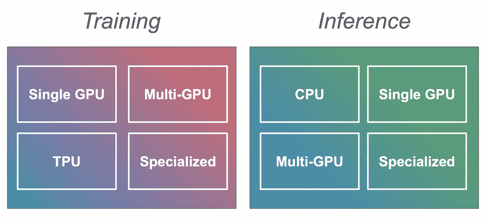

[https://huggingface.co/docs/transformers/performance](https://huggingface.co/docs/transformers/performance)

> å¦å¤–，更ä¸ç”¨è¯´ç›®å‰è¿˜ä¸å­˜åœ¨æ‹¥æŠ±è„¸ä¸­**æ¨ç†**çš„**多处ç†å™¨**解决方案:

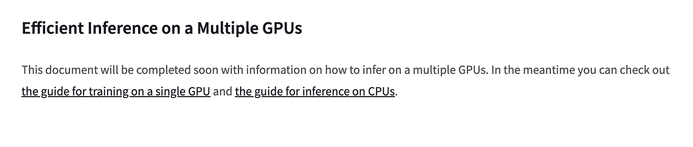

[https://hugging face . co/docs/transformers/perf _ infer _ GPU _ many](https://huggingface.co/docs/transformers/perf_infer_gpu_many)

因此，似ä¹æ²¡æœ‰æœ¬åœ°/官方的方å¼æ¥**扩展**拥抱脸管é“。您å¯ä»¥å®ç°ç”±ä¸€äº›å¾®æœåŠ¡ç»„æˆçš„æ¶æ„，例如作业队列ã€æ¶ˆæ¯ä¼ é€’åè®®ã€RESTful APIs å端和一些其他必需的组件，以将æ¯ä¸ªè¯·æ±‚分布到ä¸åŒçš„机器上，但这是按å•ä¸ªç”¨æˆ·æ‰©å±•è¯·æ±‚，而ä¸æ˜¯æ‰©å±•å®é™…的系统本身。

æ­¤å¤–ï¼Œæ­¤ç±»ç³»ç»Ÿçš„å»¶è¿Ÿä¸ Apache Spark 等本地分布å¼ç³»ç»Ÿä¸å¯åŒæ—¥è€Œè¯­(gRPC å¯èƒ½ä¼šé™ä½å»¶è¿Ÿï¼Œä½†ä»ç„¶æ²¡æœ‰ç«äº‰åŠ›)。更ä¸ç”¨è¯´å•ç‚¹æ•…障问题，管ç†å¤±è´¥çš„作业/任务/è¾“å…¥ï¼Œä»¥åŠ Apache Spark æ供的数百个其他特性，ç°åœ¨æ‚¨å¿…须自己å®ç°/维护这些特性。

在拥抱脸网站上有一篇åšæ–‡æ述了通过扩展 REST 端点æ¥æœåŠ¡æ›´å¤šç”¨æˆ·çš„完全相åŒçš„æ¶æ„:“[部署🤗ViT on Kubernetes with TF Serving](https://huggingface.co/blog/deploy-tfserving-kubernetes)“我相信其他公å¸ä¹Ÿåœ¨ä½¿ç”¨ç±»ä¼¼çš„方法æ¥æ‰©å±•æ‹¥æŠ±è„¸ï¼Œä½†æ˜¯ï¼Œä»–们都在扩展触åŠæ¨ç† REST 端点的用户/请求的数é‡ã€‚此外，您ä¸èƒ½åœ¨**æ•°æ®å—上以这ç§æ–¹å¼ç¼©æ”¾æ‹¥æŠ±è„¸ã€‚**

> 例如，fastAPI 内部的æ¨ç†æ¯”本地æ¨ç†æ…¢ 10 å€:[https://towards data science . com/hugging-face-transformer-inference-under-1 毫秒-latency-e1be0057a51c](https://towardsdatascience.com/hugging-face-transformer-inference-under-1-millisecond-latency-e1be0057a51c)

一旦拥抱脸æ供了一些本地解决方案，我将å†æ¬¡è¿è¡ŒåŸºå‡†ã€‚在此之å‰ï¼Œå½“您必须在循ç¯ç®—法中ä»å•å°æœºå™¨éå†æ•°æ®é›†ä»¥åˆ°è¾¾ REST 端点时，没有å‘外扩展。(å†æƒ³æƒ³æˆ‘们一次将行/åºåˆ—/图åƒåˆ†æ‰¹é€å…¥ GPU 的部分，你就æ˜ç™½äº†)

## 扩展 Spark NLP:

Spark NLP 是 Spark ML 的扩展，因此它å¯ä»¥åœ¨ Apache Spark 支æŒçš„所有平å°ä¸Šè¿›è¡Œæœ¬æœºæ— ç¼æ‰©å±•ï¼Œä¾‹å¦‚(但ä¸é™äº)Databricksã€AWS EMRã€Azure Insightã€GCP Dataprocã€Clouderaã€SageMakerã€Kubernetes 等等。

> 零代ç å˜åŒ–是必è¦çš„ï¼Spark NLP å¯ä»¥åœ¨ä¸æ”¹å˜ä»»ä½•ä»£ç çš„情况下ä»å•å°æœºå™¨æ‰©å±•åˆ°æ— é™å¤šå°æœºå™¨ï¼

您也ä¸éœ€è¦ä» Spark NLP 中导出任何模å‹ï¼Œå°±å¯ä»¥åœ¨ä¸€ä¸ªå®Œå…¨ä¸åŒçš„库中使用它æ¥åŠ é€Ÿæˆ–扩展æ¨ç†ã€‚

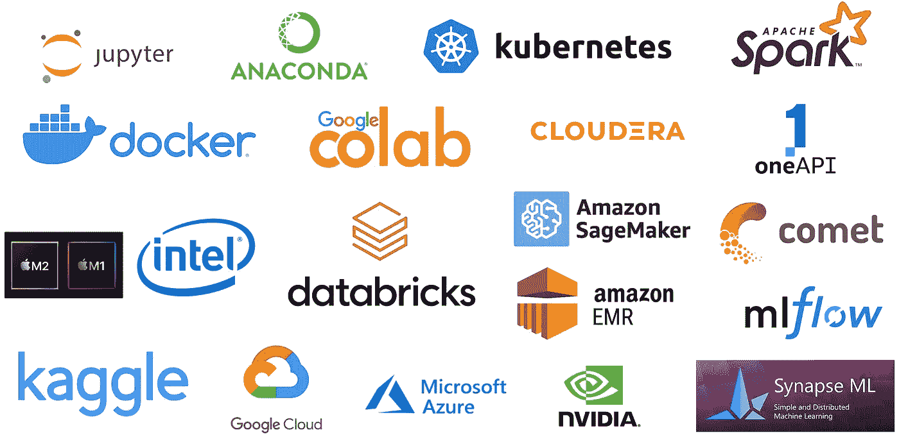

Spark NLP 生æ€ç³»ç»Ÿ:ç»è¿‡ä¼˜åŒ–ã€æµ‹è¯•å’Œæ”¯æŒçš„集æˆ

# AWS 上带 CPU 的 Databricks 多节点

让我们创建一个集群，这次我们选择**标准**内部**集群模å¼**。这æ„味ç€æˆ‘们的集群中å¯ä»¥æœ‰ä¸æ­¢ä¸€ä¸ªèŠ‚点，在 Apache Spark 术语中，这æ„å‘³ç€ 1 个驱动程åºå’Œ N 个工作器(执行器)。

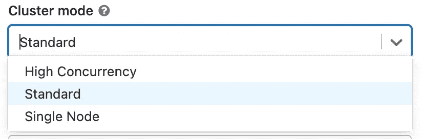

我们还需è¦é€šè¿‡`Libraries`选项å¡åœ¨è¿™ä¸ªæ–°é›†ç¾¤ä¸­å®‰è£… Spark NLP。对äºå¸¦ CPU çš„å•èŠ‚点数æ®å—，您å¯ä»¥éµå¾ªæˆ‘在上一节中æ到的步骤。如您所è§ï¼Œæˆ‘选择了我用æ¥æµ‹è¯• Hugging Face å’Œ Spark NLP çš„åŸºäº CPU çš„ AWS å®ä¾‹ï¼Œè¿™æ ·æˆ‘们就å¯ä»¥çœ‹åˆ°å½“我们添加更多节点时它是如何扩展的。

这是我们的集群é…置的样å­:

åªæœ‰ CPU çš„ Databricks 多节点(标准)集群

我将é‡ç”¨æˆ‘在以å‰çš„基准测试中使用的相åŒçš„ Spark NLP 管é“**(ä¸éœ€è¦æ›´æ”¹ä»»ä½•ä»£ç )**，并且我将åªä½¿ç”¨å…·æœ‰ 34K 图åƒçš„较大数æ®é›†ã€‚我们开始å§ï¼

## 在具有 2 个节点的 CPU 上扩展 Spark NLP

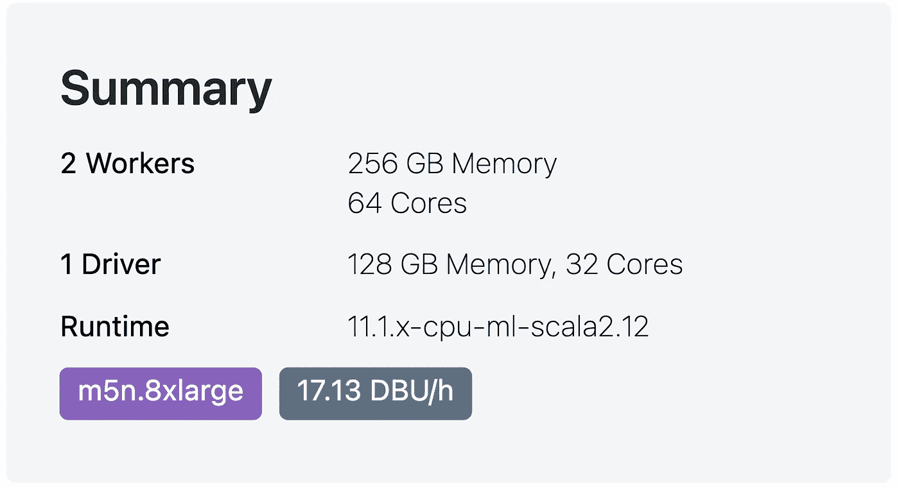

具有 2 个节点的数æ®å—â€”ä»…é™ CPU

我们åªéœ€å†æ·»åŠ  1 个节点，将进行处ç†çš„æœºå™¨æ€»æ•°ä» 1 å°å¢åŠ åˆ° 2 å°ã€‚当您ä»å•æœºè®¾ç½®(您的 Colabã€Kaggleã€Databricks å•èŠ‚点，甚至您的本地 Jupyter 笔记本)过渡到多节点集群设置(Databricksã€EMRã€GCPã€Azureã€Clouderaã€YARNã€Kubernetes ç­‰)时，我们ä¸è¦å¿˜è®° Spark NLP 的魅力。)，需è¦é›¶ä»£ç ä¿®æ”¹ï¼æˆ‘是说零ï¼è€ƒè™‘åˆ°è¿™ä¸€ç‚¹ï¼Œæˆ‘å°†åœ¨è¿™ä¸ªæ–°é›†ç¾¤ä¸­å¯¹åŒ…å« 34K 图åƒçš„较大数æ®é›†è¿è¡Œç›¸åŒçš„基准测试:

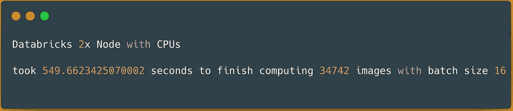

Spark NLP 图åƒåˆ†ç±»æµæ°´çº¿åœ¨å¸¦ CPU çš„ 2x 节点上预测 34742 幅图åƒ

花了大约 **9 分钟** ( **550 秒**)完æˆäº†å¯¹ 34K 图åƒçš„分类预测。让我们将在 **2x 节点**上的结æœä¸ Spark NLP 和在 Databricks å•èŠ‚点上的拥抱é¢ç»“æœè¿›è¡Œæ¯”较(我将在å•ä¸ªèŠ‚点上é‡å¤æ‹¥æŠ±é¢ç»“æœä½œä¸ºå‚考，因为拥抱é¢ä¸èƒ½åœ¨å¤šå°æœºå™¨ä¸Šæ‰©å±•ï¼Œå°¤å…¶æ˜¯åœ¨ Databricks 上):

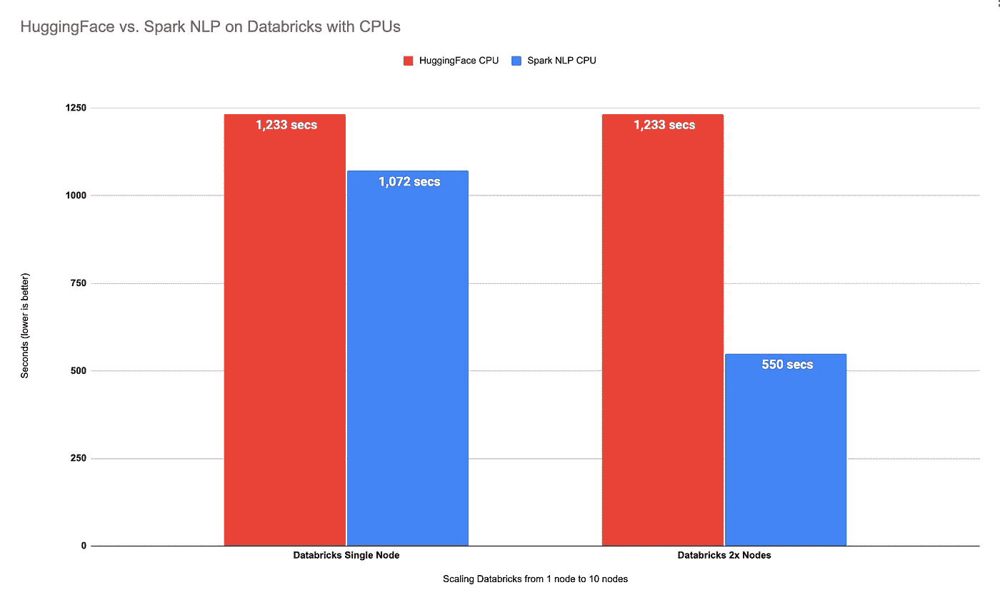

**Spark NLP** 比拥有 **2x 节点**的拥抱脸**快 124%**

之å‰ï¼ŒSpark NLP 在å•èŠ‚点 Databricks 集群上仅使用 CPU 就击败了 Hugging Face**15%**。

> 这一次，Spark NLP 通过仅使用 2x 个节点而ä¸æ˜¯ 1 个节点，完æˆäº†è¶…过 34K 张图åƒçš„处ç†ï¼Œæ¯”拥抱脸快了 124%。

## 在具有 4 个节点的 CPU 上扩展 Spark NLP

让我们åƒä»¥å‰ä¸€æ ·å°†é›†ç¾¤çš„规模扩大一å€ï¼Œä» **2x 节点**å¢åŠ åˆ° **4x 节点。**这是带有 4 个节点的集群的外观:

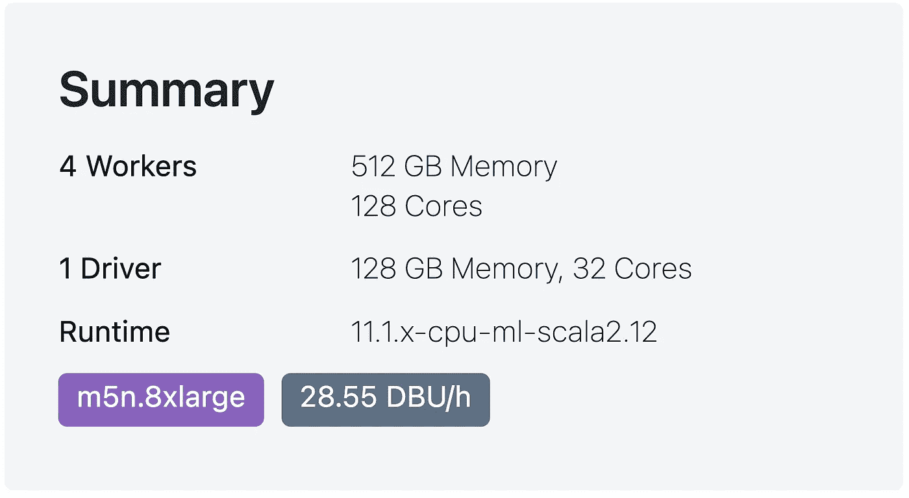

带 4 个节点的数æ®å—â€”ä»…é™ CPU

我将在具有 34K 图åƒçš„较大数æ®é›†ä¸Šå¯¹è¿™ä¸ªæ–°é›†ç¾¤è¿è¡Œç›¸åŒçš„基准测试:

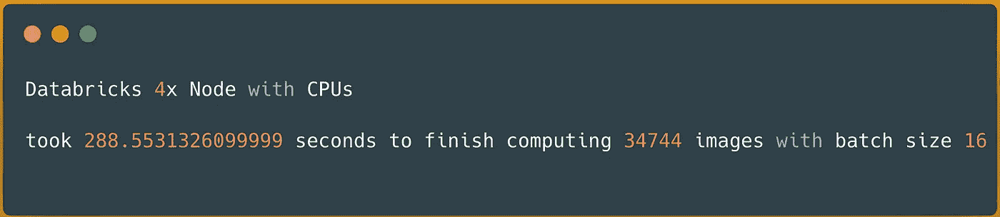

Spark NLP 图åƒåˆ†ç±»æµæ°´çº¿åœ¨å¸¦ CPU çš„ 4x 节点上预测 34742 幅图åƒ

用了大约 **5 分钟** ( **289 秒**)完æˆäº† 34K 图åƒçš„预测分类。让我们比较一下在带有 Spark NLP çš„ **4x 节点**上的结æœå’Œåœ¨ Databricks 上的 CPU 上的拥抱脸:

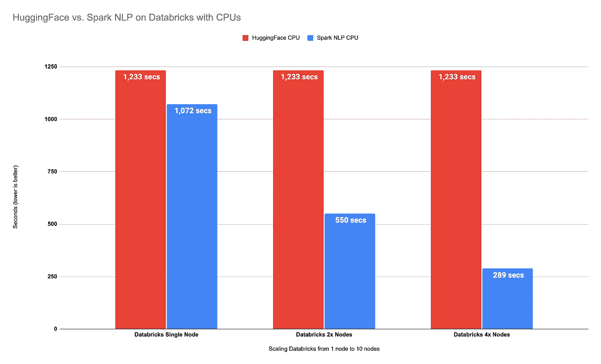

**Spark NLP** 比拥有 **4x 节点**的拥抱脸**快 327%**

> å¯ä»¥çœ‹å‡ºï¼ŒSpark NLP ç°åœ¨æ¯” CPU 上的 Hugging Face å¿«**327%**,而在数æ®å—中åªä½¿ç”¨äº† **4x 个节点**。

## 在具有 8 个节点的 CPU 上扩展 Spark NLP

ç°åœ¨ï¼Œè®©æˆ‘们通过å†æ·»åŠ  4x 个节点æ¥ä½¿ä¹‹å‰çš„集群翻å€ï¼Œæ€»å…±æœ‰ **8x 个节点**。顺便说一下，调整集群的大å°é常简å•ï¼Œåªéœ€å¢åŠ é›†ç¾¤é…置中的工作线程数é‡:

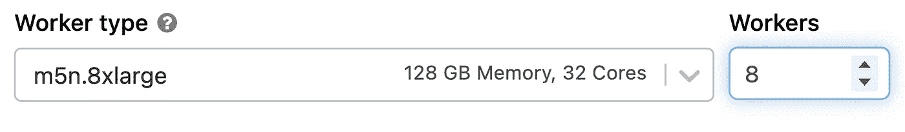

调整数æ®å—中ç«èŠ±ç°‡çš„大å°

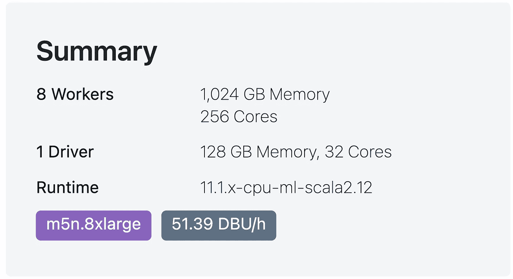

具有 8 个节点的数æ®å—â€”ä»…é™ CPU

让我们这次在 **8x 节点上è¿è¡Œç›¸åŒçš„基准:**

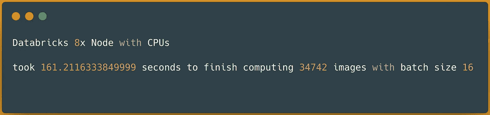

带 CPU çš„ **8x 节点**上的 Spark NLP 图åƒåˆ†ç±»æµæ°´çº¿(oneDNN) —预测 34742 幅图åƒ

用了 2 分åŠå¤šé’Ÿ( **161 秒**)完æˆäº† 34K 图åƒçš„预测分类。让我们比较一下在 **8x 节点**上 Spark NLP 的结æœä¸åœ¨ Databricks 上 CPU 上拥抱脸的结æœ:

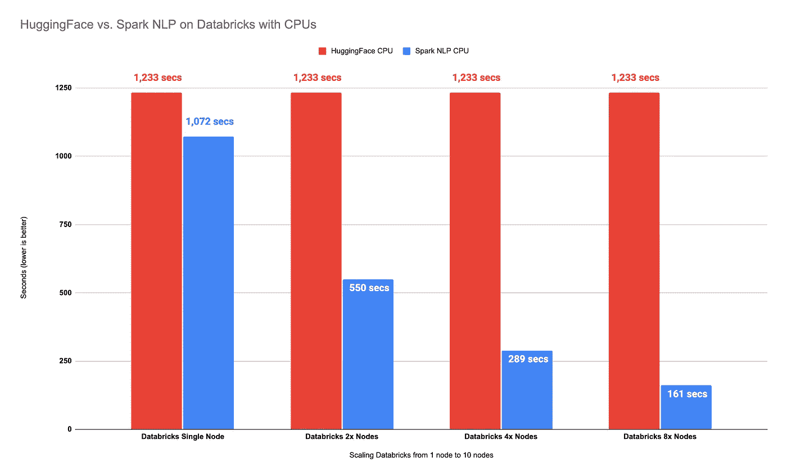

**Spark NLP** 比 **666%快**用 **8x 节点抱脸**

> å¯ä»¥çœ‹å‡ºï¼ŒSpark NLP ç°åœ¨æ¯” CPU 上的 Hugging Face å¿«**666%**,而在数æ®å—中仅使用 **8x 节点**。

让我们忽略这里的数字 6ï¼(如æœèƒ½è®©ä½ æ„Ÿè§‰å¥½ç‚¹çš„è¯ï¼Œæ˜¯ 665.8%)

## 在具有 10 å€èŠ‚点的 CPU 上扩展 Spark NLP

为了使用 Spark NLP 完æˆæˆ‘们对数æ®å—中 CPU çš„ ViT 模å‹é¢„测，我将å†æ¬¡è°ƒæ•´é›†ç¾¤çš„大å°ï¼Œå¹¶å°†å…¶å¢åŠ åˆ° **10x 节点:**

具有 10 个节点的数æ®å—â€”ä»…é™ CPU

让我们这次在 **10x 节点上è¿è¡Œç›¸åŒçš„基准:**

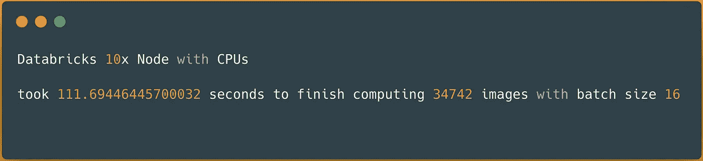

在 **10x 节点**上使用 CPU(oneDNN)çš„ Spark NLP 图åƒåˆ†ç±»æµæ°´çº¿â€”预测 34742 幅图åƒ

用了ä¸åˆ° **2 分钟** ( **112 秒**)完æˆäº†å¯¹ 34K 图åƒçš„预测分类。让我们将 **10x 节点**上的结æœä¸ä¹‹å‰åœ¨ Databricks 上 Spark NLP ä¸ CPU 上 Hugging Face 的所有结æœè¿›è¡Œæ¯”较:

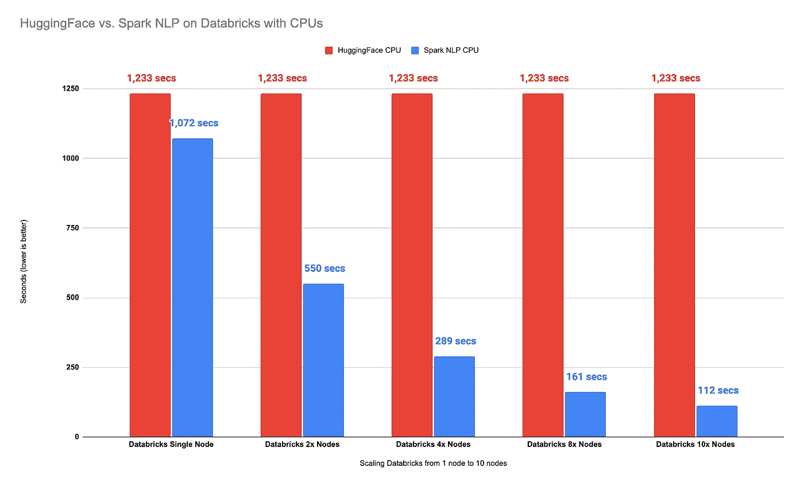

**ç«èŠ± NLP** 比 **10x 节点**抱脸**å¿« 1000%**

> 这就是你如何通过使用 Databricks 中的 **Spark NLP** 在 **10x 节点**上扩展æ¥è‡ªæ‹¥æŠ±è„¸çš„视觉转æ¢å™¨æ¨¡å‹ï¼æˆ‘们的æµæ°´çº¿ç°åœ¨æ¯” CPU 上的拥抱脸快 1000%。

我们设法通过简å•åœ°ä½¿ç”¨ Spark NLP 使我们的 **ViT** æµæ°´çº¿**比å¡åœ¨ 1 个å•èŠ‚点中的 Hugging Face**å¿« 1000%,但是我们åªä½¿ç”¨äº†**CPU**。让我们看看是å¦å¯ä»¥é€šè¿‡åœ¨ **GPU 集群**上扩展我们的æµæ°´çº¿æ¥è·å¾—åŒæ ·çš„改进。

## AWS 上带有 GPU 的 Databricks 多节点

åŸºäº GPU 的多节点 Databricks 集群ä¸å•èŠ‚点集群é常相似。唯一的区别是选择**标准**并ä¿æŒç›¸åŒçš„ ML/GPU è¿è¡Œæ—¶å’Œæˆ‘们在å•ä¸ªèŠ‚点上的 GPU åŸºå‡†ä¸­é€‰æ‹©çš„ç›¸åŒ AWS å®ä¾‹è§„格。

我们还需è¦é€šè¿‡**库**选项å¡åœ¨è¿™ä¸ªæ–°é›†ç¾¤ä¸­å®‰è£… Spark NLP。和以å‰ä¸€æ ·ï¼Œæ‚¨å¯ä»¥æŒ‰ç…§æˆ‘在使用 GPU çš„å•èŠ‚点数æ®å—中æ到的步骤进行æ“作。

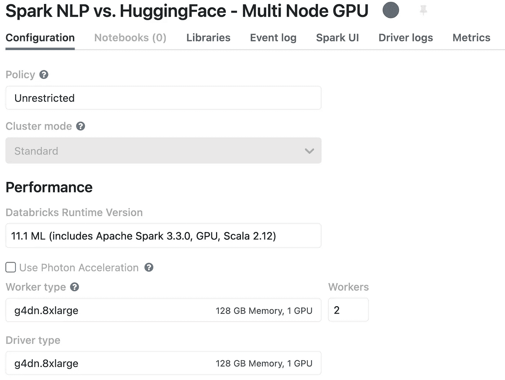

带有 GPU 的 Databricks 多节点(标准)集群

## 在具有 2 个节点的 GPU 上扩展 Spark NLP

我们的多节点 Databricks GPU 集群使用相åŒçš„ AWS GPU å®ä¾‹ **g4dn.8xlarge** ，我们之å‰ä½¿ç”¨è¯¥å®ä¾‹åœ¨å•èŠ‚点 Databricks 集群上è¿è¡Œæˆ‘们的基准æ¥æ¯”较 Spark NLP ä¸ Hugging Face。

这是对这一次两个节点情况的总结:

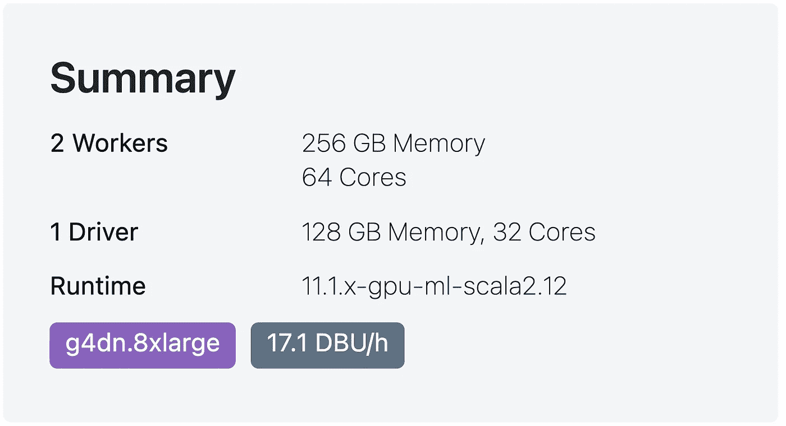

具有 2 个节点的数æ®å——æ¯ä¸ªèŠ‚点 1 个 GPU

我将在这个带有 **2x 节点的 GPU 集群中è¿è¡Œç›¸åŒçš„管é“:**

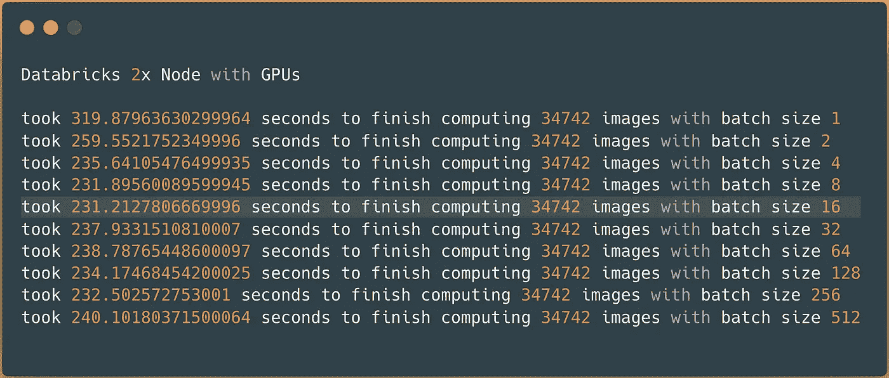

带 GPU çš„ **2x 节点**上的 Spark NLP 图åƒåˆ†ç±»æµæ°´çº¿â€”预测 34742 幅图åƒ

用了 4 分钟( **231 秒**)完æˆäº†å¯¹ **34K 图åƒ**的预测分类。让我们比较一下使用 Spark NLP 在 **2x 节点**上的结æœä¸åœ¨ Databricks 中 GPU 上的拥抱脸的结æœ:

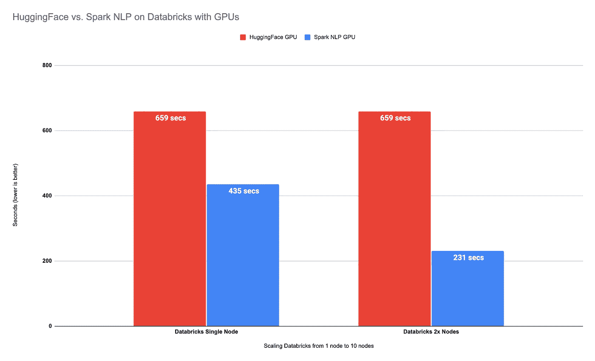

**Spark NLP** 比 **2x 节点**拥抱脸**快 185%**

> 在使用 **GPU 的情况下， **2x 节点**çš„ Spark NLP 比 1 个å•èŠ‚点上的拥抱脸几ä¹å¿«äº†**3 å€** ( **185%** ) 。**

## 在具有 4 个节点的 GPU 上扩展 Spark NLP

让我们将 GPU é›†ç¾¤çš„è§„æ¨¡ä» 2x 节点调整为 **4x 节点。**这是这次使用 GPU çš„ **4x 节点**的总结:

具有 4 个节点的数æ®å——æ¯ä¸ªèŠ‚点 1 个 GPU

让我们在 4x 节点上è¿è¡Œç›¸åŒçš„基准测试，看看会å‘生什么:

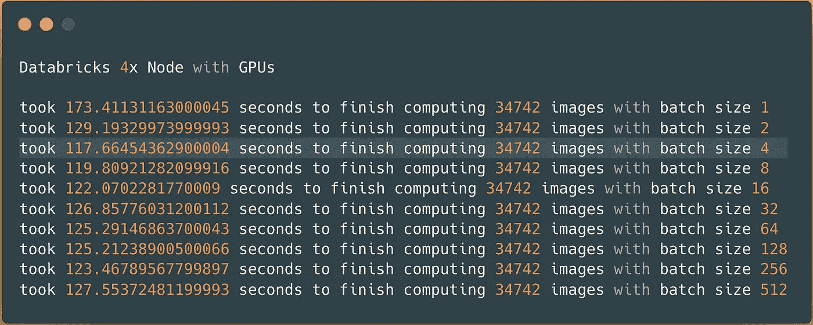

带 GPU çš„ **4x 节点**上的 Spark NLP 图åƒåˆ†ç±»æµæ°´çº¿â€”预测 34742 幅图åƒ

这一次花了将近 2 分钟( **118 秒**)æ¥å®Œæˆå¯¹æˆ‘们数æ®é›†ä¸­æ‰€æœ‰ **34K 图åƒ**的分类。为了更好地ç†è§£å•èŠ‚点中的拥抱脸ä¸å¤šèŠ‚点集群中的 Spark NLP 相比æ„味ç€ä»€ä¹ˆï¼Œè®©æˆ‘们将这一点形象化:

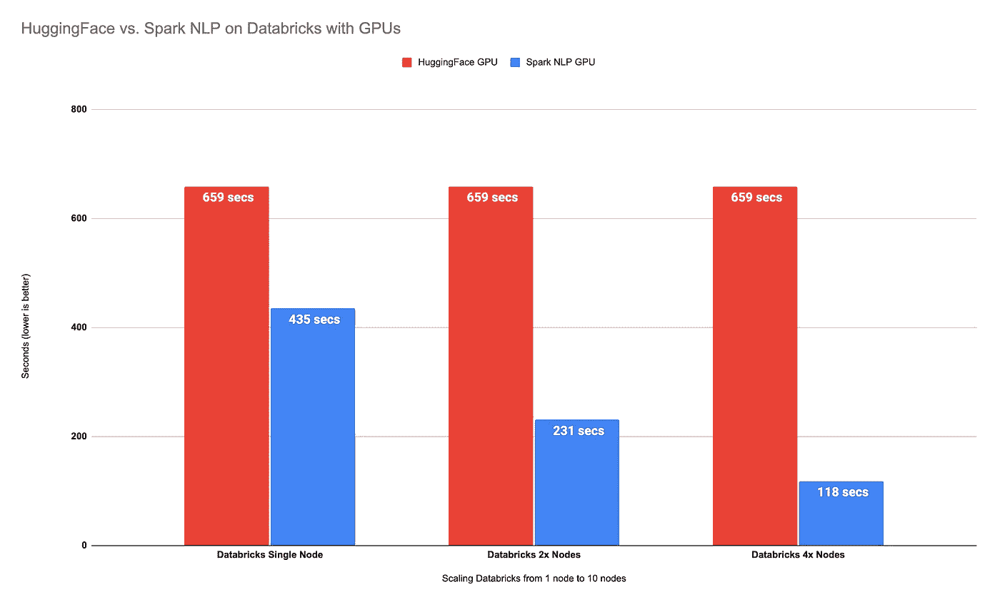

**Spark NLP** 比 **4x 节点**抱脸**快 458%**

> ä¸æ‹¥æŠ±è„¸ç›¸æ¯”，性能æå‡äº† 458%。我们刚刚通过使用带有 4 个节点的 Spark NLP 使我们的æµæ°´çº¿é€Ÿåº¦æ高了 5.6 å€ã€‚

## 在具有 8 个节点的 GPU 上扩展 Spark NLP

æ¥ä¸‹æ¥ï¼Œæˆ‘将调整集群的大å°ï¼Œä½¿æˆ‘çš„æ•°æ®å—中有 **8x 个节点**，总结如下:

8 个节点的数æ®å——æ¯ä¸ªèŠ‚点 1 个 GPU

æ醒一下，æ¯ä¸ª AWS å®ä¾‹( **g4dn.8xlarge** )有 1 个**英伟达 T4 GPU 16GB** (15GB å¯ç”¨å†…å­˜)。让我们é‡æ–°è¿è¡ŒåŸºå‡†æµ‹è¯•ï¼Œçœ‹çœ‹æˆ‘们能å¦å‘ç°ä»»ä½•æ”¹è¿›ï¼Œå› ä¸ºä»»ä½•åˆ†å¸ƒå¼ç³»ç»Ÿä¸­çš„横å‘扩展都有开销，而且您ä¸èƒ½åªæ˜¯ä¸æ–­æ·»åŠ æœºå™¨:

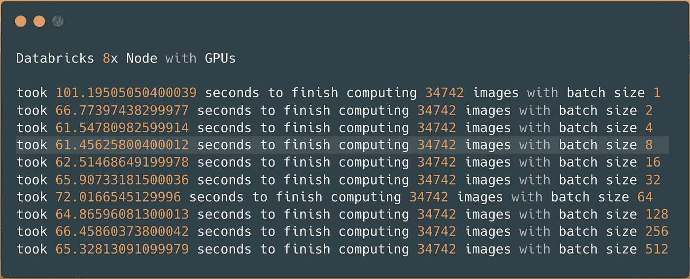

带 GPU çš„ **8x 节点**上的 Spark NLP 图åƒåˆ†ç±»æµæ°´çº¿â€”预测 34742 幅图åƒ

在我们的 Databricks 集群中，使用 **8x 节点**完æˆå¯¹ **34K 图åƒ**的分类几ä¹èŠ±äº†ä¸€åˆ†é’Ÿ( **61 秒**)。看æ¥æˆ‘们还是设法æ高了性能。让我们将此结æœä¸ä¹‹å‰å•èŠ‚点中的拥抱脸ä¸å¤šèŠ‚点集群中的 Spark NLP 的结æœè¿›è¡Œæ¯”较:

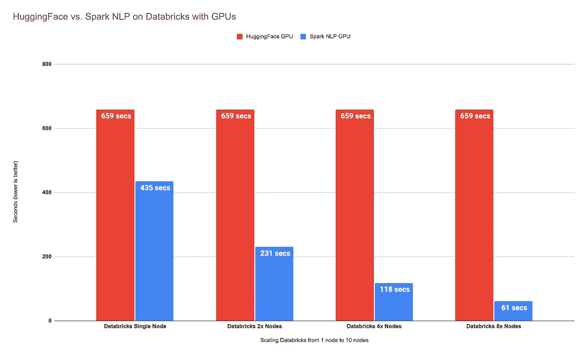

**Spark NLP** 比 **8x 节点**抱脸**快 980%**

> 带 **8x 节点**çš„ Spark NLP 在 GPU 上几ä¹æ¯”抱脸快**11 å€(980%)** 。

## 在 10 å€èŠ‚点的 GPU 上扩展 Spark NLP

类似äºæˆ‘们在 CPU 上的多节点基准测试，我想å†æ¬¡è°ƒæ•´ GPU 集群的大å°ï¼Œä½¿å…¶æ‹¥æœ‰ **10x 个节点**，并在最终节点数é‡æ–¹é¢ä¸å®ƒä»¬ç›¸åŒ¹é…。该组的最终总结如下:

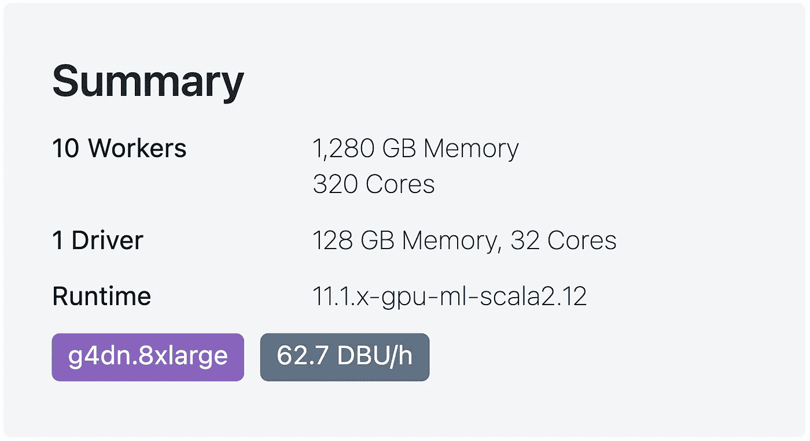

具有 10 个节点的数æ®å——æ¯ä¸ªèŠ‚点 1 个 GPU

让我们在这个特定的 GPU 集群中è¿è¡Œæœ€å一个基准测试(零代ç æ›´æ”¹):

使用 GPU 在 **10x 节点**上的 Spark NLP 图åƒåˆ†ç±»æµæ°´çº¿â€”预测 34742 幅图åƒ

ä¸åˆ°ä¸€åˆ†é’Ÿ( **51 秒**)就完æˆäº†å¯¹è¶…过 **34743 张图片**的预测分类。让我们将它们放在一起，看看我们如何在 Databricks çš„ Spark NLP 管é“中扩展æ¥è‡ª Hugging Face 的视觉转æ¢å™¨æ¨¡å‹:

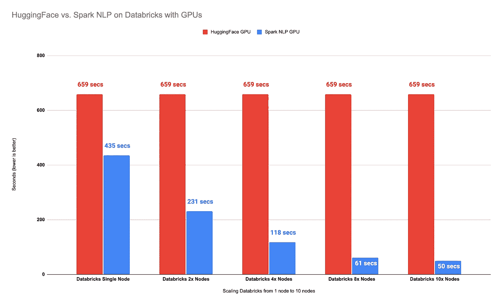

**Spark NLP** 比 **10x 节点**抱脸**快 1200%**

> 我们完了。

> 我们设法通过使用数æ®å—中的 **Spark NLP** 在 **10x 节点**上扩展我们的**视觉转æ¢å™¨**模å‹ã€‚ä¸ GPU 上的拥抱脸相比，我们的æµæ°´çº¿ç°åœ¨å¿«äº† 13 å€ï¼Œæ€§èƒ½æ高了 1200%。

让我们总结一下所有这些基准测试，首先比较 CPU å’Œ GPU 之间的改进，然å通过在 GPU 上使用 Spark NLP，我们的æµæ°´çº¿å¯ä»¥ä»æ‹¥æŠ± Face CPUs 到 Databricks 上的 10 å€èŠ‚点快多少。

# 将所有这些整åˆåœ¨ä¸€èµ·:

## æ•°æ®å—:å•èŠ‚点和多节点

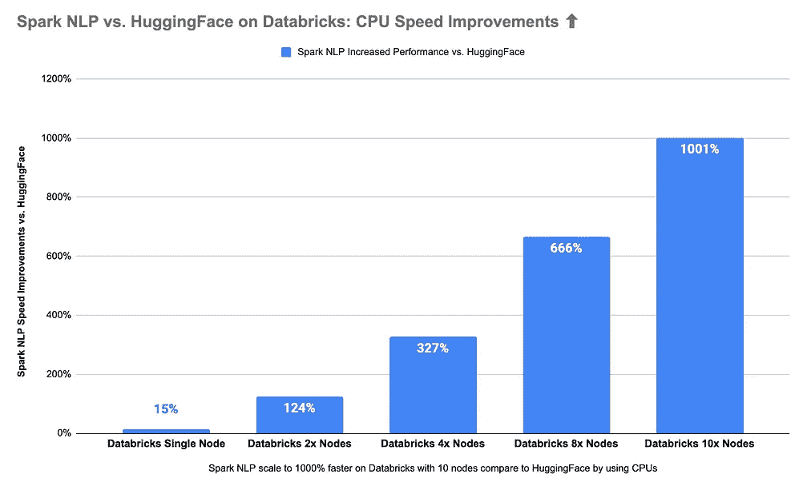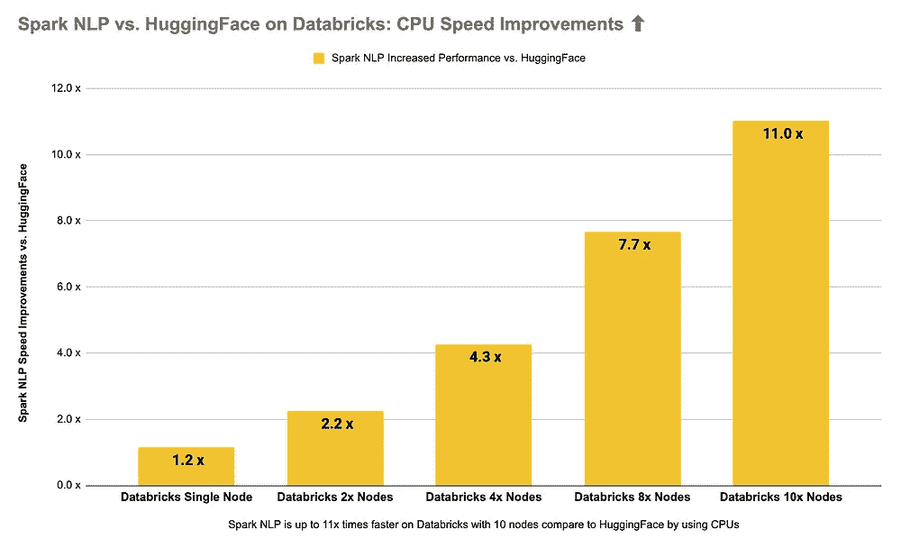

Spark NLP 比 CPU 上的拥抱脸快 11 å€(1000%)

> **ç«èŠ± NLP** 🚀在 **10x 节点上**带 CPU**比抱脸**å¿« 1000% (11x å€)🤗å¡åœ¨å¸¦æœ‰ CPU çš„å•ä¸ªèŠ‚点中

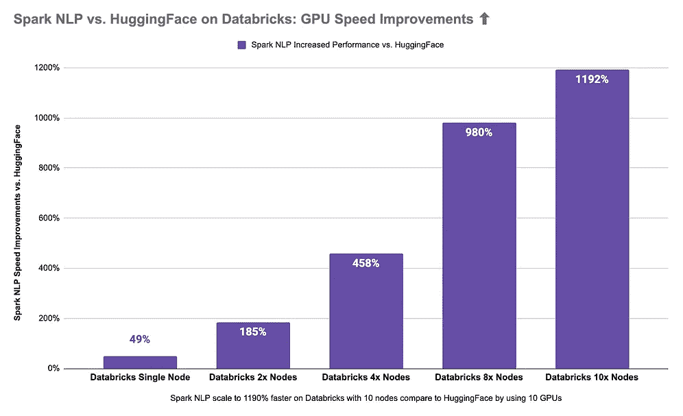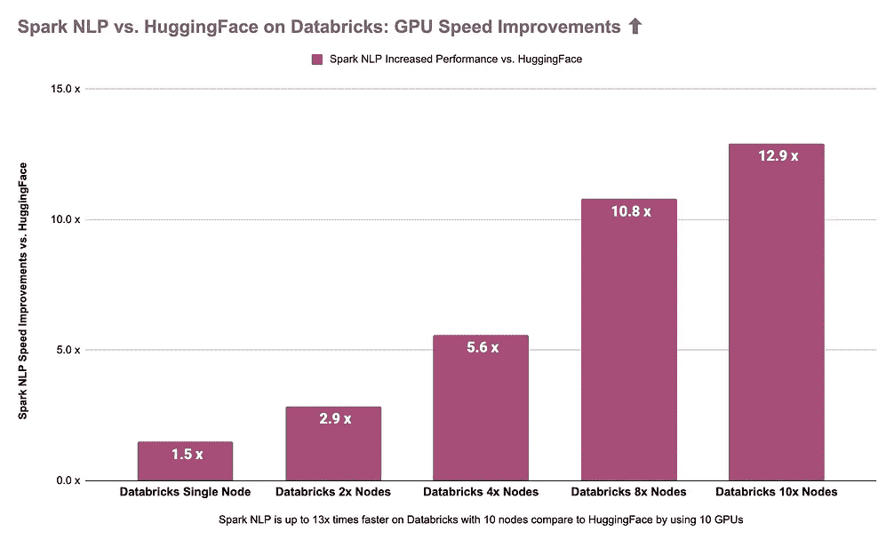

Spark NLP 比 GPU 上的拥抱脸快 13 å€(1192%)

> **ç«èŠ± NLP** 🚀在 **10x 节点上**用 GPU**比抱脸**å¿« 1192% (13x å€)🤗用 GPU å¡åœ¨å•ä¸ªèŠ‚点

我们的 AWS CPU å®ä¾‹å’Œ AWS GPU å®ä¾‹çš„价格差异呢？(我的æ„æ€æ˜¯ï¼Œå¤šä»˜å‡ºå°±å¤šæ”¶è·ï¼Œå¯¹å§ï¼Ÿ)

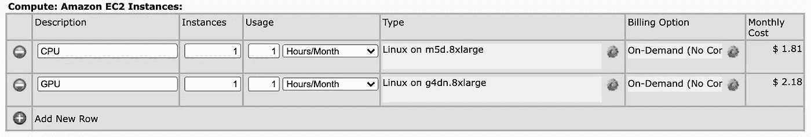

**带 CPU çš„ AWS m5d.8xlarge** ä¸å¸¦ 1 个 GPU 和类似规格的**AWS****g4dn . 8x large**

好的，所以价格看起æ¥å·®ä¸å¤šï¼è€ƒè™‘到这一点，如æœæ‚¨ä»å¡åœ¨å•å°æœºå™¨ä¸Šçš„**CPU**上的**拥抱é¢**移动到带有**10x GPU**çš„ **10x 节点**上的 **Spark NLP** ，您会è·å¾—哪些改进？

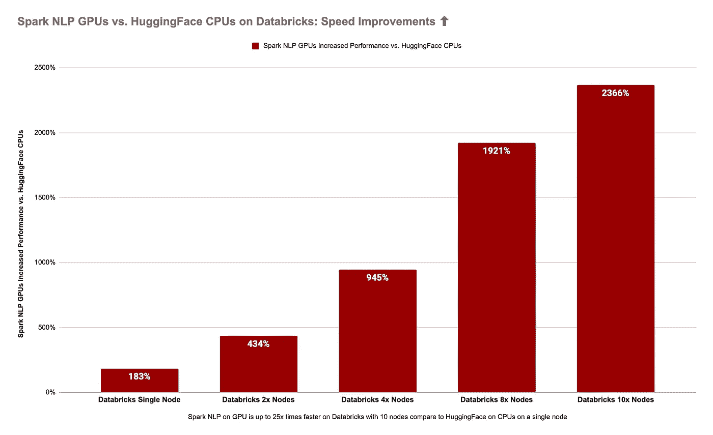

**GPU 上的 Spark NLP** 比 CPU 上的拥抱脸快 25 å€(2366%)

> ç«èŠ± NLP🚀在 10 å€äº GPU 的节点上，比拥抱脸快 2366%(25 å€)🤗在具有 CPU çš„å•ä¸ªèŠ‚点中

## 最åçš„è¯

*   本ç€å®Œå…¨é€æ˜çš„ç²¾ç¥ï¼ŒGitHub 上的 [**æ供了所有笔记本åŠå…¶æ—¥å¿—ã€æˆªå›¾ï¼Œç”šè‡³æ˜¯å¸¦æœ‰æ•°å­—çš„ excel 表格**](https://github.com/JohnSnowLabs/spark-nlp-workshop/tree/master/tutorials/blogposts/medium/scale-vision-transformers-vit-beyond-hugging-face)
*   缩放 Spark NLP 需è¦é›¶ä»£ç æ›´æ”¹ã€‚ä»å•ä¸ªèŠ‚点数æ®å—到 10 个节点è¿è¡ŒåŸºå‡†æµ‹è¯•æ„味ç€åªéœ€åœ¨åŒä¸€ä¸ªç¬”记本中é‡æ–°è¿è¡Œç›¸åŒçš„代ç å—
*   请记ä½ï¼Œè¿™ä¸¤ä¸ªåº“æ供了许多最佳å®è·µï¼Œå¯ä»¥é’ˆå¯¹ä¸åŒçš„用例在ä¸åŒçš„ç¯å¢ƒä¸­ä¼˜åŒ–它们的速度和效ç‡ã€‚例如，在 Apache Spark 中，我没有谈到分区åŠå…¶ä¸å¹¶è¡Œæ€§å’Œåˆ†å¸ƒçš„关系。有许多 Spark é…ç½®å¯ä»¥å¾®è°ƒé›†ç¾¤ï¼Œå°¤å…¶æ˜¯å¹³è¡¡ CPU å’Œ GPU 之间的任务数é‡ã€‚ç°åœ¨çš„问题是，有没有å¯èƒ½åœ¨æˆ‘们用äºåŸºå‡†æµ‹è¯•çš„相åŒç¯å¢ƒä¸­æ高它们的速度？答案是百分之百ï¼æˆ‘试图为两个库ä¿ç•™é»˜è®¤å€¼å’Œç°æˆçš„特性，以利äºå¤§å¤šæ•°ç”¨æˆ·çš„简å•æ€§ã€‚
*   ä½ å¯èƒ½æƒ³æŠŠæ‹¥æŠ±è„¸å’Œå…¶ä»–åŸºäº DL çš„ Pythonish 库打包到 Spark UDF 中æ¥ç¼©æ”¾å®ƒä»¬ã€‚这在一定程度上是å¯è¡Œçš„，因为我自己曾ç»è¿™æ ·åšè¿‡ï¼Œç°åœ¨ä»ç„¶è¿™æ ·åš(当没有本地解决方案时)。在 UDF 中包装这ç§åŸºäº transformer 的模å‹æ—¶ï¼Œæˆ‘ä¸ä¼šè¯¦ç»†è®¨è®ºå†…存过度使用ã€å¯èƒ½çš„åºåˆ—化问题ã€æ›´é«˜çš„延迟和其他问题。我åªæƒ³è¯´ï¼Œå¦‚æœæ‚¨ä½¿ç”¨ Apache Spark，请使用在 Apache Spark 上本地扩展所需特性的库。
*   在这篇文章中，我特æ„æ到了 PyTorch 上的拥抱脸和 TensorFlow 上的 Spark NLP。这是一个很大的差异，因为在 PyTorch å’Œ TensorFlow 之间通过拥抱é¢å­”进行的æ¯ä¸ªåŸºå‡†æµ‹è¯•ä¸­ï¼ŒPyTorch 过å»æ˜¯ï¼Œç°åœ¨ä»ç„¶æ˜¯æ¨ç†çš„è·èƒœè€…。在拥抱脸中，PyTorch 的延迟è¦ä½å¾—多，而且似ä¹æ¯”å˜å½¢é‡‘刚中的 TensorFlow 快得多。事å®ä¸Šï¼ŒSpark NLP 使用完全相åŒçš„ TensorFlow，并且在拥抱脸方é¢åœ¨æ¯ä¸ªåŸºå‡†æµ‹è¯•ä¸­éƒ½é¢†å…ˆäº PyTorch，这是一件大事。è¦ä¹ˆæ˜¯æ‹¥æŠ±è„¸çš„å¼ é‡æµè¢«å¿½ç•¥äº†ï¼Œè¦ä¹ˆæ˜¯ PyTorch åªæ˜¯åœ¨æ¨ç†ä¸Šæ¯”å¼ é‡æµå¿«ã€‚ä¸ç®¡æ˜¯å“ªç§æƒ…况，我都迫ä¸åŠå¾…地想看看当 Spark NLP 除了 TensorFlow ä¹‹å¤–ï¼Œè¿˜å¼€å§‹æ”¯æŒ TorchScript å’Œ ONNX è¿è¡Œæ—¶ä¼šå‘生什么。
*   ML å’Œ ML GPU Databricks è¿è¡Œæ—¶å®‰è£…了拥抱脸，é常好。但这并ä¸æ„味ç€æ‹¥æŠ±è„¸åœ¨æ•°æ®ç –å—中很容易使用。拥抱脸的 Transformer 库ä¸æ”¯æŒ DBFS(Databricks çš„åŸç”Ÿåˆ†å¸ƒå¼æ–‡ä»¶ç³»ç»Ÿ)或亚马逊 S3。正如您在笔记本中看到的，我必须下载数æ®é›†çš„å‹ç¼©ç‰ˆæœ¬ï¼Œå¹¶æå–它们以供使用。这并ä¸æ˜¯ Databricks 和其他生产平å°ä¸­çš„用户真正的åšäº‹æ–¹å¼ã€‚我们将数æ®ä¿å­˜åœ¨åˆ†å¸ƒå¼æ–‡ä»¶ç³»ç»Ÿä¸­ï¼Œå¹¶å®æ–½äº†å®‰å…¨æªæ–½ï¼Œå…¶ä¸­å¤§éƒ¨åˆ†éƒ½è¶³å¤Ÿå¤§ï¼Œæ— æ³•é€šè¿‡ä¸ªäººè®¡ç®—机下载。我必须下载我在 DBFS å·²ç»æœ‰çš„æ•°æ®é›†ï¼Œå‹ç¼©å®ƒä»¬ï¼Œä¸Šä¼ åˆ° S3，公开它们，然å在笔记本上é‡æ–°ä¸‹è½½ã€‚如æœæ‹¥æŠ±è„¸å¯ä»¥æ”¯æŒ DBFS/S3，这个相当ä¹å‘³çš„过程就å¯ä»¥é¿å…了。我认为 Databricks 预装拥抱脸很有å¸å¼•åŠ›ï¼Œä½†è¿™ä¸ä»…仅是简å•åœ°åœ¨æ¯ä¸ªèŠ‚点上è¿è¡Œ`pip install transformers`而ä¸æ˜¯ 100%兼容。

# å‚考

**维特**

*   [https://arxiv.org/pdf/2010.11929.pdf](https://arxiv.org/pdf/2010.11929.pdf)
*   [https://github.com/google-research/vision_transformer](https://github.com/google-research/vision_transformer)
*   [图åƒè¯†åˆ«ä¸­çš„视觉å˜å‹å™¨(ViT)——2022 指å—](https://viso.ai/deep-learning/vision-transformer-vit/)
*   [https://github.com/lucidrains/vit-pytorch](https://github.com/lucidrains/vit-pytorch)
*   [https://medium . com/mlearning-ai/an-image-is-worth-16x 16-words-transformers-for-image-recognition-at-scale-51f 3561 a9f 96](https://medium.com/mlearning-ai/an-image-is-worth-16x16-words-transformers-for-image-recognition-at-scale-51f3561a9f96)
*   [https://medium . com/nerd-for-tech/an-image-worth-16x 16-words-transformers-for-image-recognition-at-scale-paper-summary-3a 387 e 71880 a](https://medium.com/nerd-for-tech/an-image-is-worth-16x16-words-transformers-for-image-recognition-at-scale-paper-summary-3a387e71880a)
*   [https://gareemadhingra 11 . medium . com/summary-of-paper-an-image-worth-16x 16-words-3f 7 F3 ACA 941](https://gareemadhingra11.medium.com/summary-of-paper-an-image-is-worth-16x16-words-3f7f3aca941)
*   [https://medium . com/analytics-vid hya/vision-transformers-bye-bye-convolutions-e 929d 022 E4 ab](https://medium.com/analytics-vidhya/vision-transformers-bye-bye-convolutions-e929d022e4ab)
*   [https://medium . com/synced review/Google-brain-uncovers-re presentation-structure-differences-between-CNN-and-vision-transformers-83b 6835 db BAC](https://medium.com/syncedreview/google-brain-uncovers-representation-structure-differences-between-cnns-and-vision-transformers-83b6835dbbac)

**抱紧脸**

*   [https://hugging face . co/docs/transformers/main _ classes/pipelines](https://huggingface.co/docs/transformers/main_classes/pipelines)
*   [https://huggingface.co/blog/fine-tune-vit](https://huggingface.co/blog/fine-tune-vit)
*   [https://huggingface.co/blog/vision-transformers](https://huggingface.co/blog/vision-transformers)
*   [https://huggingface.co/blog/tf-serving-vision](https://huggingface.co/blog/tf-serving-vision)
*   [https://huggingface.co/blog/deploy-tfserving-kubernetes](https://huggingface.co/blog/deploy-tfserving-kubernetes)
*   [https://huggingface.co/google/vit-base-patch16-224](https://huggingface.co/google/vit-base-patch16-224)
*   [https://huggingface.co/blog/deploy-vertex-ai](https://huggingface.co/blog/deploy-vertex-ai)
*   [https://huggingface.co/models?other=vit](https://huggingface.co/models?other=vit)

æ•°æ®å—

*   [https://www . data bricks . com/spark/getting-started-with-Apache-spark](https://www.databricks.com/spark/getting-started-with-apache-spark)
*   [https://docs.databricks.com/getting-started/index.html](https://docs.databricks.com/getting-started/index.html)
*   [https://docs . data bricks . com/getting-started/quick-start . html](https://docs.databricks.com/getting-started/quick-start.html)
*   看最好的[æ•°æ®+AI 峰会 2022](https://www.databricks.com/dataaisummit/)
*   [https://www . data bricks . com/blog/2020/05/15/shrink-training-time-and-cost-using-NVIDIA-GPU-accelerated-xgboost-and-Apache-spark-on-data bricks . html](https://www.databricks.com/blog/2020/05/15/shrink-training-time-and-cost-using-nvidia-gpu-accelerated-xgboost-and-apache-spark-on-databricks.html)

**ç«èŠ± NLP**

*   [Spark NLP GitHub](https://github.com/JohnSnowLabs/spark-nlp)
*   [Spark NLP 研讨会](https://github.com/JohnSnowLabs/spark-nlp-workshop) (Spark NLP 示例)
*   [ç«èŠ± NLP å˜å‹å™¨](https://nlp.johnsnowlabs.com/docs/en/transformers)
*   [Spark NLP 车å‹è½®æ¯‚](https://nlp.johnsnowlabs.com/models?edition=Spark+NLP)
*   [Spark NLP 3 中的速度优化&基准测试:充分利用ç°ä»£ç¡¬ä»¶](https://www.johnsnowlabs.com/watch-webinar-speed-optimization-benchmarks-in-spark-nlp-3-making-the-most-of-modern-hardware/)
*   [Spark NLP 中的硬件加速](https://nlp.johnsnowlabs.com/docs/en/hardware_acceleration)
*   [通过 API æœåŠ¡ Spark NLP:Spring å’Œ LightPipelines](https://medium.com/spark-nlp/serving-spark-nlp-via-api-spring-and-lightpipelines-64d2e6413327)
*   [通过 API æœåŠ¡ Spark NLP(1/3):微软的 Synapse ML](https://medium.com/spark-nlp/serving-spark-nlp-via-api-1-3-microsoft-synapse-ml-2c77a3f61f9d)
*   [通过 API (2/3)æœåŠ¡ Spark NLP:FastAPI å’Œ LightPipelines](https://medium.com/spark-nlp/serving-spark-nlp-via-api-2-3-fastapi-and-lightpipelines-218d1980c9fc)
*   [通过 API æœåŠ¡ Spark NLP(3/3):æ•°æ®å—作业和 MLFlow æœåŠ¡ API](https://medium.com/spark-nlp/serving-spark-nlp-via-api-3-3-databricks-and-mlflow-serve-apis-4ef113e7fac4)
*   [Spark 3.0 上的 GPU 利用 Scala 中的深度学习](https://aws.amazon.com/blogs/opensource/leverage-deep-learning-in-scala-with-gpu-on-spark-3-0/)
*   [开始使用 GPU 加速的 Apache Spark 3](https://www.nvidia.com/en-us/ai-data-science/spark-ebook/getting-started-spark-3/)
*   [阿帕奇 Spark 性能调优](https://spark.apache.org/docs/latest/sql-performance-tuning.html)
*   GPU 上å¯èƒ½çš„é¢å¤–优化:[Apache Spark é…置的 RAPIDS 加速器](https://nvidia.github.io/spark-rapids/docs/configs.html)******