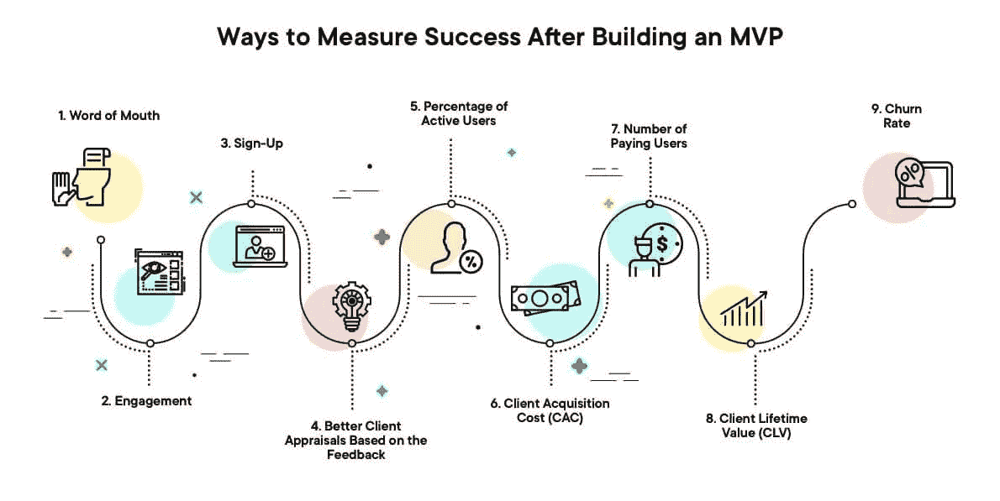
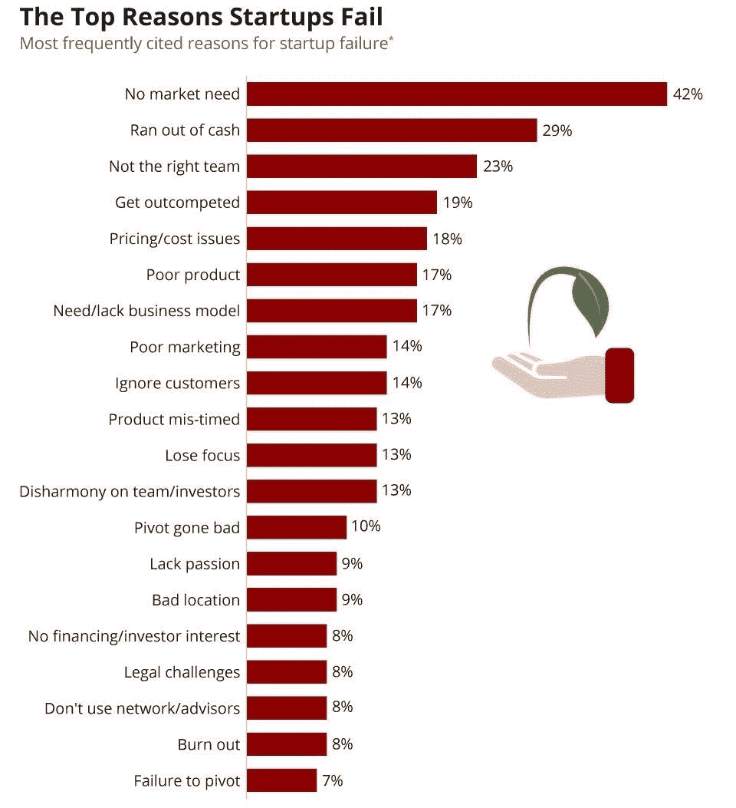

# 扩大创业规模:后 MVP 阶段

> 原文：<https://blog.devgenius.io/scaling-a-startup-post-mvp-stage-c7a59b1f33f4?source=collection_archive---------11----------------------->

[来源](https://medium.com/swlh/i-have-my-mvp-ready-whats-next-5920cd1a91a1)

随着最小可行产品或 MVP 的创建和运行，是时候创建满足广泛消费者的可扩展产品了。很难为最初的发布选择正确的工作流程，但每个后 MVP 阶段都有特定的目的，并使产品更接近预期的结果──在用户和市场竞争对手中占据领先地位。这不是一件容易的工作，但它是可行的。

在 [7Devs](https://7devs.co/) ，我们确切地知道如何让产品朝着正确的方向发展。在这篇文章中，我们将解释如何扩展任何业务。

# 如何衡量一个 MVP？

MVP 是你通往梦想产品道路上的第一个目标。在开发一个成熟的产品之前，从 MVP 开始也更省时间和成本。但是接下来会发生什么呢？

正确的途径是继续创造最具可伸缩性的产品(MSP ),也称为 MMP 或最小适销产品。在启动循环中，这是一个逻辑延续。MSP 阶段侧重于业务元素的开发。它是关于开发和扩展您的运营能力，以满足对满足客户期望的产品的需求。

当你的企业还没有在市场上立足时，扩大创业规模肯定会更加困难。但是有了合适的基础设施、有才华的团队和良好的支持，您可以安全地继续您的项目。

我们建议您按照以下步骤进行:

# 阶段 1:收集和分析反馈

你需要清晰的标记来标明产品的适用期。换句话说，这是该商品可以出售的有力证据。定量分析和质量反馈将帮助您制定良好的扩展策略。

你的产品必须满足客户的需求和期望，而技术团队需要了解客户的意见。彻底的分析将有助于确定用户首先期望看到什么特性。

收集关于最新迭代的反馈，并对产品进行任何必要的更改。此外，你需要考虑所有的数据，甚至包括最差的评论。你将需要再次修改和测试产品，直到你得到一个完美的吸引用户的版本。

只有这种方法才能帮助您的产品动态、灵活地发展。而且你会确信，从长远来看，它会带来所需的收入。

[来源](https://www.netsolutions.com/insights/how-to-build-an-mvp-minimum-viable-product-a-step-by-step-guide/)

# 阶段 2:扩展项目

MSP 阶段完全是关于扩展，即扩展服务交付或产品限制的能力，以满足不断积累的客户群不断增长的需求。

根据 [Statista](https://www.statista.com/chart/11690/the-top-reasons-startups-fail/) 的说法，大多数创业失败的根本原因是忽视了 MVP 后的规模化。

从一家初创公司发展到规模化并不容易。如果你试图在不改变业务基础设施的情况下发展，你很可能会失败。你需要一个系统的方法来扩展你的业务，这样你就有了正确的流程，一个精明的团队，或者至少是来自顾问的某些第三方支持。

在考虑如何扩展业务时，请记住支持人员和可扩展云服务的意外成本，包括 CRM、虚拟联络中心和支付 API。规划成长的每个阶段，定义 MSP 阶段的战略、目标和目的，并设定实现它们的时间框架是非常重要的。

业务的运营结构和内部层级将需要发展。你应该有解决问题所需的部门和经理。随着您的成长和扩张，您将需要为公司的每个运营、管理和财务层建立独立的团队。这将提供一个准备好与业务一起成长的结构。

[来源](https://www.statista.com/chart/11690/the-top-reasons-startups-fail)

# 第三阶段:定价

许多公司在 MSP 阶段失败是因为他们专注于错误的决策选择。你的动机不应该仅仅是利润、野心或者仅仅为了成长而成长。你应该把更多的注意力放在一个独特的、价格合理的、需求量很大的产品上。

为此，你需要研究和增加用户流量，并密切关注潜在买家向真实客户的转化。考虑一下价格，应该是合理的。在你想要的和可能的之间取得平衡。给人们提供一个有利可图的选择，你的产品就会成为畅销书。

对企业核心战略的更广泛理解是至关重要的。你必须学会从外部看待你的工作，以看到前景，并确定战略步骤的正确顺序。只有从外部和内部对企业有一个全面而健康的看法，才能为做出正确的管理决策提供最好的机会。

# 阶段 4:资金流动、运营资产和融资

有效的推广需要额外的投资。要实现交易和成长所需的正资金周转，你的收入必须足够高。因此，密切关注现金流和资金非常重要。

将业务扩展到 MSP 阶段几乎肯定意味着获得额外的财务资源。你需要流动资金来扩大生产，雇佣新员工，搬到更大的房子或黄金地段，等等。

# 阶段 5:营销战略投资

有影响力的广告的重要性是前所未有的。如果实施了有效的战略，市场营销的投资将会得到充分的回报。你需要知道吸引一个付费买家要花多少钱。这将帮助你掌握你的营销工作是否有效，或者是否需要改变。

经常检查你的客户获取成本(CAC)──花在客户获取渠道上的钱与通过该渠道获得的客户数量的比率。使用任何你认为合适的工具和性能指标，瞄准薄弱环节。

# 阶段 6:分析和测试

质量控制是产品开发的重要部分。QA 工程师必须和整个团队一起工作。创业环境是不断波动的，所以你应该一直寻找机会来改进你的产品。你应该不断思考如何扩大一家初创公司的规模，即使目前的结果相当丰硕。因此，测试应该包括在产品支持路线图的所有阶段。从设计、创作到生命周期结束。

如果用户测试成功，就可以将产品展示给投资者。他们想保证自己的钱安全，想看到你的 MVP 转化成真正有竞争力的产品。

给他们看测试结果，演示收入会是多少。用数字和真实的用户评论来验证你的商业想法，证明你的团队能够交付真实的结果。你必须向投资者证明，你清楚地知道成功销售的下一步应该是什么。

[来源](https://medium.com/swlh/i-have-my-mvp-ready-whats-next-5920cd1a91a1#id_token=eyJhbGciOiJSUzI1NiIsImtpZCI6Ijc3MjA5MTA0Y2NkODkwYTVhZWRkNjczM2UwMjUyZjU0ZTg4MmYxM2MiLCJ0eXAiOiJKV1QifQ.eyJpc3MiOiJodHRwczovL2FjY291bnRzLmdvb2dsZS5jb20iLCJuYmYiOjE2MTk0OTgzMzIsImF1)

# 经验丰富的顾问的价值

要使 MSP 成功，您需要以最具伸缩性的方式组合关键元素。在良好的支持下，启动规模扩大要容易得多。顾问可以提供帮助的关键领域如下:

*   团队构成:寻找各级人才，满足人事和雇主人力资源立法的要求。
*   内部结构:业务模式、运营和财务系统、交付、资源、会计和税务规划的现代化。
*   向上扩展计划:从 MVP 到 MSP 的战略性商业计划，并报告满足最后期限、目标和目的的情况。
*   内置可扩展性:分析现有流程和程序以提高效率，简化您的业务，并开发一个可随时扩展的经济高效的运营结构。
*   现金流、营运资本和融资:财务和管理报告。
*   全面的业务概述。

外部虚拟财务总监和非执行董事(ned)可以受益于对领导力战略的经验和理解，而不必支付全职薪酬。

# 结论

到达 MSP 不是在公园散步。在你觉得你的创业公司是一个稳定的、可扩展的和盈利的企业之前，有许多障碍需要克服。

通过与合适的顾问合作，您将获得下一次转向 MSP 所需的建议和支持。7Devs 专家拥有足够的专业知识，并准备好与初创公司合作。你想快速成长却缺乏相关经验吗？[联系专业人士](https://7devs.co/contact/)为您的产品提供最高效的后 MVP 阶段！