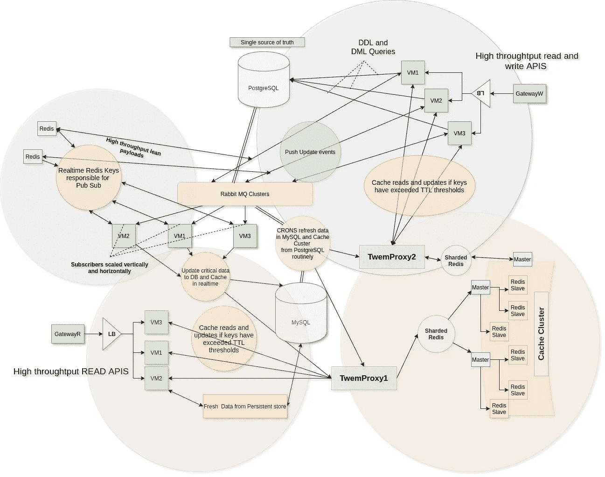

# 扩展高吞吐量读写

> 原文：<https://blog.devgenius.io/scaling-high-throughput-writes-and-reads-5599236644bf?source=collection_archive---------20----------------------->

考虑一个系统，其中有一组从系统中读取数据的用户和一组向数据集写入数据的用户。理想情况下，读写扩展在运行时采用不同的配置。

扩展通常需要根据用户群的性质对系统进行划分，同时两种性质的系统进行通信，以在可接受的速率下保持实时一致性，同时保持最短的停机时间。

在这篇博文中，我想谈谈有助于解决上述问题的架构概念。

解决方案:架构图

**GatewayR** -通过读取进行消费的用户的入口点。

**gateway w**——交易用户的入口点。

**Twemproxy** -每个 API 虚拟机上的守护进程，帮助将输入数据映射到各自的 redis 分片。

**LB-** 负载平衡器有助于在多个虚拟机之间分配负载。

**VMi** —通过在一个负载均衡器下添加多个虚拟机来水平调用 API。

**订户** - *纵向和横向扩展* ***无状态*** 虚拟机，这些虚拟机监听来自 *IPC 机制*的推送事件。它们在保持上述系统的两个部分或一个 n 分区系统的所有部分的数据*一致*方面起着至关重要的作用。

## 了解用户的本质——用户可能是多种多样的

**事务性用户(高吞吐量写入)**

*   这些用户在持久性存储上运行 DML 和 DDL qieries，如 PostgresSQL 或 MySQL
*   高吞吐量写入将需要在整个系统中传播更新。单个更新可以触发系统多个部分的更新。
*   这些更新需要接近实时地到达通过阅读消费的用户。

**通过读取进行消费的用户(高吞吐量读取)**

*   需要低延迟高可用性 API
*   近乎实时的读取

在上图中，这些用户通过架构互不相同的不同区域访问系统资源，分别用蓝色(右上)和粉色(左下)区域表示。

**注意点**

*   虽然用户的性质不同，但系统也以类似的方式不同。这保证了需要一个用于生成数据的 ***单一真实源*** ，这也被消耗
*   PostegreSQL 和 MySQL 被用作持久性存储，尽管其中一个被配置用于大量的写操作，而另一个被配置用于读操作。
*   随着单一来源的真实性而来的是可伸缩性的问题，可用性和分区容忍度会降低。下面解释了为什么 MySQL 和 PostgreSQL 被分开使用，并分别为读取和写入形成持久存储。

# **一致性对可用性对分区容忍度**

**一致性**

*   确保一致性意味着系统中的所有节点同时看到相同的数据。

**供货情况**

*   可用性意味着系统响应速度快，正常运行时间长

**分区公差**

*   虽然这些系统使用 IPC 进行通信，但是尽管任意的消息丢失或系统的一部分出现故障，系统仍能继续运行。
*   上述系统具有固有的分区容错能力，因为读取和写入是在两个不同的系统中进行的，并且是单独扩展的。

**高一致性** —在上述系统中，低延迟内存 redis 发布/订阅通道，同步更新 REDIS 集群和 MySQL。

*   Redis 集群有主集群和从集群，这带来了最终的一致性，其中更新通过从集群传播。从模块之间的更新传播时间与从模块的数量、更新吞吐量和处理的数据量成正比。
*   主 redis 和从 redis 的分片将提供可用性和一致性的完美结合
*   分片可确保数据分布在灵活的集群中，这些集群的单个吞吐量较小，因此需要同步的从机数量较少。从而确保更快的最终一致性

**高可用性**

*   从设备之间的复制确保了每个分片 redis 主设备读取的高可用性。

**高分区容忍度**

**高速缓存集群**

由右下角的棕色圆圈表示

*   高速缓存集群包含带从设备的分片主设备，从设备可以在出现故障时重新选择新的主设备，而不会丢失数据。
*   分片有助于提高系统的弹性，因为读取和权限分散在多个分片上，系统承受的压力较小
*   在由于网络故障的情况下，如果一个碎片的更新失败，一个或多个碎片将以陈旧数据结束。使用 [mutext 锁](https://medium.com/@kssreesha/debouncing-cache-updates-7c6043864538)可以处理 GatewayR 和 GatewayW 下的多个虚拟机对陈旧数据的更新，而无需冗余更新。

**PostgreSQL 和 MySQL 之间的数据流**

*   当系统在灾难性故障后恢复时，IPC 方法可以包含 retrys 来帮助更新立即通过系统传播。上面使用的 RabbitMQ 是一个高度可用的队列，它缓冲来自 write APIs 的更新，并在网络故障或订户宕机的情况下为重试提供持久性。
*   保持 **MySQL 与 PostgreSQL** 同步是非常必要的，PostgreSQL 是事实的来源，任何网络故障/节点故障都可能导致在**网关**消耗的数据与在**网关**生成的数据不一致

**实时更新**

*   随着系统被分成两部分并独立扩展，实时更新需要他们自己的一套系统和扩展程序。在上面的示例中， ***高度可用的内存 redis 发布-订阅通道*** 用于将更新近乎实时地传播到缓存集群，而 GatwayW 的 DDL 和 DML APIs 最终将数据更新到 PostgreSQL 和 MySQL。
*   进一步 ***分割这些通道*** ，例如按照 ***区域*** 对 ***进行分割，可以帮助更好地扩展系统，甚至进一步降低延迟。***
*   在 GatewayW 对 PostgreSQL 的传入写入将触发通过 ***redis 实时内存发布订阅通道的推送，该通道由订阅者使用，订阅者进而近实时更新缓存集群。用户可以在网页刷新时通过 GatewayR 或通过 socket-io 事件立即获得此更新。***
*   对 PostgreSQL 的写操作和对 Rabbit MQ 的数据推送，以及随后对 MySQL 的写操作最终会通过系统完成，从而确保 PostgreSQL 和 MySQL 同步。
*   请注意，与 RabbitMQ 相比， **redis 内存发布-订阅事件以*低延迟*传播。**

**刷新数据**

CRONs】定期运行，保持*两个持久存储同步*和*缓存用最新数据更新*，是上述系统的关键部分，以防连续网络故障阻止更新从一端传播到另一端。

请关注此空间，了解有关扩展单个器件和所用技术更新的更深入的文章。

我为物联网中的一个用例设计了一个类似的系统——请到 https://github.com/SreeshaKS/IOT-Platform[查看](https://github.com/SreeshaKS/IOT-Platform)

请在下面的评论中或通过电子邮件向我提出建议和替代方案，并详细说明以上流程。

谢谢！