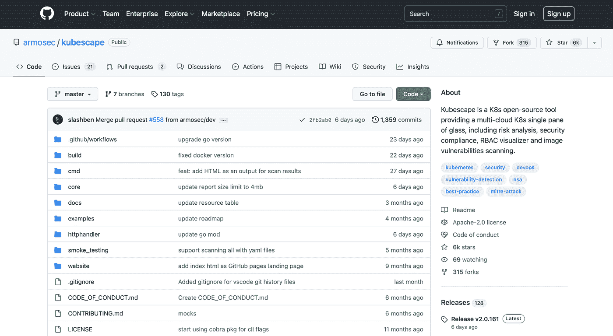
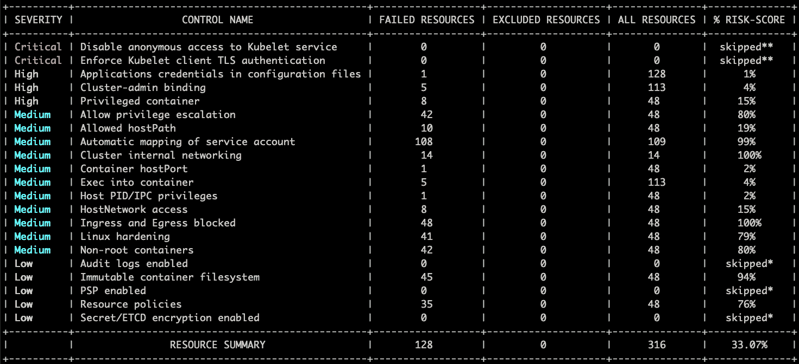

# 扫描库本内特 YAML 文件的安全性

> 原文：<https://blog.devgenius.io/scanning-kubernetes-yaml-files-for-security-e302542b5407?source=collection_archive---------5----------------------->


[图片](https://unsplash.com/photos/GCFuprAvC6A)由 [Ihor Dvoretskyi](https://unsplash.com/@ihor_dvoretskyi) 在 Unsplash 上拍摄

Kubernetes 是一个开源的容器编排系统，它自动化了手动流程，例如部署、管理和扩展容器化的应用程序。Kubernetes 的使用在整个软件行业中呈指数增长，因为它有许多优点。

重要的 Kubernetes 资源是 pod、服务和部署，它们是使用 YAML 文件以声明的方式创建的。 [YAML](https://en.wikipedia.org/wiki/YAML) (另一种标记语言)被用在配置文件中，因为它提供了更好的可读性并且更加用户友好。它是一种数据序列化语言，可以与任何编程语言并行工作。

## 库伯内特斯的 YAML 成分

定义 Kubernetes pods、服务和部署的 YAML 文件组件包括:

**pod . YAML**:pod 文件包含关于一个或多个容器的细节以及如何运行这些容器的规范。

```
apiVersion: v1 //yaml map
kind: Pod
metadata:
  name: mywebapp
  labels:
 role: webserver-role
 app: uni_app
spec:  //yaml list
  containers: //Here we are defining a web server container
  - name: webserver
 image: uni_app:1.6
 ports:
  - containerPort:70
```

**service.yaml** :服务用于启用一组 pod 的网络访问，并提供访问它们的协议。

```
apiVersion: v1
kind: Service
metadata:
  name: uni_app-service 
  labels:
 app: uni_app  //Based on the app label the service will identify the pods with the exact label
spec:
  ports:
  - nodePort: 30500
 port: 80
 protocol: TCP
 targetPort: 80
type: NodePort
```

**deployment.yaml** :负责运行一组 pods，通过副本获取资源冗余。

```
apiVersion: apps/v1
kind: Deployment
metadata:
  name: uni_app-deployment
  labels:
    app: uni_app
spec:
  replicas: 2 //As mentioned this deployment will have 2 replicas
  selector:
    matchlabels:
      app: uni_app
```

这些用于定义 [Kubernetes 对象](https://kubernetes.io/docs/concepts/overview/working-with-objects/kubernetes-objects/)的 YAML 文件可能包含需要在初始阶段识别和纠正的安全问题。Kubernetes 本身提供了非常基本的安全措施。但是这些还不足以满足用户受益所需的更高级别的安全性。为了解决这个问题，市场上有开源工具可以扫描安全漏洞和错误配置。这些工具有助于识别漏洞和错误配置，提供纠正问题的解决方案，并有助于查看 Kubernetes 集群的实时健康状况。

在 Kubernetes 中提供高级安全性的一个开源工具是 Kubescape。Kubescape 是一款开源工具，用于测试 Kubernetes 是否按照美国国家安全局和 CISA 测试的 Kubernetes 强化指南中的定义进行了部署。



在 CI/CD 管道的早期阶段，根据框架、软件漏洞和 RBAC(基于角色的访问控制)定义，扫描 K8s 集群、YAML 文件和 HELM 图表以检测错误配置。根据获得的结果，计算风险分值，并显示一段时间内的风险趋势。

这个工具已经在 K8s 世界中流行起来，因为它具有易于使用的 CLI 界面、灵活的输出格式和自动扫描功能。它使用 OPA 引擎，并使用片段扫描从 API 服务器提取的对象。

## Kubescape CLI 及其工作原理

***安装命令* :**

```
curl -s https://raw.githubusercontent.com/armosec/kubescape/master/install.sh | /bin/bash
```

***运行命令:***

```
kubescape scan — submit — enable-host-scan — verbose
```

扫描过程提供以下内容:下载 Kubernetes 安全的框架定义，建立对其对象的访问并启动安全扫描，根据框架定义扫描 Kubernetes 集群，扫描器检查集群中的容器映像是否满足定义，每个扫描阶段都有一个描述来解释如果不满足安全标准会造成的威胁，在扫描结束时提供控制名称(安全定义)、失败资源、所有资源和风险分值的汇总视图



在控制失败的情况下，它指示文件中通过测试用例所需的更改。

Kubescape 允许你构建你自己的框架来执行测试。它提供了用异常标记某些控件的灵活性，以避免在扫描过程中出现异常。

为了确保安全标准，扫描仪扫描集群中的集装箱图像，并将结果显示在 SaaS Kubescape 上。扫描仪由 armo-scan-scheduler 触发。扫描时间可以根据您的需要定制。默认情况下，扫描时间安排在午夜。

Kubescape 的优势在于，它扫描 YAML 文件、集群和舵图以提高安全性，它通过分析过去的扫描来帮助可视化风险趋势，它提供配置扫描、图像扫描、RBAC 可视化工具和合规性，并且它可以轻松集成到许多管道工具中，包括 Jenkins、CircleCI、GitLab、GitHub workflows、Prometheus、Slack 等。

# 结论

Kubernetes 为其用户提供了丰富的用途。但是伴随这些优势而来的是提供安全性以获得最大吞吐量的重要性。kubespection 和其他工具极大地促进了开源社区利用 Kubernetes 的优势，而没有数据泄露的风险。

我希望你觉得这篇文章很有见地。感谢您的阅读！