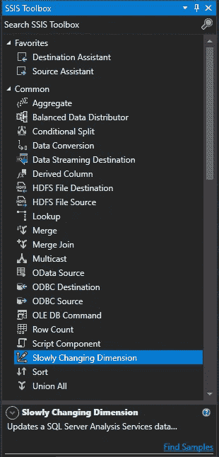
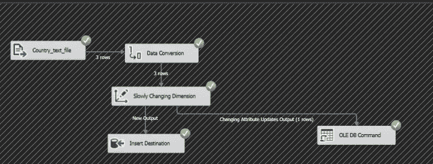

# SCD-SSIS 缓慢变化的维度。

> 原文：<https://blog.devgenius.io/scd-slowly-changing-dimension-in-ssis-7397e927162d?source=collection_archive---------8----------------------->

数据仓库必须是历史上正确的，随着时间的推移，数据库将被更新。例如，今年必须更改的产品销售价格和必须保存为历史数据的先前价格。

为此，我们有一个非常好的组件，那就是**SCD——缓慢变化的维度。**

# 什么是渐变维度(SCD)？

一个**缓变维度** ( **SCD** )是 SSIS 中的一个组件，它包含相对静态的数据，这些数据可以缓慢但不可预测地改变，而不是根据一个固定的时间表。

图 1 缓慢变化的尺寸

**典型的缓慢变化维度的例子**是地理位置、产品等的名称。

SCD 可以在数据流选项卡中的 SSIS 工具箱的公共部分中找到。

图 2 SSIS 工具箱中的 SCD

但是现在我们的问题是**为什么**这个名字会慢慢改变维度？**为什么**不是重复或数据同步？为了回答这个问题，我们知道我们正在加载一个维度数据，因此有了“维度”这个词。但是因为数据，维度数据是主表中的主数据，并且主数据不是每天都更新，所以它在本质上是缓慢变化的。因此，名称为**缓慢变化的尺寸。**

在本文中，我们将看到三种类型的 SCDs

图 3 三种 SCD

# SCD 的类型有—

1.  固定属性
2.  改变属性
3.  历史属性

首先，从我们的固定属性开始—

当列中的值不应被更改时，选择固定属性，如果它们被更改，则将被视为错误。

## 例子

我们有一个包含国家 ID、国家名称的文本文件，我们必须将数据传输到 SQL server 中 Temp123 数据库的 dim Country 表中。

在这个例子中，我们将使用一个固定的属性，这样当输入国家值时，它们不会改变，并且我们会得到一个错误消息。

图 4 主文本文件

*   (**注意**-Dim _ Country 表已经加载了上述数据，在本例中，我们将尝试更改该数据以理解固定属性)

图 DIM _ 国家表。

## 所以**第一步**

我们将数据加载到平面文件源中，并提供必要的连接。

## **第二步**

我们必须将它与 SCD 连接并编辑 SCD。点击编辑，会弹出一个向导，不是“甘道夫大帝”，而是 SCD 向导。

图 6 SCD 向导

我们提供到数据库的连接，选择表并映射列。

图 7 列的映射

如您所见，我们已经映射了这些列，在输入列中还可以看到“国家 ID 副本”和“国家名称副本”。这是因为我们必须使用数据转换来使它们的数据类型相同。

## 第三步

我们将选择“我们的国家/地区名称”列作为不会更改的列，并将“更改类型”选择为“固定属性”。

图 8 SCD 柱的选择

## 第四步

然后，单击“下一步”选中“固定属性”框，并取消选中“推断成员支持”,如下所示

图 9 选择固定属性

图 10 取消选择推断成员支持

## 第五步

在步骤 4 之后，单击 next 并完成，如果我们已经正确地完成了所有的事情，那么我们将会看到一个逻辑出现在 SCD 下面的屏幕上。

图 11 新逻辑

我们将编辑它，并提供 SQL 中的连接和目标表。

## 第六步

现在一切都设置好了，我们将对我们的“主文本文件”(图 4)进行更改，我们将把 Country_Name — USA 更改为 only“US”并运行该包。你会出错的！

图 12 固定属性错误

由于我们选择了固定属性，因此将国家名称 USA 更改为仅“US”被视为错误。

继续改变属性—

更改属性(TYPE-1)更改后的值将覆盖现有值。

## 例子

现在我们有了主文本文件(图 4)和 Dim Country(图 5 ),我们将遵循相同的步骤，直到第 2 步，从那里开始——

## 第三步

我们将选择“我们的国家/地区名称”列作为将被更改/更新的列，我们将选择“更改类型”来更改属性。

图 13 更改属性

## 第四步

然后，单击“下一步”选中“固定属性”框，并取消选中“推断成员支持”。

图 14 选择改变属性

## 第五步

在步骤 4 之后，单击 next 并完成，如果我们已经正确地完成了所有的事情，那么我们将会看到一个逻辑出现在屏幕上，在 SCD 的下面。“插入目标”是仅插入新记录的位置，如果不是新记录而是已更改的记录，将转到“OLE DB 命令”。

图 15 新逻辑

我们将编辑它，并提供 SQL 中的连接和目标表。

## 第六步

现在一切都设置好了，我们将对我们的“主文本文件”(图 4)进行更改，我们将把 Country_Name — USA 更改为 only“US”并运行该包。

图 16 封装成功

## 大满贯！！！！！

正如你在上面看到的，我们的软件包已经成功运行，并且从美国到美国的国名更改已经完成。同样的变化可以在下面看到，反映在我们的 dim 国家在我们的数据库表。

图 17 更新的 DIM_COUNTRY 表

现在我们已经更新了我们的数据，并且知道如何慢慢地改变它，我们将看看如何让我们的历史数据也呈现或显示在表格中。

这就是历史属性发挥作用的地方—

历史属性是我们还可以保存历史或旧数据以及新数据的地方。为此，我们必须维护审计线索，因此我们必须对现有的表进行一些更改。

我们将添加具有 Bit 数据类型的 value_is_new 列，其中如果值是新的，它将显示为 1，如果值是旧的，它将显示为 0。

现在我们有了主文本文件(图 4)和 Dim Country(图 5)，我们将遵循相同的步骤，直到第 2 步，从那里开始—

## 第三步

我们将选择我们的国家名称列作为将要更改/更新的列，但这次我们将选择将类型更改为历史属性，然后单击下一步，此时将打开“历史属性选项”。

图 18 历史属性选项

在上面的窗口中，您将指定哪一列有当前记录，以及如果记录过期，将给出什么值。继续单击“下一步”，直到完成此操作。

## 第四步

现在，您的屏幕上会出现类似这样的内容，确保您连接到目的地，并且在运行包之前没有错误。

图 19 新逻辑

## 第五步

现在一切都设置好了，我们将对我们的“主文本文件”(图 4)进行更改，我们将把 Country_Name — USA 更改为 only“US”并运行该包。

图 20 历史数据

最后，我们可以看到，USA = 0 表示它不是活动值，US = 1 表示它是新值。

至此，我们完成了 3 种 SCD，没有认真地完成。

> *这篇文章到此为止，希望你喜欢。如果您能分享这篇文章，并留下您的想法、建议和推荐，我将不胜感激，希望您能不断进步、学习和成长。*
> 
> *下次见，*

# 保持警惕。保持好奇。

# 再见