# 图解三元组 T2556

> 原文：<https://blog.devgenius.io/schematizing-the-triad-t2556-36baaaf97706?source=collection_archive---------17----------------------->

## 三和弦 T2556 系列之六

发现 PCB 上的所有痕迹是令人疲惫的，我花了几个月的时间从事其他项目，而 Triad 以一种被抛弃和指责的方式看着我。但是休息之后，终于[把机器重新组装起来](https://medium.com/@alexwking/reassembling-the-triad-t2556-4706f01fb486?source=friends_link&sk=186d2e8d6d0a7cc714bdc6c526cd2ea6)并开始深入观察，这真是太棒了。

我应该早点想到这个主意，但是在项目的早期我花了很长时间来数引脚…就像我知道一个信号到达某个引脚，但是那个数字是多少呢？最终，我想到在我追踪的 IC 上制作一个小卡片，它能告诉我哪个引脚是哪个引脚。早点做这件事会节省很多时间！

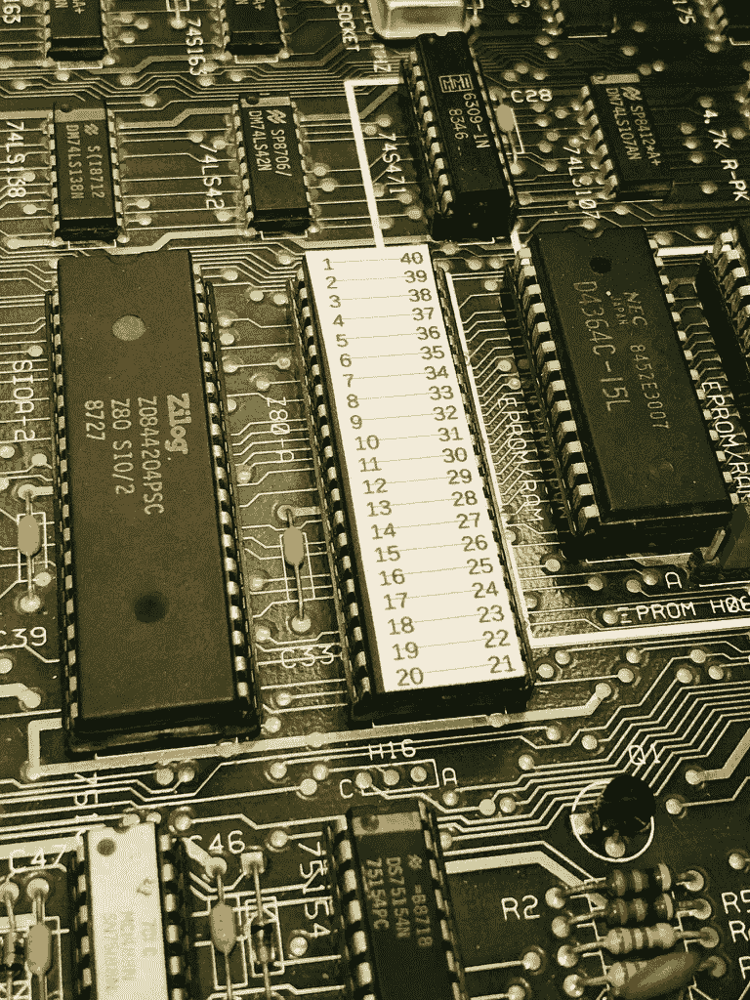

总之。我们讨论的是从 PCB 图像创建原理图，理解这一点需要更多地关注技术细节。

开始的时候，我决定了几件事:

*   这并不一定是完美的:目标是了解硬件和软件，以达到设备可以重新利用的程度。
*   电路板上有一堆旁路电容和上拉/下拉电阻，这对机器可靠运行可能至关重要，但它们无助于理解功能。所以不需要包含他们。
*   当我理解某件事时，添加描述性的文字，因为当我真正需要引用它时，我会忘记。

# 确定互连

从 PCB 到原理图的映射有点麻烦，但至少很简单(嗯，除了连接没有意义的时候)，机器在这个过程中泄露了秘密，让事情变得有趣。

基本上，它是这样工作的。

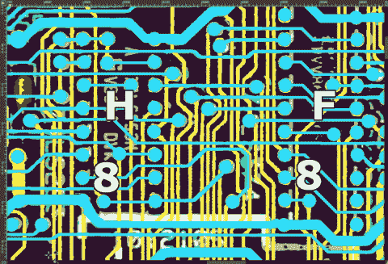

动画通过 F7 引脚 11 追踪 H8 引脚 7 到 N8 引脚 1

1.  选取设备上的起始引脚
2.  用对比鲜明的颜色填满这个洞
3.  翻转到另一个层，洪水填充，然后跟踪到远端
4.  如果我们找到了一台设备，请记下该设备和 pin 码
5.  如果还有更多要做，它们循环回到步骤(3)
6.  最后，记下终端设备和 pin 码

希望从动画中可以看出两件事:第一，解决这个问题需要多少血淋淋的工作，第二，有一个巨大的 trace+via : connection 比率。我猜想这是 20 世纪 80 年代自动布线的最新水平，或者随着设计的发展，工程师们没有足够的时间来重新布线电路板。

我提前建立了一个数据表存储库，以便在需要时参考，还有一些器件必须导入 KiCad 的原理图编辑器。

通常情况下，我会选择与前一个连接终止时相同设备上的一个未探测的 pin，并让普罗维登斯顺其自然。事后看来，最好从 Z80 的数据和地址线开始，然后优先处理主要设备。

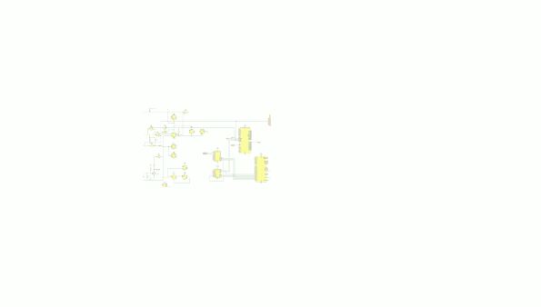

示意图的演变

这样做的原因是，当设备 **A** 以某种方式连接到设备 **B** 时，认为它们紧密地一起工作。但这在许多东西都连接在一起的情况下并不成立，比如一般的`HIGH`或`LOW`线，或者逻辑门。

我之前说过，我不想包括上拉或下拉电阻，因为它们只会使图变得杂乱，特别是当它们的目的是调整或清除信号电平时。但也有这些输入定义特定逻辑电平的情况。在这些情况下，我简单地将输入标记为`HIGH`或`LOW`。

所以当拼图拼在一起时，功能块是如何形成的就越来越明显了。这意味着随着时间的推移，原理图的各个部分会被重构和重新形成。

尽管如此，仍有许多工作要做:

*   仍然有一些阶段对我来说不是非常清楚，比如视频处理逻辑如何导航各种风格，比如闪烁和下划线。然而，现在信息已经存在，如果或者当我需要逆向工程那个逻辑的时候，只需要一点时间。
*   虽然我在将 PCB 布局转换为原理图时发现了一些错误，并不得不回去修复，但仍然有一些连接很奇怪，就像一个信号连接许多输入，但没有明显的输出馈入这些输入。标有`MAGICBUS`的物品就是一个例子。很明显，当我想到这个名字的时候，我很累。
*   其他一些全局标签仍然有点模糊，随着这些逻辑块被更好地理解，它们的功能将变得更加清晰。

# 示意图重点

可能很快要做的一个主要改变是将功能块转移到子表中，并且可能将全球和本地标签分开。

不过，这并不十分有趣。更有趣的是那些功能块*实际上是如何工作的*。完整的原理图在这篇文章的末尾，但这里有一些我最喜欢的部分。

## 设备选择

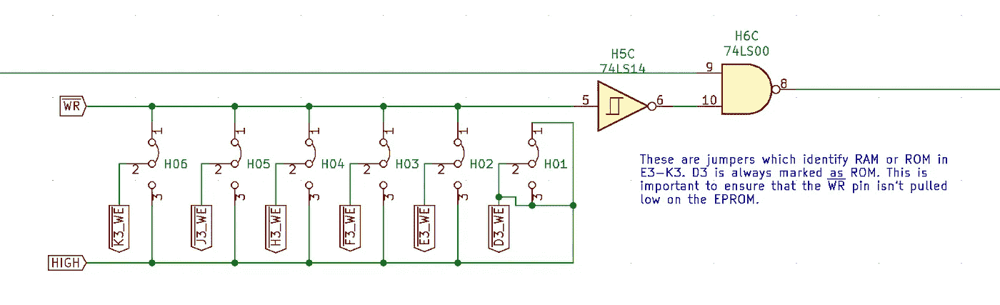

这是一个简单的开始。每个 ROM 和 EPROM 插座都有一个蓝色跳线，它要么驱动设备上的`/WR`引脚为低电平以启动写入，要么始终将电压保持在 5 伏，这对于可编程只读设备来说可能非常重要。您可以看到，对于 D3 处的 EPROM，`/WR`线将始终处于 5v，PCB 上的跳线基本上只是为了装饰。

另外，`H6C`在 CPU 写入视频 RAM 时，驱动一组缓冲区上的输出使能。

## 设备解码逻辑

这实际上是我看的第一批作品之一。仅仅通过观察 I/O 地址空间是如何映射的，就可以对这样的机器了解很多！

请记住，地址线(A)指定要写入或读取的数据的位置，数据线(D)用于传输信息。Z80 有 16 条地址线，允许访问高达 64K 的存储空间。它有八条数据线，因此可以表示 0 到 255 范围内的值。

但是 Z80 也有一个独立的 8 位输入/输出设备地址范围。这些可通过机器指令`in`和`out`访问。计算机外围设备知道 Z80 说的是哪一个，因为它使用`/IORQ`信号来指定 IO 请求，使用`/MREQ`来指定常规内存范围中的地址。

这部分电路决定了如何将输入输出命令路由到正确的设备。

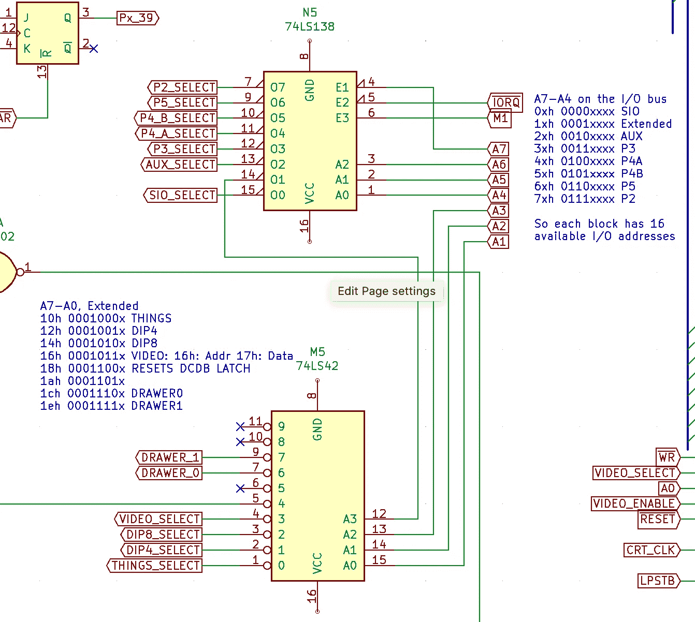

[SN74LS138](http://www.ti.com/lit/gpn/sn74ls138) 是一个解码器/解复用器。它将采用一个三位二进制数，并将相应的输出引脚设为低电平。000 将激活输出 0，001 将激活输出 1，依此类推。

然而，为了实现这一切，必须启用该设备。三条使能线配置为`A7`低电平(意味着仅使用低位 0x7F 地址……上半部分 0x 80–0x ff 可能可供我们扩展)；`/IORQ`低电平，这发生在输入/输出操作期间；而`/M1`高电平，意味着 CPU 没有获取指令。因为地址输入是`A4` - `A6`，这使得由低四位`A0` - `A3`表示的十六个地址可供这八个器件中的每一个使用。

除了前两个设备之外，所有这些设备都连接到扩展连接器。0x 00–0x0F 范围内的器件分配给 Z80 串行 I/O 控制器，但更有趣的是 0x10 模块。

0x10 模块提供机器内部的实际 I/O，并提供对许多设备的访问。例如，这就是 6845 CRT 控制器的编程寻址方式(地址 0x16 和 0x17)。还有两个地址块专用于机器背面的`CASH DRAWER`端口。鉴于我没有那个硬件，我可能永远也弄不清楚那两个是怎么用的，但是看起来它们只是作为输出位使用。

## 配置和输入/输出

进一步挖掘其中的几个地址，我们会看到位于`A4`和`B4`的两个 [SN74LS240](http://www.ti.com/lit/gpn/sn54ls240) 8 位缓冲器，以及位于`C4`的一个 [SN74273](http://www.ti.com/lit/gpn/sn74ls273) 8 位锁存器。

当通过 M5(见上文)选择时，两个缓冲器将来自器件远端的值呈现在数据总线上。因此，如果您想了解 8 个 DIP 开关阵列上的开关是如何设置的，只需读取输入输出地址空间中 0x14 处的值。

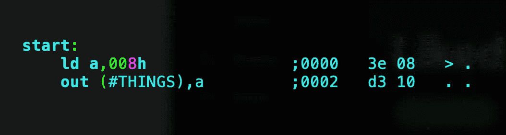

`C4`虽然需要更多的挖掘，因为它全面访问了一吨的东西。原来，机器启动时执行的第一对指令在这个锁存器上设置了初始配置。但它还能做更多的事情，比如在扬声器上驱动方波，以及在 Z80 串行控制器上为同步串行活动设置时钟频率。现在我知道得更多了，我很惊讶为什么他们不使用 Z80 计数器定时器控制器，它带来了所有的额外好处，但也许供应是一个问题？

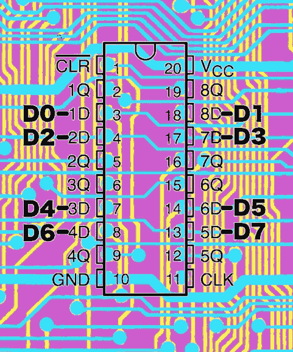

C4 的数据总线路由

但真正令人困惑的是，我假设数据线`D0`映射到设备上的`1D`,`D1`映射到`2D`等等，一直到`D7`映射到`8D`。

天啊，我是不是想错了。

当我比较 Z80 装配器和原理图时，很明显有些地方出了问题。

该电路实际上针对走线的简单性和长度进行了优化。这主意不错，只是我没有预料到。在图中，我将 74LS273 数据手册中的引脚重叠在 PCB 走线上。因为我已经精确地追踪了这个芯片的所有输出，所以有一个明显的不匹配。

亚历克斯，不要走捷径。

## 地址解码逻辑

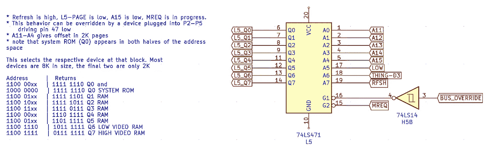

在本系列的第一篇文章中，我想知道 74LS471 是干什么的。这是伟大的到了这一点，在逆向工程的 PCB 和发现！

在本文的前面，我谈到了这台机器如何解码地址线来访问系统上的设备。原来*这个*芯片为 RAM 和 EPROM 做了大部分解码地址的工作。

地址线从一侧进入，每个存储器件的选择线从一侧出去。`L5_Q0`转到地址 0x000 的 EPROM，`L5_Q1`转到地址 0x 2000(8K 偏移)的 RAM 的第一个块，依此类推。

还记得 74LS471 中的大部分字节都是 FF 吗？这是因为存储设备的使能线*为低电平有效*，这意味着它们需要选择低电平信号。在所有地址中，最多有一位为低。如果一次有一个以上的位为低，那么将同时启用两个器件，这将导致读取错误并使机器 sad。

除了用于两个视频 RAM 芯片的最后两个单独的行之外，所有块的大小都是 8K(四个字节，具有相同的值以启用存储设备)。这些只有 2K 大小(每个一个字节)。

还要注意，无论`THING-Q3`是否激活，底部 8K 块(EPROM 程序所在的位置)都是可访问的。这是非常重要的，因为否则启用对视频 RAM 的访问将禁止对 EPROM 的访问，并且不能执行进一步的指令。

不过，最令人兴奋的部分可能是有一个额外的信号到达 74LS471:即`/BUS_OVERRIDE`线。这源于扩展连接器，意味着我们有可能提供分页或虚拟内存之类的东西，因为它消除了 74LS471 本来会执行的任何解码和使能。

## 字符块选择

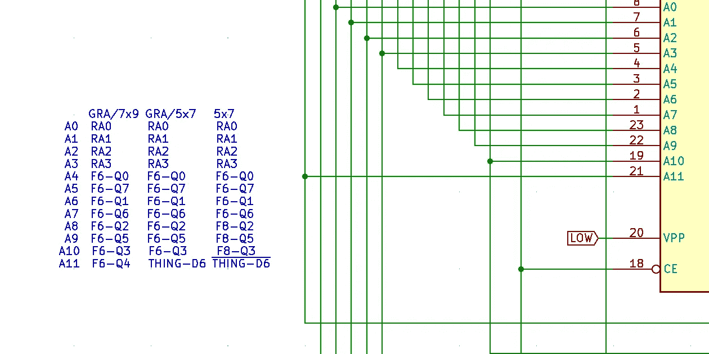

这需要对总线线路进行大量跟踪，在撰写本文时，我仍然需要尝试一下。

在由视频控制逻辑寻址的三字符 EPROMS 中，似乎两个 5x7 存储器部分由`THING-D6`寻址，我将能够翻转显示哪个 2K 的 4K 地址空间。

别担心:我已经把它添加到我的待办事项列表中了。

## 复位电路

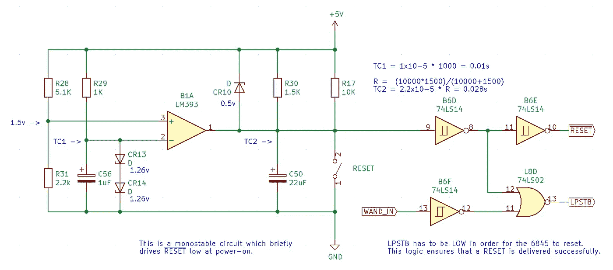

我不是一个模拟电子的超级粉丝，这个电路绝对是*走那条路。*

不过有几件事很突出。

合上`RESET`开关将使`C50`放电。释放后，`C50`将通过`R30`开始充电，大约 0.02 秒后饱和。反向偏置的齐纳二极管`CR10`然后(不考虑`R17`和`R30`的影响)将电压保持在大约 4.5v (5v 电源减去二极管的 0.5v 击穿电压)。

`B6D`是一个带有[施密特触发器](https://en.wikipedia.org/wiki/Schmitt_trigger)输入的反相器。输入的施密特触发器特性很重要，因为它有助于消除复位线翻转时的任何“反弹”。虽然可能`C50`会对此有很大帮助。

[LM393](http://www.ti.com/lit/ds/symlink/lm393-n.pdf) 是一个比较器电路，类似于运算放大器，但与数字逻辑接口。它比较两个输入端的电压(引脚 3 和 2 上的`+IN`和`-IN`)，然后在引脚 1 上输出数字信号。

此处用于在通电后短时间内保持`/RESET`线为低电平，以便在机器开始工作前电源轨已经稳定。否则，数字信号将是不可预测的，很可能会出现恶作剧。

从数据手册中:

> 当同相(+IN)输入上的电压大于反相(-IN)输入时，输出为高电平。当同相(+IN)输入端的电压小于反相(-IN)输入端的电压时，输出为低电平。

通电时，分压电阻器将在`+IN`上提供 1.5v 参考电压。引脚 1 上的输出将取决于引脚 2 上的电压相对于此的变化。在某个时刻，引脚 2 上的电压将导致器件状态翻转，reset 线将变得安静。

在这一点上，我的脑袋开始爆炸，试图理解为什么两个正向偏置齐纳二极管需要齐纳二极管，以及该电路如何优于标准单稳态配置中的 555 定时器。我说过我讨厌模拟电子吗？

## 视频/处理器 RAM 访问

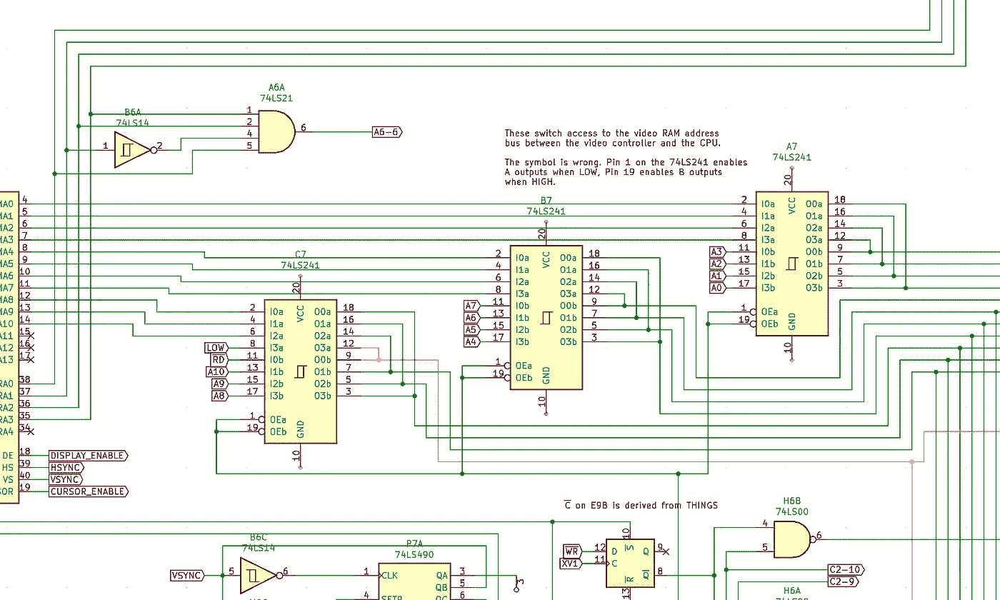

这个电路让我困惑了几个月！我不明白 74LS241 上的`OEa`和`OEb`是如何这样连接在一起的:这种配置意味着两个信号源总是处于活动或不活动状态。直到我看了一眼[数据表](https://www.electroschematics.com/wp-content/uploads/2013/07/74LS240-datasheet.pdf)，才意识到原理图符号是错误的。

当`OEa`为低时，`I-a`线通过，`OEb`为高时，`I-b`线通过。如果该元件在引脚 19 上没有反相输入就好了。

除了下面的完整示意图，就这些了！硬件只能说明问题的一部分，了解各种设备是如何被访问的非常重要，这样才能更上一层楼。那么[让我们来看看代码](https://alexwking.medium.com/disassembling-the-triad-t2556-part-one-b714069fec79) …

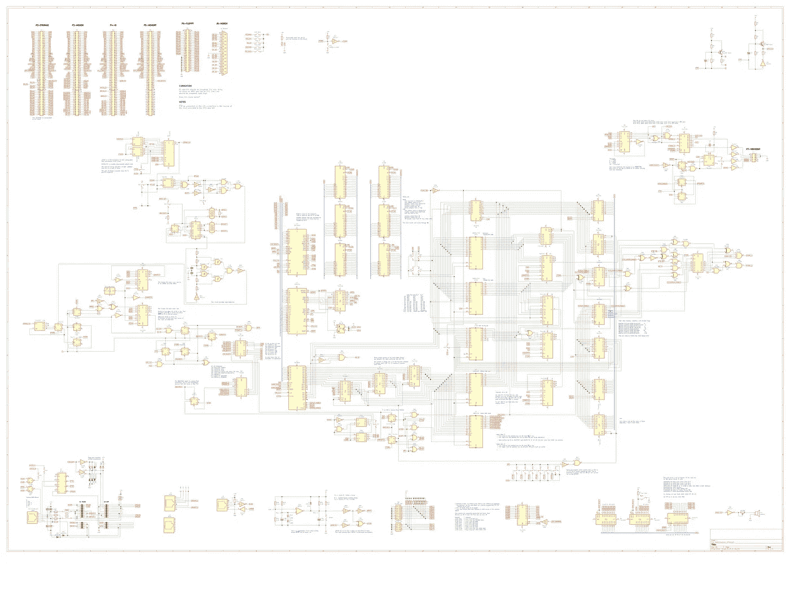