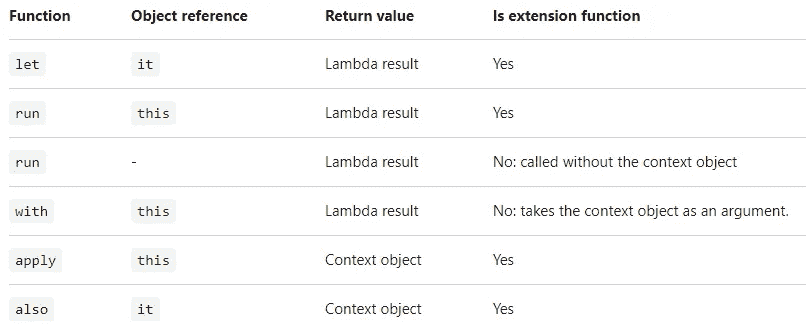

# 范围函数| Kotlin

> 原文：<https://blog.devgenius.io/scope-functions-kotlin-5131391ac48d?source=collection_archive---------8----------------------->

当我们想为一个对象的上下文执行一个代码块时，有五个不同的**作用域函数**可以使用。这是一个临时范围。在这个范围内，我们可以不使用对象的名称来访问它。

[基本上，这些函数做同样的事情:在一个对象上执行一段代码。不同的是这个对象是如何在块内变得可用的，以及整个表达式的结果是什么。](https://kotlinlang.org/docs/scope-functions.html)



关键差异表

# **。>让{ it-】**

Let 通常用于空校验。

即使我们用**“if”**检查 null，不同的线程也可能访问该变量并导致应用程序崩溃。此外，该变量仍然是可空类型。

```
if (number != null) {
    val number2 = *number* + 1 // Number variable throws an error.
}
```

这就是为什么我们必须使用 let。我们也可以将 let 块声明为一个值。let 块的最后一行将充当 return。同样，我们可以在 let 块中使用 **elvis 操作符**。如果我们使用 elvis 操作符，我们的变量类型将不可为空。

```
val x = number?.*let* **{** val number2 = **it** + 1
    number2
**}** ?: 3
```

# }

# 。应用{ this-->

如果我们要多次使用一个以上的属性或一个类的一个属性时使用 apply，我们就不需要每次都使用该类的对象。

```
val intent = Intent().*apply* **{** putExtra("", "")
    putExtra("", 0)
    *action* = ""
**}**
```

# **}**

# 。运行{ this-->

Run 的工作方式类似于 with。但是当我们使用 run 的时候，如果要赋一个变量或者值，就必须在最后一行返回我们想要的类型，否则就是一个单位。

```
val intent2 = Intent().*run* **{** putExtra("", "")
    putExtra("", 0)
    *action* = ""
    this
**}**
```

# }

# with(){ this-->

一个非扩展函数:**上下文对象**作为一个参数传递，但是在 lambda 内部，它作为一个接收器(`this`)可用。**返回值**为 lambda 结果。在我看来，同样适用。我不知道它们之间有什么不同。

```
val intent3 = *with*(Intent()) **{** putExtra("","")
**}**
```

# }

# 。也{ it-->

**上下文对象**可作为实参使用( ***it*** )。**返回值**是对象本身。

**同样**对于执行一些将上下文对象作为参数的动作也很有用。对于需要引用对象而不是其属性和功能的操作，或者当您不想从外部作用域隐藏**这个**引用时，也可以使用**。**

```
fun getSquaredI() = (i * i).*also* **{** i++
**}**
```

# }

我所说的只是解释的摘要。可以查看 [***链接***](https://kotlinlang.org/docs/scope-functions.html#also)*了解更多详细信息。*

> *感谢阅读，我希望它是有帮助的。*

**

*里克·范德克伦在 [Unsplash](https://unsplash.com?utm_source=medium&utm_medium=referral) 上拍摄的照片*