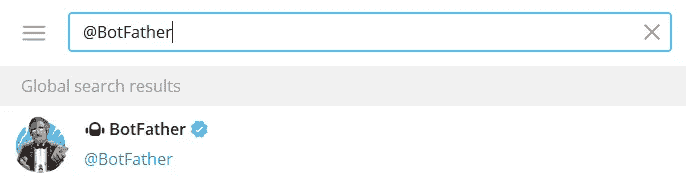
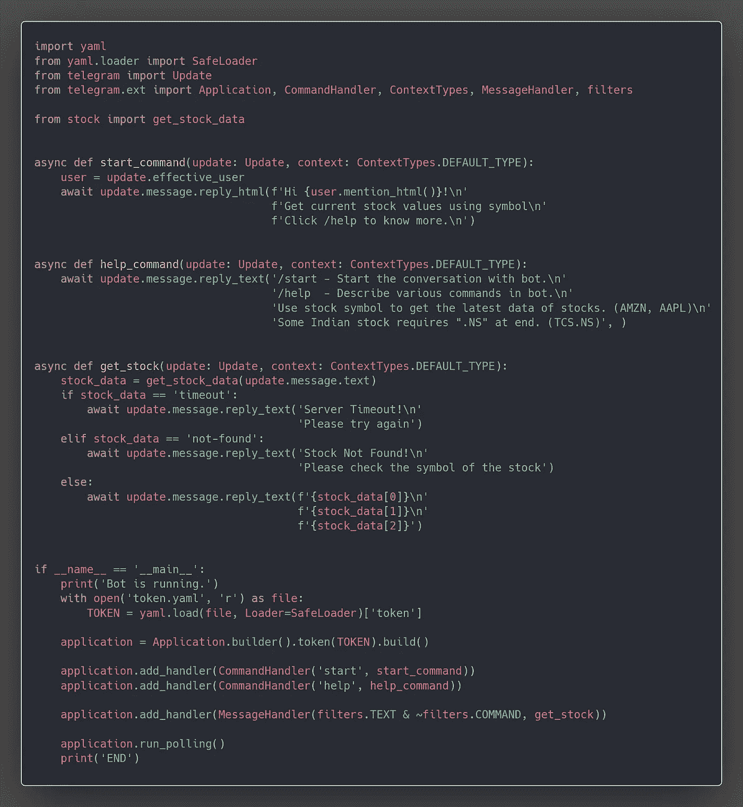
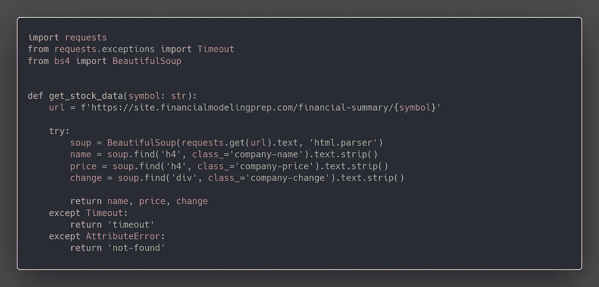
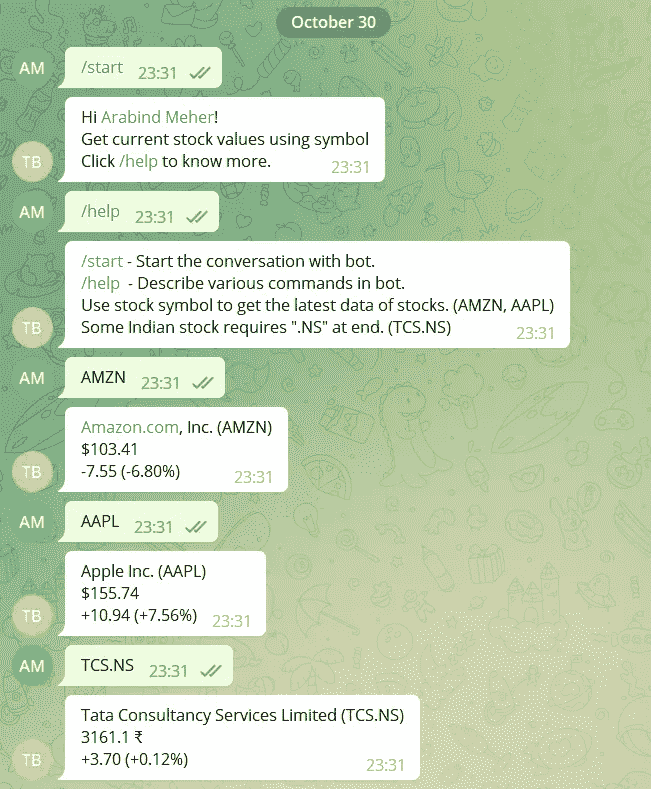

# 使用 telegram-bot 的废弃股票价格

> 原文：<https://blog.devgenius.io/scrap-stock-price-using-telegram-bot-e9c29d83abf9?source=collection_archive---------15----------------------->


马克西姆·霍普曼在 [Unsplash](https://unsplash.com/s/photos/stock?utm_source=unsplash&utm_medium=referral&utm_content=creditCopyText) 上的照片

在本文中，我们将了解如何构建一个简单的电报机器人来回复股票的最新价格。

[](https://github.com/arabind-meher/Stock-Scraping-Bot.git) [## GitHub-Arab nd-meher/Stock-Scraping-Bot

github.com](https://github.com/arabind-meher/Stock-Scraping-Bot.git) 

```
# requirements
pip install pyyaml
pip install requests
pip install beautifulsoup4
pip install python-telegram-bot --pre
```

# 电报机器人

## 1.在电报中创建一个机器人

请按照以下步骤创建电报机器人

在 telegram 中搜索@BotFather(带蓝色勾号)



机器人父亲

使用以下命令与@BotFather 交互以创建新的机器人

```
1\. /start
2\. /newbot
3\. <choose bot name>
4\. <choose bot username>
It will generate a token for your bot.
*keep the token safe, as anyone can use that to control your bot.
```

## 2.用 python 连接 telegram-bot

Python 库' **python-telegram-bot** '使用 bot 的令牌将您现有的 bot 连接到 python 代码。它可以创建各种命令和消息处理程序来与 bot 交互。

向您的机器人添加命令和消息处理程序

```
# Command Handler
start_command - (/start) command in telegram
help_command  - (/help)  command in telegram# Message Handler
get_stock - direct messages in telegram
sending stock symbol as direct message, bot will reply stock data
```

[](https://github.com/arabind-meher/Stock-Scraping-Bot/blob/master/main.py) [## 刮料机器人/主设备上的 main.py

### 在 GitHub 上创建一个帐户，为 arabind-meher/Stock-Scraping-Bot 开发做出贡献。

github.com](https://github.com/arabind-meher/Stock-Scraping-Bot/blob/master/main.py) 

# 刮料

Python 模块请求和漂亮的汤将被用于网页抓取。Request 模块用于获取网页的 HTML 代码，beautiful soup 将使从代码中抓取特定元素变得更加容易。

在浏览器中，打开网站并检查，以检查我们需要从页面中提取的所有元素。对于这个项目，我们必须提取第一个表。在下面的代码中，你可以看到我们是如何使用请求和漂亮的汤从网页中提取第一个表格的。

[](https://github.com/arabind-meher/Stock-Scraping-Bot/blob/master/stock.py) [## 在主阿拉宾德-梅尔/刮料机器人处刮料机器人/stock.py

### 在 GitHub 上创建一个帐户，为 arabind-meher/Stock-Scraping-Bot 开发做出贡献。

github.com](https://github.com/arabind-meher/Stock-Scraping-Bot/blob/master/stock.py) 

# 决赛成绩



电报机器人