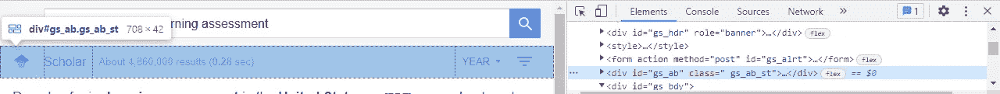

# 使用 Python 在线抓取数据

> 原文：<https://blog.devgenius.io/scrape-data-online-using-python-libraries-5a667958c12b?source=collection_archive---------11----------------------->

马文·迈耶在 [Unsplash](https://unsplash.com?utm_source=medium&utm_medium=referral) 上的照片

有时候我们没有确切的数据来回答我们需要知道的。你可以进行一次调查，但是如果你想让你的回答成为一个更大群体的[代表](https://www.alchemer.com/resources/blog/representative-sample/)，那就要费时、费钱，并且需要更高的执行能力。当针对代表性不足的群体时，您可能会问不同组织已经反复问过的相同问题，这可能会导致[响应疲劳](https://www.sciencedirect.com/science/article/pii/S0304387821001073)。

有很好的理由进行调查，但也存在创造性的选择，以使我们的生活和他人的生活更容易。其中一种方法是直接从网站上搜集信息。当站点包含文本、数字或项目符号模式时，Web 抓取特别有用，您可以将这些模式组合成一种数据集格式。

在本文中，我将通过一个示例，使用 Python 中的库 [Requests](https://pypi.org/project/requests/) 和 [BeautifulSoup4](https://pypi.org/project/beautifulsoup4/) 来代理每个国家的**学习评估研究** **的数量。*请求*允许您发送一个 HTTP/请求(将您连接到 web 链接)。Beautiful Soup 可以解析 HTML 或 XML 来搜索或修改其中的内容。**

我将在这篇文章中详述这些步骤。你可以在 Github 上找到完整的脚本。

**步骤一。建立你的环境**

除了*请求*和 *BeautifulSoup，*我还导入了 [*os*](https://docs.python.org/3/library/os.html#module-os) ，帮助你设置相对路径*。当其他操作系统复制您的代码时，这很有用。在这里，我设置了依赖于用户的 Github 克隆的路径。*

**第二步。设置对所有国家的搜索**

在这篇文章中，我将结合“学习评估”这一术语来查看每个国家的谷歌学术结果的数量(这是要跟随的[查询](https://scholar.google.com/scholar?hl=en&as_sdt=0%2C9&q=%28United+States%29+AND+%28learning+assessment%29&btnG=)的链接)。你会得到这样的东西:

谷歌学术结果

我们想要的数据是搜索词的结果的**数量**，我将在下一步中用到它。首先，我们将创建一个链接列表，返回每个国家的搜索结果。请注意，在这个例子中，链接的变化部分将只在“*美国+美国*”中，这将根据国家的不同而变化。

搜索的链接结构

我们基于通用链接结构创建一个字符串，并在一个循环中将它连接到每个国家。结果是包含每个国家的学习评估查询结果的链接列表。

**第三步。识别要解析的内容**

现在我们已经有了我们要请求的所有页面，我们要为 Beautiful Soup 确定要解析的页面部分。返回谷歌学术页面，右键单击—选择“检查”。在右侧，您会看到“elements”选项卡，这是该页面的 HTML 脚本。这些页面通常由 CSS 组织。对元素、id、类有一个[基本了解](http://Here's an intro to CSS classes.)对有效使用美汤很有帮助。

滚动脚本，直到找到突出显示结果栏的 *div* 元素。识别的*类*为 *gs_ab_st.*

查询结果的页面检查

**第四步。解析每个请求中的选择**

设置好一切后，我们将使用*请求*和*美汤*库来获取数据。我们为*请求*设置了一个通用头，并在命令 *requests.get()* 中输入搜索的链接。然后，使用 *bs()* 解析请求响应中的文本。最后，soup.find_all()返回包含类 *gs_ab_st* 的文本。

我通过一个循环运行每个搜索，并将输出附加到一个列表中。

您可能需要进行一些清理，以提取字符串中不需要的部分。我将我的结果组合成一个 [*熊猫*](https://pandas.pydata.org/) 数据框，并包含了网络抓取的日期作为参考。最终输出被写入。csv 格式:

最终输出的快照

**奖励:将数据可视化**

国家一级的数据通常对全球或区域比较有用。最后，这里有两个例子来展示这些结果是如何可视化的。

**A)** [**泡沫图**](https://medium.com/dev-genius/data-visualization-for-economics-using-wdi-package-in-r-d2da5a542f8b) **谷歌学术的成绩和人均 GDP。按地区划分颜色，按人口划分尺寸(10-14 岁)。**

我们可以用财富(人均 GDP)作为参考点，观察任何预期的趋势以及谁做得更好或更差。联合国人口数据按年龄提供了预测和历史数据。我选择了 10-14 岁的学生作为研究对象。人均国内生产总值(2015 年不变美元)可从[世界发展指标](https://data.worldbank.org/indicator/NY.GDP.PCAP.KD)中获得。

查询结果和人均 GDP 的气泡图

**B)条形图结果，区域比较**

着眼于区域趋势，洞察力来自频率和结果分布的并排比较。这里不包括人口和财富维度。

谷歌学术结果的水平条形图

**最后的想法**

美丽的汤和请求都是强大的库，因为它们使用灵活。[这个来自达蒙·琼斯教授的例子](https://twitter.com/nomadj1s/status/1294390370499952640)自 2015 年以来，从芝加哥大学警察局(UCPD)刮擦每一个交通站和搜索，发现 UCPD 不成比例地在海德公园拦住更多的黑人。

你能想到其他可以通过网络抓取开始处理的数据吗？什么样的数据组合加强了你的结果的初步发现？

一如既往的感谢您的阅读！