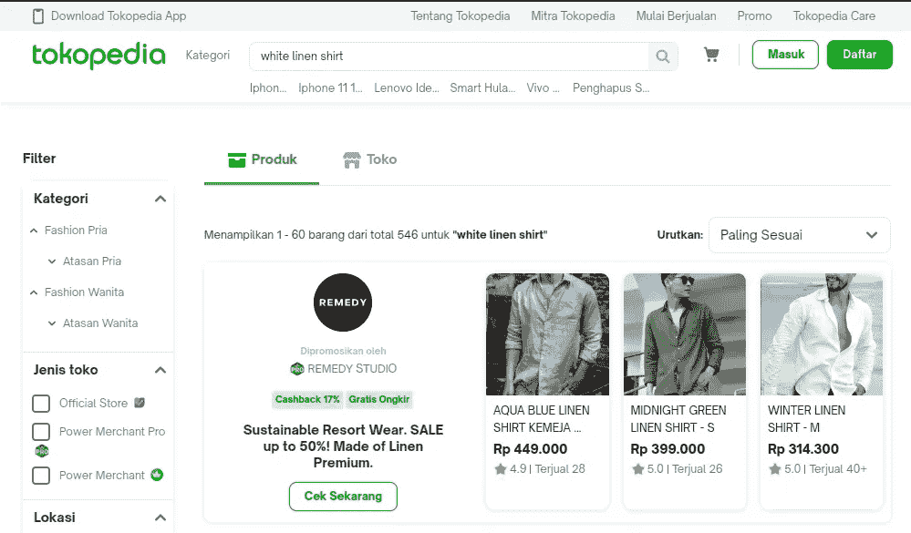
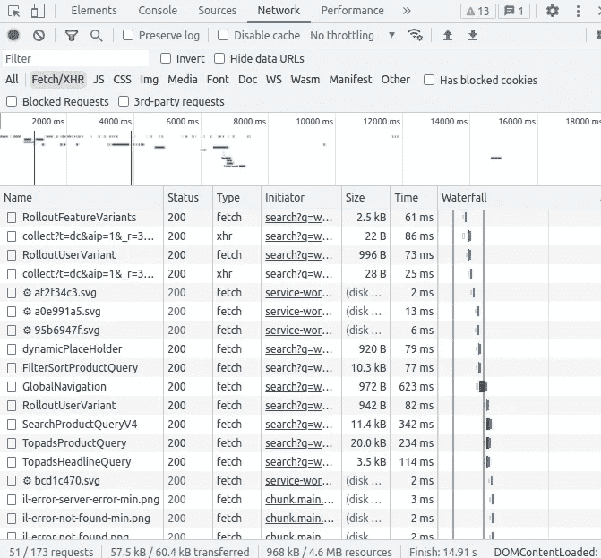
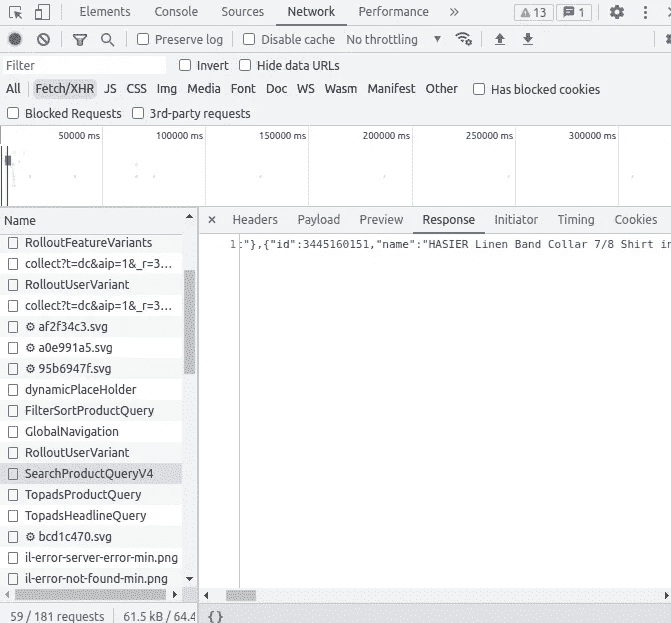
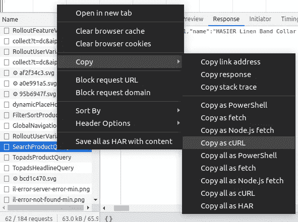
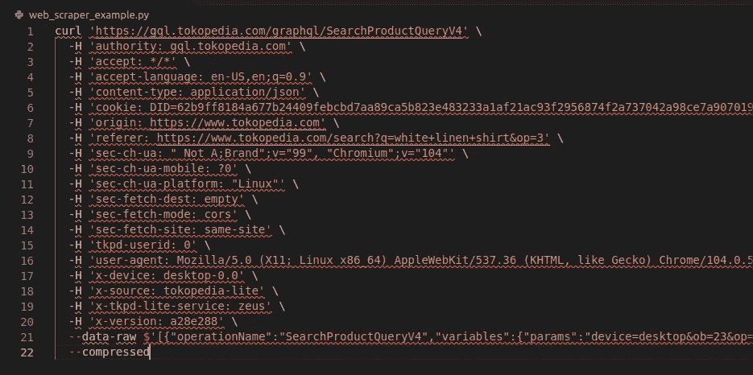
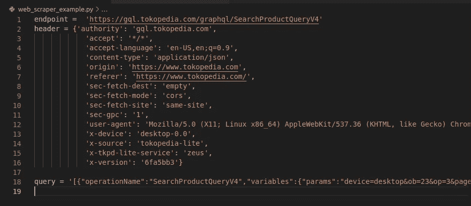
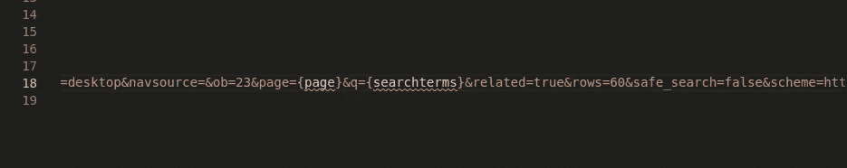
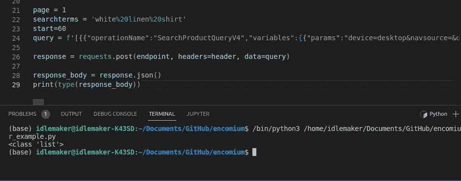
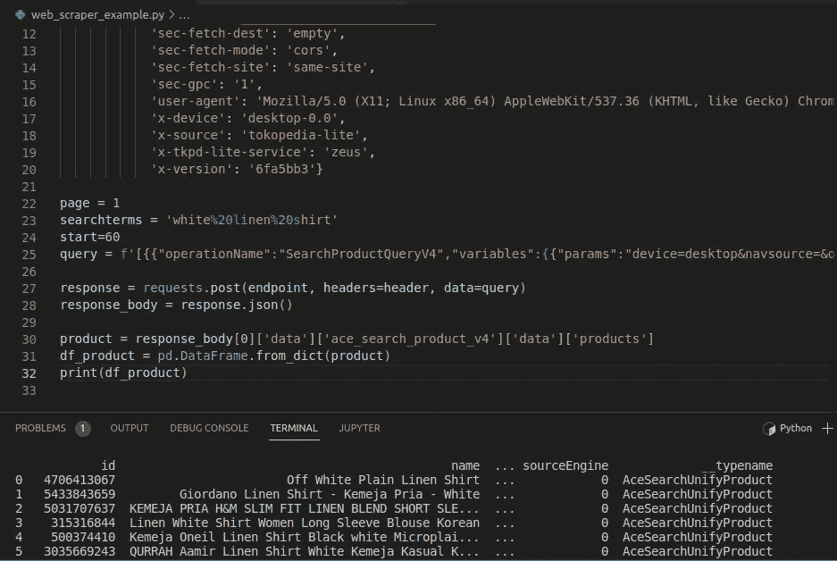

# 通过公开隐藏的 API，无需硒就能抓取数据

> 原文：<https://blog.devgenius.io/scrape-data-without-selenium-by-exposing-hidden-apis-946b23850d47?source=collection_archive---------1----------------------->

詹姆斯·哈里逊在 [Unsplash](https://unsplash.com?utm_source=medium&utm_medium=referral) 上拍摄的照片

最近，我正在做一个兼职项目，需要来自 Tokopedia 的产品数据，Tokopedia 是印度尼西亚最大的电子商务网站之一。主要目标是构建一个 web scraper 函数，该函数可以可靠地用于从搜索结果页面获取产品数据和卖家数据，这些数据可以作为原始数据集进行处理，或者在下游生成洞察。我们求助于网络抓取，因为就像许多其他网站一样，Tokopedia 没有任何 API 来查询其数据。

在本文中，我假设您对 Python 编程、发出基本的 API 请求和使用 HTTP 方法有基本的了解。

# 更快更简单的方法

尽管 Tokopedia 没有发布任何有文档记录的 API，但该网站拥有一个我们可以利用的“隐藏”API。使用这个 API 有几个有趣的地方。

首先，API 有一个非常快的**响应时间。请记住，这是用于查询向用户显示的产品的 API。因为内容交付时间应该惊人的快，我们可以将这个速度加入到我们的 web scraper 中。此外，通过使用这个 API，**我们不必加载 JavaScript** 、图像、渲染 HTML 和其他我们在使用 Selenium 时需要处理的事情。这进一步减少了装载时间。**

第二，这个程序很容易构建。正如您将看到的，代码一点也不臃肿。抛开 Python 语言本身，我主要只是用了请求和熊猫。scraper 本身，没有头和查询(无论如何我们都要从浏览器中复制)只有几行代码。我们甚至不需要处理用户代理欺骗、web 驱动程序和其他组件。我们只是发送 API 请求，然后 API 会很高兴地发送响应。这减少了开发时间，并使程序更容易调试。

听起来很有趣？我们开始吧！

# 1.公开隐藏的 API

让我们看看我所说的隐藏的 API。首先，我们需要浏览器公开 API。出于某种原因，Firefox 未能公开 API。因此，在这种情况下我推荐 Chrome。

Tokopedia.com 搜索结果页面

然后，我们将在[www.tokopedia.com](http://www.tokopedia.com)上搜索一些产品。我试图找到一件“白色亚麻衬衫”，这恰好是我最喜欢的衬衫类型。不久之后，Tokopedia 将在其搜索结果页面上展示一些产品。

右键单击屏幕上的任意位置，然后**单击“检查”**调出开发者工具。然后，转到**“网络”**选项卡**。**该选项卡监控哪些请求被发送到哪些端点，因此如果有任何隐藏的 API，它将在这里显示出来。然后，点击**【XHR】**。如果你好奇 XHR 是什么，它是 XMLHttpRequest 的缩写，是一个用于传输数据的 JavaScript 对象。实质上，通过点击“XHR”，我们将试图获取数据的 API 与试图获取图像、HTML、CSS 或 JavaScript 的 API 分开。最后，**重新加载**页面来监控请求。

开发工具“网络”标签下的 XHR 对象。你看到什么有趣的东西了吗？

点击“XHR”将显示所有用于传输数据的 HTTP 方法。通过点击每个请求名称，我们可以查看请求以及响应**标题**，请求**有效负载**和站点的**响应**正文。提示:尝试评估 API 名称，看看是否有什么指示搜索产品查询，然后查看它的响应体来验证它。

点击“SearchProductQueryV4”并检查响应。

如果你看得足够仔细，有一个名为“SearchProductQueryV4”的请求。这个 API 的名字很有趣。实际上，预览响应体显示 API 返回产品和销售者数据，这些是我们感兴趣的信息。

右键单击该方法，然后单击“**复制为卷曲**”。这将复制端点、头和请求体，然后将其格式化以与 cURL 兼容。您还可以使用 fetch 或 powershell 格式复制请求。端点、标头和请求正文仍将被复制。

将 API 复制为 cURL。其他格式也可用。

# 2.使用请求库测试 API

接下来，我们需要稍微清理一下格式化的请求。这部分可以用邮差或者失眠之类的工具，但是手动分离这个也无妨。我们本质上只需要分离端点、头和查询。如果我们将复制的请求粘贴到一个文本编辑器中，那么我们将得到如下结果:

请求仍然是 cURL 格式的。

让我们将这个请求分成几个部分:

1.  第一行，命令`curl`之后的部分是 API **端点**。端点仅仅是**一个你发送请求的地址。它类似于一个常规的网站地址，但用于发送 API 请求。**
2.  选项`-H` 前面的第二行是请求的**标题**。这一部分包含一些有趣的信息，包括臭名昭著的`user-agent`头。
3.  最后，我们到达以`-data--raw`为前缀的请求**主体**。这就是**查询**所在的地方，也是您询问您到底想从 API 中得到什么的地方。

让我们花一些时间将这些部分分成变量。

将每个部分分成不同的变量。

接下来，我们需要分析查询的哪些部分做了什么。我发现有三部分信息特别重要:`page`、`q`和`start`。`q`接受搜索词，而`page`和`start`一起控制将要加载的信息。例如，如果我们为搜索结果的第二页加载信息，我们应该为查询提供`page=2`和`start=60`。`start`应为 60，因为之前的 0–59 个产品加载在第一页(是的，Tokopedia 每页加载 60 个产品)。

我们可以使用 f-string 来改变这些查询参数的值。这样，我们就可以操纵`page`、`q`和`start`。然而，由于这个查询包含括号，我们需要使用另一个括号来转义它们。为此，请用双括号替换每个括号。

使用 f 字符串改变查询参数。其他括号(未显示)用双括号转义。

然后，我们使用一个 Python `requests`模块来启动一个测试请求。除了提供端点之外，不要忘记还要提供消息头和请求体。启动请求，看看服务器是否像我们预期的那样给出了响应。

使用 JSON 库打印响应体。显示了部分产品数据。

正如我们所看到的，服务器在其响应体中包含了一个 JSON 文件。幸运的是，它包含了我们正在寻找的产品数据。现在，一些价值是在印度尼西亚，因为 Tokopedia 本身目前在印度尼西亚市场运作。

现在，并不是头或查询体中的每一件事都很重要。除了`page`、`q`和`start`，我选择让这两个保持原样。当然，您可以调整标题和查询体，以确定保留一些内容是否不会影响您的代码。

# 3.解析响应

测试完响应后，我们需要解析响应中我们感兴趣的内容。我们可以通过编写`response.json()`来提取响应体。通常该方法返回一个字典，但是由于某种原因，它返回一个列表。让我们将结果放入一个名为`response_body`的变量中。

在这个实例中，响应主体返回一个列表。

在`response_body`内部，我们所要做的就是遍历文件，看看产品数据可能驻留在哪里。然后，只需要将索引和子索引链接在一起。在这个 Tokopedia 实例中，可以在给定的索引链中找到产品数据:

`response_body[0]['data']['ace_search_product_v4']['data']['products']`

这将返回一个字典列表。你可以直接把它放入熊猫数据帧，通过像这样调用`pd.DataFrame.from_records()`:

将结果作为 DataFrame 对象打印到终端。

一旦有了结果，您可以将它们导出为 CSV 格式，或者放在您的数据库中。

# 4.完成功能

到目前为止，查询实际上只返回单个页面的产品数据。要获取给定搜索结果的所有产品数据，我们只需要一个获取所有页面数据的函数，如下所示:

`check()`函数返回从搜索中检索到的产品总数作为`srp_count`，从搜索中检索到的总页数作为`page_count`。在某种意义上，它“检查”搜索结果页面，以查看结果包含多少产品，以及在多少页面中。因此得名。最后，`scrape()`函数充当从所有搜索结果页面中检索数据的主函数，而不仅仅是单个页面。`scrape()`要求`srp_count`和`page_count`都作为查询的变量参数，这就是`check()`派上用场的地方。

现在，我们可以添加几个功能。也许，我们可以包括一定的价格范围限制，或只包括一定的卖方会员地位。我们可以通过修改查询并将它们作为函数中的参数来添加这些特性。或者，我们也可以添加多线程，就像我在这里做的。

像往常一样，我的 [GitHub](https://github.com/sknrendra/) 上有完整的功能代码。代码的最终长度勉强超过 50 行，但这主要是因为过长的头。实际上，构建这个刮刀并不比完成一个 HTTP 请求复杂多少。

# 摘要

通过思考 HTML 之外的内容，我们可以构建一个更快、更高效、向服务器发送更少请求且更少冗长的 web 抓取器。当进行网络抓取时，总是寻找一个隐藏的 API，因为当网络抓取器工作得更快，请求更少时，你和网站所有者都会很高兴。

希望这个故事对你的旅途有所帮助。发现错误请随意评论，喜欢就鼓掌。谢谢你。